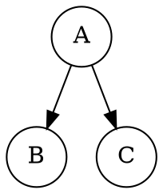

# Technical Design

## Boundaries

```text
package.json + pnpm-lock.yaml
        -> .vitepress/config.ts (Markdown plugin)
        -> content/chapter-*/**/*.md (DOT source)
        -> public/diagrams/*.svg (plugin cache, generated)
        -> VitePress dist/pages (static asset)
```

- `.vitepress/config.ts` remains the sole VitePress configuration boundary.
- `content/**` remains the single source of diagram definitions; generated SVGs are cache/output, not hand-edited sources.
- `docs/GRAPHVIZ_AUTHORING_GUIDE.md` is the authoring contract and links from `docs/DEVELOP_GUIDE.md`.

## Plugin Configuration

Use `createBuildTimeDiagramsPlugin` from `vitepress-plugin-diagrams` so a production build waits for missing diagrams and fails loudly when Kroki cannot generate them. Configure:

- `diagramsDir: "public/diagrams"` so generated files are served by VitePress without copying them into source Markdown directories.
- `publicPath: `${base}diagrams``; the plugin does not apply VitePress's Pages base itself, so the config supplies the normalized base (`/diagrams` locally, `/DSA-Mastery/diagrams` on Pages).
- `krokiServerUrl: process.env.KROKI_SERVER_URL ?? "https://kroki.io"` to support a self-hosted CI endpoint without hard-coding credentials.
- `diagramsDistDir: "diagrams"` emits each SVG into the final Vite asset directory; this is required because build-time generation happens after VitePress copies the public directory.
- `excludedDiagramTypes` left empty unless the package defaults require narrowing; `enableFileImports: false` for the first rollout because all diagrams are inline and this avoids broad file-read scope.

The plugin's `configureMarkdown` is called from the existing `markdown.config`; its Vite plugin is added to the existing `vite.plugins` array without replacing `configFile: false`.

## Markdown Contract

Use the plain info string ```` ```graphviz ```` (the plugin matches the complete info string) and place the optional plugin metadata comment immediately below:

```md

<!-- diagram id="tree-binary-example" caption: "一棵二叉树" -->
```

Node IDs are stable ASCII identifiers; Chinese labels use `label="..."`. Directed graphs use `digraph` and `->`; undirected examples use `graph` and `--`; edge weights use `label="7"`. Captions describe the learning point, not implementation metadata.

## Migration Set

Migrate every `text [*.txt]` block in `content/chapter-04-tree/`: course/child-sibling overviews, binary-tree classifications and serialization, traversal traces, threaded-tree diagrams, the three-step conversion, and classic-problem diagrams. Node/edge figures become normal DOT graphs; text-heavy blocks become Graphviz `plain`/record nodes so no teaching text is lost. Add Graphviz figures to `content/chapter-05-graph/02-traversal.md` (DFS/BFS traversal graph) and `03-applications.md` (weighted graph illustrating an MST/shortest path).

## Failure, Cache, and Rollback

- Build-time generation makes Kroki availability a build prerequisite only when a diagram is missing; checked-in cached SVGs keep normal builds deterministic and fast.
- A failed fetch must be a build error that names the source page/diagram. Authors can run a local self-hosted Kroki endpoint via `KROKI_SERVER_URL`.
- To roll back, remove the plugin registration and dependency, revert only the migrated fences, and leave/remove `public/diagrams` according to the generated-file cleanup check; no route or content-index rollback is needed.

## Accessibility and Styling

Rely on the plugin's semantic `<figure>`/`` output and captions. Add a small `.vpd-diagram` rule in existing `custom.css` only if needed for `max-width: 100%`, centered layout, and overflow containment; do not add a new component or raw color tokens.
