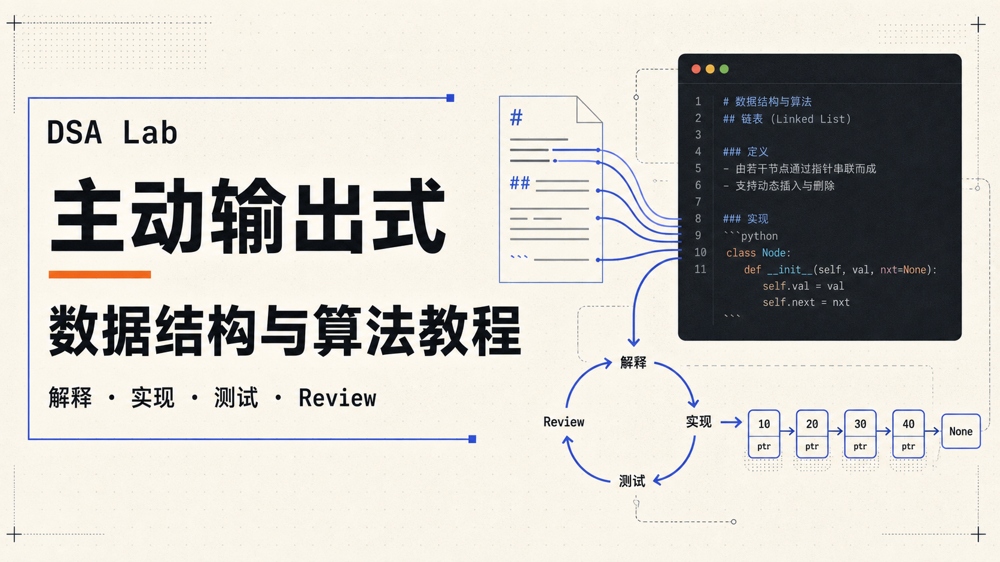
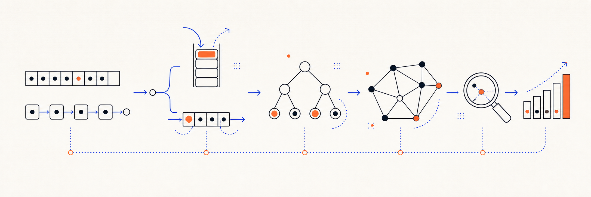
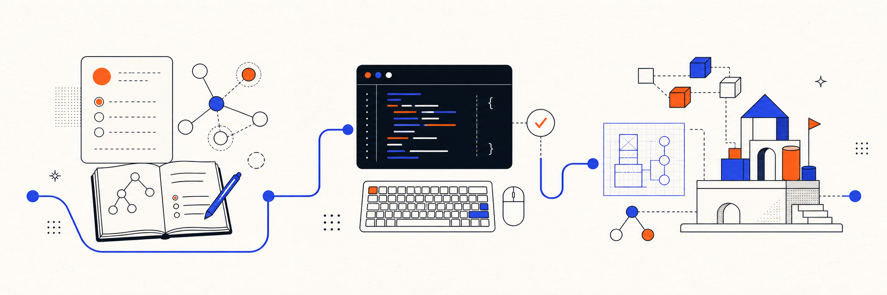

<p align="center">
  
</p>

<h1 align="center">DSA Mastery</h1>

<p align="center">
  <strong>学透 · 做实 · 用活</strong>
</p>

<p align="center">
  面向大学课程的数据结构与算法理论与实验教程。<br />
  把抽象概念讲清楚，也把动手实践真正落到代码与实验中。
</p>

<p align="center">
  <a href="https://azenann.github.io/DSA-Mastery/"><strong>进入在线课程</strong></a>
  ·
  <a href="https://azenann.github.io/DSA-Mastery/learn/">查看课程地图</a>
  ·
  <a href="https://azenann.github.io/DSA-Mastery/labs/">浏览全部 Labs</a>
  ·
  <a href="./CONTRIBUTING.md">参与贡献</a>
</p>

<p align="center">
  <a href="https://github.com/AzenAnn/DSA-Mastery/actions/workflows/pages.yml">
    
  </a>
</p>

---

## 从“知道”到“会做”

数据结构与算法不只是定义、公式和模板。真正困难的地方，是看懂一个结构为什么这样设计，并把它变成能够正确运行的程序。

DSA Mastery 将课程讲解与实验练习放在同一个学习入口中：读完一个主题后，可以继续完成对应的概念题、编程练习或综合实验，让理论与实践彼此衔接。

| 理论理解 | 动手实现 | 多层练习 |
| --- | --- | --- |
| 从定义、抽象数据类型与关键性质出发，理解结构和算法背后的设计取舍。 | 使用 C++ 完成核心结构与算法，把纸面过程转化为可以运行的程序。 | 通过 Theory、Exercise 与 Project 三类 Lab，承接不同阶段的学习目标。 |

## 课程内容

<p align="center">
  <strong>60+ 教材页面</strong>
  &nbsp;·&nbsp;
  <strong>100+ Lab</strong>
</p>

课程从基础概念与线性结构出发，逐步进入树、图、查找、排序和算法方法。内容仍在持续完善；尚未完成的页面会明确标注状态，不把草稿包装成完成品。

<p align="center">
  
</p>

| 学习主题 | 已覆盖方向 |
| --- | --- |
| 基础与线性结构 | 绪论、线性表、栈与队列、字符串、数组与矩阵 |
| 树与图 | 树与二叉树、树的应用、图的基础、存储、遍历与应用 |
| 查找与排序 | 查找、基础排序、高效排序与外部排序 |
| 算法方法 | 贪心算法、动态规划，以及围绕课程主线持续补充的练习与实验 |

完整章节安排请前往[课程地图](https://azenann.github.io/DSA-Mastery/learn/)，也可以直接从[在线课程首页](https://azenann.github.io/DSA-Mastery/)开始阅读。

## 三类 Lab

Lab 不是教材末尾的附属材料，而是用于检查理解、练习实现和完成综合任务的独立学习单元。

<p align="center">
  
</p>

| Theory | Exercise | Project |
| --- | --- | --- |
| 通过交互选择题和概念辨析，检查术语、性质与关键结论。 | 通过可编译、可运行的 C++ 任务，练习核心结构、算法和边界处理。 | 通过包含多个任务与依赖关系的综合实验，组织完整的问题解决过程。 |

你可以在 [Labs 目录](https://azenann.github.io/DSA-Mastery/labs/)中按章节和类型选择练习。

## 开始学习

### 在线阅读

推荐直接访问[在线课程](https://azenann.github.io/DSA-Mastery/)。课程地图、教材页面和 Labs 已经整理在同一个网站中，无需先配置本地环境。

### 获取仓库

```bash
git clone https://github.com/AzenAnn/DSA-Mastery.git
```

如果需要本地运行 C++ Labs，推荐使用平台自举脚本：直接运行后用方向键、空格和回车选择要安装的内容；基础运行环境必选，Program、Project/CMake、VS Code 和扩展可以按需选择。脚本会自动处理依赖，并在重跑时复用已有工具和仓库。高级用户仍可指定 `runtime`、`basic` 或 `full` profile。

- macOS：[macOS 学生实验环境安装指南](https://azenann.github.io/DSA-Mastery/learn/chapter-preface/05-macos-student-setup/)
- Windows：[Windows 学生实验环境安装指南](https://azenann.github.io/DSA-Mastery/learn/chapter-preface/02-windows-student-setup/)

脚本也可以只做检查：`--check-only` 不安装工具、不 clone/pull 仓库、不安装依赖；学校设备、公司代理或包管理器不可用时，教程仍保留逐项手工安装路径。

## 参与贡献

欢迎通过 Issue 提交勘误、实验建议和章节改进，也欢迎贡献能够帮助学习者理解概念或完成实践的内容。

提交改动前，请先阅读[贡献指南](./CONTRIBUTING.md)。较大的内容或结构调整建议先创建 Issue，说明希望解决的学习问题和预期结果。

如果你准备新增或调整 Lab，请继续阅读 [Lab 更新与测试指南](./docs/LAB_AUTHORING_GUIDE.md)，确保练习类型、运行方式和验收标准与项目保持一致。

## 许可与使用

本仓库目前公开可见，但尚未添加明确的内容与代码 License。公开可见不等于获得复制、修改或再分发授权；在许可方案确定之前，如需在其他项目中使用仓库内容，请先取得作者的明确许可。

引用教材、论文、网页、图片或开源代码时，请保留来源与许可信息，并避免复制受版权保护的正文或图表。

---

<p align="center">
  <strong>准备好开始了吗？</strong><br />
  <a href="https://azenann.github.io/DSA-Mastery/">进入 DSA Mastery 在线课程</a>
</p>
