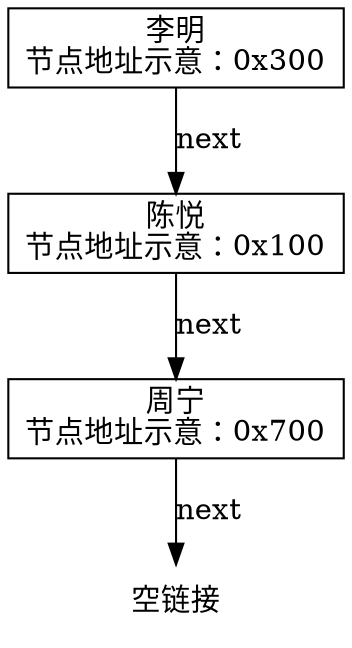
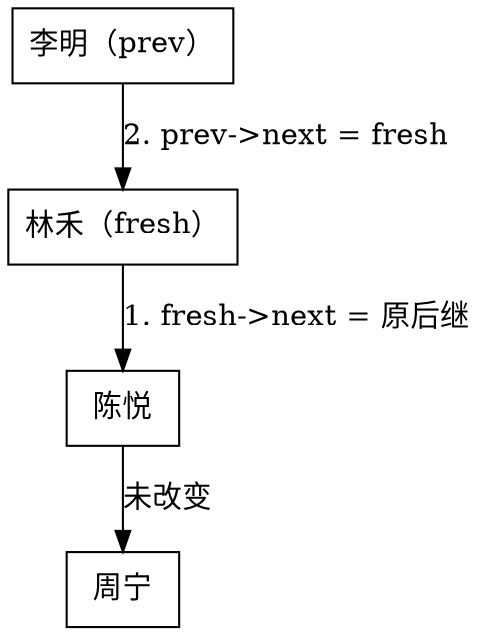
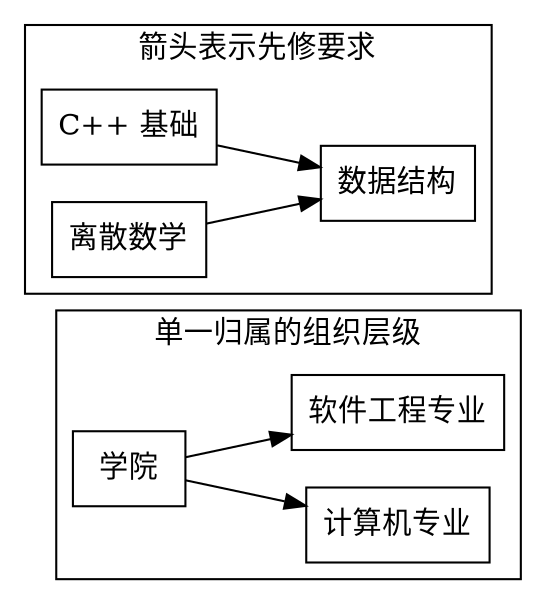

# 0.1 数据结构基础概念

## 从一份学生名单开始

你已经会用 C++ 写变量、结构体和循环。现在，计算机学院需要一个学生信息管理程序。第一版只有一个要求：**保存学生的学号、姓名和成绩**。

| 学号 | 姓名 | 成绩 |
| --- | --- | --- |
| 20260017 | 李明 | 86.5 |
| 20260008 | 陈悦 | 92.0 |
| 20260023 | 周宁 | 78.0 |

三条记录用几个变量就能存下。但下一周，老师要按名单位置点名、把补录学生插到指定位置、按学号查找和删除。每加一个要求，原先方便的写法都可能多出一笔成本。

本节跟着这些变化回答三个问题：存的究竟是什么，记录之间有什么关系，怎样表示才能方便地完成常见操作。读完后，你应能解释自己的选择及其前提，而不只是报出“数组”或“链表”的名字。

## 需求一：保存记录，先分清存的是什么

看表中的 `86.5`：它是数据，但并不是我们每次都要单独管理的对象。查找李明时，我们通常希望同时拿到他的学号、姓名和成绩，因此把一整条记录作为处理单位。

::: definition 定义 · 从数据项到数据结构
- **数据**：能够被计算机输入、存储和处理的符号，例如学号、姓名和成绩。
- **数据项**：构成一个数据元素的属性，是当前讨论层次中具有独立含义的最小单位，例如一条记录的“成绩”。
- **数据元素**：数据集合中的基本处理单位，本例是一名学生的完整记录。
- **数据对象**：具有相同性质的数据元素的集合，例如本学院本届学生记录的集合，不只是眼前已录入的三条。
- **数据结构**：相互之间存在一种或多种特定关系的数据元素的集合。研究它时，还要考虑关系的存储表示和相关操作。
:::

“最小单位”取决于问题。如果只管理成绩，姓名是一个数据项；如果研究姓名的字符编码，就会进一步讨论字符。术语帮助我们固定讨论层次，不是把所有数据永久分成几类。

先做一个判断：`20260017` 是数据项还是数据元素？在这份记录表里，它是学号这一数据项的值；若程序只维护一组学号，每个学号又可以成为一个数据元素。==先确定处理单位，再给它命名==。

## 需求二：按位置访问，顺序和地址是一回事吗

老师希望按录入顺序点名，屏幕显示 `李明、陈悦、周宁`。此时除了“这三个人都在名单中”，还多了一种关系：李明在陈悦之前，陈悦在周宁之前。

这叫**逻辑结构**，即元素之间的抽象关系。这里是线性关系：除首尾外，每个元素恰有一个直接前驱、一个直接后继。它只说明名单顺序，还没有规定内存地址。

把记录放进数组，可以用下标访问。本文从 `0` 开始编号，因此“第 2 名”对应下标 `1`。假设每个记录槽大小都是 `w` 字节、首地址为 `base`，数组布局可写成：

| 逻辑下标 | 记录 | 记录槽地址 |
| --- | --- | --- |
| 0 | 李明 | `base` |
| 1 | 陈悦 | `base + w` |
| 2 | 周宁 | `base + 2w` |

数组的相邻槽连续，位置 `p` 的地址可由 `base + p * w` 算出。这种把逻辑次序映射到连续存储单元的方式叫**顺序存储**，是存储结构的一种。若记录含 `std::string`，连续的是记录对象本身，其字符缓冲区不一定也在这段区域中。

同一份名单还可以用链接表示：


<!-- diagram id="ch0-student-links" caption="沿 next 依次读到李明、陈悦、周宁，地址的数值次序不决定名单次序" -->

每个节点保存一条记录及下一个节点的地址，这是**链式存储**。图中的地址只用于辨认节点，不表示真实分配结果。逻辑上相邻的李明和陈悦，在内存中不必相邻；只要链接正确，名单顺序就正确。

::: intuition 直觉 · 一个顺序，两种表示
==一个逻辑结构可以有多种存储实现==。数组通过连续槽位体现先后，链表通过链接体现先后。按位置找陈悦时，数组可以计算地址；单链表通常要从头沿链接走到她，而不能把“第几个”直接当作节点地址。
:::

以下代码只展示表示方式，暂不实现完整的名单操作。`count` 表示已使用的槽数；`next` 表示后继，不是“内存中紧挨着的对象”。

::: code-group

```cpp{9-10} [sequential-storage.cpp]
#include <string>

struct Student {
    int id;
    std::string name;
    double score;
};

Student records[100]{};
int count = 0;
```

```cpp{9-14} [linked-storage.cpp]
#include <string>

struct Student {
    int id;
    std::string name;
    double score;
};

struct Node {
    Student value;
    Node* next = nullptr;
};

Node* head = nullptr;
```

:::

## 需求三：在指定位置插入，究竟省了哪一步

### 完整示范：把林禾插到陈悦前面

::: example 问题 · 三人名单变四人
原名单是 `[李明, 陈悦, 周宁]`，把林禾插到下标 `1`，得到 `[李明, 林禾, 陈悦, 周宁]`。数组有空余容量，新链表节点也已准备好。

**先预测**：数组要搬几条旧记录？链表要改几条链接？“指定下标为 1”是否意味着程序已经拿到了插入位置的节点？
:::

先在纸上执行数组版。为避免覆盖还没搬走的记录，要从后向前移动：

| 步骤 | 下标 0 | 下标 1 | 下标 2 | 下标 3 |
| --- | --- | --- | --- | --- |
| 初始 | 李明 | 陈悦 | 周宁 | 空 |
| 周宁移到 3 | 李明 | 陈悦 | 周宁 | 周宁 |
| 陈悦移到 2 | 李明 | 陈悦 | 陈悦 | 周宁 |
| 林禾写到 1 | 李明 | 林禾 | 陈悦 | 周宁 |

旧记录移动了 2 次，新记录写入 1 次。推广到长度 `n`、插入位置 `p`：原下标 `p` 到 `n-1` 的记录都要后移，共 `n-p` 次，再写入新记录。尾部插入 `p=n` 时，不用移动旧记录。

链表中，如果已经拿到李明节点 `prev`，让新节点 `fresh` 的 `next` 先指向陈悦，再把 `prev->next` 改为 `fresh`，就得到新顺序：


<!-- diagram id="ch0-student-insertion" caption="两次链接赋值完成局部插入，先接上原后继才能保留后面的名单" -->

这里省掉了整段搬移，但“拿到 `prev`”是一个前提。若只给下标 `p`，单链表通常要从头走到第 `p-1` 个节点；若只给“陈悦的学号”，还得先查找并保留她的前驱。

::: property 性质 · 把定位与修改分开计费
一次操作的成本包含“找到位置”和“在该处修改”。数组按下标定位不需要逐个经过前面的元素，但中间插入要搬移；单链表的局部插入可以只改常数条链接，但从头寻找前驱的步数会随位置增长。
:::

### 单条件变式：只把插入位置改到表尾

仍假设数组有空余容量。原来的 `n-p` 公式继续成立，代入 `p=n` 就得到 0 次移动。对单链表，改链接的方法仍成立，但**定位方式必须重查**：只有头指针时需走到表尾；另有尾指针时才可直接定位，并且插入后要更新尾指针。

::: counterexample 反例 · “链表插入一定快”
一个只有头指针的长单链表，要按下标在末尾插入，先得经过整个表；一个有空余容量的数组在尾部追加，只需写入新槽。不能用“链表只改两条链接”替代完整操作的分析。
:::

反过来，动态数组在容量已满时可能需要重新分配并搬移已有记录。到第 1 章学习扩容时，还会区分单次代价和一串追加操作的平均分摊代价。

## 需求四：按学号查找或删除，位置不再免费

老师现在说：“删除学号 `20260008` 的学生。”这是按**关键字**提出的要求，学号用于标识记录；它不是数组下标，也不保证记录按学号排序。

先补全这个小例子：三条原记录的学号依次为 `[17, 8, 23]`（省略共同前缀）。删除 `8` 时，要比较几次学号？找到后，数组还要移动几条记录？单链表要掌握哪个节点？

::: details 补全后的推导
从头扫描：先比较 `17`，再比较 `8`，共 2 次。数组随后把 `23` 前移一次，并将长度减一；单链表扫描时保留 `17` 所在的前驱节点，再让它的 `next` 指向 `23`，最后释放被删除的节点。

若删除 `99`，两种方案都要检查全部 3 条记录，报告未找到，名单不变。推广到 `n` 条未排序记录，查找最多比较 `n` 次。链表局部修改的优势没有消除这笔查找成本。
:::

为了公平比较，下面假设记录大小有固定上限，一次记录移动或一次链接访问作为一个计费单位；数组有足够容量，链表不带额外索引。

| 操作及已知条件 | 数组 | 只有头指针的单链表 |
| --- | --- | --- |
| 读取下标 `p`，`0 <= p < n` | 直接计算地址 | 从头经过 `p` 条链接 |
| 在下标 `p` 插入 | 移动 `n-p` 条旧记录 | 先找前驱，再改常数条链接；表头单独处理 |
| 按学号查找 | 未排序时最多比较 `n` 次 | 最多比较 `n` 次 |
| 按学号删除 | 先查找，再搬移后续记录 | 先查找并保留前驱，再修改链接、释放节点 |
| 已知有效前驱，删除其后继 | 数组没有同样的链接操作 | 局部修改不随名单长度增长 |
| 顺序浏览全部记录 | 访问 `n` 条记录 | 访问 `n` 个节点，并读取链接 |

::: pitfall 易错点 · 已知节点不等于已知前驱
普通单链表删除某节点通常还需要修改其前驱的链接。只给目标节点指针，不能一概声称常数时间删除；尾节点尤其不能用“复制后继数据”的技巧处理。双向链表保存了前驱链接，是另一种表示，其额外空间与维护成本也不同。
:::

## 需求五：同时满足多种操作需求

名单增长到一万条后，老师每天按学号查找几千次，偶尔调整显示顺序，还要顺序导出全部记录。只说“支持增删查改”已经不够：**哪些操作多、哪些操作少、一次要处理多少记录**，会影响选择。

一种思路是在主体名单之外增加**索引**，保存“学号到记录位置”的对应关系。另一种思路是**散列存储**，用散列函数从学号计算候选位置，并处理不同学号映射到同一位置的冲突。它们能改善特定查找需求，但都需要额外空间与维护。

例如索引若保存数组下标，在中间插入后，后续下标变了，相关索引也要更新。若保存动态数组中的地址，扩容还可能使旧地址失效。此时不能只计算一次查找省了多少步，而不计算更新索引的成本。

这些取舍对应数据结构的三个层面：

| 层面 | 需要回答的问题 | 本例 |
| --- | --- | --- |
| 逻辑结构 | 元素之间有什么关系？ | 学生记录有显示次序 |
| 存储结构 | 元素和关系怎样表示？ | 连续数组、链式节点、辅助索引 |
| 基本操作 | 允许对这些数据做什么？ | 查找、读取、插入、删除、导出 |

基本操作可以按用途分成四类，不能只记“增删查改”而漏掉资源与遍历：

| 类别 | 典型操作 | 需要明确的边界 |
| --- | --- | --- |
| 创建与销毁 | 初始化空表、释放资源 | 销毁后谁还持有引用？ |
| 访问与遍历 | 按位置读取、依次导出 | 空表、非法位置如何处理？ |
| 查找与更新 | 按学号定位、修改成绩 | 未找到怎么办？学号能否重复？ |
| 插入与删除 | 补录、移除记录 | 首尾位置、容量、删除不存在的记录 |

## 抽象数据类型

数组和链表的操作步骤不同，使用名单的人是否必须了解这些细节？先为程序约定行为，就能把“使用什么功能”和“内部怎么完成”分开。

::: definition 定义 · 抽象数据类型
<dfn>抽象数据类型</dfn>（Abstract Data Type，ADT）约定数据对象、数据关系和允许的操作及其行为，隐藏具体存储和实现细节。两个实现只有遵守同一份约定，才能被使用者替换。
:::

下面是一份学生名单的**操作契约**。名单长度为 `n`，位置从 `0` 开始，学号唯一。正常返回时，各操作应满足：

| 操作与输入 | 输出和成功后的状态 | 边界行为 |
| --- | --- | --- |
| 创建空名单 | 长度为 0 | 可立即查询长度、遍历 |
| `size()` | 返回记录数 `n` | 空表返回 0 |
| `get(p, out)` | 成功时复制第 `p` 条记录到 `out`，返回真 | `p` 不在 `[0,n)` 时返回假，`out` 和名单不变 |
| `find_by_id(id)` | 返回匹配记录的当前位置 | 不存在时返回 `-1`，名单不变 |
| `insert(p, s)` | 把记录 `s` 插在位置 `p`，后续次序保持，返回真 | `p` 不在 `[0,n]` 或学号重复时返回假，名单不变 |
| `erase_by_id(id)` | 移除匹配记录，其他记录相对次序不变，返回真 | 未找到时返回假，名单不变 |
| 遍历、销毁 | 按当前次序访问；结束使用时释放所拥有资源 | 空表遍历零条记录 |

注意插入允许 `p=n`，读取却不允许。插入还要求学号唯一，因此即便已知位置，也可能需要查重；前面“只计算局部插入”的成本，并不是这份完整契约的总成本。固定容量实现若要在表满时返回失败，也必须把容量限制加入契约；不能暗中让使用者承担它。

::: details C++ 辅助阅读：把部分契约写成接口声明
下面是接口外观，不是完整可运行的容器。它省略构造、销毁和内部存储；资源分配失败等工程细节以后再讨论。`const` 表示该成员函数不修改名单，`Student& out` 用来接收输出。

```cpp:line-numbers [student-list-interface.cpp]
#include <string>

struct Student {
    int id;
    std::string name;
    double score;
};

class StudentList {
public:
    int size() const;
    bool get(int position, Student& out) const;
    int find_by_id(int id) const;
    bool insert(int position, const Student& student);
    bool erase_by_id(int id);
};
```

接口签名只告诉我们参数与返回类型，不能替代表中的边界规则。返回 `false` 时名单是否已被部分修改，就必须由契约明确约定。
:::

## 名单之外：元素还可以有什么关系

学生名单是线性的，课程中的数据却不都能排成一条链。

| 逻辑结构 | 关系特点 | 例子 |
| --- | --- | --- |
| 集合 | 只强调成员属于同一集合，无指定次序 | 本学期开设的课程编号集合 |
| 线性 | 有唯一的先后次序，内部元素各有一个直接前驱和后继 | 候补名单 |
| 树形 | 层级关系：根没有父节点，其他节点恰有一个父节点，可有多个子节点 | 单一归属下的学院、专业组织层级 |
| 图 | 一般关联，可有多个相邻对象 | 道路、同学合作、课程先修关系 |


<!-- diagram id="ch0-structure-relations" caption="组织层级中每个专业只有一个父节点；先修关系中同一门课可以有多个前置课程" -->

这张先修关系图虽没有环，仍不能按上述有根树理解：数据结构课程有两个前置节点。选择“树”还是“图”要看关系约束，而不是看图画得像不像树。树、图也能借助数组表示；逻辑结构的名字不指定唯一的内存布局。

## 独立迁移：给下一版名单提方案

假设有两种使用情境，请分别提出方案，并写出依据。

1. 50 条记录，主要按位置点名，每学期只补录两次。
2. 一万条记录，主要操作是“在当前游标后插入”，游标已经持有有效节点；很少按位置读取。后来老师又要求频繁按学号查找。

还请设计三个操作序列，用来检验不同实现是否遵守前面的 ADT 契约。

::: details 参考分析与契约检查
情境 1 用顺序存储较直接：常见的按位置访问不需要逐个定位，偶尔插入的搬移最多几十条，容量方案需说清。不能仅凭“有插入”就判定要用链表。

情境 2 的游标已经提供局部插入所需的位置，链式存储有适合之处；仍需说明游标有效性、查重和节点分配。新加按学号查找后，原先局部插入的分析仍成立，但工作负载变了，应重新比较辅助索引及其同步成本，不能直接沿用结论。

契约检查可以选：空表 `get(0, out)` 失败且不改 `out`；空表 `insert(0, s)` 成功但再次插入同学号失败且长度不变；插入三人后删除中间一人，检查剩余次序，再删除不存在的学号并确认名单不变。测试的是可观察行为，不要求数组和链表走同样的内部步骤。
:::

## 小结与下一步

面对新的数据组织问题，按这个顺序写下判断：

1. **存什么**：数据元素是什么，由哪些数据项组成？
2. **对象有什么关系**：成员、先后、层级，还是一般关联？
3. **常做哪些操作**：输入、输出与失败行为如何约定？
4. **规模与频率如何**：几十条还是几万条，哪种操作占多数？
5. **选择表示方式**：怎样存元素、怎样表示关系，是否加索引？
6. **评估成本**：把定位、修改、空间与维护一起计入，再检查边界。

在[学习地图 Lab](../../labs/chapter-00/theory/T-00-01-learning-map/README.md)中，可以把这六步用作“数据结构基础”的可检查产出。接着读 [0.2 时间与空间复杂度概论](./02-time-and-space-complexity.md)：我们将把“移动很多条”“查找很久”变成明确的计数与增长趋势。
