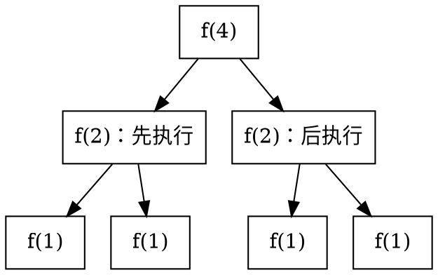

# 0.2 时间与空间复杂度概论

## 一份名单，为什么人数翻倍会慢得更多

上一节的学生名单需要学号唯一。现在要检查一批导入的学号：把每个学号与它前面的所有学号比较，统计重复的无序下标对。同一个学号若出现三次，就有三对重复。

你会预测：名单从 4 人变成 8 人，比较次数翻倍，还是接近四倍？先不要运行程序，也不用记任何复杂度公式。

```cpp:line-numbers {8} [duplicate-pairs.cpp]
#include <vector>

long long duplicate_pairs(const std::vector<int>& ids) {
    int n = static_cast<int>(ids.size());
    long long pairs = 0;
    for (int i = 0; i < n; ++i) {
        for (int j = 0; j < i; ++j) {
            if (ids[i] == ids[j]) ++pairs;
        }
    }
    return pairs;
}
```

这里没有发现重复就提前退出，因此每一对都要比较。本文只需基本 C++ 循环、数组和函数知识；出现的求和、对数和递归会从执行过程解释。先学会算这段程序，再把方法迁移到改变了一个条件的新程序。

## 先手算，再确定计数对象

令 `n` 为学号个数，选择一次 `ids[i] == ids[j]` 比较作为**基本操作**。注意返回值 `pairs` 数的是“相等的对”，我们现在数的是“比较过的对”，两者不同。

::: example 代表题一 · 三角循环的完整示范
取四个互不相同的学号 `[17, 8, 23, 31]`。预测比较次数后，逐行补出比较对象：

| 外层 `i` | 内层 `j` | 对应下标对 | 本轮比较次数 |
| --- | --- | --- | --- |
| 0 | 无 | 无 | 0 |
| 1 | 0 | `(1,0)` | 1 |
| 2 | 0, 1 | `(2,0), (2,1)` | 2 |
| 3 | 0, 1, 2 | `(3,0), (3,1), (3,2)` | 3 |

总共比较 `0+1+2+3=6` 次，返回的重复对数却是 `0`。即使四个学号全部相同，比较仍是 6 次，只是返回值变成 6。
:::

固定外层 `i`，`j` 取 `0` 到 `i-1`，恰好有 `i` 个值。外层的各轮依次执行，所以次数要**相加**：

$$
C(n)=\sum_{i=0}^{n-1}i=0+1+\cdots+(n-1)=\frac{n(n-1)}2.
$$

这里的求和符号就是把每一轮的账目合并：下方写起点，上方写终点，后面的 `i` 是该轮的次数。

::: proof 推导 · 为什么是 n(n−1)/2
把和正着、倒着各写一次。同一列相加都是 `n-1`，共有 `n` 列，所以两份总和为 `n(n-1)`，一份就是 `n(n-1)/2`。

也可以从问题核验：`n` 人中选两人有 `n(n-1)/2` 种无序配对，而循环恰好每对比较一次。两种计数方式应当一致。
:::

**方法提炼**：写出外层实际取值；固定其中一个值，数清内层次数；再对这些次数求和。只有各轮内层工作相同时，求和才能直接简化成“轮数乘每轮工作”。

边界也要核验：空名单和只有一人的名单都没有配对，比较次数为 0。它们仍要执行初始化和返回，所以“某个基本操作零次”不代表程序耗时为零。

先试做[第 15 题的精确计数](../../labs/chapter-00/theory/T-00-02-complexity-quiz/README.md#quiz-q15)：它仍然逐行求和，但起止边界变了。先列出第一行、最后一行和行数，再套求和公式。

## 从操作次数到增长趋势

| 人数 `n` | 三角循环比较次数 `n(n-1)/2` | 逐个浏览的访问次数 `n` |
| --- | --- | --- |
| 4 | 6 | 4 |
| 8 | 28 | 8 |
| 16 | 120 | 16 |
| 100 | 4950 | 100 |
| 1000 | 499500 | 1000 |

人数翻倍时，三角循环的比较次数比值是 `C(2n)/C(n)=2(2n-1)/(n-1)`（`n>1`），逐渐接近 4；逐个浏览则恰好翻倍。我们希望用一种简短语言描述这种增长差异。

::: definition 定义 · 规模、基本操作与时间复杂度
**输入规模**是刻画问题大小的参数，本题为记录条数 `n`。**基本操作**是所选计算模型中一次成本有常数上界的动作，例如机器字长整数的一次比较。**时间复杂度**描述算法工作量随输入规模增长的渐近变化。

本文使用常见的单位成本模型：整数及下标能放入机器字，基本算术和访问按常数时间计。示例中的整数运算不得溢出；实际计数实验使用小规模输入和 `long long` 计数器。渐近推导则考察该模型中的规模增长。
:::

数一个代表操作有用，是因为我们还核对了其他工作：三角循环的判断、自增等开销与比较次数同阶，再加外层的线性开销，总时间仍为平方级。若循环体调用一个复杂函数，就必须另计函数内部工作，不能把“一行代码”自动当作一次常数操作。

::: pitfall 易错点 · 规模不是永远等于某个数值
数组有 `n` 项时，`n` 是元素个数；若输入只有一个整数 `N`，其二进制表示长度约为 `log₂N`。执行 `N` 轮与“按输入位数线性”不是同一回事。字符串比较、大整数运算、打印可变长内容，也不能无条件按一次常数操作计。
:::

现在可以进入[操作计数实验](../../labs/chapter-00/exercise/E-00-01-operation-counter/README.md#先预测-再验证)，先做常数、线性、平方三种计数。它验证的是源程序的执行模型；实际秒数还受编译器优化、缓存和系统负载影响。复杂度不承诺某个固定耗时，也不代替测量。

## 渐近记号：先说含义，再写定义

对三角循环，$n(n-1)/2$ 与 $n^2$ 只差常数倍和低阶项。我们写 $C(n)=\Theta(n^2)$，读作“大 Theta”，表示同阶增长，即**渐近紧界**。

三种记号回答不同问题：

| 记号 | 含义 | 例子 |
| --- | --- | --- |
| `O(g(n))`，大 O | 渐近上界，增长至多为常数倍 `g(n)` | `n=O(n²)` 成立，但上界较松 |
| `Ω(g(n))`，大 Omega | 渐近下界，增长至少为正常数倍 `g(n)` | `n²=Ω(n)` 成立，但下界较松 |
| `Θ(g(n))`，大 Theta | 同时有上述上下界 | `3n+7=Θ(n)` |

::: definition 定义 · 渐近上界、下界与紧界
对最终非负的函数 `f(n)`、最终为正的函数 `g(n)`：

- `f(n)=O(g(n))`：存在常数 `c>0` 和阈值 `n₀`，使所有 `n≥n₀` 满足 $0\le f(n)\le c g(n)$。
- `f(n)=Ω(g(n))`：存在常数 `c>0` 和阈值 `n₀`，使所有 `n≥n₀` 满足 $0\le c g(n)\le f(n)$。
- `f(n)=Θ(g(n))`：存在常数 `c₁,c₂>0` 和阈值 `n₀`，使所有 `n≥n₀` 满足 $0\le c_1g(n)\le f(n)\le c_2g(n)$。

这些常数不能随 `n` 改变。“等于 O”是约定写法，不是普通函数之间的等号。
:::

例如 `n≥2` 时，`n-1≥n/2`，于是

$$
\frac14 n^2\le \frac{n(n-1)}2\le\frac12 n^2.
$$

这就给出了三角计数的紧界证明，不需要比较每一个可能的输入规模。

常见增长顺序为

$$
1\prec\log n\prec\sqrt n\prec n\prec n\log n\prec n^2\prec n^3\prec2^n\prec n!.
$$

这里 `≺` 表示左边比右边增长得更慢，讨论的是足够大的 `n`。例如 `1000n` 在小输入上可能比 `n²` 大；增长阶较低不保证每个小样本都更快。对固定底数 `b>1`，换底公式 $\log_b n=\log_2 n/\log_2 b$ 只带来常数因子。

### 最好、最坏、平均：先选函数，再给它求界

按学号顺序查找，遇到匹配就返回。相同长度的名单也可能花不同时间：目标在第一条时比较 1 次，在最后一条或不存在时比较 `n` 次。

::: example 平均情况需要概率前提
假设学号唯一，目标一定存在，而且等概率出现在 `n` 个位置。若在第 `k` 个位置找到，就比较 `k` 次，因此平均比较次数为

$$
\frac1n\sum_{k=1}^{n}k=\frac{n+1}{2}.
$$

若目标不存在的概率为 `r`，且成功时仍等概率落在各位置，平均次数变为 $rn+(1-r)(n+1)/2$。换了输入分布，就要重新计算平均值。
:::

最好、最坏分别在所有规模为 `n` 的输入中取最少、最多工作量；平均情况根据指定的输入分布取期望。因此这里最好时间为 `Θ(1)`，最坏为 `Θ(n)`，在上述分布下平均为 `Θ(n)`。平均不是“最好与最坏相加除以二”的通用公式。

::: pitfall 易错点 · 大 O 本身不等于最坏情况
==情况描述输入，渐近记号描述函数的界==。可以给最好、最坏、平均时间分别写 O、Ω 或 Θ。最好时间 `Θ(1)` 也满足 `O(n)`，但后一个说法不够紧。选择题若用 O 列出多个候选量级，本章约定选最紧的那一项；严格论证优先用 Θ 表达同阶。
:::

完成[选择题第 8、9、17 题](../../labs/chapter-00/theory/T-00-02-complexity-quiz/README.md#quiz-q8)，检查自己是否区分了增长阶、常数和上界。接下来的循环题则要把这些语言用到真实计数上。

## 循环题组：每次只改变一个条件

以下 `count++` 直接记录内层执行次数。实验取整数 `0≤n≤10⁶`，但平方循环请先用小 `n`；循环变量与计数器用 `long long`。复杂度结论讨论 `n` 增大时的趋势，不用 `log 0` 解释空输入。

### 变式一：只把内层上界 i 改成 n

```cpp [rectangle-count.cpp]
long long count = 0;
for (long long i = 0; i < n; ++i)
    for (long long j = 0; j < n; ++j)
        ++count;
```

先预测 `n=4`：原来是 6 次，现在是 16 次。外层取值没变，“固定外层再数内层”的方法也没变；必须调整的是每行次数，从 `i` 改为固定的 `n`。

$$
C(n)=\sum_{i=0}^{n-1}n=n^2.
$$

两者都是 `Θ(n²)`，精确计数却不同，而且这个改动会比较自己和自己、把不同下标的一对正反各比较一次。**复杂度同阶不代表程序完成了同一件事**。

### 代表题二：上界不动，只把外层步长改为翻倍

为了研究步长，先把三角计数的外层起点写成 `1`。原来 `i=0` 那行的内层次数为零，因此删去它不改变计数。然后只把 `++i` 改为 `i *= 2`：

```cpp:line-numbers {2} [geometric-count.cpp]
long long count = 0;
for (long long i = 1; i < n; i *= 2)
    for (long long j = 0; j < i; ++j)
        ++count;
```

这次由你补全。先预测 `n=8` 的次数，再填表，最后判断为什么不能直接用“外层轮数乘最大内层次数”当作精确结果。

| `n` | 外层进入循环时的 `i` | 总次数 |
| --- | --- | --- |
| 1 | 无 | 0 |
| 8 | `1, 2, ___` | `1+2+___` |
| 9 | `1, 2, ___, ___` | ___ |

与三角循环相比，每轮仍做 `i` 次工作，求和思想保留；必须调整的是 **`i` 不再取遍所有整数**。令 `m` 为外层轮数，先写出 `i=2^k` 和最后一次进入循环的条件，再把求和下标换成 `k`。

::: details 补全推导：边界决定最后一项
`n=8` 时 `i` 为 `1,2,4`，共 `7` 次；`n=9` 时多出 `i=8`，共 `15` 次。

当 `n>1`，$m=\lceil\log_2 n\rceil$，外层取 $2^0,\ldots,2^{m-1}$，最后一项小于 `n`，下一项 $2^m$ 不小于 `n`。因此

$$
C(n)=\sum_{k=0}^{m-1}2^k=2^m-1,\qquad n-1\le C(n)<2n-1.
$$

当 `n=1`，`m=0`，空和仍为 0；`n=0` 也不进入循环，单独处理即可。外层控制还需 $\Theta(\log n)$ 工作，总时间为 $\Theta(n)$。

若 $n=2^r$，严格条件 `i<n` 给出的次数是 $n-1$。只把条件改成 `i<=n`，则对 $n\ge1$ 有 $m=\lfloor\log_2 n\rfloor+1$，总次数为 $2^m-1$；仅当 `n` 为 2 的幂时才等于 $2n-1$。不能把某个特殊边界的精确式套在所有 `n` 上。
:::

这里用的是有限等比和。`1+2+4+…` 的无限级数不收敛；有限和与最大项同阶，才是得到线性时间的依据。

::: counterexample 反例 · 外层翻倍不保证总时间为对数级
保留翻倍外层，只把内层上界 `i` 改成 `n`。外层取值和轮数公式都不变，但每轮工作变成 `n` 次，总计 `n⌈log₂n⌉`（`n≥1`），时间为 `Θ(n log n)`。外层轮数不能代替整个算法的次数。
:::

现在对照做[第 3、6、13 题](../../labs/chapter-00/theory/T-00-02-complexity-quiz/README.md#quiz-q3)：第 3 题固定内层上界，第 6 题随 `i` 增长，第 13 题随 `i` 缩小。再到[计数实验的单条件变式](../../labs/chapter-00/exercise/E-00-01-operation-counter/README.md#单条件变式)验证 `n=1,2,7,8,9`，重点解释 8 到 9 的跳变。

### 变式三：只移动指针的初始化位置

下面两段都有外层循环与内层 `while`。先预测 `n=4` 时各执行几次 `++count`。

::: code-group

```cpp [reset-pointer.cpp]
long long count = 0;
for (long long i = 0; i < n; ++i) {
    long long j = 0;
    while (j < i) {
        ++j;
        ++count;
    }
}
```

```cpp [shared-pointer.cpp]
long long count = 0;
long long j = 0;
for (long long i = 0; i < n; ++i) {
    while (j < i) {
        ++j;
        ++count;
    }
}
```

:::

| 外层 `i` | 每轮重置：本轮 `j` 前进次数 | 不重置：本轮 `j` 前进次数 |
| --- | --- | --- |
| 0 | 0 | 0 |
| 1 | 1 | 1 |
| 2 | 2 | 1 |
| 3 | 3 | 1 |

只改变了 `j=0` 的位置。重置版仍可沿用三角求和；不重置版中，`j` 会继承上一轮的终点，“每轮从 0 走到 i”的依据已经失效。

不重置时，`j` 在整个程序里只从 `0` 前进到 `n-1`，`n≥1` 时总共前进 `n-1` 次；`n=0` 时为 0 次。还要加上外层 `n` 轮判断，总时间为 `Θ(n)`，而重置版为 `Θ(n²)`。

**可以迁移的方法**是跟踪变量整个运行期间的变化，而不是只看它在哪层循环里。前提是指针单调前进且不被重置；若别处把 `j` 后退或重置，就不能继续使用“全程只走一遍”的解释。

### 代表题三：累计多少，才会停止

下面的程序输入非负整数 `n`。给出循环次数的精确表达式和时间复杂度，解释结果，并核验 `n=0,6,7`。

```cpp [accumulated-stop.cpp]
long long rounds = 0;
long long total = 0;
while (total < n) {
    ++rounds;
    total += rounds;
}
```

::: details 独立作答后核对
计数对象是 `total += rounds` 的执行次数，设为 `k`。`n=6` 时累计值依次为 `1,3,6`，执行 3 次；`n=7` 时再走到 `10`，执行 4 次；`n=0` 时执行 0 次。

执行 `k` 轮后，`total=1+2+…+k=k(k+1)/2`。循环在第一次满足 `total≥n` 时停止，因此

$$
\begin{aligned}
k&=\min\{t\in\mathbb Z_{\ge0}:t(t+1)/2\ge n\}\\
 &=\left\lceil\frac{\sqrt{8n+1}-1}{2}\right\rceil.
\end{aligned}
$$

每轮只做常数次工作，所以时间为 `Θ(√n)`（渐近讨论 `n≥1`）。这里不是把 `n` 个数全部加完：`n` 是累计量的目标，迭代次数 `k` 才是未知量。

与三角题相比，等差求和仍成立，但问题方向变了：原题已知项数 `n` 求和；本题已知停止阈值 `n`，要反推最小项数。不能把 `rounds` 每次加 1 直接解释成线性时间。
:::

做[第 4、5、7 题](../../labs/chapter-00/theory/T-00-02-complexity-quiz/README.md)核验平方边界，再独立分析一个单条件变式：只把累加语句改成 `total += 2 * rounds - 1`。其他代码不变，`n=9` 与 `n=10` 各需几轮？

::: details 变式反馈
第 `k` 轮后累计前 `k` 个奇数，和为 `k²`，因此最少需 `⌈√n⌉` 轮。两个样例分别是 3 和 4 轮，时间仍为 `Θ(√n)`。停止不等式的方法保留，但累计和从三角数改成平方数，不能沿用原精确式。
:::

### 折半循环：终止于 1 和终止于 0

取正整数 `n`，从 `i=n²` 开始，每轮作整数除法 `i/=2`。例如 `n=5`：

```text
i != 1：25 -> 12 -> 6 -> 3 -> 1       （4 次除法）
i != 0：25 -> 12 -> 6 -> 3 -> 1 -> 0  （5 次除法）
```

整数除法向下取整。任何正整数反复除以 2 都会先到 1，再到 0。第一种次数是 `⌊log₂(n²)⌋`，第二种恰好多一次，二者均为 `Θ(log n)`。初值 `n²` 在对数里变成 `2log₂n`，不会把时间变成平方级。

若初值为 0 而条件是 `i!=1`，则会一直停在 0，无法终止；若把每步操作改成 `--i`，从 `n²` 到 1 才需要 `n²-1` 次。数值范围也必须保证 `n*n` 不溢出。用[第 1、18、19 题](../../labs/chapter-00/theory/T-00-02-complexity-quiz/README.md)检查“初值、步长、停止值”是否分别看清。

## 把计数迁移到方案比较：多次区间求和

某次测验的成绩已录入，老师反复询问名单中不同连续区间的总分。令记录数为 `n`、查询数为 `q`。为便于手算，先用 `[3,1,4,1,5]` 代替真实成绩，每次查询半开区间 `[l,r)`，包含 `l`，不包含 `r`。

先预测：三个查询 `[0,3)`、`[1,5)`、`[2,4)`，逐项相加要做几次加法？是否值得预先存下从头开始的累计和？

| 查询 | 逐项相加 | 结果 | 加法次数（从 0 累加） |
| --- | --- | --- | --- |
| `[0,3)` | `3+1+4` | 8 | 3 |
| `[1,5)` | `1+4+1+5` | 11 | 4 |
| `[2,4)` | `4+1` | 5 | 2 |

总计 9 次加法。直接法的工作由**每次区间长度**决定，不能把“单次最多扫 n 个”误写成每次恰好扫 `n` 个。

### 预处理：把共同计算留下来

定义 `prefix[k]` 为前 `k` 项之和，`prefix[0]=0`。上述数组对应 `[0,3,4,8,9,14]`。`prefix[r]` 包含 `[0,r)`，减去 `prefix[l]` 就去掉了 `[0,l)`，余下 `[l,r)`。

::: property 性质 · 前缀和查询
若 $0\le l\le r\le n$，则

$$
\sum_{i=l}^{r-1}a_i=\mathrm{prefix}[r]-\mathrm{prefix}[l].
$$

空区间 `l=r` 返回 0；全区间 `[0,n)` 返回 `prefix[n]`。区间结果可为负，前缀和不要求元素非负。
:::

```cpp:line-numbers {7,16} [range-sum.cpp]
#include <stdexcept>
#include <vector>

std::vector<long long> build_prefix(const std::vector<int>& a) {
    std::vector<long long> prefix(a.size() + 1, 0);
    for (std::size_t i = 0; i < a.size(); ++i) {
        prefix[i + 1] = prefix[i] + a[i];
    }
    return prefix;
}

long long range_sum(const std::vector<long long>& prefix,
                    int l, int r) {
    if (l < 0 || r < l || static_cast<std::size_t>(r) >= prefix.size())
        throw std::out_of_range("invalid range");
    return prefix[r] - prefix[l];
}
```

先调用一次 `build_prefix`，然后把同一份结果传给每次查询。假设累计值能放进 `long long`；`prefix` 必须是这份数据对应的合法前缀数组。小例子需要 5 次构建加法与 3 次查询减法，但这还没有计入分配、写入和边界检查，不能仅凭 `8<9` 就宣称实际耗时更短。

::: complexity 复杂度 · n 条数据与 q 次查询
设第 `t` 次查询长度为 `Lₜ`，不计读取已给定输入、逐次处理并输出查询结果：

- 直接求和：时间 $\Theta(q+\sum_{t=1}^{q}L_t)$，最坏每次查全区间时为 `Θ(qn)`（`n,q≥1`）；额外空间 `Θ(1)`。
- 前缀和：构建一次 `Θ(n)`，每次查询 `Θ(1)`，总时间 `Θ(n+q)`；额外空间 `Θ(n)`。

`q` 与 `n` 是独立变量。没有 `q=n` 的前提，就不能把 `qn` 自动写成 `n²`；依次扫描 `n` 项再扫描 `m` 项是 `Θ(n+m)`，扫描 `n×m` 个位置才是 `Θ(nm)`。
:::

**提炼方法**：列出一次性准备成本与重复成本，再用工作负载判断是否划算。查询很多且区间普遍较长时，预处理收益明显；只有一次短查询时，构建整份前缀和反而可能增加工作。

### 单条件变式：查询之间允许改成绩

假设把下标 `1` 的值从 `1` 改成 `7`。原来的查询公式仍成立，但**旧前缀数组不再对应当前数据**：从 `prefix[2]` 开始都需要调整，最坏一次更新花 `Θ(n)`。

::: counterexample 适用边界 · 前缀和依赖静态数据
用旧的 `prefix` 查询 `[1,2)` 会返回 1，而正确值已是 7。“每次查询常数时间”的前提是预处理结果有效。频繁修改时，需要把维护成本加回总账，或以后学习支持动态区间操作的结构。
:::

独立判断：`n` 很大，但 `q=1`，查询仅含两个元素；另一种情形中 `q=n`，每次查询长度至少为 `n/2` 且数据不变。分别比较两种方案的时间与额外空间。

::: details 迁移反馈
第一种直接法只做两次累加和常数次控制，查询时间 `Θ(1)`、额外空间 `Θ(1)`；前缀和要先花 `Θ(n)` 时间和空间。若把共同的输入读取也计入，两种完整程序都至少需要读取这份输入，须说明统计范围。

第二种直接法的长度和至少为 `n²/2`、至多为 `n²`，时间 `Θ(n²)`；前缀和为 `Θ(n+n)=Θ(n)`，代价是 `Θ(n)` 额外空间。结论依赖“查询长且多、数据静态”这三个条件。
:::

## 空间分析：同一时刻还留下了什么

三角循环可能执行几十万次比较，却始终只保留少量下标与计数变量。前缀和每次查询只做一次减法，却要保存整份辅助数组。总执行次数与内存占用没有固定的对应关系。

::: definition 定义 · 峰值辅助空间
本文默认分析**辅助空间**，不计已给定的输入；输出若全部保留在内存中，单独说明并计入保留成本。对某次执行，令 `M(t)` 为时刻 `t` 仍被算法占用的额外内存，则

$$
S_{\mathrm{aux}}=\max_t M(t).
$$

需要最坏空间时，再对相同规模的所有输入取最大值。统计的是同一时刻所有存活对象的总量，包括显式辅助结构、递归栈以及尚未释放的缓冲区。
:::

### 分配很多次，不等于同时占很多份

下面用同样大小的缓冲区解释生存期。假设每轮都要使用其中的 `n` 个元素：

| 做法 | 一次运行总共处理的元素量 | 同时保留的元素量 | 峰值额外空间 |
| --- | --- | --- | --- |
| 循环 `n` 轮，每轮创建一个长度 `n` 的临时数组，轮末销毁 | `n²` | 至多一份 `n` | `Θ(n)` |
| 同样循环，但把每轮数组都保存到结果集合 | `n²` | 最后有 `n` 份 `n` | `Θ(n²)` |
| 仅保留一个累计变量 | 取决于循环次数 | 常数个变量 | `Θ(1)` |

比如两份数组同时存在，长度分别为 `n`、`m`，就要相加成 `Θ(n+m)`；若第一份已释放后才申请第二份，则取峰值 `Θ(max(n,m))`。对两个参数它们同阶，但生存期分析仍须正确，面对许多份数组时差别可能改变最终量级。

::: pitfall 易错点 · 栈或堆不是加法与 max 的开关
“栈空间加法、堆空间取 max”不是通用规则。父调用若保留一个堆数组再进入子调用，父子数组就会同时存在，必须相加；兄弟调用若依次执行并释放临时数据，才能复用空间。

局部 `std::vector` 的元素缓冲区通常在堆上，局部对象析构会释放它所拥有的缓冲区；局部裸指针指向的 `new[]` 内存则不会因指针离开作用域自动释放。只数局部变量名会漏掉真正占空间的数据。
:::

若全部查询答案也存进长度 `q` 的数组，前缀和方案保留的辅助结构加输出共 `Θ(n+q)`；若逐条输出，则不需要这份答案数组。遇到“原地算法”一词，也先问是否把递归栈计入；本文若称**严格常数辅助空间**，就连递归栈一起计数。

完成[第 12、16 题](../../labs/chapter-00/theory/T-00-02-complexity-quiz/README.md)时，先写统计口径，再判断选项。涉及排序的例子可先依据解析理解其辅助结构，具体实现留到排序章节。

## 简单递归：调用总数与同时存活的调用

递归就是函数调用更小规模的自身。每次调用必须有终止条件；尚未返回的调用通常要保存参数、局部变量和返回位置，这些组成调用栈中的**栈帧**。这里按普通递归执行分析，不依赖编译器消除调用栈。

### 一条调用链：每次把规模减一

下面的函数计算前 `n` 个元素的和，前提为 `0≤n≤a.size()` 且结果不溢出：

```cpp [recursive-sum.cpp]
#include <vector>

long long recursive_sum(const std::vector<int>& a, int n) {
    if (n == 0) return 0;
    return recursive_sum(a, n - 1) + a[n - 1];
}
```

`n=3` 时依次进入 `sum(3), sum(2), sum(1), sum(0)`。共有 4 次调用、3 次加法；到 `sum(0)` 时前面三个调用尚未返回，4 个栈帧同时存在。

推广到 `n`：总调用数 `n+1`，每次调用除子调用外只做常数工作，故时间 `Θ(n)`；最大活跃调用数也为 `n+1`，每帧只保留常数信息，故辅助空间 `Θ(n)`。数组通过常量引用传入，没有为每次调用复制整个数组。改成一个循环累计，时间仍为 `Θ(n)`，辅助空间可降到 `Θ(1)`。

### 一条更短的链：每次只搜索一半

**二分查找**用于已排序且可按下标直接访问的序列：比较中间元素后，目标若存在，只可能在其中一半。每次递归只搜索那个半区，不是把两个半区都搜索一遍。

经过 `k` 次减半，候选量约为 `n/2^k`；缩小到常数规模需要 `Θ(log n)` 次。每个调用只作常数工作，最坏时间与普通递归实现的栈空间均为 `Θ(log n)`；用循环维护左右边界时，额外空间为 `Θ(1)`。未排序、链表按位置访问不便等情况，都不能直接搬用这个分析。

### 有两个分支，时间也不一定是指数级

先预测下面 `n=4` 时会调用几次：

```cpp [split-calls.cpp]
long long split_calls(int n) {
    if (n <= 1) return 1;
    long long left = split_calls(n / 2);
    long long right = split_calls(n / 2);
    return left + right;
}
```


<!-- diagram id="ch0-split-call-tree" caption="七个节点代表七次调用；先执行左子调用再执行右子调用，同时活跃的栈帧最多三个" -->

答案是 7 次。若 `n=2^h`，第 `d` 层有 `2^d` 个调用，层号从 0 到 `h`，总调用数为 `1+2+…+2^h=2n-1`；每个节点的非递归工作为常数，时间为 `Θ(n)`。这里同名节点是不同的调用，没有缓存复用。

空间则数同时未返回的调用：沿一条路径最多 `h+1` 帧，左边返回后才进入右边，每帧只保留常数大小的结果，所以辅助空间为 `Θ(log n)`。一般正整数也因向下取整而有同阶结论；本例不能用“二叉分支”直接推出 `Θ(2^n)`。

::: complexity 复杂度 · 递归时间与空间分开列账
时间累计所有实际执行调用的非递归工作；空间统计同时存活的栈帧、数据与保留结果。只有每帧大小有统一常数上界时，调用栈空间才与最大深度同阶。若各层保存不同大小的数组，应沿活跃路径逐项相加，不能直接用根层数组大小乘深度代替分析。
:::

到[第 2、14 题](../../labs/chapter-00/theory/T-00-02-complexity-quiz/README.md)比较“减一单分支”与“减半双分支”。若将 `split_calls` 的两个 `n/2` 都改成 `n-1`，试独立推导调用数与辅助空间。

::: details 递归变式反馈
正整数 `n` 时，调用数满足 `C(1)=1`、`C(n)=1+2C(n-1)`，展开得到 `C(n)=2^n-1`，时间为 `Θ(2^n)`。活跃路径只有 `n` 帧，每帧仍为常数，空间为 `Θ(n)`。求树上总和的方法保留，但深度由对数变成线性，时间因此改变得很大。

这是数学执行模型的结论，实际实验应只用小 `n`，并避免固定宽度整数返回值溢出。大量调用数与同时存活帧数的区别，在这个变式中尤其明显。
:::

## 拓展阅读：什么时候进入第 12 章

完成入门主线后，再读[从递推式到复杂度：递归树与主定理](../chapter-12-divide-conquer-recursion/06-recurrence-complexity.md)，学习每层非递归工作不再为常数时如何求和，再完成[选择题第 10、11 题](../../labs/chapter-00/theory/T-00-02-complexity-quiz/README.md)。主定理的条件与推导集中在第 12 章，本节不要求先背公式再分析递归。

原有高级材料中的两个关键判断，可在第 12 章继续核验：

- [不等规模递推的平方上界](../chapter-12-divide-conquer-recursion/06-recurrence-complexity.md#不等规模递推的平方上界)：`T(n)=3T(n/4)+2T(n/6)+n²` 为 `Θ(n²)`，根调用已给出平方下界，不能得出更小的量级。
- [归纳没有闭合时先检查什么](../chapter-12-divide-conquer-recursion/06-recurrence-complexity.md#归纳没有闭合时先检查什么)：一次归纳证明失败，只说明这次证明未完成，未必说明猜想错误。

::: details 可选的数学与理论阅读
小 o、小 ω 分别表示严格低阶和严格高阶：在函数最终为正的前提下，`f=o(g)` 对应 `f/g→0`，`f=ω(g)` 对应 `f/g→∞`。它们不是最好情况或最坏情况的别名。

渐近记号、代换法、主定理可查 Cormen、Leiserson、Rivest、Stein《Introduction to Algorithms》第 4 版第 3、4 章；Akra–Bazzi 方法用于更一般的分治递推，第 12 章保留一个有完整依据的实例。

复杂性理论研究问题在计算模型下需要多少资源，和本节为一个具体程序计数是不同层次。原空间拓展涉及的 Savitch 定理讨论确定性与非确定性空间的模拟，**不是空间层次定理**，也不能由它推出“空间比时间更强”。需要这部分背景时，可查 Sipser《Introduction to the Theory of Computation》第 3 版第 8 章；本章不使用这些定理作为解题前提。
:::

## 自检：把答案写成可复核的分析

拿一道新题，先不看选项，写出以下内容：

1. 输入规模、数值范围和所选基本操作；有多个独立参数时全部保留。
2. 一两个小样例的执行轨迹，检查起点、终点、是否取整和是否重置。
3. 操作次数的求和式，或“执行 k 轮后”的状态与停止不等式。
4. 渐近界及输入情况；平均情况附概率前提。
5. 峰值时仍存活的额外数据，说明是否保留输出、是否复制参数。
6. 只改一个条件后，哪些依据保留，哪一步需要重算。

把[19 道选择题](../../labs/chapter-00/theory/T-00-02-complexity-quiz/README.md)分组完成后，选择一道错题按这六项重写分析。随后可读 [0.3 从内存视角理解复杂度](./03-memory-perspective.md)，进一步区分渐近模型与具体机器上的访问代价。
