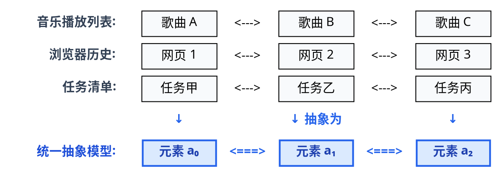
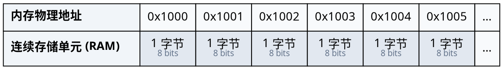

# 1.1 线性表抽象数据类型 (List ADT)

数据结构的学习通常以“线性表”为起点。本节我们将逐一探讨三个根本问题：
* 现实生活中的排队、播放列表与历史记录，在计算机中如何被抽象建模？
* 计算机底层硬件内存只是一维字节网格，我们如何在这上面组织结构化数据？
* 为什么在编写具体实现之前，必须先确立抽象数据类型（ADT）与接口契约？

---

## 学习目标

完成本节后，你应该能够：

- **追溯建模动机**：说明如何从生活中的一维序列场景中提炼出“一对一前驱后继”的逻辑关系；
- **理解内存现实**：理解逻辑序列与物理内存的映射关系，说明逻辑结构与物理存储的分层作用；
- **准确定义 ADT**：给出数据类型与抽象数据类型（ADT）的形式化定义，区分“接口契约（What）”与“底层实现（How）”；
- **规范接口设计**：写出语言无关的 List ADT 核心 API 声明，并严格定义索引范围（Pre-conditions）与异常处理契约。

---

## 1.1 序列问题与内存现实

### 1.1.1 现实中的一维序列
在日常生活与软件系统中，我们时刻都在处理“按先后次序排列”的数据：

* **音乐播放列表 (Playlist)**：歌曲按加入时间或播放次序排成一列。播放器支持按顺序播放下一首、返回上一首、在指定位置插入新歌或移除旧歌；
* **浏览器历史记录 (Browser History)**：用户访问网页的 URL 形成严格的时间序列。你可以点击“后退”回退到前驱网页，点击“前进”前往后继网页；
* **任务清单 (TodoList)**：任务按优先级或创建时间排列，完成一项划掉一项，有紧急事件则插入当前位置。

这些应用场景看似千差万别，但如果在数学与计算机视角下剥离具体业务属性，会发现它们共享了**完全相同的一维逻辑特征**：数据元素之间存在着**严格的先后次序**。


<!-- diagram id="linear-list-abstraction" caption: "从具体业务序列提炼出线性表的前驱后继抽象模型" -->

---

### 1.1.2 逻辑序列与物理内存的鸿沟

在计算机底层，物理内存（RAM）本质上是一维线性排列、按字节严格编号的**字节网格（Byte Grid）**：


<!-- diagram id="memory-byte-grid" caption: "物理内存由按字节严格编号的一维连续存储单元构成" -->

在硬件眼中，只有二进制比特（Bit）、以 8 位为单位的字节（Byte）以及按数值递增的**内存地址（Address）**。计算机硬件只认识地址寻址，并不理解什么是“播放列表”、“任务先后”或“前驱后继”。

这就产生了**逻辑需求与物理硬件之间的鸿沟**：
* **人类心智模型**：思考的是具有业务语义的逻辑序列（谁排在谁前面、插入新元素、删除旧元素）；
* **底层物理硬件**：提供的仅仅是一排排只能通过数值地址访问的字节盒子。

为了填补这道鸿沟，计算机科学确立了两个核心分层：
1. **逻辑结构（Logical Structure）**：脱离具体硬件，在数学层面定义数据元素之间的关联关系；
2. **物理存储（Physical Storage）**：研究如何利用底层的内存盒子与地址，高效地实现这种数学关系。

因此，我们遵循“先逻辑模型，后物理存储”的原则：本节先确立一维序列的逻辑模型与 ADT 契约；后续小节再分别探讨顺序表与链表两种物理存储实现。

---

### 1.1.3 线性表的逻辑模型
作为最基本的一种逻辑结构，<dfn>线性表 (Linear List)</dfn> 的形式化数学定义如下：

::: definition 线性表 (Linear List)
线性表是具有相同数据类型的 $n$（$n \ge 0$）个数据元素的**有限序列**，通常记作：

$$
L = (a_0, a_1, a_2, \dots, a_{i-1}, a_i, a_{i+1}, \dots, a_{n-1})
$$

其中 $n$ 为**表长 (Length / Size)**。当 $n = 0$ 时，$L$ 称为**空表 (Empty List)**。
:::

在线性表中，元素之间的逻辑关系被称为**一对一（1:1）前驱后继关系**：
1. **唯一首节点 (Head)**：$a_0$ 是序列的起点，**无直接前驱**，有且仅有一个直接后继 $a_1$（当 $n > 1$ 时）；
2. **唯一尾节点 (Tail)**：$a_{n-1}$ 是序列的终点，**无直接后继**，有且仅有一个直接前驱 $a_{n-2}$（当 $n > 1$ 时）；
3. **内部节点**：对于任意中间元素 $a_i$（$0 < i < n-1$），有且仅有一个直接前驱 $a_{i-1}$ 和一个直接后继 $a_{i+1}$。

::: property 核心性质 · 逻辑相邻 $\neq$ 物理相邻
线性表定义的是**逻辑上的相邻**（$a_i$ 在逻辑上紧跟 $a_{i-1}$）。==逻辑结构不等于存储结构==：至于数据元素在物理内存中是“紧挨着存放在连续地址上”（顺序表），还是“分散存放在各处并通过指针链接”（链表），在线性表这一数学抽象层面上完全不做限制。
:::

---

## 1.2 抽象数据类型与接口契约

### 1.2.1 抽象数据类型的概念
在 [0.1 数据结构基础概念](../chapter-00-introduction/01-data-structure-basics.md) 中，我们已经建立了抽象数据类型（ADT）的概念：**ADT 是一个数学模型以及定义在该模型上的一组操作**，它只声明操作能做什么（What），而不涉及如何实现（How）。

现在，我们将这一设计范式具体实例化到线性序列上，为线性表确立标准化的 **List ADT** 接口契约。

---

### 1.2.2 面向接口解耦
为什么软件工程中强调“面向接口编程”？

这就是软件设计中至关重要的 **面向接口编程与信息隐藏 (Information Hiding)** 原则：

```text
┌──────────────────────────────────────────────────────────┐
│                   上层业务调用方 (Client Code)              │
│       (音乐播放器 UI、浏览器标签页管理器、待办清单逻辑)        │
└────────────────────────────┬─────────────────────────────┘
                             │ 只依赖标准的 List 接口 (What)
                             ▼
┌──────────────────────────────────────────────────────────┐
│                   List ADT 抽象接口规范                   │
│      size() / isEmpty() / get() / set() / insert()       │
└──────────────┬────────────────────────────┬──────────────┘
               │ 实现方式 1                  │ 实现方式 2
               ▼                            ▼
┌─────────────────────────────┐ ┌──────────────────────────┐
│  物理连续存储：动态顺序表    │ │  物理离散存储：双向链表   │
│ (Dynamic Array / std::vector)│ │ (Doubly Linked List)     │
└─────────────────────────────┘ └──────────────────────────┘
```

1. **使用者与提供者解耦**：写播放器界面的工程师只需要知道调用 `list.insert(0, song)` 就能在开头插歌，不需要关心底层到底是搬移数组还是修改指针；
2. **底层实现的可替换性**：今天数据量小，底层可以使用顺序表；明天发现需要频繁在头部插入数据，底层就可以无缝替换成双向链表，而**上层业务调用代码无需修改**。

我们前面提到的 List ADT，在面向对象语言中正是通过**接口（Interface / 纯虚类）**来实现的。

---

### 1.2.3 List ADT 核心操作

在线性表中，我们将线性表元素在逻辑序列中的位置编号在理论模型中称为**秩 (Rank)**（强调其数学序数与前驱元素个数），在具体编程语言（如 C++/Java）与工程实现中则统称为**下标或索引 (Index)**（遵循现代惯例，采用 $0$-indexed 从 $0$ 开始编号）。**为了与后续章节的工程实现及标准库保持统一，下文统一使用"下标（index）"这一用词**。

在 [0.1 节](../chapter-00-introduction/01-data-structure-basics.md) 中，我们曾将数据结构的基本操作分成了四大类，在List ADT 里，这四类操作展开如下：

1. **创建与销毁**：由构造函数与析构函数完成，接口中体现为虚析构 `~List()`；
2. **访问与遍历**：`size()`、`isEmpty()` 与 `get(index)`，读取表的状态与指定下标的元素；
3. **查找与更新**：`find(value)` 按值检索首个匹配元素的下标（知值索位，未找到返回 `-1`），`set(index, elem)` 按下标修改元素（知位改值）；
4. **插入与删除**：`insert(index, elem)` 与 `remove(index)`，动态改变序列的结构。

它们在 C++ 中的纯虚接口声明如下：

```cpp:line-numbers [list-adt.hpp]
template <typename T>
class List {
public:
    virtual ~List() {}

    // ==================== 1. 访问与遍历操作 ====================
    
    /**
     * @brief 返回当前线性表中的元素个数 (表长)
     * @return int 表长 n (n >= 0)
     */
    virtual int size() const = 0;

    /**
     * @brief 判断线性表是否为空表
     * @return bool 若表长为 0 返回 true，否则返回 false
     */
    virtual bool isEmpty() const = 0;

    /**
     * @brief 获取指定下标 (index) 处的元素值 (知位索值)
     * @param index 目标元素下标
     * @pre 前置条件: 0 <= index < size()
     * @return T 目标位置的元素副本或常量引用
     */
    virtual T get(int index) const = 0;

    // ==================== 2. 查找与更新操作 ====================

    /**
     * @brief 查找第一个值为 value 的元素位置 (知值索位)
     * @param value 待查找的目标值
     * @return int 第一个匹配元素的下标；若不存在则返回 -1
     */
    virtual int find(const T& value) const = 0;

    /**
     * @brief 替换指定下标 (index) 处的元素值 (知位改值)
     * @param index 目标元素下标
     * @param elem 新元素值
     * @pre 前置条件: 0 <= index < size()
     */
    virtual void set(int index, const T& elem) = 0;

    // ==================== 3. 插入与删除操作 ====================

    /**
     * @brief 在指定下标 (index) 处插入一个新元素
     * @param index 插入位置 (插入后该元素成为新的 a[index]，原 a[index...] 依次后移)
     * @param elem 待插入的新元素
     * @pre 前置条件: 0 <= index <= size() (允许在末尾 size() 处追加)
     * @post 后置条件: size() 增加 1
     */
    virtual void insert(int index, const T& elem) = 0;

    /**
     * @brief 删除指定下标 (index) 处的元素并返回其值
     * @param index 待删除元素下标
     * @pre 前置条件: 0 <= index < size()
     * @post 后置条件: size() 减少 1，原 a[index+1...] 依次前移
     * @return T 被删除的元素原值
     */
    virtual T remove(int index) = 0;
};
```

---

### 1.2.4 边界契约与异常处理
在工程实践中，一个优秀的接口规范不仅要说明“正常情况下做什么”，更要明确**“异常与非法输入时的契约保证”**：

| 操作接口 | 合法输入范围 (Pre-condition) | 边界越界与未命中行为 (Out of Bounds) |
| :--- | :--- | :--- |
| `get(index)` / `set(index, e)` | $0 \le \text{index} < \text{size()}$ | 抛出 `IndexOutOfBoundsException` 异常 |
| `remove(index)` | $0 \le \text{index} < \text{size()}$ (空表不可删) | 抛出 `IndexOutOfBoundsException` 或 `Underflow` |
| `insert(index, e)` | $0 \le \text{index} \le \text{size()}$ | $\text{index} = \text{size()}$ 为合法尾插；其余越界抛异常 |
| `find(value)` | 任意合法类型值 `value` | 若未找到返回 `-1`（安全返回，不抛异常） |

### 例题：判定接口调用的合法性与边界行为

假设当前线性表 `list` 包含 3 个元素：`["A", "B", "C"]`（`size() == 3`）。请分析以下各行调用的执行结果（正常返回 / 抛出异常），并说明原因：

```cpp
1. list.get(3);
2. list.insert(3, "D");
3. list.remove(0);
4. int pos = list.find("Z");
5. list.get(pos);
```

::: details 查看分析
1. **`list.get(3)` 抛出异常**：合法下标区间为 $[0, \text{size}-1] = [0, 2]$，下标 `3` 越界。
2. **`list.insert(3, "D")` 正常执行**：插入允许 $\text{index} = \text{size}$，表示在表尾追加元素，执行后表长变为 4。
3. **`list.remove(0)` 正常执行**：表非空（$\text{size} > 0$）且下标 `0` 合法，删除首元素 `"A"`，原后继元素前移，表长减 1。
4. **`int pos = list.find("Z")` 正常执行**：表中不存在元素 `"Z"`，根据契约安全返回 `-1`，不抛出异常。
5. **`list.get(pos)` 抛出异常**：由于 `pos == -1`，直接将未校验的返回值传入 `get()` 导致下标越界。
:::

---

## 易错点清单

- **混淆逻辑与存储**：线性表是逻辑结构（仅定义一对一前后次序），不能等同于物理存储上的“数组”，链表同样是线性表；
- **混淆插入与存取的下标边界**：`get`、`set`、`remove` 的合法下标是 $[0, \text{size} - 1]$，而 `insert` 是 $[0, \text{size}]$（$\text{index} = \text{size}$ 代表尾插）；
- **误判空表操作**：空表（$\text{size} == 0$）无法读取或删除，但 `insert(0, elem)` 是完全合法的插入；
- **忽视 `find` 的哨兵返回值**：`find` 未命中时约定返回 `-1` 而不抛异常，若不加检查直接将返回值传入 `get()` 会引发越界。

---

## 小结与自测

请尝试回答以下问题以检验对线性表逻辑结构与 ADT 接口契约的理解：

1. 线性表的逻辑结构与物理存储结构有什么本质区别？
2. 为什么 `insert(index, elem)` 的合法下标范围是 $0 \le \text{index} \le \text{size()}$，而 `get(index)` 则是 $0 \le \text{index} < \text{size()}$？
3. 什么是面向接口解耦？为什么使用纯虚类定义 List ADT 能够方便后续替换底层实现？
4. 查找操作 `find(value)` 为什么在未找到时约定返回 `-1`，而不是像越界操作那样直接抛出异常？

::: details 查看自测答案
1. 逻辑结构描述的是数据元素之间的数学关联（线性表为一对一的先后前驱后继关系），脱离具体硬件；物理存储结构描述的是该逻辑关系在物理内存中的具体安置方式（如连续存储或指针链接）。同一种逻辑结构可以用多种不同的物理存储结构来实现。
2. `get(index)` 是对已有元素的访问，下标必须落在现有元素集合 $[0, \text{size} - 1]$ 内；而 `insert(index, elem)` 是在序列中开辟新位置，当 $\text{index} = \text{size}$ 时，语义是在当前最后一个元素之后追加新元素，因此是完全合法的边界。
3. 面向接口解耦将“能做什么（接口方法与契约）”与“怎么做（底层内存与算法）”彻底分开。上层代码只调用 `List` 接口，底层未来将动态数组（顺序表）替换为双向链表时，上层调用代码无需修改即可平滑复用。
4. 越界访问（如 `get(-1)`）属于违背调用前置条件的**程序逻辑错误 / 异常行为**，应抛出异常予以阻断；而按值查找未命中属于**正常且可预期的业务运行结果**，通过返回 `-1` 哨兵值通知调用方更为轻量高效。
:::

接口契约已经确立，接下来的核心任务是为其寻找高效的物理实现。最直观的方案，便是直接利用内存的物理连续性将数据紧密排列——这便是 [1.2 顺序表 (动态数组)](./02-sequential-list.md)。
