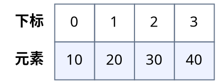
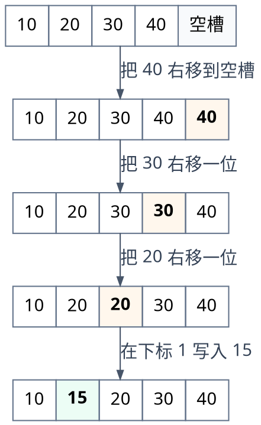
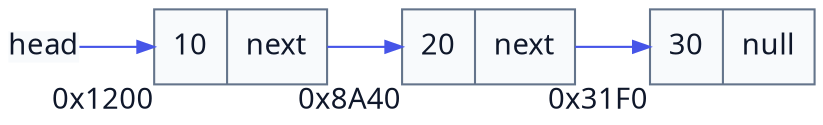
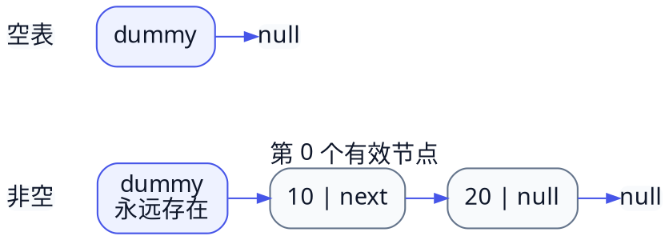
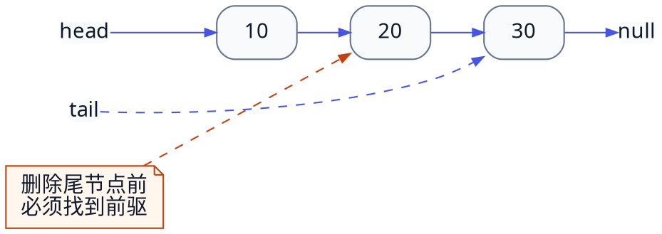
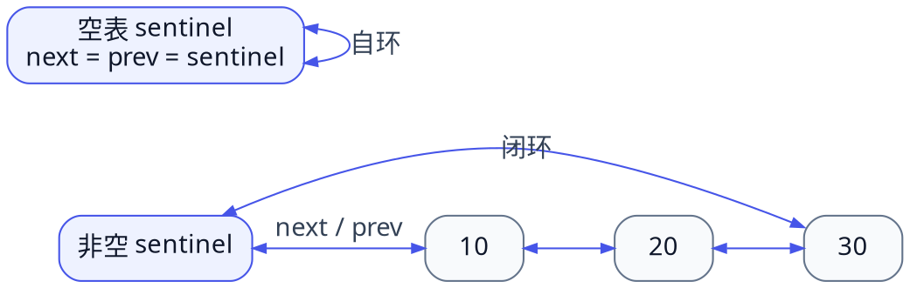

# 1.3 第二种实现——链表与演进设计

[顺序表](./02-sequential-list.md)把元素放在连续空间中，擅长按下标访问；链表走的是另一条路线：节点可以分散存放，再用链接表达先后关系。本节不只给出一份“能跑”的代码，而是沿着一条重构路线回答四个问题：

1. 为什么要从连续存储转向离散存储？
2. 为什么裸露的节点不足以成为可靠的数据结构？
3. 哨兵节点如何把边界特判变成普通操作？
4. 双向循环链表究竟优化了什么，又没有优化什么？

## 学习目标

完成本节后，你应该能够：

- 画出单链表和双向循环链表的节点关系；
- 解释“定位节点”与“修改链接”是两个不同的成本；
- 用封装、`size_` 缓存和哨兵节点逐步改进链表设计；
- 正确实现头、中、尾位置的插入和删除；
- 用不变量检查丢链、断链、空指针与尺寸漂移；
- 判断何时双向链表的额外指针值得付出。

## 3.1 离散存储引入

### 3.1.1 顺序表批量平移元素的 O(n) 痛点

假设顺序表当前保存：


<!-- diagram id="sequential-insert-before" caption="在下标 1 插入 15 之前，顺序表按下标 0 到 3 连续保存 10、20、30、40" -->

要在位置 `1` 插入 `15`，必须先把 `20、30、40` 依次向右移动：


<!-- diagram id="sequential-insert-shift-trace" caption="在下标 1 插入 15 时，必须先从尾部开始把 40、30、20 依次右移" -->

若当前长度为 `n`，在位置 `i` 插入需要移动 `n-i` 个元素；删除则要把后面的元素向左补位。在大规模数据中反复进行头部或中间插删，移动成本会成为主要开销。

::: tip 链表改变的是“搬移方式”
链表不会让数据凭空消失，也不会让查找自动变快。它只是把“批量搬移元素”改成“定位后修改少量链接”。
:::

### 3.1.2 离散物理内存与指针连接

链表把每个元素装进一个节点。单链表节点至少包含业务数据和下一个节点的地址：

```cpp [raw-node.cpp]
struct Node {
    int value;
    Node* next;
};
```

三个节点的物理地址可能相距很远，但 `next` 仍能建立稳定的逻辑顺序：


<!-- diagram id="linked-list-logical-order" caption="三个节点的物理地址彼此离散，但 next 指针仍把它们连接为 10、20、30 的稳定逻辑顺序" -->

这里要刻意分开两个概念：

- **物理相邻**：内存地址连续，顺序表依赖它；
- **逻辑相邻**：前一个节点保存后一个节点的地址，链表依赖它。

访问 `a[i]` 时，顺序表可由首地址直接计算目标地址；单链表只能从头沿 `next` 走 `i` 步，所以按位置访问是 `O(n)`。

## 3.2 坏设计的重构路线

### 3.2.1 原始裸节点链表

最短的演示代码可以直接拼接节点：

```cpp:line-numbers [raw-list.cpp]
Node* head = new Node{10, nullptr};
head->next = new Node{20, nullptr};
head->next->next = new Node{30, nullptr};
```

它说明了链接原理，却不是一份易维护的容器设计：

- `head` 和所有指针都暴露给调用者，任何代码都能破坏链条；
- 没有统一的插入、删除和越界约定；
- 每次求长度都要遍历，`size()` 是 `O(n)`；
- 谁负责释放节点不明确，容易泄漏或重复释放；
- 递归遍历长链表还可能耗尽调用栈。

::: warning 裸节点适合解释，不适合当作公共接口
如果调用者能随意改写 `next`，容器就无法保证“所有有效节点恰好被访问一次”这一基本不变量。
:::

### 3.2.2 封装单链表

第一步重构是用外壳类管理 `head_`，并把节点类型放进私有区域：

```cpp [encapsulated-list-shape.cpp]
class SinglyLinkedList {
private:
    struct Node {
        int value;
        Node* next;
    };

    Node* head_ = nullptr;
    std::size_t size_ = 0;

public:
    // 对外只暴露 size、at、insert、erase、clear 等操作。
};
```

封装带来三个直接收益：

1. 调用者只能通过受控操作修改链表；
2. 边界和失败方式可以集中定义；
3. 内部实现可以从直接头指针继续演进为哨兵，而不改变外部操作语义。

### 3.2.3 尺寸缓存

若每次 `size()` 都从头数到尾，查询长度需要 `O(n)`。维护一个 `size_` 字段后，长度查询可降为 `O(1)`：

```cpp
std::size_t size() const noexcept {
    return size_;
}
```

代价是每个结构修改操作都必须同步维护它：

| 操作 | `size_` 变化 |
| --- | --- |
| 成功插入一个节点 | `+1` |
| 成功删除一个节点 | `-1` |
| 查询、遍历、读取 | 不变 |
| `clear()` | 归零 |
| 操作因越界失败 | 不变 |

因此缓存不是“免费优化”，而是把一次查询成本换成一条新的全局不变量：

> `size_` 必须始终等于从首个有效节点沿 `next` 能访问到的有效节点数。

### 例题 1：找到尺寸漂移

下面的删除逻辑有什么问题？

```cpp
void erase_after(Node* previous) {
    Node* target = previous->next;
    previous->next = target->next;
    delete target;
}
```

::: details 查看分析
链接修改本身是正确的，但函数没有执行 `--size_`。删除一次后，遍历只能看到 `n-1` 个节点，`size()` 却仍返回 `n`。

还要补充前置条件：`previous != nullptr` 且 `previous->next != nullptr`。若条件不成立，读取 `target->next` 会触发未定义行为。
:::

## 3.3 哨兵节点的边界革命

### 3.3.1 链表边界特判的痛点

直接使用 `head_` 指向第一个有效节点时，头部操作和中间操作的代码形状不同：

```cpp
if (index == 0) {
    head_ = new Node{value, head_};
} else {
    Node* previous = locate(index - 1);
    previous->next = new Node{value, previous->next};
}
```

删除也要单独处理空表、首节点和普通节点。分支越多，越容易漏掉“删除唯一节点”“连续删除到空表”“清空后重新插入”等边界。

### 3.3.2 Dummy Head 的引入

哨兵节点不保存业务数据，只负责站在所有有效节点之前：


<!-- diagram id="dummy-head-cases" caption="dummy 节点在空表和非空表中始终存在，使第 0 个有效节点之前总有统一的前驱" -->

这样，第 `i` 个有效节点之前总有一个节点：

- `i = 0` 时，前驱是 `dummy`；
- `i > 0` 时，前驱是第 `i-1` 个有效节点。

下面是一份聚焦核心操作的单链表实现：

```cpp:line-numbers [singly-linked-list.cpp]
#include <cstddef>
#include <stdexcept>

class SinglyLinkedList {
private:
    struct Node {
        int value;
        Node* next;
    };

    Node dummy_{0, nullptr};
    std::size_t size_ = 0;

    Node* before(std::size_t index) {
        if (index > size_) {
            throw std::out_of_range("insert position out of range");
        }

        Node* cursor = &dummy_;
        for (std::size_t step = 0; step < index; ++step) {
            cursor = cursor->next;
        }
        return cursor;
    }

public:
    SinglyLinkedList() = default;
    SinglyLinkedList(const SinglyLinkedList&) = delete;
    SinglyLinkedList& operator=(const SinglyLinkedList&) = delete;

    ~SinglyLinkedList() {
        clear();
    }

    std::size_t size() const noexcept {
        return size_;
    }

    bool empty() const noexcept {
        return size_ == 0;
    }

    int at(std::size_t index) const {
        if (index >= size_) {
            throw std::out_of_range("index out of range");
        }

        const Node* cursor = dummy_.next;
        for (std::size_t step = 0; step < index; ++step) {
            cursor = cursor->next;
        }
        return cursor->value;
    }

    void insert(std::size_t index, int value) {
        Node* previous = before(index);
        previous->next = new Node{value, previous->next};
        ++size_;
    }

    int erase(std::size_t index) {
        if (index >= size_) {
            throw std::out_of_range("erase position out of range");
        }

        Node* previous = before(index);
        Node* target = previous->next;
        const int removed = target->value;
        previous->next = target->next;
        delete target;
        --size_;
        return removed;
    }

    void clear() noexcept {
        while (dummy_.next != nullptr) {
            Node* target = dummy_.next;
            dummy_.next = target->next;
            delete target;
        }
        size_ = 0;
    }
};
```

#### 代码讲解

- 第 11 行的 `dummy_` 是对象本身的一部分，不需要单独 `new` 或 `delete`。
- `before(index)` 允许 `index == size_`，因为尾后位置是合法插入点。
- `at(index)` 和 `erase(index)` 只允许 `index < size_`，因为它们必须访问已有元素。
- 插入时必须先让新节点接住 `previous->next`，再让前驱指向新节点；顺序反过来会丢失后半条链。
- 删除时先保存 `target`，再跨过目标节点，最后释放目标；释放后不得再读取 `target`。
- 类主动释放所有节点，并禁用默认浅拷贝。否则两个链表对象会持有同一批节点，析构时发生重复释放。

这段代码把“表头插入”变成普通的“在 `dummy_` 后插入”，但定位第 `i` 个位置仍需走 `i` 步。

### 例题 2：按正确顺序插入

已知链条 `dummy → 10 → 30 → null`，`previous` 指向节点 `10`。要求插入 `20`，以下哪种顺序正确？

1. `previous->next = new Node{20, nullptr}; newNode->next = oldNext;`
2. `Node* node = new Node{20, previous->next}; previous->next = node;`

::: details 查看分析
第 2 种正确。创建 `node` 时先保存旧后继 `30`，再把 `10` 的 `next` 改为 `node`，最终得到 `10 → 20 → 30`。

第 1 种如果没有在改写前另存 `oldNext`，就失去了到 `30` 的入口，后半条链无法再访问。
:::

## 3.4 双向链表与终极演进

### 3.4.1 单链表无法 O(1) 删除尾节点

给单链表增加 `tail_` 后，尾部追加可以直接接在 `tail_` 后面；但删除尾节点仍需要找到它的前驱：


<!-- diagram id="singly-linked-tail-predecessor" caption="tail 只定位尾节点 30；要删除它，单链表仍必须从 head 出发找到前驱节点 20" -->

`tail_` 只告诉我们“尾节点是谁”，没有告诉我们“谁指向尾节点”。因此，除非调用者已经持有前驱，否则尾删仍需从头遍历，复杂度为 `O(n)`。

### 3.4.2 双向指针 prev 与 next

双向节点同时保存前驱和后继：

```cpp
struct Node {
    int value;
    Node* prev;
    Node* next;
};
```

已知目标节点时，可以直接访问 `target->prev` 与 `target->next`，再让两侧节点跨过目标：

```cpp
target->prev->next = target->next;
target->next->prev = target->prev;
```

修改链接是 `O(1)`，但如果输入仍然只是“删除下标 `i`”，定位目标节点依旧需要 `O(n)`。

### 3.4.3 双向循环带哨兵链表

只使用一个哨兵，就能同时表达头、尾与空表：


<!-- diagram id="circular-sentinel-cases" caption="同一个 sentinel 在空表时自环，在非空表时与首尾节点组成双向闭环" -->

- `sentinel_.next` 是首个有效节点；
- `sentinel_.prev` 是最后一个有效节点；
- 空表时二者都指回哨兵；
- 有效节点永远位于某一对相邻节点之间。

```cpp:line-numbers [doubly-circular-list.cpp]
#include <cstddef>
#include <stdexcept>

class DoublyCircularList {
private:
    struct Node {
        int value;
        Node* prev;
        Node* next;
    };

    Node sentinel_{0, nullptr, nullptr};
    std::size_t size_ = 0;

    Node* node_at(std::size_t index) {
        if (index >= size_) {
            throw std::out_of_range("index out of range");
        }

        if (index < size_ / 2) {
            Node* cursor = sentinel_.next;
            for (std::size_t i = 0; i < index; ++i) {
                cursor = cursor->next;
            }
            return cursor;
        }

        Node* cursor = sentinel_.prev;
        for (std::size_t i = size_ - 1; i > index; --i) {
            cursor = cursor->prev;
        }
        return cursor;
    }

    void link_between(Node* left, Node* right, int value) {
        Node* node = new Node{value, left, right};
        left->next = node;
        right->prev = node;
        ++size_;
    }

    int unlink(Node* target) noexcept {
        const int removed = target->value;
        target->prev->next = target->next;
        target->next->prev = target->prev;
        delete target;
        --size_;
        return removed;
    }

public:
    DoublyCircularList() {
        sentinel_.next = &sentinel_;
        sentinel_.prev = &sentinel_;
    }

    DoublyCircularList(const DoublyCircularList&) = delete;
    DoublyCircularList& operator=(const DoublyCircularList&) = delete;

    ~DoublyCircularList() {
        clear();
    }

    std::size_t size() const noexcept {
        return size_;
    }

    bool empty() const noexcept {
        return size_ == 0;
    }

    void push_front(int value) {
        link_between(&sentinel_, sentinel_.next, value);
    }

    void push_back(int value) {
        link_between(sentinel_.prev, &sentinel_, value);
    }

    void insert(std::size_t index, int value) {
        if (index > size_) {
            throw std::out_of_range("insert position out of range");
        }
        Node* right = index == size_ ? &sentinel_ : node_at(index);
        link_between(right->prev, right, value);
    }

    int pop_front() {
        if (empty()) {
            throw std::out_of_range("pop from empty list");
        }
        return unlink(sentinel_.next);
    }

    int pop_back() {
        if (empty()) {
            throw std::out_of_range("pop from empty list");
        }
        return unlink(sentinel_.prev);
    }

    int erase(std::size_t index) {
        return unlink(node_at(index));
    }

    int front() const {
        if (empty()) {
            throw std::out_of_range("front of empty list");
        }
        return sentinel_.next->value;
    }

    int back() const {
        if (empty()) {
            throw std::out_of_range("back of empty list");
        }
        return sentinel_.prev->value;
    }

    void clear() noexcept {
        while (!empty()) {
            unlink(sentinel_.next);
        }
    }
};
```

#### 代码讲解

- 构造函数让哨兵的两个方向都指向自己，空表无需使用 `nullptr`。
- `link_between(left, right, value)` 的前置条件是 `left` 与 `right` 当前相邻。新节点先记录左右邻居，再更新左右邻居，共建立四条互相一致的链接。
- `unlink(target)` 不允许传入哨兵。它让左右邻居互相连接后再释放目标，头删和尾删使用完全相同的逻辑。
- `node_at` 根据下标落在前半还是后半，选择从头或从尾遍历；最坏复杂度仍为 `O(n)`。
- `push_front`、`push_back`、`pop_front`、`pop_back` 都已经持有相邻节点，因此结构修改是 `O(1)`。

### 3.4.4 修改成本 O(1) 与定位成本 O(n)

链表复杂度最常见的误解，可以用一个公式拆开：

$$
T_{\text{operation}}
= T_{\text{locate}}
+ T_{\text{relink}}
$$

- 输入是下标 `i`：通常要先遍历，`T_{\text{locate}} = O(n)`；
- 输入是有效节点或前驱指针：定位已由调用者完成，`T_{\text{locate}} = O(1)`；
- 已知相邻节点后，修改有限条链接，`T_{\text{relink}} = O(1)`。

所以“链表插入删除是 `O(1)`”缺少重要前提。更准确的说法是：

> 已经持有正确节点或前驱时，链表的局部链接修改是 `O(1)`；按下标定位后再修改，整体通常是 `O(n)`。

### 例题 3：尾删为什么会改变复杂度

有一个长度为 `n` 的链表，调用者只持有 `tail`：

1. 在单链表中删除尾节点；
2. 在双向循环哨兵链表中删除尾节点。

分别需要多少步？

::: details 查看分析
单链表的 `tail` 没有前驱信息，必须从头找到满足 `cursor->next == tail` 的节点，再更新尾指针，整体为 `O(n)`。

双向链表可由 `sentinel.prev` 取得尾节点，再由 `tail->prev` 取得新尾节点，修改两侧链接后释放目标，整体为 `O(1)`。

提升来自“目标和前驱都已知”，不是来自链表能按下标瞬移。
:::

### 例题 4：四条链接中漏了一条

在 `10 ⇄ 20` 之间插入 `15` 时，只执行：

```cpp
node->prev = left;
node->next = right;
left->next = node;
// 忘记 right->prev = node;
```

向前遍历可能仍得到 `10, 15, 20`。为什么结构依然错误？

::: details 查看分析
从 `20` 向后访问 `prev` 时仍会得到 `10`，跳过了 `15`，破坏了 `x->next->prev == x`。

双向链表不能只用单方向遍历验证。每次插入删除后都应检查正向序列、反向序列、尺寸以及哨兵两端是否一致。
:::

## 演进后的复杂度对照

| 操作 | 带哨兵单链表 | 双向循环哨兵链表 |
| --- | --- | --- |
| `size()` | `O(1)` | `O(1)` |
| 按下标访问 | `O(n)` | `O(n)`，可从较近一端开始 |
| 头部插入/删除 | `O(1)` | `O(1)` |
| 尾部插入 | 无尾指针时 `O(n)` | `O(1)` |
| 尾部删除 | `O(n)` | `O(1)` |
| 已知前驱后插入/删除 | `O(1)` | `O(1)` |
| 每节点链接域 | 1 个 `next` | 1 个 `prev` + 1 个 `next` |

## 不变量与易错点清单

实现链表时，不要只观察一组“看起来正确”的输出。至少检查：

- `size_` 等于实际有效节点数；
- 单链表最后一个节点满足 `next == nullptr`；
- 双向链表中任意节点满足 `x->next->prev == x` 与 `x->prev->next == x`；
- 空的双向循环链表满足 `sentinel.next == &sentinel` 和 `sentinel.prev == &sentinel`；
- 修改链接前已经保存仍需访问的节点；
- 删除节点后不再解引用它；
- 空表、单节点、头部、中间、尾部都经过测试；
- 容器的复制、移动与析构策略不会导致浅拷贝、泄漏或重复释放。

## 小结与自测

链表设计的演进不是不断添加字段，而是在消除可重复出现的风险：

```text
裸节点
  → 外壳封装所有权
  → size 缓存稳定长度查询
  → dummy head 统一表头边界
  → prev + next 支持双向局部修改
  → circular sentinel 统一空表、头与尾
```

请尝试回答：

1. 为什么 `size_` 是性能优化，同时也是新的正确性负担？
2. 哨兵节点保存业务数据吗？它为什么能减少分支？
3. 维护 `tail` 为什么只能让单链表尾插变快，不能让尾删也自动变快？
4. 双向循环链表按下标删除第 `i` 个元素的整体复杂度是多少？
5. 如果业务长期保存某个节点的地址，删除该节点后还需要防范什么问题？

::: details 查看自测答案
1. 它把 `size()` 从遍历变成字段读取，但所有插删都必须同步更新字段。
2. 不保存。它为首个有效节点提供固定前驱，让头部操作复用普通链接逻辑。
3. `tail` 只给出尾节点，没有给出尾节点前驱；尾删仍需寻找前驱。
4. 定位 `O(n)`，修改链接 `O(1)`，整体 `O(n)`。
5. 防范悬空指针。节点释放后，旧地址不能再读取；工程中常用受控迭代器、句柄或明确生命周期约束。
:::

接下来完成 [Lab 01-E-04：单链表逆置](../../labs/chapter-01/exercise/E-01-04-singly-linked-list-reverse/README.md)，用可运行测试覆盖空表、单节点和多节点链接修改。下一篇将把这些实现放到同一张决策表中：[1.4 比较与权衡](./04-comparison-and-selection.md)。
