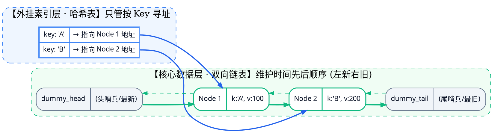

# 1.5 现实中的 List 与工程扩展

前面几节讨论了顺序表和链表的原理及选型。本节把这些结论放回真实的软件工程里：标准库到底封装了哪些细节？没有原生指针时怎么表达链式关系？一个看似简单的 LRU 缓存为什么还需要考虑并发问题？

## 学习目标

- 区分标准库的公开接口与具体实现细节；
- 理解静态链表中游标、自由表的作用和限制；
- 搞清楚 LRU 里哈希表和双向链表各自负责什么，以及基础版本为什么不支持并发。

## 1.5.1 标准库：先看接口，再看源码

标准库文档给出的是**公开接口**——也就是你可以依赖的行为、复杂度和失效规则。源码展示的是**某个版本的具体实现**，它解释了为什么这个版本做了这样的取舍，但不能推广到所有实现。

### 5.1.1 `std::vector` 与 `std::list`

`std::vector` 是连续存储的动态数组，按下标访问直接对应地址计算；`std::list` 是双向链表，插入删除已知节点时不需要搬移元素。它们都实现了容器接口，但连续空间、节点稳定性和修改成本的权衡完全不同。

以 GCC 的 libstdc++ 为例，`vector` 内部用 `_M_start`、`_M_finish`、`_M_end_of_storage` 三个指针分别标记已分配区间的起点、已构造元素的末尾和容量末尾。**注意：这只是 libstdc++ 的一种实现方式，不是 C++ 标准强制的布局。**

`vector` 的 `push_back` 在容量足够时只需在末尾构造元素，容量不足时才需要重新分配并搬移已有元素。在通常的 1.5 倍或 2 倍扩容策略下，多次尾部追加的均摊复杂度是 $O(1)$，但单次调用并不保证恒为 $O(1)$。

另外要注意一个常见误区："`list` 的插入删除是 $O(1)$" 这句话的前提是**已经给出了有效节点或迭代器**。如果输入只是下标或键，定位节点的遍历成本必须算进总成本里。

`std::list` 的节点布局同样不是标准规定的；不要把"带循环哨兵"当成所有实现的共同事实。工程选型时仍然要回到第 1.4 节的核心问题：访问者手里拿的是下标、键，还是稳定的节点句柄？

### 5.1.2 `ArrayList` 与 `LinkedList`

Java 的 `ArrayList` 用数组作缓冲区，`LinkedList` 同时实现了 `List` 和 `Deque` 接口。前者适合按位置读取和顺序遍历，后者在双端操作和已知节点附近的局部修改上更直接。

OpenJDK 的 `ArrayList` 扩容通常按 `oldCapacity + (oldCapacity >> 1)` 计算，也就是约 1.5 倍增长。但 JDK 文档只保证追加的均摊常数时间，**增长倍率本身不是 Java API 的公开契约**，不同版本可能不同。

还有一个容易被忽略的点：`ArrayList` 在结构性修改与并发访问交叠时并不安全，需要外部同步。这不是"数组"或"链表"的名称就能自动解决的问题。

## 1.5.2 静态链表与 Free List 内存池

### 5.2.1 诞生契机：没有指针年代的“数组模拟”

在早期高级语言（如早期 FORTRAN、BASIC）中，语言本身没有提供原生指针与堆内存分配（`malloc`）。为了获得链表“插入删除无需搬移大量内存”的灵活性，先驱工程师们**用数组下标模拟指针**：
* 节点预先存放在连续数组的“槽位（Slot）”中；
* 槽位内部用一个整型变量——**游标（Cursor）**，记录下一个逻辑节点的数组下标。

这种用数组槽位与游标构筑的结构，就是**静态链表（Static Linked List）**。

### 5.2.2 核心设计：双链共存与 Free List

静态数组容量在一开始就被固定。为了能在插入新节点时以 $O(1)$ 代价立即拿到空闲槽位（而非 $O(N)$ 遍历扫描数组寻找空位），静态链表采用了**“用链表管理链表”**的巧妙设计：在同一个数组中同时穿插两条互不干扰的链表：

1. **数据链表（Active List，`head` 引导）**：串联已存入的有效业务数据；
2. **备用链表（Free List，`free_head` 引导）**：把当前所有**未使用的空闲槽位**用自身的 `next` 游标串联成一条备用链表！

```graphviz
digraph StaticLinkedListDualList {
  rankdir=LR;
  graph [nodesep=0.35, ranksep=0.45, bgcolor="#ffffff"];
  node [fontname="sans-serif", fontsize=11];
  edge [fontname="sans-serif", fontsize=10, arrowsize=0.75];

  // 物理连续槽位 (0..5)
  node [shape=record, style="filled,rounded", color="#94a3b8", fillcolor="#f8fafc", fontcolor="#0f172a", margin="0.12,0.08"];
  slot0 [label="{下标 [0] | 哨兵/终止 | next: 0}", fillcolor="#f1f5f9", color="#cbd5e1"];
  slot1 [label="{下标 [1] | data: 'A' | next: 3}", fillcolor="#ecfdf5", color="#10b981", penwidth=1.5];
  slot2 [label="{下标 [2] | (空闲) | next: 5}", fillcolor="#fffbeb", color="#f59e0b", penwidth=1.5];
  slot3 [label="{下标 [3] | data: 'B' | next: 4}", fillcolor="#ecfdf5", color="#10b981", penwidth=1.5];
  slot4 [label="{下标 [4] | data: 'C' | next: 0}", fillcolor="#ecfdf5", color="#10b981", penwidth=1.5];
  slot5 [label="{下标 [5] | (空闲) | next: 0}", fillcolor="#fffbeb", color="#f59e0b", penwidth=1.5];

  // 约束物理槽位在水平一条线上严格按 0, 1, 2, 3, 4, 5 排列
  slot0 -> slot1 -> slot2 -> slot3 -> slot4 -> slot5 [style=invis, weight=50];

  // 两个头指针
  node [shape=box, style="filled,rounded", fontcolor="#ffffff", penwidth=0];
  head [label="head = 1\n(数据链首)", fillcolor="#10b981"];
  free_head [label="free_head = 2\n(空闲链首)", fillcolor="#f59e0b"];

  // 头指针指向首节点
  head -> slot1 [color="#10b981", penwidth=2.2];
  free_head -> slot2 [color="#f59e0b", penwidth=2.2];

  // 活动数据链表 (Active List) 逻辑连接 (1 -> 3 -> 4 -> 0)
  slot1 -> slot3 [color="#10b981", penwidth=2.2, constraint=false, label="A -> B"];
  slot3 -> slot4 [color="#10b981", penwidth=2.2, constraint=false, label="B -> C"];
  slot4 -> slot0 [color="#10b981", penwidth=1.8, style=dashed, constraint=false, label="终止"];

  // 备用空闲链表 (Free List) 逻辑连接 (2 -> 5 -> 0)
  slot2 -> slot5 [color="#f59e0b", penwidth=2.2, constraint=false, label="空闲 2 -> 5"];
  slot5 -> slot0 [color="#f59e0b", penwidth=1.8, style=dashed, constraint=false, label="终止"];
}
```


<!-- diagram id="static-linked-list-dual-list" caption="静态链表在同一物理数组中维护两条逻辑链表：绿色为存放有效数据的活动链表，黄色为串联可用槽位的备用空闲链表（Free List）" -->

### 5.2.3 底层机制：$O(1)$ 的对象内存池实现

分配（`alloc`）相当于对 Free List 执行 **Pop Front**，回收（`free`）相当于对 Free List 执行 **Push Front**，纯用户态运行，耗时恒定为 $O(1)$：

```cpp:line-numbers [static-list-pool.cpp]
template <typename T, size_t Cap>
class StaticList {
    struct Slot { T data{}; int next{0}; };
    std::array<Slot, Cap + 1> slots_{}; // slots_[0] 作空指针哨兵
    int head_{0}, free_head_{1};

public:
    StaticList() {
        // 初始化：将 1..Cap 串成一条满额的空闲链表 (1->2->...->Cap->0)
        for (size_t i = 1; i < Cap; ++i) slots_[i].next = i + 1;
    }

    int alloc_slot() {
        if (free_head_ == 0) throw std::overflow_error("Pool full");
        int cur = free_head_;
        free_head_ = slots_[free_head_].next; // 摘出首个可用槽位
        return cur;
    }

    void free_slot(int idx) {
        slots_[idx].next = free_head_;
        free_head_ = idx; // 归还槽位，插回 Free List 表头
    }

    void push_front(const T& val) {
        int s = alloc_slot();
        slots_[s].data = val;
        slots_[s].next = head_;
        head_ = s;
    }
};
```

### 5.2.4 关键认知与现代工程价值
* **物理下标 $\neq$ 逻辑位序**：数组下标仅是槽位编号。访问逻辑第 $k$ 个元素依然必须沿游标走 $k-1$ 步（$O(k)$），**不具备随机访问能力**；
* **现代工业场景**：
  1. **高可靠嵌入式（MISRA C 规范）**：车载与航天严禁在运行时调用 `malloc/free`（防碎片与不确定耗时），必须预分配静态池；
  2. **操作系统内核**：Linux Slab 分配器底层管理空闲对象块的核心就是单向 Free List 模式；
  3. **算法竞赛（链式前向星）**：用静态数组模拟图的邻接表，常数性能比动态容器高数倍。

可以先完成配套练习 [Lab 01-T-05：静态链表选择题精练](../../labs/chapter-01/theory/T-01-05-static-linked-list-quiz/README.md)，巩固游标转移与槽位复核的核心细节。

## 1.5.3 LRU 缓存：从线性表到组合结构

LRU（最近最少使用）本质是一种淘汰调度策略，而非绑定某一种特定结构。它的演进清晰反映了线性表的物理边界：

### 5.3.1 规模分水岭
- **小容量（$N \le 16$）**：**纯数组**最佳。CPU 硬件 L1/L2 缓存直接用寄存器或小数组移位实现，享有 100% 缓存局部性且无指针开销；
- **大容量（$N > 1000$）**：纯数组搬移 $O(n)$ 不可接受，纯链表按键查找 $O(n)$ 也成瓶颈，必须引入**“双向链表 + 外挂哈希表”**组合结构。

### 5.3.2 谁在干什么？链表与哈希表的分工

这是理解该结构的关键——两者各司其职，缺一不可：

| 组件 | 角色定位 | 核心工作（代码体现） | 为什么必须有它？（优势与盲区） |
| :--- | :--- | :--- | :--- |
| **双向链表** | **身体（维护时序）** | `remove()`、`add_head()`、`tail->prev` | **优势**：仅改 4 根指针即可 $O(1)$ 挪动或淘汰任意节点。<br>**盲区**：无法根据 Key 定位，纯链表查找需 $O(n)$。 |
| **哈希表** | **眼睛（外挂导航）** | `map[key]`、`map.erase(key)` | **优势**：根据 Key 瞬间在 $O(1)$ 定位到节点内存地址。<br>**盲区**：它只管寻址，完全没有“谁先谁后”的时间概念。 |


<!-- diagram id="lru-composite-structure" caption="哈希表作为外挂索引提供 O(1) 按键直达节点，双向链表通过虚拟头尾哨兵提供 O(1) 摘除与置顶" -->

> **关键细节**：链表节点内冗余保存 `k`，是为了淘汰尾节点 `victim` 时，能凭 `victim->k` 反向去哈希表中精准执行 `map.erase()`。

### 5.3.3 核心代码：看清指针分界

```cpp:line-numbers [lru-cache.cpp]
class LRUCache {
    // 1. 【双向链表部分】：维护时序的核心指针节点
    struct Node { int k, v; Node *prev{nullptr}, *next{nullptr}; Node(int k=0, int v=0): k(k), v(v) {} };
    int cap;
    Node *head, *tail; // 虚拟头尾哨兵

    // 2. 【哈希表部分】：外挂索引字典 (Key -> 链表节点内存指针)
    std::unordered_map<int, Node*> map;

    // 【纯双向链表操作】：仅修改 4 根指针，O(1)
    void remove(Node* n) { n->prev->next = n->next; n->next->prev = n->prev; }
    void add_head(Node* n) { n->next = head->next; n->prev = head; head->next->prev = n; head->next = n; }

public:
    explicit LRUCache(int c) : cap(c), head(new Node()), tail(new Node()) {
        head->next = tail; tail->prev = head;
    }

    int get(int k) {
        // [哈希表负责]：O(1) 查找是否存在
        if (!map.count(k)) return -1;
        Node* n = map[k];
        // [双向链表负责]：把已知节点摘下，置顶到表头 (更新时序)
        remove(n); add_head(n);
        return n->v;
    }

    void put(int k, int v) {
        if (map.count(k)) {
            Node* n = map[k]; n->v = v;
            remove(n); add_head(n); // [双向链表负责] 挪到表头
        } else {
            if (map.size() == cap) {
                // [双向链表负责]：从尾部拿到最久未使用的节点
                Node* victim = tail->prev;
                remove(victim);
                // [哈希表负责]：同步注销该节点的索引
                map.erase(victim->k);
                delete victim;
            }
            Node* n = new Node(k, v);
            map[k] = n;      // [哈希表负责] 登记索引
            add_head(n);     // [双向链表负责] 插入最新表头
        }
    }
};
```

### 5.3.4 并发死穴与工业演进
- **读写锁失效**：严格 LRU 的 `get` 命中必须修改链表指针置顶，**读操作本质是写操作**，导致读写锁退化为全局互斥锁争用；
- **工业折中方案**：
  - **分段加锁（Striped Lock）**：拆分为多个独立 LRU 分片，分散锁竞争；
  - **MySQL 冷热切分**：按 5/8 划分 New/Old 区，防止偶发的大表全表扫描冲垮所有热数据；
  - **Redis 采样近似**：放弃全局链表（省去 16 字节指针），随机抽样 5 个 key 淘汰最旧项。

## 参考来源

- [GCC libstdc++：`stl_vector.h`](https://github.com/gcc-mirror/gcc/blob/master/libstdc%2B%2B-v3/include/bits/stl_vector.h)，访问日期：2026-08-17。三指针示例仅对应该实现。
- [C++ reference：`std::vector`](https://en.cppreference.com/w/cpp/container/vector) 与 [`std::list`](https://en.cppreference.com/w/cpp/container/list)，访问日期：2026-08-17。
- [OpenJDK：`ArrayList.java`](https://github.com/openjdk/jdk/blob/master/src/java.base/share/classes/java/util/ArrayList.java)，访问日期：2026-08-17。增长策略随实现版本变化。
- [Java SE 21：`ArrayList`](https://docs.oracle.com/en/java/javase/21/docs/api/java.base/java/util/ArrayList.html) 与 [`LinkedList`](https://docs.oracle.com/en/java/javase/21/docs/api/java.base/java/util/LinkedList.html)。

## 小结

- 标准库接口告诉你"可以依赖什么"，源码阅读告诉你"这个版本为什么这样取舍"；不要把二者混为一谈。
- 静态链表用游标链接逻辑顺序，自由表负责可复用槽位；物理数组本身不自动带来逻辑上的随机访问能力。
- LRU 是一种淘汰策略而非特定结构：纯顺序表（小容量/硬件缓存）与纯链表各有优劣；当规模扩大时，通过“双向链表时序 + 外挂哈希快速定位”组合出双重 $O(1)$ 能力，但在并发场景下需警惕 `get` 带来的链表写竞争。

