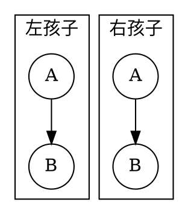
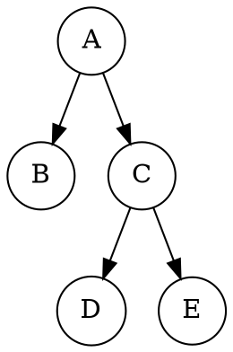
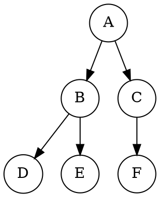
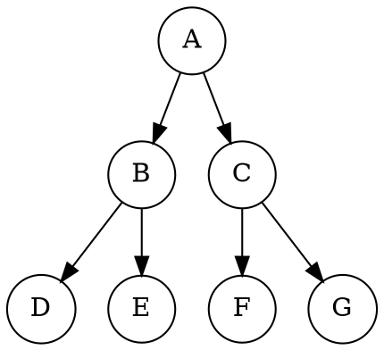
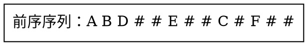

# 4.2 二叉树

一般树只关心“有几个孩子”；二叉树进一步给每个节点安排了两个固定且有序的位置：左孩子槽与右孩子槽。即使某个槽为空，它的位置语义仍然存在。这个小小的限制带来了递归定义、数组编号、数量性质和统一节点结构，也让二叉树成为搜索树、堆、表达式树等结构的共同基础。

## 学习目标

完成本节后，你应该能够：

- 严格描述二叉树以及左右子树不可交换的语义；
- 区分 Full、Complete、Perfect 三种特殊形态，不被中文“满二叉树”的歧义误导；
- 推导层节点上界、总节点上界、$n_0=n_2+1$ 与完全二叉树编号关系；
- 比较顺序存储和二叉链表，并解释中序线索如何复用空链域；
- 用 C/C++ 根据带空标记的先序序列创建二叉树，并正确处理失败与销毁。

## 4.2.1 二叉树的定义与左右子树

::: definition 定义 · 二叉树
<dfn>二叉树</dfn>（binary tree）是有限节点集合：

- 它可以是空集，此时称为空二叉树；
- 它也可以由一个根节点，以及两棵互不相交的二叉树组成；这两棵树分别称为根的<dfn>左子树</dfn>和<dfn>右子树</dfn>。

每个节点至多有一个左孩子和一个右孩子。左、右是有序位置，交换后通常得到另一棵二叉树。
:::

可把非空二叉树写成递归形式：

$$
T=(r,T_L,T_R),
$$

其中 $r$ 是根，$T_L$ 与 $T_R$ 分别是左、右二叉树；两者都允许为空。

::: counterexample 反例 · 一个孩子不等于一个无方向孩子
下面两棵树的数据相同、节点度数也相同，但不是同一棵二叉树：


<!-- diagram id="binary-left-or-right" caption: "同一节点放在左槽与右槽是两种不同的二叉树" -->

在一般无序树中，它们可能被视为同一种父子关系；在二叉树中，“B 位于左槽”与“B 位于右槽”是不同结构。
:::

::: pitfall 易错点 · 二叉树不只是“度不超过 2 的树”
“每个节点至多两个孩子”只描述了数量上限。二叉树还规定两个孩子位置有左、右之分，并允许“左空右非空”。因此把一般树的两个孩子随意交换，或把唯一孩子统一挪到左边，都会丢失二叉树结构信息。
:::

## 4.2.2 二叉树的特殊形态：满（Full）/ 完全（Complete）/ 完美（Perfect）

英文资料中的 Full、Complete、Perfect 有清晰区别；中文资料却常把 Full 或 Perfect 都译作“满二叉树”。本文始终同时给出英文术语，并采用下表口径：

| 形态 | 本文中文 | 严格条件 | 是否要求叶在同层 |
| --- | --- | --- | --- |
| Full binary tree | 正则（Full）二叉树 | 每个节点的孩子数只能是 $0$ 或 $2$ | 否 |
| Complete binary tree | 完全二叉树 | 除最后一层外全部填满，最后一层从左向右连续 | 否 |
| Perfect binary tree | 完美二叉树 | 每个内部节点都有两个孩子，且所有叶位于同一层 | 是 |

::: info 术语口径
国内很多数据结构教材把 Perfect binary tree 称为“满二叉树”；也有译文把 Full binary tree 直译为“满二叉树”。看到“满”字时不要只凭中文判断，应继续检查它要求的是“节点度只能为 0 或 2”，还是“每一层全部填满”。本文分别写作“正则（Full）”与“完美（Perfect）”。
:::

### Full：每个节点要么没有孩子，要么左右俱全


<!-- diagram id="full-binary-tree" caption: "正则（Full）二叉树：每个节点的孩子数只能是 0 或 2" -->

这棵树是 Full：`A`、`C` 都有两个孩子，`B`、`D`、`E` 都是叶。但叶不在同一层，所以它不是 Perfect；最后一层又没有从左侧连续填充，所以它也不是 Complete。

### Complete：像数组一样逐层、从左到右填入


<!-- diagram id="complete-binary-tree" caption: "完全二叉树：最后一层从左向右连续填充" -->

完全二叉树只允许最后一层不满，而且最后一层节点必须靠左连续。因此：

- 不能在某个位置留下空槽后，又在其右侧出现节点；
- 只有最后一个内部节点可能仅有左孩子；
- 层序编号不会出现中间空洞，适合直接放入数组。

### Perfect：每一层全部填满


<!-- diagram id="perfect-binary-tree" caption: "完美二叉树：每一层都被完全填满" -->

若 Perfect 二叉树共有 $k$ 层，则叶节点数为 $2^{k-1}$，总节点数为 $2^k-1$。

::: property 性质 · 三种形态的包含关系

$$
\text{Perfect} \Longrightarrow \text{Full},\qquad
\text{Perfect} \Longrightarrow \text{Complete}.
$$

反向均不成立，Full 与 Complete 之间也不存在一般的相互包含关系。例如上面的 Full 树不是 Complete；一个含 $6$ 个节点的 Complete 树中，节点 `C` 只有左孩子，所以不是 Full。
:::

::: example 示例 · 快速判断
判断一棵树是否 Complete 时，可以想象按层序把节点装入数组：一旦遇到第一个空孩子位置，之后就不能再出现非空节点。判断是否 Full 时，只需检查是否存在“恰好一个孩子”的节点。判断是否 Perfect，则还要保证所有叶的层次相同。
:::

## 4.2.3 二叉树的基本性质

本节约定根在第 $1$ 层，二叉树共有 $k$ 层。若按边数说树高，则树高为 $k-1$。

### 第 $i$ 层的节点上界

::: theorem 定理 1 · 层节点上界
二叉树第 $i$ 层至多有

$$
2^{i-1}
$$

个节点，其中 $i\ge 1$。
:::

::: proof
根所在的第 $1$ 层只有一个节点，即 $2^0$。假设第 $i$ 层至多有 $2^{i-1}$ 个节点；每个节点至多产生两个孩子，所以第 $i+1$ 层至多有

$$
2\cdot 2^{i-1}=2^i
$$

个节点。由数学归纳法，结论对所有 $i\ge 1$ 成立。
:::

### $k$ 层二叉树的节点上界

::: corollary 推论 · 总节点上界
共有 $k$ 层的二叉树至多有

$$
n\le \sum_{i=1}^{k}2^{i-1}=2^k-1
$$

个节点。等号成立当且仅当每一层都填满，即该树为 Perfect。
:::

反过来，含 $n>0$ 个节点的二叉树至少需要

$$
k\ge \left\lceil \log_2(n+1)\right\rceil
$$

层；最坏情况下可以退化成单链，共有 $n$ 层。

### 叶节点数与度为 2 的节点数

设 $n_0,n_1,n_2$ 分别表示度为 $0,1,2$ 的节点数。

::: theorem 定理 2 · 叶节点数量关系
任意非空二叉树都满足：

$$
n_0=n_2+1.
$$
:::

::: proof
节点总数为

$$
n=n_0+n_1+n_2.
$$

除根外每个节点恰好由一条父子边连入，因此边数为 $n-1$。另一方面，每个度为 $1$ 的节点贡献一条向下边，每个度为 $2$ 的节点贡献两条，所以：

$$
n-1=n_1+2n_2.
$$

代入节点总数并整理：

$$
n_0+n_1+n_2-1=n_1+2n_2
\Longrightarrow n_0=n_2+1.
$$
:::

这个结论与形状无关。单节点树中 $n_0=1,n_2=0$，仍然成立；度为 $1$ 的节点数会在推导中抵消。

::: property 性质 · 二叉链表的空链域
普通二叉链表的每个节点有两个孩子指针，共 $2n$ 个指针域。非空指针恰好对应 $n-1$ 条父子边，所以空指针域共有：

$$
2n-(n-1)=n+1.
$$

线索二叉树正是利用这些原本为空的链域保存遍历前驱或后继。
:::

### 完全二叉树的编号性质

把完全二叉树按层序、从左到右编号为 $1,2,\ldots,n$。对编号为 $i$ 的节点：

| 关系 | 1-based 编号 | 存在条件 |
| --- | --- | --- |
| 父节点 | $\left\lfloor i/2\right\rfloor$ | $i>1$ |
| 左孩子 | $2i$ | $2i\le n$ |
| 右孩子 | $2i+1$ | $2i+1\le n$ |

因此编号大于 $\lfloor n/2\rfloor$ 的节点全部是叶，最后一个内部节点编号为 $\lfloor n/2\rfloor$。完全二叉树的层数为：

$$
k=\left\lfloor \log_2 n\right\rfloor+1.
$$

若程序使用从 $0$ 开始的数组下标，则节点 `i` 的父下标为 $\lfloor(i-1)/2\rfloor$，左右孩子下标分别为 `2*i + 1` 与 `2*i + 2`。

::: example 示例 · n=10 的完全二叉树
编号 `4` 的父节点是 `2`，左右孩子是 `8`、`9`；编号 `5` 只有左孩子 `10`。编号 `6` 到 `10` 都大于 $\lfloor 10/2\rfloor=5$，因此都是叶节点。
:::

::: pitfall 易错点 · 编号公式有前提
`i → 2i / 2i+1` 描述的是按层序连续编号的 Complete 二叉树，或在数组中为普通二叉树保留所有空槽后的逻辑位置。不能给任意稀疏链式二叉树随意压缩编号后继续套用该公式。
:::

## 4.2.4 顺序存储、二叉链表与线索二叉树【进阶】

### 顺序存储

顺序存储按层序把节点放入数组。完全二叉树不会产生内部空槽，节点关系只靠下标公式恢复，无需保存孩子指针。

```cpp:line-numbers [complete-tree-array.cpp]
std::vector<char> tree = {
    '\0',  // 1-based 占位
    'A',   // 1
    'B',   // 2
    'C',   // 3
    'D',   // 4
    'E',   // 5
    'F'    // 6
};

int left(int i)  { return 2 * i; }
int right(int i) { return 2 * i + 1; }
```

::: complexity 复杂度 · 完全二叉树顺序存储
已知下标时，父子定位为 $\Theta(1)$；存储 $n$ 个节点使用 $\Theta(n)$ 空间。末尾增加一个节点仍保持 Complete 形态时，动态数组追加通常为摊还 $\Theta(1)$。
:::

对稀疏树，顺序存储可能非常浪费。若一棵树每层只有右孩子，根编号为 $1$，第 $k$ 层节点编号将达到 $2^k-1$；只存 $k$ 个节点却要预留指数级下标范围。

### 二叉链表

二叉链表为每个节点保存数据、左孩子指针与右孩子指针：

```c:line-numbers [binary-node.c]
typedef struct BiNode {
    char value;
    struct BiNode* left;
    struct BiNode* right;
} BiNode;
```

它只为真实节点分配空间，适合形状任意、需要频繁接入或断开子树的二叉树。代价是每个节点多保存两个链接，且不能仅凭一个节点立即找到父节点；若父查询频繁，可以额外保存非拥有型父指针。

| 维度 | 顺序存储 | 二叉链表 |
| --- | --- | --- |
| 最适合的形状 | Complete 或接近 Complete | 任意形状 |
| 父子定位 | 下标计算 $\Theta(1)$ | 已有节点时沿指针 $\Theta(1)$ |
| 稀疏树空间 | 可能大量空槽 | 只分配真实节点 |
| 插入删除子树 | 可能破坏连续编号 | 改少量链接，但需管理内存 |
| 序列化 | 数组顺序直观 | 必须记录空孩子或额外结构 |
| 节点稳定地址 | 数组扩容可能改变 | 独立分配时通常稳定 |

### 线索二叉树

普通二叉链表有 $n+1$ 个空链域。若经常按某种遍历次序寻找前驱和后继，可以让空链域改存“线索”。

::: definition 定义 · 中序线索二叉树
对二叉树进行中序排列：

- 若节点的左指针原本为空，可令它指向该节点的中序前驱，并用 `leftTag` 标记为线索；
- 若节点的右指针原本为空，可令它指向该节点的中序后继，并用 `rightTag` 标记为线索；
- 原本存在的孩子链接仍标记为孩子。

这样得到的结构称为中序线索二叉树。
:::

```cpp:line-numbers [threaded-node.cpp]
enum class LinkTag { Child, Thread };

struct ThreadedNode {
    char value;
    ThreadedNode* left;
    ThreadedNode* right;
    LinkTag leftTag;
    LinkTag rightTag;
};

ThreadedNode* firstInorder(ThreadedNode* node) {
    while (node != nullptr &&
           node->leftTag == LinkTag::Child &&
           node->left != nullptr) {
        node = node->left;
    }
    return node;
}

ThreadedNode* nextInorder(ThreadedNode* node) {
    if (node == nullptr) {
        return nullptr;
    }
    if (node->rightTag == LinkTag::Thread) {
        return node->right;
    }
    return firstInorder(node->right);
}
```

在已经线索化的树上，从第一个中序节点不断调用 `nextInorder`，可以不用递归栈访问全部节点；单步沿若干孩子边下降，完整一轮遍历仍为 $\Theta(n)$。

::: pitfall 易错点 · 线索不是孩子
线索指针可能指回祖先或跨到另一棵子树。遍历、销毁和重新线索化时必须先检查 `LinkTag`，只沿标记为 `Child` 的链接递归；把所有非空指针都当孩子会形成循环、重复访问甚至重复释放。
:::

## 4.2.5 二叉树的创建、实现与销毁【C/C++】

仅给出节点值无法唯一还原形状。下面采用<dfn>带空标记的先序序列</dfn>：先写根，再写左子树、右子树；空树写作 `#`。

例如：


<!-- diagram id="preorder-serialization" caption: "前序序列用 # 标记空子树，保证结构信息不丢失" -->

对应：


<!-- diagram id="rebuilt-tree" caption: "由前序序列和空指针标记还原出的二叉树" -->

### C：显式报告失败并清理部分结果

`binary_tree_build_preorder` 通过二级指针返回结果。读取失败或内存不足时，它会释放当前调用已经创建的部分子树，并保证 `*out == NULL`，调用者不会接到半棵树。

::: details C 实现（点击展开）

```c:line-numbers [binary-tree.c]
#include <stdio.h>
#include <stdlib.h>
#include <string.h>

typedef struct BiNode {
    char value;
    struct BiNode* left;
    struct BiNode* right;
} BiNode;

typedef enum BuildStatus {
    BUILD_OK,
    BUILD_INPUT_END,
    BUILD_NO_MEMORY,
    BUILD_BAD_ARGUMENT
} BuildStatus;

void binary_tree_destroy(BiNode* root) {
    if (root == NULL) {
        return;
    }
    binary_tree_destroy(root->left);
    binary_tree_destroy(root->right);
    free(root);
}

BuildStatus binary_tree_build_preorder(FILE* input, BiNode** out) {
    char token[32];
    BiNode* node;
    BuildStatus status;

    if (input == NULL || out == NULL) {
        return BUILD_BAD_ARGUMENT;
    }
    *out = NULL;

    if (fscanf(input, "%31s", token) != 1) {
        return BUILD_INPUT_END;
    }
    if (strcmp(token, "#") == 0) {
        return BUILD_OK;
    }

    node = malloc(sizeof *node);
    if (node == NULL) {
        return BUILD_NO_MEMORY;
    }
    node->value = token[0];
    node->left = NULL;
    node->right = NULL;

    status = binary_tree_build_preorder(input, &node->left);
    if (status != BUILD_OK) {
        binary_tree_destroy(node);
        return status;
    }

    status = binary_tree_build_preorder(input, &node->right);
    if (status != BUILD_OK) {
        binary_tree_destroy(node);
        return status;
    }

    *out = node;
    return BUILD_OK;
}
```

:::

调用者只在 `BUILD_OK` 时使用根指针，最后执行 `binary_tree_destroy(root)`。空输入与合法空树不同：空输入返回 `BUILD_INPUT_END`，单个 `#` 则成功构造 `NULL` 根。

### C++：用 `std::unique_ptr` 承接部分构造

C++ 版本让节点独占左右子树。若输入中途结束而抛出异常，当前栈帧里的 `unique_ptr` 会自动释放已经构造的部分树。

::: details C++ 实现（点击展开）

```cpp:line-numbers [binary-tree.cpp]
#include <istream>
#include <memory>
#include <stdexcept>
#include <string>
#include <utility>

struct Node {
    explicit Node(std::string text) : value(std::move(text)) {}

    std::string value;
    std::unique_ptr<Node> left;
    std::unique_ptr<Node> right;
};

std::unique_ptr<Node> buildPreorder(std::istream& input) {
    std::string token;
    if (!(input >> token)) {
        throw std::runtime_error("incomplete binary-tree serialization");
    }
    if (token == "#") {
        return nullptr;
    }

    auto root = std::make_unique<Node>(std::move(token));
    root->left = buildPreorder(input);
    root->right = buildPreorder(input);
    return root;
}

void destroy(std::unique_ptr<Node>& root) {
    root.reset();  // 递归销毁左右子树；函数返回后 root == nullptr
}
```

:::

在只需要整棵树随作用域结束自动释放时，不必专门调用 `destroy`；根 `unique_ptr` 的析构已经完成同一工作。单独给出 `destroy` 是为了表达“提前清空树”的操作。

::: complexity 复杂度 · 创建与销毁
若序列描述 $n$ 个真实节点，创建和销毁都访问每个节点一次，时间为 $\Theta(n)$；节点存储为 $\Theta(n)$。递归调用栈为 $\Theta(h)$，其中 $h$ 是树高。平衡树的 $h=\Theta(\log n)$，单链形退化树的 $h=\Theta(n)$。
:::

### 生命周期与输入边界

::: property 性质 · 普通二叉树所有权不变量
对上面的普通二叉链表实现：

- 根拥有整棵树，节点分别拥有左、右子树；
- 一个节点不能同时被两个拥有型指针管理；
- 构造成功后，每个非根节点恰好由一个父链接到达；
- 销毁节点前先销毁左右子树，销毁后不再使用此前保存的裸指针或引用。
:::

::: pitfall 易错点 · 创建与销毁中的五类边界
1. 创建函数必须先处理空标记，否则递归没有基线；
2. 先序协议必须严格按“根、左、右”消费输入，少一个 `#` 都是不完整序列；
3. C 中左子树创建成功、右子树失败时，必须连同左子树一起释放；
4. `malloc` 分配的节点用 `free`，`new` 创建的对象用 `delete` 或智能指针管理，二者不能混用；
5. 线索化后的树不能直接套用普通递归销毁，必须只沿 `Child` 链接释放，或先解除线索。
:::

生产系统若允许任意字符串值，不能永久把 `#` 当作不可转义的节点值；应改用长度前缀、显式类型标签或结构化格式。对不可信输入还应限制最大节点数和最大深度，避免恶意序列耗尽内存或调用栈。

## 小结与自测

二叉树在一般树的基础上固定了左、右两个有序槽位。Perfect、Complete、Full 描述不同约束；层上界与总节点上界来自每节点至多产生两个孩子，$n_0=n_2+1$ 则来自节点数与边数的双重计数。Complete 形态适合数组，任意形态适合二叉链表，线索化可以用空链域换取无辅助栈的后继访问。

请尝试回答：

1. 只有右孩子的单分支树，交换为只有左孩子后还是同一棵二叉树吗？
2. 一棵 Full 二叉树一定是 Complete 吗？一棵 Perfect 二叉树呢？
3. 第 $6$ 层最多有多少个节点？共有 $6$ 层时最多有多少个节点？
4. 若 $n_2=17$，叶节点数是多少？为什么不需要知道 $n_1$？
5. 含 $31$ 个节点的 Complete 二叉树共有几层，最后一个内部节点编号是多少？
6. 为什么普通二叉链表有 $n+1$ 个空指针域？线索化后销毁时为什么必须检查标记？
7. 对先序串 `A # B # #`，画出构造结果，并说明 C 与 C++ 版本何时释放它。

回顾一般树的表示与 ADT，可返回[4.1 树的基本概念与存储结构](./01-tree-basics.md)。
