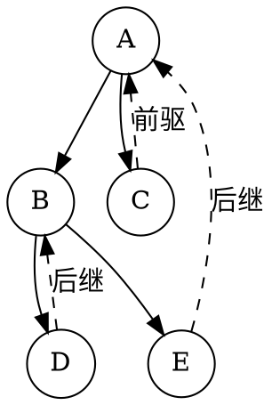
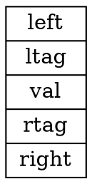
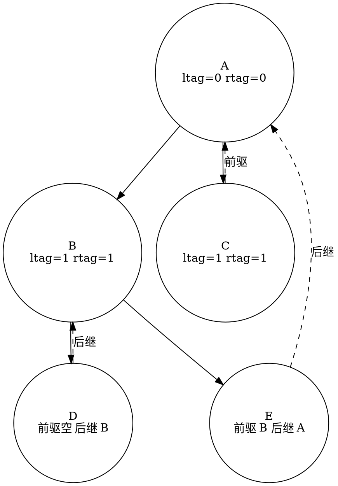
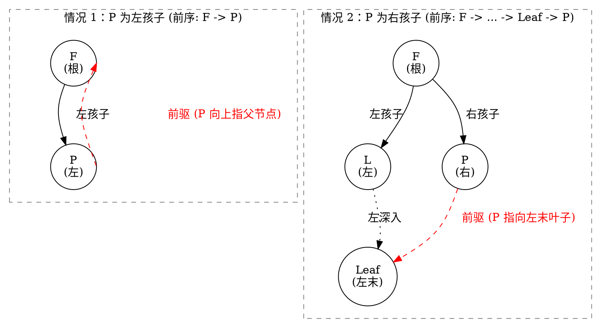
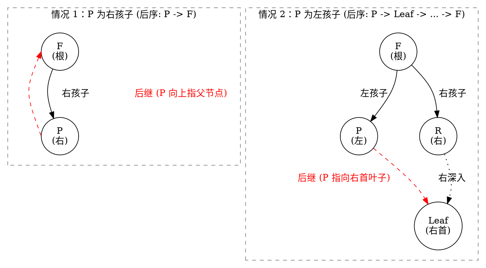
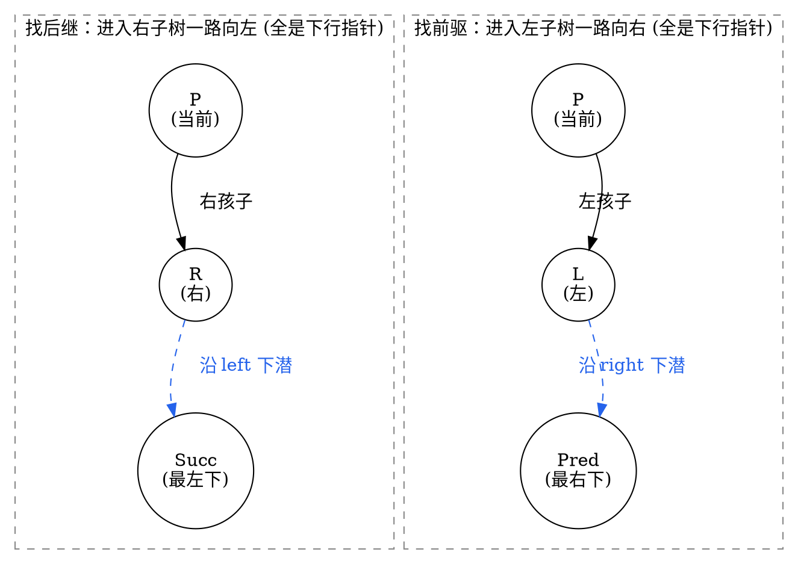
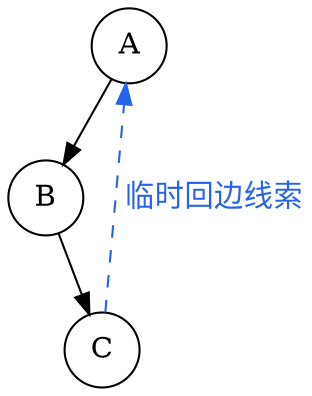

# 4.4 线索二叉树

在标准的二叉链表存储中，每个节点包含一个数据域和两个指针域（`left` 与 `right`）。对于一棵拥有 $n$ 个节点的二叉树，系统总共分配了 $2n$ 个指针域。但在上一节我们推导过：树中只有 $n-1$ 条父子边。

这意味着：**在 $2n$ 个指针域中，有且仅有 $n-1$ 个指针真正指向了孩子，剩下的 $n+1$ 个指针全都是闲置的 `nullptr`！**

当我们在程序中需要频繁寻找某个节点在某种遍历序列下的**直接前驱（Predecessor）**或**直接后继（Successor）**时，传统的二叉链表必须每次都从根节点重新做一遍完整的递归或栈遍历（耗费 $O(n)$ 时间与 $O(h)$ 额外空间）。

能不能把这闲置的 $n+1$ 个空指针充分利用起来，让二叉树像双向链表一样支持快速的前驱、后继查找与常数空间遍历？

这就是**线索二叉树（Threaded Binary Tree）**的诞生契机。

---

## 学习目标

完成本节后，你应该能够：

- 严格证明二叉链表中空指针域数量恒为 $n+1$ 的定理；
- 阐述线索二叉树通过增加 `ltag` 与 `rtag` 标志位区分“孩子边”与“线索边”的设计原理；
- 熟练写出基于双指针（`curr` 与 `prev`）的中序线索化（In-order Threading）核心算法；
- 掌握利用线索查找中序前驱与中序后继的方法，并实现 $O(1)$ 辅助空间的全树非递归中序遍历；
- 剖析前序线索与后序线索的对称性与不对称局限（为什么单向链表难以找前序前驱与后序后继）；
- 理解现代算法中的 Morris 遍历思想，理解无标志位 $O(1)$ 空间遍历的工程演进。

---

## 4.4.1 为什么需要线索（空指针、前驱与后继）

### 1. 空链域定理的严密证明

::: theorem 定理 1 · 空指针域数量恒定性
对于任意一棵含有 $n$（$n \ge 1$）个节点的二叉链表，其空指针域（`nullptr`）的数量恒等于：

$$
\text{NullPointers} = n + 1
$$
:::

::: proof
**证明方法 1（总边数守恒法）**：
每个节点恰好拥有 $2$ 个指针域，故 $n$ 个节点总共有 $2n$ 个指针域。
在二叉树中，除根节点外，其余每个节点上方都连有一条来自父节点的边（即被父节点的非空指针指向）。因此，非空指针的总数恰好等于节点总数减 $1$（即 $n-1$ 条树边）。
空指针域数量等于总指针数减去非空指针数：
$$
2n - (n - 1) = n + 1.
$$

**证明方法 2（节点度数守恒法）**：
设度为 $0, 1, 2$ 的节点数分别为 $n_0, n_1, n_2$。
- 度为 $0$ 的叶节点产生 $2$ 个空指针；
- 度为 $1$ 的节点产生 $1$ 个空指针；
- 度为 $2$ 的节点产生 $0$ 个空指针。
故总空指针数为 $2n_0 + n_1$。由二叉树基本性质 $n_0 = n_2 + 1$，代入得：
$$
2(n_2 + 1) + n_1 = (n_2 + n_1 + n_2) + 2 = n_0 + n_1 + n_2 + 1 = n + 1.
$$
:::

### 2. 传统二叉链表的寻亲痛点


<!-- diagram id="threaded-motivation" caption: "空指针改存中序前驱或后继，得到 D、B、E、A、C 的线索" -->

在上面的中序序列中：
- 节点 `E` 的中序直接后继是 `A`，但从节点 `E` 本身出发，没有任何指针指向 `A`；
- 节点 `C` 的中序直接前驱是 `A`，但从节点 `C` 出发也无法向上找到 `A`；
- 如果不使用系统调用栈或显式栈，我们就无法完成单向漫游。

**核心思想**：若节点的 `left` 为空，则让其指向该节点在某种遍历下的**直接前驱**；若节点的 `right` 为空，则让其指向**直接后继**。这种指向前驱和后继的指针，就称为<dfn>线索（Thread）</dfn>。

---

## 4.4.2 线索二叉树的节点结构与中序线索化

### 1. 节点结构设计与标志位

将空指针改为线索后，产生了一个新的歧义：程序拿到 `node->left` 时，如何知道它指向的是真正的**左孩子**还是**前驱线索**？

为此，我们必须在每个节点内部增加两个布尔标志位 `ltag` 和 `rtag`：


<!-- diagram id="threaded-node-struct" caption: "线索二叉树节点在左右指针旁增加 ltag 与 rtag" -->

::: definition 标志位语义约定
- $\text{ltag} = 0$（`Link`）：`left` 指向真正的**左孩子节点**；
- $\text{ltag} = 1$（`Thread`）：`left` 指向该遍历序列下的**直接前驱节点**；
- $\text{rtag} = 0$（`Link`）：`right` 指向真正的**右孩子节点**；
- $\text{rtag} = 1$（`Thread`）：`right` 指向该遍历序列下的**直接后继节点**。
:::

### 2. C++ 节点类型定义

```cpp:line-numbers [threaded-node.hpp]
enum PointerTag { Link = 0, Thread = 1 };

struct ThreadNode {
    int val;
    ThreadNode* left = nullptr;
    ThreadNode* right = nullptr;
    PointerTag ltag = Link;
    PointerTag rtag = Link;

    explicit ThreadNode(int x) : val(x) {}
};
```

### 3. 中序线索化算法（In-order Threading）

线索化的实质，就是在中序遍历二叉树的过程中，检查并填补空指针。

为了在中序遍历时同时访问到“当前节点 `curr`”和“刚刚访问过的上一个节点 `prev`”，我们使用**双指针追踪法**：

1. 递归线索化左子树：`inThreading(curr->left)`；
2. 处理当前节点 `curr` 的前驱线索：
   - 若 `curr->left == nullptr`，说明其左孩子为空，将其改为前驱线索：`curr->left = prev; curr->ltag = Thread;`；
3. 处理前驱节点 `prev` 的后继线索：
   - 若 `prev != nullptr` 且 `prev->right == nullptr`，说明 `prev` 的右孩子为空，将其改为指向当前节点的后继线索：`prev->right = curr; prev->rtag = Thread;`；
4. 更新前驱指针：`prev = curr`；
5. 递归线索化右子树：`inThreading(curr->right)`。


<!-- diagram id="threaded-tree-diagram" caption: "线索标志区分孩子指针与中序前驱/后继线索" -->

::: details 中序线索化完整实现（点击展开）

```cpp:line-numbers [inorder-threading.cpp]
class ThreadedBinaryTree {
private:
    ThreadNode* prev = nullptr; // 全局/成员追踪前驱指针

    void inThreading(ThreadNode* curr) {
        if (curr == nullptr) return;

        // 1. 递归线索化左子树（注意：必须是真正的左孩子）
        if (curr->ltag == Link) {
            inThreading(curr->left);
        }

        // 2. 建立当前节点的前驱线索
        if (curr->left == nullptr) {
            curr->left = prev;
            curr->ltag = Thread;
        }

        // 3. 建立上一个节点的后继线索
        if (prev != nullptr && prev->right == nullptr) {
            prev->right = curr;
            prev->rtag = Thread;
        }

        // 4. 前驱指针推进
        prev = curr;

        // 5. 递归线索化右子树
        if (curr->rtag == Link) {
            inThreading(curr->right);
        }
    }

public:
    void createInorderThread(ThreadNode* root) {
        prev = nullptr;
        if (root != nullptr) {
            inThreading(root);
            // 处理中序最后一个节点的右线索
            if (prev != nullptr) {
                prev->right = nullptr;
                prev->rtag = Thread;
            }
        }
    }
};
```

:::

---

## 4.4.3 线索二叉树的前驱 / 后继查找与遍历

线索建立完成后，整棵树就被织成了一张双向网。我们可以在**不使用任何递归和辅助栈**的情况下，以严格 $O(1)$ 空间完成遍历！

### 1. 寻找中序直接后继（In-order Successor）

给定节点 `p`，寻找其中序后继节点 `next`：
- **情况 A（`p->rtag == Thread`）**：`p->right` 已经是指向后继的线索，直接返回 `p->right`，耗时 $O(1)$！
- **情况 B（`p->rtag == Link`）**：`p` 拥有真正的右子树。根据中序遍历规则（根 $\to$ 右子树），其中序后继必然是**其右子树中最先被访问的节点**（即右子树中“最左下”的节点）。

```cpp:line-numbers [inorder-successor.cpp]
ThreadNode* inorderSuccessor(ThreadNode* p) {
    if (p == nullptr) return nullptr;
    if (p->rtag == Thread) {
        return p->right; // 直接通过线索返回后继
    }
    // rtag == Link: 进入右子树，并一路向左下潜到底
    ThreadNode* curr = p->right;
    while (curr->ltag == Link) {
        curr = curr->left;
    }
    return curr;
}
```

### 2. 寻找中序直接前驱（In-order Predecessor）

对称地，给定节点 `p`，寻找其中序前驱节点 `prevNode`：
- **情况 A（`p->ltag == Thread`）**：直接返回 `p->left`；
- **情况 B（`p->ltag == Link`）**：进入其左子树，一路向右下潜到底（找左子树中“最右下”的节点）。

```cpp:line-numbers [inorder-predecessor.cpp]
ThreadNode* inorderPredecessor(ThreadNode* p) {
    if (p == nullptr) return nullptr;
    if (p->ltag == Thread) {
        return p->left; // 直接通过线索返回前驱
    }
    // ltag == Link: 进入左子树，并一路向右下潜到底
    ThreadNode* curr = p->left;
    while (curr->rtag == Link) {
        curr = curr->right;
    }
    return curr;
}
```

### 3. 基于线索的 $O(1)$ 辅助空间中序遍历

有了 `inorderSuccessor`，全树的中序遍历就退化成了如同遍历链表一般的简单 `while` 循环：

::: details O(1) 空间非递归中序遍历（点击展开）

```cpp:line-numbers [inorder-threaded-traversal.cpp]
#include <iostream>

void traverseInorderThreaded(ThreadNode* root) {
    if (root == nullptr) return;

    // 1. 找到整棵树中序遍历的第一个节点（最左下的节点）
    ThreadNode* curr = root;
    while (curr->ltag == Link) {
        curr = curr->left;
    }

    // 2. 依次寻找后继节点并输出，直到到达末尾
    while (curr != nullptr) {
        std::cout << curr->val << " ";
        curr = inorderSuccessor(curr); // O(1) 转移
    }
    std::cout << "\n";
}
```

:::

---

## 4.4.4 前序 / 后序线索【进阶】与 Morris 遍历

除了中序线索二叉树，我们也可以对二叉树进行**前序线索化**或**后序线索化**。但受限于单向二叉链表的指针向下性，它们表现出了极其鲜明的**结构单向不对称性**。

### 1. 结构不对称性原理与拓扑图解

#### (1) 前序线索（根 $\to$ 左 $\to$ 右）：为什么“找前驱极难”？

在前序遍历中，根节点早于孩子节点被访问。若节点 $P$ 拥有左孩子（`ltag == 0`，没有前驱线索），要寻找它紧邻的前驱（**线索应从 $P$ 出发指向其前驱**）：
- **情况 1（$P$ 是左孩子）**：前序序列为 $F \to P \dots$，$P$ 的前驱即为父节点 $F$（**线索应由 $P$ 向上指向 $F$**）；
- **情况 2（$P$ 是右孩子且有左兄弟 $L$）**：前序序列为 $F \to \dots \to \text{Leaf} \to P \dots$，$P$ 的前驱为左兄弟子树在前序遍历下的最末叶子（**线索应由 $P$ 指向该最末叶子**）。


<!-- diagram id="preorder-thread-limitation" caption: "前序线索找前驱的两种场景：均需回溯父节点，单向二叉链表无法到达" -->

> 💥 **单向链表局限**：当前节点 $P$ 只有向下的孩子指针，无法向上回溯找到父节点 $F$，因而也无法借道 $F$ 拐入左子树。

---

#### (2) 后序线索（左 $\to$ 右 $\to$ 根）：为什么“找后继极难”？

在后序遍历中，孩子节点全部访问完毕后才访问父节点。若节点 $P$ 拥有右孩子（`rtag == 0`，没有后继线索），要寻找它紧邻的后继（**线索应从 $P$ 出发指向其后继**）：
- **情况 1（$P$ 是右孩子）**：后序序列为 $\dots \to P \to F$，$P$ 的后继即为父节点 $F$（**线索应由 $P$ 向上指向 $F$**）；
- **情况 2（$P$ 是左孩子且有右兄弟 $R$）**：后序序列为 $\dots \to P \to \text{Leaf} \to \dots \to F$，$P$ 的后继为右兄弟子树在后序遍历下的第一个叶子（**线索应由 $P$ 指向右首叶子**）。


<!-- diagram id="postorder-thread-limitation" caption: "后序线索找后继的两种场景：均需回溯父节点，单向二叉链表无法到达" -->

> 💥 **单向链表局限**：当前节点 $P$ 同样无法向上回溯到父节点 $F$，因而无法从左孩子跨入右兄弟子树 $R$。

---

#### (3) 中序线索（左 $\to$ 根 $	o$ 右）：为什么双向都“极易”？


<!-- diagram id="inorder-thread-bidirectional" caption: "中序线索双向搜索路径全部顺行向下，无需向上回溯父节点" -->

> ✨ **天然优势**：找后继一路“向下向左”，找前驱一路“向下向右”。所有路径均严格单向下行，完全无需向上回溯父节点！


### 2. 前序、后序与中序线索的遍历能力对比

| 线索类型 | 寻找直接后继（Successor） | 寻找直接前驱（Predecessor） | 遍历全树能力 |
| :--- | :--- | :--- | :--- |
| **中序线索** | **极易**（`rtag=1` 取 `right` 线索；否则进入右子树沿 `left` 找最左下节点） | **极易**（`ltag=1` 取 `left` 线索；否则进入左子树沿 `right` 找最右下节点） | **天然支持无栈双向全遍历** |
| **前序线索** | **极易**（若有左孩子取左；若无左有右取右；若为叶子取 `right` 线索） | **极难**（`ltag=1` 直接取；`ltag=0` 时，若为左孩子前驱为父节点，若为右孩子前驱为左子树前序末节点。**均依赖父指针，无法直接向上回溯**） | **仅支持无栈顺向遍历**（逆向遍历必须升级为三叉链表） |
| **后序线索** | **极难**（`rtag=1` 直接取；`rtag=0` 时，若为右孩子后继为父节点，若为左孩子后继为右子树后序首节点。**均依赖父指针，无法直接向上回溯**） | **极易**（若有右孩子取右；若无右有左取左；若为叶子取 `left` 线索） | **仅支持无栈逆向遍历**（顺向遍历必须升级为三叉链表） |

::: pitfall 易错点 · 为什么前序逆向遍历与后序顺向遍历必须引入三叉链表？
- 普通二叉链表是指针单向由父指向子的；
- 前序找前驱、后序找后继在非叶分支节点处，**必然要求先回溯到父节点**；
- 因此，若要在 $O(1)$ 空间下实现前序逆向遍历或后序顺向遍历，**节点结构必须升级为包含 `parent` 指针的三叉链表**。
:::

---

### 3. 拓展：Morris 遍历（无需标志位的 $O(1)$ 空间遍历）

线索二叉树虽然实现了 $O(1)$ 空间的非递归遍历，但它为每个节点额外增加了 `ltag` 与 `rtag` 两个字段，侵入了数据结构本身。

现代算法设计大师 J. H. Morris 提出了著名的 **Morris 遍历算法**：
- **核心思想**：利用二叉树中大量叶节点的空闲 `right` 指针，在遍历过程中**动态临时建立指向后继的回边**，在访问完毕回溯时**再将指针恢复为 `nullptr`**！
- **最大优势**：**不需要对树的结构定义增加任何标志位**，真正实现“原地复用空指针、遍历完完美复原树形态”的 $O(1)$ 额外空间、$\Theta(n)$ 时间遍历。


<!-- diagram id="morris-concept" caption: "Morris 遍历利用前驱节点的空闲右指针建立临时线索，访问完毕后再恢复现场" -->

---

## 小结与自测

线索二叉树的核心本质是==用标志位将 $n+1$ 个闲置空链域转化为线性前驱与后继连接==。中序线索二叉树在左、右方向上完全对称，能够以 $\Theta(1)$ 辅助空间双向巡游全树。

请尝试回答以下自测问题：

1. 一棵含有 $100$ 个节点的二叉树，如果采用二叉链表存储，其中有多少个空指针？如果采用中序线索二叉树存储，有多少个线索指针？
2. 在中序线索二叉树中，节点 `P` 没有左孩子（`P->ltag == Thread`），`P->left` 指向的节点在树中与 `P` 是什么关系？
3. 为什么前序线索二叉树找后继很容易，但找前驱必须依赖父指针？
4. 如果二叉树只有一个根节点，经过中序线索化后，其 `ltag`、`rtag` 以及两个指针的值分别是什么？
5. 比较普通二叉链表的非递归中序遍历（显式栈）与中序线索二叉树遍历的时空复杂度差异。

下一节进入[4.5 树、森林与二叉树](./04-trees-and-forests.md)：我们将跨越二叉树的边界，探索一般多叉树、森林如何通过经典“孩子兄弟”映射化繁为简，与二叉树融为一体。
