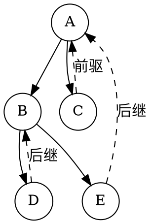
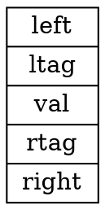
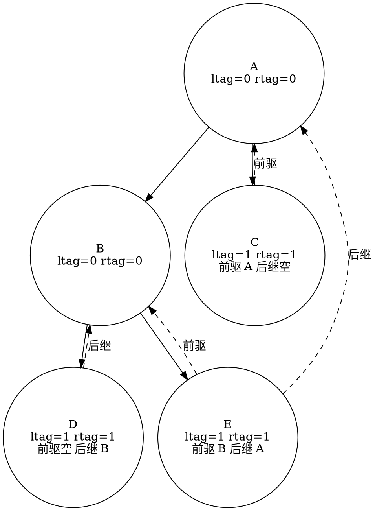
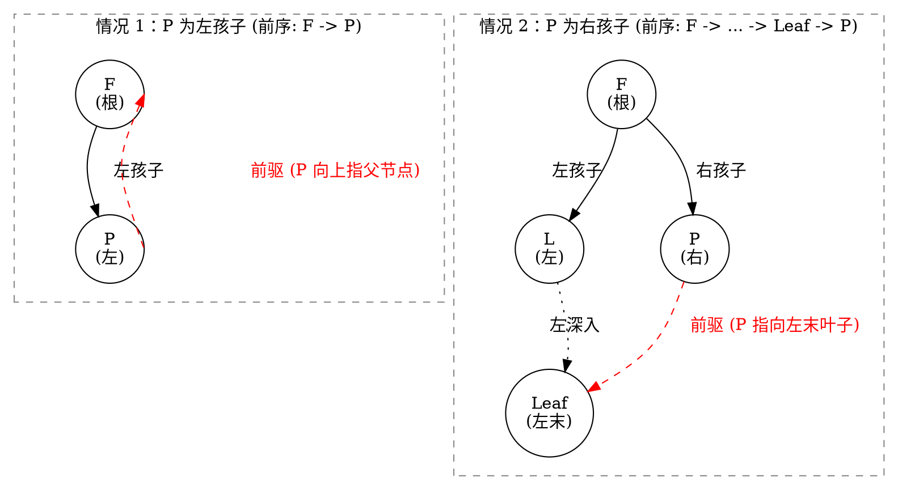
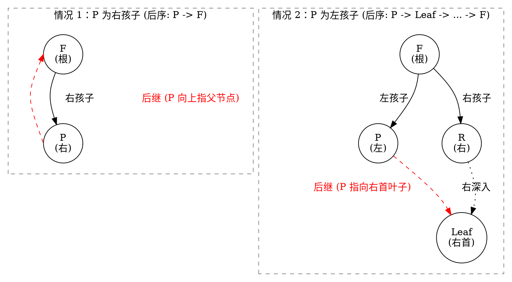
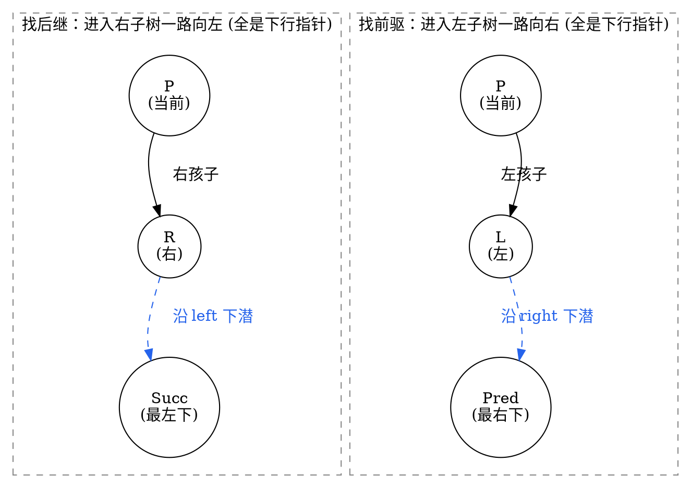
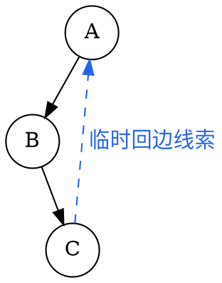

# 4.4 线索二叉树

在标准的二叉链表存储中，每个节点包含一个数据域和两个指针域（`left` 与 `right`）。对于一棵拥有 $n$ 个节点的二叉树，系统总共分配了 $2n$ 个指针域。但在 [4.1 节](./01-tree-basics.md) 中我们已经推导过：树中只有 $n-1$ 条父子边。

这意味着：在 $2n$ 个指针域中，有且仅有 $n-1$ 个指针指向孩子，剩下的 $n+1$ 个指针是空的 `nullptr`。

当我们在程序中需要频繁寻找某个节点在某种遍历序列下的 **直接前驱（Predecessor）** 或 **直接后继（Successor）** 时，传统的二叉链表必须每次都从根节点重新做一遍完整的递归或栈遍历（耗费 $O(n)$ 时间与 $O(h)$ 额外空间）。

能不能把这闲置的 $n+1$ 个空指针充分利用起来，让二叉树像双向链表一样支持快速的前驱、后继查找与常数空间遍历？

这就是 **线索二叉树（Threaded Binary Tree）** 的诞生契机。

---

## 学习目标

完成本节后，你应该能够：

- 严格证明二叉链表中空指针域数量恒为 $n+1$ 的定理；
- 阐述线索二叉树通过增加 `ltag` 与 `rtag` 标志位区分“孩子边”与“线索边”的设计原理；
- 熟练写出基于双指针（`curr` 与 `prev`）的中序线索化（In-order Threading）核心算法；
- 掌握利用线索查找中序前驱与中序后继的方法，并实现 $O(1)$ 辅助空间的全树非递归中序遍历；
- 剖析前序线索与后序线索的对称性与不对称局限（为什么单向链表难以找前序前驱与后序后继）；
- 理解现代算法中的 Morris 遍历思想，理解无标志位 $O(1)$ 空间遍历的工程演进。

---

## 4.4.1 为什么需要线索（空指针、前驱与后继）

### 1. 空链域定理的严密证明

::: theorem 定理 1 · 空指针域数量恒定性
对于任意一棵含有 $n$（$n \ge 1$）个节点的二叉链表，其空指针域（`nullptr`）的数量恒等于：

$$
\text{NullPointers} = n + 1
$$
:::

::: proof
**证明方法 1（总边数守恒法）**：
每个节点恰好拥有 $2$ 个指针域，故 $n$ 个节点总共有 $2n$ 个指针域。
在二叉树中，除根节点外，其余每个节点上方都连有一条来自父节点的边（即被父节点的非空指针指向）。因此，非空指针的总数恰好等于节点总数减 $1$（即 $n-1$ 条树边）。
空指针域数量等于总指针数减去非空指针数：
$$
2n - (n - 1) = n + 1.
$$

**证明方法 2（节点度数守恒法）**：
设度为 $0, 1, 2$ 的节点数分别为 $n_0, n_1, n_2$。
- 度为 $0$ 的叶节点产生 $2$ 个空指针；
- 度为 $1$ 的节点产生 $1$ 个空指针；
- 度为 $2$ 的节点产生 $0$ 个空指针。
故总空指针数为 $2n_0 + n_1$。由二叉树基本性质 $n_0 = n_2 + 1$，代入得：
$$
2(n_2 + 1) + n_1 = (n_2 + n_1 + n_2) + 2 = n_0 + n_1 + n_2 + 1 = n + 1.
$$
:::

### 2. 传统二叉链表的寻亲痛点


<!-- diagram id="threaded-motivation" caption: "空指针改存中序前驱或后继，得到 D、B、E、A、C 的线索" -->

在上面的中序序列中：
- 节点 `E` 的中序直接后继是 `A`，但从节点 `E` 本身出发，没有任何指针指向 `A`；
- 节点 `C` 的中序直接前驱是 `A`，但从节点 `C` 出发也无法向上找到 `A`；
- 如果不使用系统调用栈或显式栈，我们就无法沿着中序序列逐个访问节点。

**核心思想**：若节点的 `left` 为空，则让其指向该节点在某种遍历下的**直接前驱**；若节点的 `right` 为空，则让其指向**直接后继**。这种指向前驱和后继的指针，就称为<dfn>线索（Thread）</dfn>。

---

## 4.4.2 线索二叉树的节点结构与中序线索化

### 1. 节点结构设计与标志位

将空指针改为线索后，产生了一个新的歧义：程序拿到 `node->left` 时，如何知道它指向的是左孩子，还是前驱线索？

为此，我们必须在每个节点内部增加两个布尔标志位 `ltag` 和 `rtag`：


<!-- diagram id="threaded-node-struct" caption: "线索二叉树节点在左右指针旁增加 ltag 与 rtag" -->

::: definition 标志位语义约定
- $\text{ltag} = 0$（`Link`）：`left` 指向左孩子节点；
- $\text{ltag} = 1$（`Thread`）：`left` 指向该遍历序列下的直接前驱节点；
- $\text{rtag} = 0$（`Link`）：`right` 指向右孩子节点；
- $\text{rtag} = 1$（`Thread`）：`right` 指向该遍历序列下的直接后继节点。
:::

::: info 既然“复用原有指针”还需要增加 `ltag` / `rtag` 标志位，为什么不直接另开前驱/后继字段？

1. **保持二叉树语义**：节点的逻辑结构依然只有“左孩子”和“右孩子”；若额外增加 `pre`/`next` 指针，节点就变成了“四叉”结构，破坏了二叉树作为递归树形结构的基本定义与接口统一性。

2. **内存开销天差地别**：标志位通常只需 2 个比特（或利用结构体内存对齐的缝隙填充，几乎零额外开销），而额外增加 2 个完整指针在 64 位系统下占用 **16 字节**。对于百万级节点，前者几乎不增加内存，后者会陡增十几兆。

:::

### 2. C++ 节点类型定义

```cpp:line-numbers [threaded-node.hpp]
enum PointerTag { Link = 0, Thread = 1 };

struct ThreadNode {
    int val;
    ThreadNode* left = nullptr;
    ThreadNode* right = nullptr;
    PointerTag ltag = Link;
    PointerTag rtag = Link;

    explicit ThreadNode(int x) : val(x) {}
};
```

### 3. 中序线索化算法（In-order Threading）

线索化的实质，就是在中序遍历二叉树的过程中，检查并填补空指针。

为了在中序遍历时同时访问到“当前节点 `curr`”和“刚刚访问过的上一个节点 `prev`”，我们使用**双指针追踪法**：

1. 递归线索化左子树：`inThreading(curr->left)`；
2. 处理当前节点 `curr` 的前驱线索：
   - 若 `curr->left == nullptr`，说明其左孩子为空，将其改为前驱线索：`curr->left = prev; curr->ltag = Thread;`；
3. 处理前驱节点 `prev` 的后继线索：
   - 若 `prev != nullptr` 且 `prev->right == nullptr`，说明 `prev` 的右孩子为空，将其改为指向当前节点的后继线索：`prev->right = curr; prev->rtag = Thread;`；
4. 更新前驱指针：`prev = curr`；
5. 递归线索化右子树：`inThreading(curr->right)`。

::: example 示例 · 中序线索化手工走查
下面用一个最小但足够典型的例子说明 `prev` 是如何滚动的：


<!-- diagram id="threaded-tree-diagram" caption: "线索标志区分孩子指针与中序前驱/后继线索" -->

它的中序序列是 `D B E A C`。在线索化时，`prev` 永远保存刚访问完的上一个节点；当当前节点 `curr` 遇到空左指针，就把它改成 `prev`，当 `prev` 遇到空右指针，就把它改成 `curr`。

| 步骤 | `curr` | `prev` | 动作 |
| --- | --- | --- | --- |
| 1 | `D` | `nullptr` | `D` 无左孩子，令 `D.left = nullptr` 作为前驱线索，`D.ltag = Thread`；此时还没有上一个节点可接后继 |
| 2 | `B` | `D` | `D.right` 为空，令 `D.right = B`，`D.rtag = Thread`，说明 `D` 的中序后继是 `B`；然后 `prev = B` |
| 3 | `E` | `B` | `E` 无左孩子，令 `E.left = B`，`E.ltag = Thread`；`B.right` 已有真实右孩子，不能改成线索，继续往前推进 |
| 4 | `A` | `E` | `E.right` 为空，令 `E.right = A`，`E.rtag = Thread`；随后 `prev = A` |
| 5 | `C` | `A` | `C` 无左孩子，令 `C.left = A`，`C.ltag = Thread`；最后再在 `createInorderThread` 中把 `prev->right = nullptr` 作为末端哨兵 |

**注意**：`prev` 只是“前一个被访问到的中序节点”，它不是父节点，也不是新加的前驱后继字段；它只是在遍历过程中充当滚动状态。
:::

::: details 中序线索化完整实现（点击展开）

```cpp:line-numbers [inorder-threading.cpp]
class ThreadedBinaryTree {
private:
    ThreadNode* prev = nullptr; // 全局/成员追踪前驱指针

    void inThreading(ThreadNode* curr) {
        if (curr == nullptr) return;

        // 1. 递归线索化左子树（注意：必须是真正的左孩子）
        // 初次线索化时，所有 tag 均为 Link；只有在已线索化树上，才需要用 tag 判断是否真的有孩子。
        // 这里统一用 nullptr 判据，避免把“孩子存在”与“线索存在”混为一谈。
        if (curr->left != nullptr && curr->ltag == Link) {
            inThreading(curr->left);
        }

        // 2. 建立当前节点的前驱线索
        if (curr->left == nullptr) {
            curr->left = prev;
            curr->ltag = Thread;
        }

        // 3. 建立上一个节点的后继线索
        if (prev != nullptr && prev->right == nullptr) {
            prev->right = curr;
            prev->rtag = Thread;
        }

        // 4. 前驱指针推进
        prev = curr;

        // 5. 递归线索化右子树
        if (curr->right != nullptr && curr->rtag == Link) {
            inThreading(curr->right);
        }
    }

public:
    void createInorderThread(ThreadNode* root) {
        prev = nullptr;
        if (root != nullptr) {
            inThreading(root);
            // 处理中序最后一个节点的右线索
            if (prev != nullptr) {
                prev->right = nullptr;
                prev->rtag = Thread;
            }
        }
    }
};
```

:::

---

## 4.4.3 线索二叉树的前驱 / 后继查找与遍历

线索建立完成后，整棵树就被织成了一张双向网。我们可以在**不使用任何递归和辅助栈**的情况下，以严格 $O(1)$ 辅助空间完成遍历！

### 1. 寻找中序直接后继（In-order Successor）

给定节点 `p`，寻找其中序后继节点 `next`：
- 情况 A（`p->rtag == Thread`）：`p->right` 已经是指向后继的线索，直接返回 `p->right`，耗时 $O(1)$。
- 情况 B（`p->rtag == Link`）：`p` 拥有真实的右子树。根据中序遍历规则（根 $\to$ 右子树），其中序后继必然是其右子树中最先被访问的节点，即右子树中“最左下”的节点。

```cpp:line-numbers [inorder-successor.cpp]
ThreadNode* inorderSuccessor(ThreadNode* p) {
    if (p == nullptr) return nullptr;
    if (p->rtag == Thread) {
        return p->right; // 直接通过线索返回后继
    }
    // rtag == Link: 进入右子树，并一路向左下潜到底
    ThreadNode* curr = p->right;
    while (curr->ltag == Link) {
        curr = curr->left;
    }
    return curr;
}
```

### 2. 寻找中序直接前驱（In-order Predecessor）

对称地，给定节点 `p`，寻找其中序前驱节点 `prevNode`：
- 情况 A（`p->ltag == Thread`）：直接返回 `p->left`；
- 情况 B（`p->ltag == Link`）：进入其左子树，一路向右下潜到底，找左子树中“最右下”的节点。

```cpp:line-numbers [inorder-predecessor.cpp]
ThreadNode* inorderPredecessor(ThreadNode* p) {
    if (p == nullptr) return nullptr;
    if (p->ltag == Thread) {
        return p->left; // 直接通过线索返回前驱
    }
    // ltag == Link: 进入左子树，并一路向右下潜到底
    ThreadNode* curr = p->left;
    while (curr->rtag == Link) {
        curr = curr->right;
    }
    return curr;
}
```

### 3. 基于线索的 $O(1)$ 辅助空间中序遍历

有了 `inorderSuccessor`，全树的中序遍历就退化成了如同遍历链表一般的简单 `while` 循环：

::: details O(1) 空间非递归中序遍历（点击展开）

```cpp:line-numbers [inorder-threaded-traversal.cpp]
#include <iostream>

void traverseInorderThreaded(ThreadNode* root) {
    if (root == nullptr) return;

    // 1. 找到整棵树中序遍历的第一个节点（最左下的节点）
    ThreadNode* curr = root;
    while (curr->ltag == Link) {
        curr = curr->left;
    }

    // 2. 依次寻找后继节点并输出，直到到达末尾
    while (curr != nullptr) {
        std::cout << curr->val << " ";
        curr = inorderSuccessor(curr); // 均摊 O(1) 转移
    }
    std::cout << "\n";
}
```

:::

::: pitfall 易错点 · 线索二叉树“找前驱/后继”的时间复杂度误区
- 单次查找并非严格 O(1)。若当前节点存在右孩子（`rightThread = 0`），需沿其右子树一直向左找到最左下节点作为后继，该过程耗时为树高 O(h)，最坏情况下（斜树）退化为 O(n)。
- 均摊 O(1) 的成立有严格前提：仅当从遍历起点（如中序首节点）开始，连续调用找后继直至遍历完整棵树时，所有向下深入查找的总步数为 O(n)，此时均摊单次操作才为 O(1)。
- 若进行非连续性的“反复来回跳”（例如先找节点 A 的后继，再跳回 A 找前驱，或在任意节点间随机跳跃查找），则无法利用均摊分析，每次操作相互独立，单次时间复杂度依然为 O(h)（最坏 O(n)）。
- 切勿将“完整遍历一遍的均摊效率”等同于“任意单次随机查找的效率”，两者应用场景完全不同；若业务涉及大量随机前驱/后继查询，需考虑改用三叉链表（带父指针）或其他数据结构。
:::

---

## 4.4.4 前序 / 后序线索【进阶】与 Morris 遍历

除了中序线索二叉树，我们也可以对二叉树进行前序线索化或后序线索化。但受限于单向二叉链表的指针向下性，它们表现出明显的结构不对称性。

### 1. 结构不对称性原理与拓扑图解

#### (1) 前序线索（根 $\to$ 左 $\to$ 右）：为什么“找前驱困难”？

在前序遍历中，根节点早于孩子节点被访问。若节点 $P$ 拥有左孩子（`ltag == 0`，没有前驱线索），要寻找它紧邻的前驱（线索应从 $P$ 出发指向其前驱）：
- 情况 1（$P$ 是左孩子）：前序序列为 $F \to P \dots$，$P$ 的前驱即为父节点 $F$，线索应由 $P$ 向上指向 $F$；
- 情况 2（$P$ 是右孩子且有左兄弟 $L$）：前序序列为 $F \to \dots \to \text{Leaf} \to P \dots$，$P$ 的前驱为左兄弟子树在前序遍历下的最末叶子，线索应由 $P$ 指向该最末叶子。


<!-- diagram id="preorder-thread-limitation" caption: "前序线索找前驱的两种场景：均需回溯父节点，单向二叉链表无法到达" -->

::: intuition 直觉 · 单向链表局限
当前节点 $P$ 只有向下的孩子指针，无法向上回溯找到父节点 $F$，因而也无法借道 $F$ 拐入左子树。
:::

---

#### (2) 后序线索（左 $\to$ 右 $\to$ 根）：为什么“找后继困难”？

在后序遍历中，孩子节点全部访问完毕后才访问父节点。若节点 $P$ 拥有右孩子（`rtag == 0`，没有后继线索），要寻找它紧邻的后继（线索应从 $P$ 出发指向其后继）：
- 情况 1（$P$ 是右孩子）：后序序列为 $\dots \to P \to F$，$P$ 的后继即为父节点 $F$，线索应由 $P$ 向上指向 $F$；
- 情况 2（$P$ 是左孩子且有右兄弟 $R$）：后序序列为 $\dots \to P \to \text{Leaf} \to \dots \to F$，$P$ 的后继为右兄弟子树在后序遍历下的第一个叶子，线索应由 $P$ 指向右首叶子。


<!-- diagram id="postorder-thread-limitation" caption: "后序线索找后继的两种场景：均需回溯父节点，单向二叉链表无法到达" -->

::: intuition 直觉 · 单向链表局限
当前节点 $P$ 同样无法向上回溯到父节点 $F$，因而无法从左孩子跨入右兄弟子树 $R$。
:::

---

#### (3) 中序线索（左 $\to$ 根 $\to$ 右）：为什么双向都比较容易？


<!-- diagram id="inorder-thread-bidirectional" caption: "中序线索双向搜索路径全部顺行向下，无需向上回溯父节点" -->

::: intuition 直觉 · 中序线索天然优势
找后继一路“向下向左”，找前驱一路“向下向右”。所有路径都向下延伸，不需要回溯父节点。
:::


### 2. 前序、后序与中序线索的遍历能力对比

中序线索最适合做双向遍历；前序与后序线索则各自只擅长一个方向。

| 线索类型 | 后继/前驱的处理方式 | 遍历能力 |
| :--- | :--- | :--- |
| 中序线索 | 后继：右子树中最左下节点；前驱：左子树中最右下节点 | 支持无栈双向全遍历 |
| 前序线索 | 后继：优先走左孩子，再走右孩子；前驱：通常需要回到父节点或左兄弟子树末端 | 只适合顺向遍历 |
| 后序线索 | 前驱：优先走右孩子，再走左孩子；后继：通常需要回到父节点或右兄弟子树首端 | 只适合逆向遍历 |

::: pitfall 易错点 · 为什么前序逆向遍历与后序顺向遍历必须引入三叉链表？
- 普通二叉链表是指针单向由父指向子的；
- 前序找前驱、后序找后继在非叶分支节点处，需要先回溯到父节点；
- 因此，若要在 $O(1)$ 空间下实现前序逆向遍历或后序顺向遍历，节点结构必须升级为包含 `parent` 指针的三叉链表。
:::

---

### 3. 拓展：Morris 遍历（无需标志位的 $O(1)$ 空间遍历）

线索二叉树虽然实现了 $O(1)$ 空间的非递归遍历，但它为每个节点额外增加了 `ltag` 与 `rtag` 两个字段，侵入了数据结构本身。

J. H. Morris 提出了 Morris 遍历算法：
- 关键思想：利用二叉树中大量叶节点的空闲 `right` 指针，在遍历过程中临时建立指向后继的回边，并在访问完毕后恢复为 `nullptr`。
- 主要优势：不需要对树的结构定义增加任何标志位，就可以在 $O(1)$ 额外空间和 $\Theta(n)$ 时间内完成遍历，并在结束后恢复树形态。


<!-- diagram id="morris-concept" caption: "Morris 遍历利用前驱节点的空闲右指针建立临时线索，访问完毕后再恢复现场" -->

::: details Morris 中序遍历的 C++ 实现（点击展开）

```cpp:line-numbers [morris-inorder.cpp]
#include <iostream>

// 假设 ThreadNode 定义如本节 4.4.2 所示（不使用 ltag/rtag）
void morrisInorder(ThreadNode* root) {
    ThreadNode* curr = root;
    while (curr != nullptr) {
        if (curr->left == nullptr) {
            // 没有左子树，直接访问并向右移动
            std::cout << curr->val << " ";
            curr = curr->right;
        } else {
            // 寻找当前节点在中序下的前驱（左子树的最右节点）
            ThreadNode* pred = curr->left;
            while (pred->right != nullptr && pred->right != curr) {
                pred = pred->right;
            }
            if (pred->right == nullptr) {
                // 第一次到达：建立临时回边，进入左子树
                pred->right = curr;
                curr = curr->left;
            } else {
                // 回溯：已访问完左子树，恢复回边并访问当前节点
                pred->right = nullptr;
                std::cout << curr->val << " ";
                curr = curr->right;
            }
        }
    }
    std::cout << "\n";
}
```

:::


---

## 配套理论题

本节对应的理论题库如下：

| 顺序 | 题目与入口 |
| ---: | --- |
| 07 | [线索二叉树理论题精练](../../labs/chapter-04/theory/T-04-07-threaded-binary-tree-quiz/README.md) |

## 小结与自测

线索二叉树的核心本质是==用标志位将 $n+1$ 个闲置空链域转化为线性前驱与后继连接==。中序线索二叉树在左、右方向上完全对称，能够以 $\Theta(1)$ 辅助空间双向巡游全树。

请尝试回答以下自测问题：

1. 一棵含有 $100$ 个节点的二叉树，如果采用二叉链表存储，其中有多少个空指针？如果采用中序线索二叉树存储，有多少个线索指针？
2. 在中序线索二叉树中，节点 `P` 没有左孩子（`P->ltag == Thread`），`P->left` 指向的节点在树中与 `P` 是什么关系？
3. 为什么前序线索二叉树找后继很容易，但找前驱必须依赖父指针？
4. 如果二叉树只有一个根节点，经过中序线索化后，其 `ltag`、`rtag` 以及两个指针的值分别是什么？
5. 比较普通二叉链表的非递归中序遍历（显式栈）与中序线索二叉树遍历的时空复杂度差异。

下一节进入[4.5 树、森林与二叉树](./05-trees-and-forests.md)：我们将跨越二叉树的边界，探索一般多叉树、森林如何通过经典“孩子兄弟”映射化繁为简，与二叉树融为一体。
