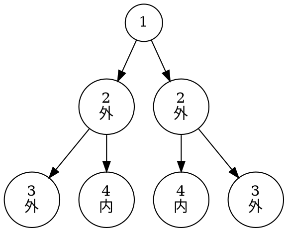
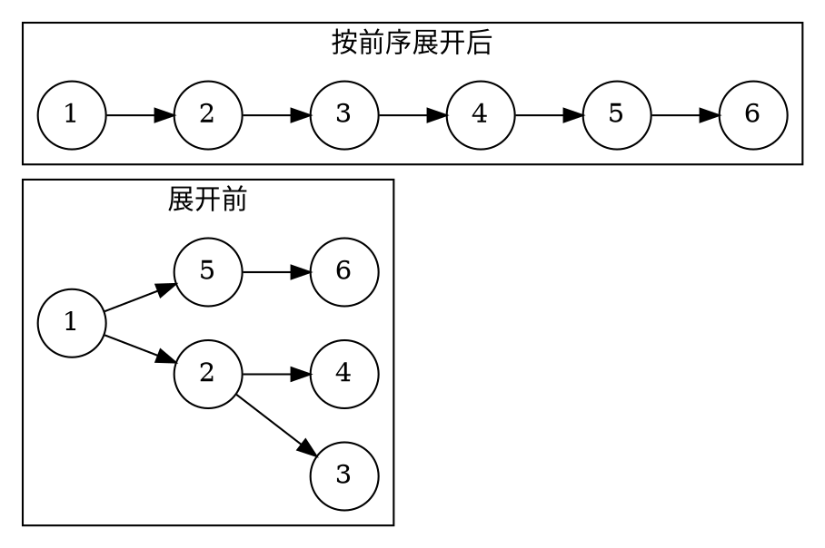
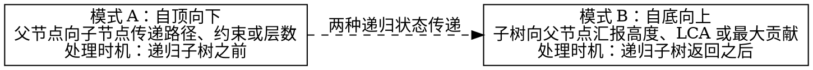

# 4.6 二叉树的经典问题

在掌握了二叉树的形态定义、存储结构与遍历机制之后，接下来我们来研究二叉树里面的经典问题。

二叉树的问题虽然千变万化，涵盖节点统计、结构判断、形态变换、路径搜索、祖先定位乃至树形动态规划，但它们的底层逻辑高度收敛于一个共同的数学基石：**分治（Divide and Conquer）与递归状态转移**。

本节我们将二叉树的经典问题归纳为五大核心模型，提炼**“自顶向下（Top-Down）”**与**“自底向上（Bottom-Up）”**的统一递归思维框架，攻克二叉树的算法高地。

---

## 学习目标

完成本节后，你应该能够：

- 熟练写出节点数、叶节点、高度与宽度的分治统计公式；
- 掌握对称二叉树的双树镜像递归比较，以及完全二叉树的 BFS 连续性判空；
- 理解平衡二叉树从 $O(n^2)$ 自顶向下优化为 $O(n)$ 自底向上剪枝的精髓；
- 掌握原地将二叉树展开为先序单链表的前驱拼接技巧；
- 熟练应用前序值传递与回溯（Backtracking）现场保护解决路径总和问题；
- 建立求解二叉树直径、最近公共祖先（LCA）与最大路径和（树形 DP）的自底向上递归模型。

---

## 4.6.1 统计类：节点数、叶节点、高度与宽度

统计类问题的核心是**分治策略**：将整棵树的统计指标，分解为左子树的统计指标与右子树的统计指标的代数合并。

$$
f(\text{root}) = \text{combine}(f(\text{root}\to\text{left}), f(\text{root}\to\text{right})) + \text{self}
$$

### 1. 节点总数与叶节点统计

```cpp:line-numbers [count-nodes.cpp]
// 统计节点总数
int countNodes(TreeNode* root) {
    if (root == nullptr) return 0;
    return 1 + countNodes(root->left) + countNodes(root->right);
}

// 统计叶节点（度为 0）总数
int countLeaves(TreeNode* root) {
    if (root == nullptr) return 0;
    if (root->left == nullptr && root->right == nullptr) return 1;
    return countLeaves(root->left) + countLeaves(root->right);
}
```

### 2. 树的最大深度（高度）

树的最大深度定义为从根节点到最远叶节点所经过的节点数：

```cpp:line-numbers [max-depth.cpp]
int maxDepth(TreeNode* root) {
    if (root == nullptr) return 0;
    return 1 + std::max(maxDepth(root->left), maxDepth(root->right));
}
```

### 3. 二叉树的最大宽度（编号性质应用）

二叉树的宽度指所有层中节点跨度的最大值。在完全二叉树编号模型下（根为 $0$，左孩子为 $2i+1$，右孩子为 $2i+2$），每一层的宽度等于**该层最右节点的编号减去最左节点的编号加 $1$**。

::: tip 技巧 · 编号归一化防止整数溢出
在非常深的不平衡树中，编号可能发生指数级增长导致 64 位整数溢出。解决方法是在每层开始时，**将该层所有节点的编号减去该层首个节点的编号（以 $0$ 为基准对齐）**。
:::

```cpp:line-numbers [width-of-binary-tree.cpp]
#include <queue>
#include <cstdint>
#include <algorithm>

int widthOfBinaryTree(TreeNode* root) {
    if (root == nullptr) return 0;

    // 队列中存储：{节点指针, 满二叉树节点编号}
    std::queue<std::pair<TreeNode*, uint64_t>> q;
    q.push({root, 0});
    uint64_t maxWidth = 0;

    while (!q.empty()) {
        size_t size = q.size();
        uint64_t minIndex = q.front().second; // 当前层最左侧节点的编号基准
        uint64_t first = 0, last = 0;

        for (size_t i = 0; i < size; ++i) {
            auto [node, index] = q.front();
            q.pop();

            // 核心：减去 minIndex 归一化防止指数溢出
            uint64_t curIndex = index - minIndex;
            if (i == 0) first = curIndex;
            if (i == size - 1) last = curIndex;

            if (node->left != nullptr)  q.push({node->left, 2 * curIndex + 1});
            if (node->right != nullptr) q.push({node->right, 2 * curIndex + 2});
        }
        maxWidth = std::max(maxWidth, last - first + 1);
    }
    return static_cast<int>(maxWidth);
}
```

---

## 4.6.2 判断类：相同、对称、完全与平衡

### 1. 相同树（Same Tree）与对称树（Symmetric Tree）

判断两棵树是否相同，要求根节点值相同，且左子树与左子树相同、右子树与右子树相同：

```cpp:line-numbers [is-same-tree.cpp]
bool isSameTree(TreeNode* p, TreeNode* q) {
    if (p == nullptr && q == nullptr) return true;
    if (p == nullptr || q == nullptr) return false;
    return (p->val == q->val) &&
           isSameTree(p->left, q->left) &&
           isSameTree(p->right, q->right);
}
```

而判断一棵树是否是**关于中心轴对称的镜像二叉树**，要求“左子树的外侧与右子树的外侧对称，左子树的内侧与右子树的内侧对称”：


<!-- diagram id="symmetric-tree" caption: "对称树的镜像节点逐层对应，外侧与内侧同时匹配" -->

```cpp:line-numbers [is-symmetric.cpp]
class Solution {
public:
    bool isSymmetric(TreeNode* root) {
        if (root == nullptr) return true;
        return check(root->left, root->right);
    }
private:
    bool check(TreeNode* t1, TreeNode* t2) {
        if (t1 == nullptr && t2 == nullptr) return true;
        if (t1 == nullptr || t2 == nullptr) return false;
        return (t1->val == t2->val) &&
               check(t1->left, t2->right) && // 外侧比较
               check(t1->right, t2->left);   // 内侧比较
    }
};
```

---

### 2. 完全二叉树判定（Complete Binary Tree Check）

利用 BFS 层序遍历的性质：如果一棵树是完全二叉树，当按层序遍历把所有节点（**包括空指针**）压入队列时，**所有非空节点必须紧密相连，绝不能在遇到空指针之后再次出现有效节点**。

```cpp:line-numbers [is-complete-tree.cpp]
#include <queue>

bool isCompleteTree(TreeNode* root) {
    std::queue<TreeNode*> q;
    q.push(root);
    bool seenNull = false;

    while (!q.empty()) {
        TreeNode* node = q.front();
        q.pop();

        if (node == nullptr) {
            seenNull = true; // 标记首次遇到空槽
        } else {
            if (seenNull) {
                return false; // 遇空之后又见节点，破坏了连续性！
            }
            q.push(node->left);
            q.push(node->right);
        }
    }
    return true;
}
```

---

### 3. 平衡二叉树判定（Balanced Tree Check）

平衡二叉树（AVL 性质）要求：树中任意节点的左右子树高度差绝对值不超过 $1$（$|\text{leftHeight} - \text{rightHeight}| \le 1$）。

#### 两种解法原理与剪枝机制对比

1. **朴素自顶向下法（$O(n^2)$，重复计算痛点）**：
   - 算法流程：先写一个 `maxDepth` 函数求当前节点的左右子树高度并做差判断；然后再递归检查 `root->left` 和 `root->right` 是否平衡。
   - **致命缺陷**：从根到叶的每个节点都会被反复计算高度。在退化单链树中，总比较次数为 $n + (n-1) + \dots + 1 = \Theta(n^2)$。

2. **最优自底向上剪枝法（$\Theta(n)$，后序短路剪枝）**：
   - **返回值复用（哨兵标记机制）**：函数 `checkHeight(node)` 承担双重职责：
     - 若子树**平衡**：返回该子树的真实高度（非负整数 $\ge 0$）；
     - 若子树**失衡**：返回特殊哨兵值 **`-1`**。
   - **短路剪枝执行过程（Short-Circuit）**：
     - 递归后序遍历左子树得到 `leftH`：若 `leftH == -1`（左子树已失衡），**立即短路 `return -1`，完全无需再去遍历的右子树**。
     - 递归遍历右子树得到 `rightH`：若 `rightH == -1`，同理立即 `return -1`；
     - 若左右子树均平衡，但当前高度差 $|\text{leftH} - \text{rightH}| > 1$：说明当前节点失衡，返回 `-1`；
     - 否则两子树平衡，返回当前树高 `1 + std::max(leftH, rightH)`。
   - **复杂度收益**：失衡信号一旦产生便自底向上直接熔断回溯，每个节点至多被访问一次，时间复杂度优化为 $\Theta(n)$。

```cpp:line-numbers [is-balanced.cpp]
class Solution {
public:
    bool isBalanced(TreeNode* root) {
        return checkHeight(root) != -1;
    }
private:
    int checkHeight(TreeNode* root) {
        if (root == nullptr) return 0;

        int leftH = checkHeight(root->left);
        if (leftH == -1) return -1; // 提前剪枝

        int rightH = checkHeight(root->right);
        if (rightH == -1) return -1; // 提前剪枝

        if (std::abs(leftH - rightH) > 1) return -1; // 当前失衡
        return 1 + std::max(leftH, rightH);
    }
};
```

---

## 4.6.3 变换类：翻转二叉树与展开为单链表

### 1. 翻转二叉树（Invert / Mirror Binary Tree）

将二叉树中所有节点的左右子树互换。后序或前序递归均可优雅完成：

```cpp:line-numbers [invert-tree.cpp]
TreeNode* invertTree(TreeNode* root) {
    if (root == nullptr) return nullptr;
    
    TreeNode* leftChild = invertTree(root->left);
    TreeNode* rightChild = invertTree(root->right);
    
    root->left = rightChild;
    root->right = leftChild;
    return root;
}
```

---

### 2. 二叉树展开为先序单链表（Flatten Binary Tree）

要求**原地（In-place）**将二叉树重构为一条沿 `right` 指针向下的单链表，节点顺序与前序遍历相同，且所有 `left` 指针置为空。


<!-- diagram id="flatten-tree" caption: "二叉树原地展开为按前序排列的右链" -->

::: property 寻找前驱节点的 O(1) 空间解法
对于当前节点 `curr`，若其拥有左子树：
1. 其左子树在前序遍历中的最后一个节点，正是**左子树中最右下的节点（前驱节点 `predecessor`）**；
2. 将 `curr->right` 接到 `predecessor->right` 上；
3. 将 `curr->left` 整体移到 `curr->right`，并将 `curr->left` 置空；
4. `curr` 顺着新的 `right` 继续向前推进！
:::

```cpp:line-numbers [flatten-binary-tree.cpp]
void flatten(TreeNode* root) {
    TreeNode* curr = root;
    while (curr != nullptr) {
        if (curr->left != nullptr) {
            // 找到左子树的最右节点
            TreeNode* pred = curr->left;
            while (pred->right != nullptr) {
                pred = pred->right;
            }
            // 拼接右子树
            pred->right = curr->right;
            curr->right = curr->left;
            curr->left = nullptr;
        }
        curr = curr->right;
    }
}
```

---

## 4.6.4 路径类：根到叶数字之和与回溯收集

### 1. 求根节点到叶节点数字之和（Sum Root to Leaf Numbers）

每条从根到叶的路径代表一个十进制数（例如 $1 \to 2 \to 3$ 代表 $123$）。求所有路径数字之和。

**自顶向下值传递模型**：在递归向子节点推进时，传递累积值 `currentSum * 10 + node->val`；当且仅当到达叶节点时，将该数值返回。

```cpp:line-numbers [sum-numbers.cpp]
class Solution {
public:
    int sumNumbers(TreeNode* root) {
        return dfs(root, 0);
    }
private:
    int dfs(TreeNode* root, int sum) {
        if (root == nullptr) return 0;
        sum = sum * 10 + root->val;
        if (root->left == nullptr && root->right == nullptr) {
            return sum; // 叶节点，结算当前路径值
        }
        return dfs(root->left, sum) + dfs(root->right, sum);
    }
};
```

---

### 2. 路径总和 II（收集所有满足目标和的路径）

找出所有从根节点到叶节点路径总和等于 `targetSum` 的路径集合。

**显式回溯（Backtracking）与现场保护**：
- 进入节点时：`path.push_back(node->val)`；
- 离开节点时：执行 `path.pop_back()` 恢复现场，保证状态干净。

```cpp:line-numbers [path-sum-ii.cpp]
#include <vector>

class Solution {
public:
    std::vector<std::vector<int>> pathSum(TreeNode* root, int targetSum) {
        std::vector<std::vector<int>> results;
        std::vector<int> path;
        dfs(root, targetSum, path, results);
        return results;
    }
private:
    void dfs(TreeNode* root, int remainingSum,
             std::vector<int>& path,
             std::vector<std::vector<int>>& results) {
        if (root == nullptr) return;

        path.push_back(root->val);
        remainingSum -= root->val;

        // 必须是叶节点且剩余和为 0
        if (root->left == nullptr && root->right == nullptr && remainingSum == 0) {
            results.push_back(path);
        } else {
            dfs(root->left, remainingSum, path, results);
            dfs(root->right, remainingSum, path, results);
        }

        path.pop_back(); // 回溯：撤销选择，恢复现场
    }
};
```

---

## 4.6.5 二叉树问题的统一递归框架

二叉树的高级算法题往往看似毫无头绪，但只要将其拆解为两种基本递归形态，问题便迎刃而解：


<!-- diagram id="recursive-framework" caption: "树递归的自顶向下传参与自底向上汇总框架" -->

### 1. 二叉树的最近公共祖先（Lowest Common Ancestor, LCA）

给定节点 $p$ 和 $q$，寻找它们在树中的最近公共祖先。

**后序状态汇聚逻辑**：
- 若当前节点为 `nullptr` 或等于 $p$ 或 $q$，直接返回当前节点；
- 递归询问左子树和右子树：
  - 若左、右子树各返回了一个非空节点 $\Longrightarrow$ 当前节点正是唯一的分割根节点（LCA）；
  - 若只有一边返回非空 $\Longrightarrow$ 说明 $p$ 和 $q$ 均位于该侧子树中，返回该非空结果。

```cpp:line-numbers [lowest-common-ancestor.cpp]
TreeNode* lowestCommonAncestor(TreeNode* root, TreeNode* p, TreeNode* q) {
    if (root == nullptr || root == p || root == q) return root;

    TreeNode* leftLCA = lowestCommonAncestor(root->left, p, q);
    TreeNode* rightLCA = lowestCommonAncestor(root->right, p, q);

    if (leftLCA != nullptr && rightLCA != nullptr) {
        return root; // 左右各抓到一个，当前节点就是最近公共祖先
    }
    return (leftLCA != nullptr) ? leftLCA : rightLCA;
}
```

---

### 2. 二叉树中的最大路径和（树形 DP 压轴）

路径可以从树中任意节点出发，到达任意节点，路径中至少包含一个节点。求所有可能路径的最大权值和。

::: property 单侧贡献与跨根路径的解耦
- **函数的返回值（向上汇报）**：当前节点能为父节点提供的**单侧最大贡献值**（只能选左或选右）：
  $$
  \text{gain}(\text{root}) = \text{root}\to\text{val} + \max(0, \max(\text{leftGain}, \text{rightGain}))
  $$
- **全局答案的更新（局部结算）**：以当前节点作为最高拐弯点的**跨根最大路径和**：
  $$
  \text{currentMaxPath} = \text{root}\to\text{val} + \max(0, \text{leftGain}) + \max(0, \text{rightGain})
  $$
:::

```cpp:line-numbers [max-path-sum.cpp]
#include <algorithm>
#include <climits>

class Solution {
    int maxPath = INT_MIN;

    int maxGain(TreeNode* root) {
        if (root == nullptr) return 0;

        // 若子树贡献为负数，则舍弃取 0
        int leftGain = std::max(0, maxGain(root->left));
        int rightGain = std::max(0, maxGain(root->right));

        // 更新跨过当前根的最大路径和
        int currentPathSum = root->val + leftGain + rightGain;
        maxPath = std::max(maxPath, currentPathSum);

        // 向上层父节点汇报单侧最大延伸贡献
        return root->val + std::max(leftGain, rightGain);
    }

public:
    int maxPathSum(TreeNode* root) {
        maxGain(root);
        return maxPath;
    }
};
```

---

## 小结与自测

解决二叉树复杂问题的核心思维是**“分治汇报”**：
- **前序位置（下潜）**：向子节点下发上下文与路径约束；
- **后序位置（回溯）**：收集左右子树算好的结果并进行汇总决策。

无论是求高度、判断平衡、寻找公共祖先还是树形 DP，本质都是**先让左右子树各自算出答案，当前节点在后序位置把两份数据合并上报**。

请尝试回答以下自测问题：

1. 在计算二叉树最大宽度时，为什么不能直接用节点在层中的相对索引相减，而必须使用完全二叉树编号？
2. 比较平衡二叉树判定的自顶向下法（$O(n^2)$）与自底向上剪枝法（$O(n)$）的时空开销，并说明剪枝机制。
3. 在路径总和 II 中，如果不做 `path.pop_back()` 的回溯操作，输出结果会出现什么错误？
4. 在最近公共祖先（LCA）算法中，如果节点 $p$ 本身就是节点 $q$ 的祖先，算法是如何正确返回 $p$ 的？
5. 在最大路径和（Max Path Sum）问题中，为什么递归函数返回的值与全局更新的值计算方式不同？

---

至此，第 4 章《树与二叉树》的理论与经典问题已全部建立。在下一章《树的应用》中，我们将探索二叉搜索树（BST）、AVL 平衡树、堆与优先队列、赫夫曼编码以及 B/B+ 树在现代工业系统中的应用。
