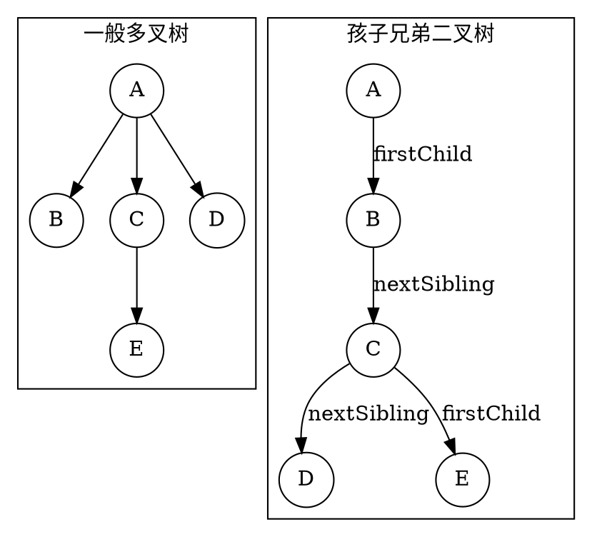
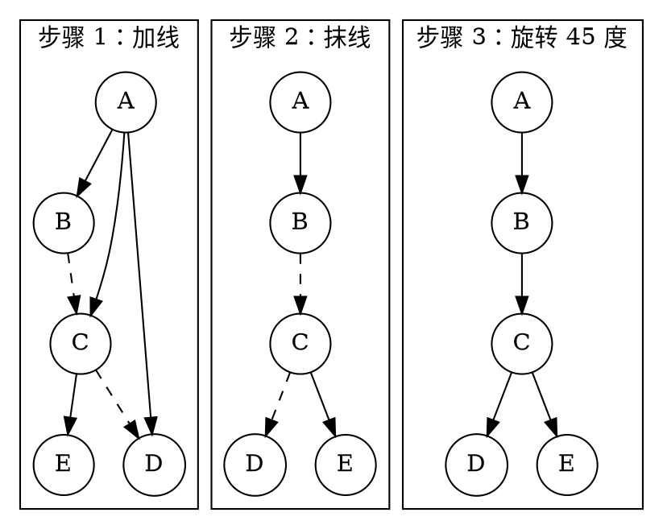
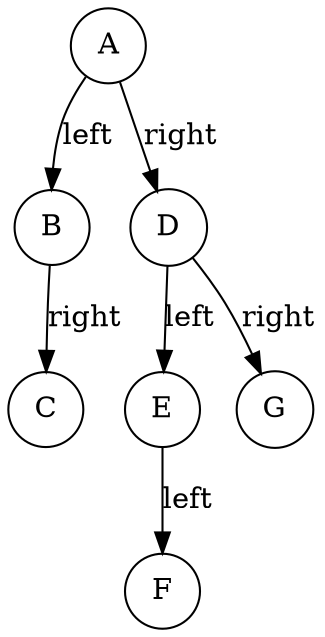

# 4.5 树、森林与二叉树

在现实生活和计算机系统中，多叉树（如文件系统的目录树、企业组织架构图、XML/JSON 语法树）与森林（多个独立树的集合）更为普遍。多叉树的节点度数各不相同，若为每个节点预留最大可能的孩子指针数组，会浪费大量内存，而且操作逻辑也会变得繁杂。

二叉树由于每个节点固定只有两个有序槽位（左、右），具有更紧凑、更高效的存储与算法实现。

那么，能否将任意形态的多叉树，甚至是由多棵树构成的森林，完全等价地转换为一棵二叉树？

答案是孩子兄弟表示法（Left-Child Right-Sibling, LCRS）。通过这一表示法，许多本来只针对标准二叉树的高效算法就可以应用到多叉树与森林中，替代那些繁杂的操作。

---

## 学习目标

完成本节后，你应该能够：

- 掌握树转换为二叉树的“加线、抹线、旋转”几何法则与本质原理；
- 解释为什么由单棵树转换得到的二叉树，其根节点的右孩子必定为空；
- 熟练完成森林与二叉树之间的相互可逆转换（双向映射）；
- 区分树的先根遍历、后根遍历与森林的先序、后序遍历规则，理解树为什么没有“中根遍历”；
- 严格推导并牢记**树/森林遍历与二叉树遍历的等价映射定理**（尤其是“后根遍历 $\Longleftrightarrow$ 二叉树中序遍历”的深层原因）。

---

## 4.5.1 树与二叉树的转换

### 1. 转换的底层语义：左孩子，右兄弟

我们在 [4.1 节](./01-tree-basics.md) 介绍过孩子兄弟表示法：
- `firstChild`（左指针）：指向该节点的**第一个孩子（长子）**；
- `nextSibling`（右指针）：指向该节点的**下一个相邻右侧兄弟**。

当我们将 `firstChild` 当作二叉树的 `left`，将 `nextSibling` 当作二叉树的 `right` 时，一般多叉树就自然转换为了一棵二叉树。

```cpp:line-numbers [lcrs-node.hpp]
struct CSNode {
    int val;
    CSNode* firstChild = nullptr;  // 左指针：第一个孩子
    CSNode* nextSibling = nullptr; // 右指针：下一个兄弟
};
```


<!-- diagram id="tree-to-binary-concept" caption: "firstChild 映射左指针，nextSibling 映射右指针" -->

### 2. 树转二叉树的直观几何规则（三步法）

1. **加线**：在所有属于同一个父节点的兄弟节点之间，画一条水平连线；
2. **抹线**：对树中的每一个节点，只保留它与**第一个孩子节点（最左孩子）**的连线，抹去它与其他所有孩子节点的连线；
3. **旋转平移**：以根节点为轴心，顺时针旋转 $45^\circ$。原来的长子成为左孩子，原来的水平兄弟链成为右斜向下的右孩子链。


<!-- diagram id="tree-three-step-rule" caption: "加线、抹线、旋转是树到孩子兄弟二叉树的三步转换" -->

::: property 性质 · 单树转换二叉树的根右链为空
由任意一棵**单棵树**转换得到的二叉树，其**根节点的右子树一定为空（`root->right == nullptr`）**。
**原因**：树的根节点是全局唯一的，它在逻辑上没有任何兄弟节点，因此其 `nextSibling` 必定为空。
:::

---

## 4.5.2 森林与二叉树的转换

<dfn>森林</dfn>（forest）是 $m$（$m \ge 0$）棵互不相交的树的集合：

$$
F = (T_1, T_2, \dots, T_m).
$$

当 $m = 0$ 时，为空森林；当 $m = 1$ 时，森林退化为单棵树。

### 1. 森林转换为二叉树

既然单棵树的根节点没有兄弟，那么如果有**多棵树**，我们就可以将第二棵树 $T_2$ 的根节点看作第一棵树 $T_1$ 根节点的“兄弟”，挂在 $T_1$ 的右指针上；将第三棵树 $T_3$ 的根节点挂在 $T_2$ 根节点的右指针上，依此类推。

**森林转二叉树转换算法**：
1. 将森林中的每一棵树 $T_1, T_2, \dots, T_m$ 分别按照 4.5.1 节规则转换为对应的二叉树 $B_1, B_2, \dots, B_m$；
2. 第一棵二叉树 $B_1$ 的根节点直接作为整棵二叉树的根；
3. 从 $B_2$ 开始，依次将后一棵二叉树的根节点，作为前一棵二叉树根节点的 **右孩子（`right`）** 连接起来。


<!-- diagram id="forest-to-binary" caption: "森林的各棵树根沿右链串联，得到唯一的二叉树" -->

### 2. 二叉树还原为森林

二叉树转换为森林是上述过程的完全逆过程：

1. **切断右链**：从二叉树的根节点开始，沿着根的右孩子指针一路向下，将所有右指针连线全部断开，得到 $m$ 棵独立的二叉树 $B_1, B_2, \dots, B_m$；
2. **独立还原**：对每一棵二叉树 $B_i$，按逆向规则还原为单棵多叉树 $T_i$；
3. **组合森林**：将还原出的所有树集合起来，即得到原始森林 $F = (T_1, T_2, \dots, T_m)$。

::: theorem 定理 1 · 森林与二叉树的双射同构
森林与二叉树之间存在 **一一对应（Bijective Mapping）** 关系。任意给定的森林都可以唯一转换得到一棵二叉树，任意二叉树也可以唯一还原为原始森林。
:::

---

## 4.5.3 树与森林的遍历及对应关系

### 1. 树的遍历规则

对于一棵非空的一般多叉树，有两种自然的深度优先遍历策略：

- **先根遍历（Pre-order Tree Traversal）**：
  1. 先访问根节点；
  2. 从左到右，依次先根遍历根节点的每一棵子树。
- **后根遍历（Post-order Tree Traversal）**：
  1. 从左到右，依次后根遍历根节点的每一棵子树；
  2. 最后访问根节点。

::: pitfall 易错点 · 为什么一般树没有“中根遍历”？
二叉树有严格的“左子树”与“右子树”，根节点正好位于中间（$L \to D \to R$）。但在一般多叉树中，一个节点可能拥有 $3$ 个或更多的孩子（如 $B, C, D$），无法唯一定义哪个孩子是“左”，哪个孩子是“中间”，因此**一般树只有先根遍历和后根遍历，不存在中根遍历**。
:::

### 2. 森林的遍历规则

设森林 $F = (T_1, T_2, \dots, T_m)$，其中 $T_1$ 的根为 $R_1$，其子树构成的子森林为 $F_1$：

- **先序遍历森林（Pre-order Forest Traversal）**：
  1. 访问第一棵树的根节点 $R_1$；
  2. 先序遍历第一棵树中根节点的子树森林 $F_1$；
  3. 先序遍历除了第一棵树之后剩余的树构成的森林 $(T_2, \dots, T_m)$。
- **后序遍历森林（Post-order Forest Traversal）**：
  1. 后序遍历第一棵树中根节点的子树森林 $F_1$；
  2. 访问第一棵树的根节点 $R_1$；
  3. 后序遍历除了第一棵树之后剩余的树构成的森林 $(T_2, \dots, T_m)$。

---

### 3. 核心定理：树/森林遍历与二叉树遍历的等价对应

这是树形结构理论与算法题中常用的对应关系：

::: theorem 定理 2 · 树/森林遍历与二叉树遍历的等价映射
关键在于把“树的孩子”翻译成“二叉树的左子树”，把“树的兄弟链”翻译成“二叉树的右子树”。因此，原始结构中的访问顺序会保持不变，并映射到二叉树的对应遍历序列：

| 原始结构 | 原始遍历方式 | 对应转换后二叉树的遍历方式 |
| :--- | :--- | :--- |
| 树（Tree） | 先根遍历 | 二叉树的前序遍历（$DLR$） |
| 树（Tree） | 后根遍历 | 二叉树的中序遍历（$LDR$） |
| 森林（Forest） | 先序遍历 | 二叉树的前序遍历（$DLR$） |
| 森林（Forest） | 后序遍历 | 二叉树的中序遍历（$LDR$） |
:::

::: proof 为什么“树的后根遍历”对应“二叉树的中序遍历”而非后序遍历？（严格归纳证明）

**1、基础情况（高度为 1 的树）**

若树仅有根节点 $R$，无任何孩子。转换后的二叉树仅含一个孤立节点 $R$。其中序遍历输出 $R$，原树的后根遍历也输出 $R$。结论成立。

---

**2、归纳假设**

假设对于所有高度小于 $h$（$h \ge 2$）的树，转换后的二叉树中序遍历序列均等于对应原树的后根遍历序列。

---

**3、归纳步骤（高度为 $h$ 的树）**

设原树根节点为 $R$，其从左到右的孩子依次为 $C_1, C_2, ..., C_k$（$k \ge 1$）。以 $C_i$ 为根的子树记为 $T_i$，其高度均小于 $h$，因此均满足归纳假设。

根据转换规则构造二叉树：
- $R$ 的左指针指向 $C_1$；
- 对于任意 $1 \le i < k$，节点 $C_i$ 的右指针指向 $C_{i+1}$（即通过右指针串起兄弟链表）；
- 由于 $R$ 是整棵树的根，它没有右兄弟，因此二叉树中 $R$ 的右指针为空。

现在对转换后的二叉树进行**中序遍历**（左子树 $\to$ 根 $\to$ 右子树）：

**第一步：遍历 $R$ 的左子树**

$R$ 的左子树是以 $C_1$ 为根的二叉树。由于 $C_1$ 的右链挂载着 $C_2, C_3, ..., C_k$，当中序遍历进入这棵左子树时，会按照“左-根-右”的规则逐层递归：

- 先完整遍历 $C_1$ 的左子树（即 $T_1$ 除 $C_1$ 本身）；
- 访问 $C_1$ 本身；
- 进入 $C_1$ 的右子树——而 $C_1$ 的右子树恰好是以 $C_2$ 为根的二叉树；
- 继续完整遍历 $C_2$ 的左子树（$T_2$ 除 $C_2$ 本身），访问 $C_2$，进入 $C_2$ 的右子树（$C_3$）……
- 依此类推，直到处理完 $C_k$ 的整棵子树。

因此，遍历完 $R$ 的左子树，实际上已经**按顺序完整地处理了 $C_1, C_2, ..., C_k$ 各自对应的整棵二叉树**，其输出序列为：

$$
\text{Inorder}(T_1) + \text{Inorder}(T_2) + ... + \text{Inorder}(T_k)
$$

**第二步：访问根节点 $R$**

中序遍历访问 $R$ 本身。

**第三步：遍历 $R$ 的右子树**

因 $R$ 的右指针为空，此步无输出。

---

将三步合并，得到二叉树中序遍历的完整展开式：

$$
\text{Inorder}(转换后二叉树) = \text{Inorder}(T_1) + \text{Inorder}(T_2) + ... + \text{Inorder}(T_k) + R
$$

由归纳假设，对于每个 $i$（$1 \le i \le k$），$\text{Inorder}(T_i)$ 等于原树 $T_i$ 的后根遍历序列。代入上式：

$$
\text{Inorder}(转换后二叉树) = \text{后根}(T_1) + \text{后根}(T_2) + ... + \text{后根}(T_k) + R
$$

这正是原树以 $R$ 为根的后根遍历定义（先依次后根遍历每一个孩子子树，最后访问根节点 $R$）。归纳完成，结论得证。

---

**补充说明：为什么二叉树的“后序遍历”不行？**

若对转换后的二叉树做后序遍历（左子树 $\to$ 右子树 $\to$ 根），其输出为：

$$
\text{Postorder}(转换后二叉树) = \text{Postorder}(以 C_1 为根的二叉树) + R
$$

后序遍历在处理以 $C_1$ 为根的二叉树时，会将 $C_2$（挂在 $C_1$ 的右指针上）视为 $C_1$ 的右子树，混入 $C_1$ 的内部递归顺序中，导致 $C_1$ 在 $C_2$ 的子树的后面。这意味着 $C_2$ 的子树会被穿插在 $C_1$ 的后序序列内部，而不是在 $C_1$ 整体处理完毕后才独立处理 $C_2$。

原树后根遍历要求的是“先完整输出 $T_1$，再完整输出 $T_2$，……”，但二叉树的后序遍历输出结果中，$T_2$ 的内容被嵌套在 $T_1$ 内部，无法提取出“按兄弟子树逐个完整输出”的序列。因此，后序遍历与树的后根遍历完全不对应。

综上，只有中序遍历能完美承载树的后根遍历顺序。
:::

---

## 配套理论题

本节对应的理论题库如下：

| 顺序 | 题目与入口 |
| ---: | --- |
| 08 | [树与森林理论题精练](../../labs/chapter-04/theory/T-04-08-trees-and-forests-quiz/README.md) |

## 小结与自测

树与森林通过 **孩子兄弟二叉链表（左孩子、右兄弟）** 与二叉树建立了双射同构关系。森林多根串联于右链，树的先根映射二叉树前序，树的后根映射为二叉树的中序。

请尝试回答以下自测问题：

1. 一棵含有 $n$ 个节点的一般树转换成二叉树后，这棵二叉树的根节点的左指针与右指针分别有什么特点？
2. 已知某森林包含 3 棵树，节点总数分别为 $n_1, n_2, n_3$。转换为二叉树后，二叉树根节点的右子树包含多少个节点？
3. 为什么一般多叉树不能定义中根遍历？
4. 给定一棵多叉树，其先根遍历序列为 `A B C D E`，后根遍历序列为 `B D E C A`。请写出该多叉树转换为二叉树后的中序遍历序列。
5. 简述在文件系统或组织架构等多叉树系统中，采用孩子兄弟二叉链表代替指针数组的主要工程优势。

::: details 参考答案 · 题 4
由定理 2 可知：**树的后根遍历等价于转换后二叉树的中序遍历**。因此，题目中所给的后根遍历序列 `B D E C A`，就是该多叉树对应的二叉树中序遍历序列。

也就是说，答案为：

`B D E C A`

这是一个典型的“陷阱题”：**先根 + 后根并不能唯一确定一棵多叉树**，但在孩子兄弟表示中，它们恰好分别对应二叉树的前序与中序，因此无需还原整棵树即可直接得到答案。
:::

下一节进入[4.6 二叉树的经典问题](./06-binary-tree-classic-problems.md)：我们将综合运用递归框架、DFS/BFS 状态转移与树形动态规划，系统讨论二叉树形态统计、路径回溯、对称变换与最近公共祖先等经典问题。
