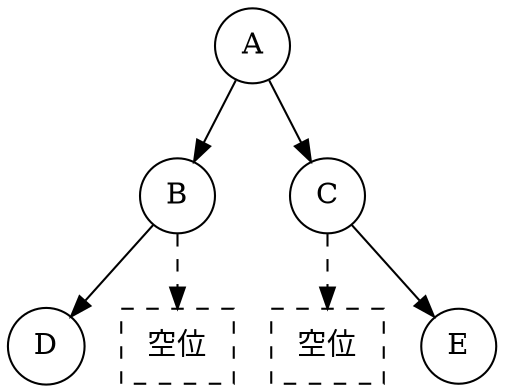
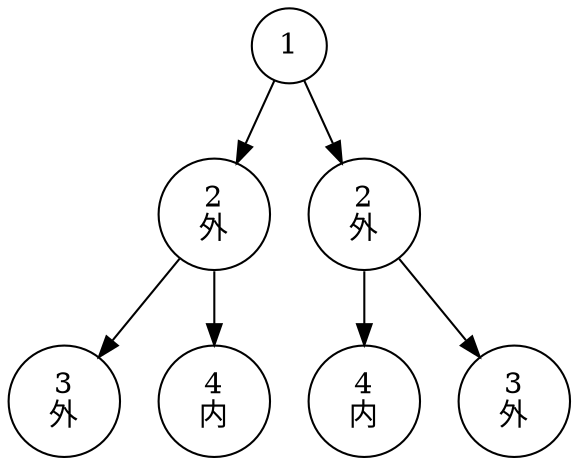
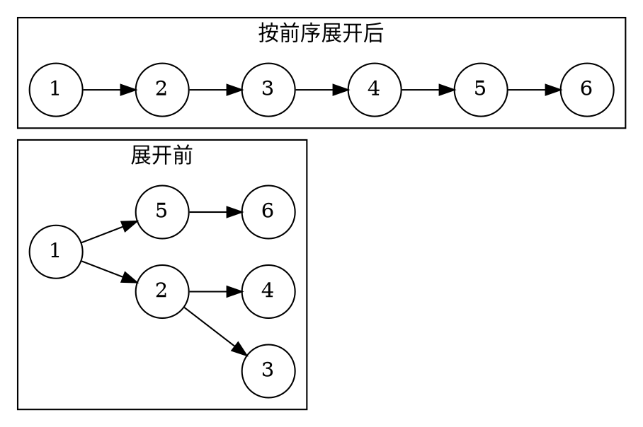
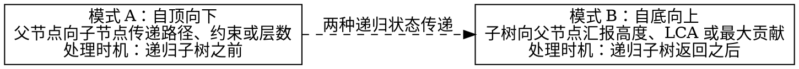
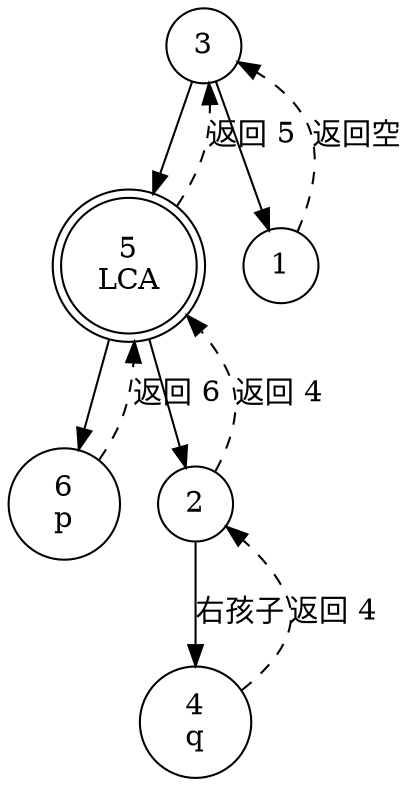

# 4.6 二叉树的经典问题

在掌握了二叉树的形态定义、存储结构与遍历机制之后，接下来我们来研究二叉树里面的经典问题。

二叉树的问题虽然千变万化，涵盖节点统计、结构判断、形态变换、路径搜索、祖先定位乃至树形动态规划，但它们的底层逻辑高度收敛于一个共同的数学基石：**分治（Divide and Conquer）与递归状态转移**。

本节我们将二叉树的经典问题归纳为五大核心模型，提炼**“自顶向下（Top-Down）”**与**“自底向上（Bottom-Up）”**的统一递归思维框架，攻克二叉树的算法高地。

---

## 学习目标

完成本节后，你应该能够：

- 熟练写出节点数、叶节点与高度的分治统计公式，并区分按节点数和按编号跨度计算的两种宽度；
- 掌握对称二叉树的双树镜像递归比较，以及完全二叉树的 BFS 连续性判空；
- 理解平衡二叉树从 $O(n^2)$ 自顶向下优化为 $O(n)$ 自底向上剪枝的精髓；
- 掌握原地将二叉树展开为先序单链表的前驱拼接技巧；
- 熟练应用前序值传递与回溯（Backtracking）现场保护解决路径总和问题；
- 建立求解二叉树直径、最近公共祖先（LCA）与最大路径和（树形 DP）的自底向上递归模型。

---

## 4.6.1 统计类

统计类问题的核心是**分治策略**：将整棵树的统计指标，分解为左子树的统计指标与右子树的统计指标的代数合并。

$$
f(\text{root}) = \text{combine}(f(\text{root}\to\text{left}), f(\text{root}\to\text{right})) + \text{self}
$$

### 1. 节点总数与叶节点统计

```cpp:line-numbers [count-nodes.cpp]
// 统计节点总数
int countNodes(TreeNode* root) {
    if (root == nullptr) return 0;
    return 1 + countNodes(root->left) + countNodes(root->right);
}

// 统计叶节点（度为 0）总数
int countLeaves(TreeNode* root) {
    if (root == nullptr) return 0;
    if (root->left == nullptr && root->right == nullptr) return 1;
    return countLeaves(root->left) + countLeaves(root->right);
}
```

### 2. 树的最大深度（高度）

树的最大深度定义为从根节点到最远叶节点所经过的节点数：

```cpp:line-numbers [max-depth.cpp]
int maxDepth(TreeNode* root) {
    if (root == nullptr) return 0;
    return 1 + std::max(maxDepth(root->left), maxDepth(root->right));
}
```

### 3. 二叉树的最大宽度

::: definition 两种宽度约定
**经典定义（按节点数）**：一层的宽度是该层实际存在的节点个数，二叉树的最大宽度是各层节点数的最大值，**不计空位**。这也是 [4.3 层序遍历](./03-binary-tree-traversal.md)分析队列空间时使用的宽度。

**编号跨度定义（计入中间空位）**：一层的宽度是最左与最右非空节点之间占据的位置数，**计入两端之间的空位，不计两端以外的空位**；整棵树取各层跨度的最大值。[LeetCode 662「二叉树最大宽度」](https://leetcode.com/problems/maximum-width-of-binary-tree/)采用这一约定。
:::

例如，下面这棵树的第三层只有两个节点，却跨越了四个位置：


<!-- diagram id="binary-tree-width-definitions" caption: "第三层为 D、空位、空位、E：实际节点数为 2，编号跨度为 4" -->

| 计算约定 | 第 1 层 | 第 2 层 | 第 3 层 | 整棵树的最大宽度 |
| --- | --- | --- | --- | --- |
| 实际节点数 | 1 | 2 | 2 | 2 |
| 包含中间空位的跨度 | 1 | 2 | 4 | 4 |

**按经典定义求宽度**，只需在 BFS 每层开始时记录队列长度；队列中仅存放非空节点：

```cpp:line-numbers [max-level-node-count.cpp]
#include <algorithm>
#include <cstddef>
#include <queue>

std::size_t maxLevelNodeCount(TreeNode* root) {
    if (root == nullptr) return 0;

    std::queue<TreeNode*> q;
    q.push(root);
    std::size_t maxWidth = 0;
    while (!q.empty()) {
        const std::size_t levelSize = q.size();
        maxWidth = std::max(maxWidth, levelSize);
        for (std::size_t i = 0; i < levelSize; ++i) {
            TreeNode* node = q.front();
            q.pop();
            if (node->left != nullptr) q.push(node->left);
            if (node->right != nullptr) q.push(node->right);
        }
    }
    return maxWidth;
}
```

**按编号跨度求宽度**，则需要保留节点之间的空位信息。在完全二叉树编号模型下（根为 $0$，左孩子为 $2i+1$，右孩子为 $2i+2$），每层跨度为**该层最右节点的编号减去最左节点的编号加 $1$**。下面的 `widthOfBinaryTree` 计算的是这一种宽度。

::: tip 技巧 · 每层编号归一化
深树的绝对编号可能很大。在每层开始时，**将该层所有节点的编号减去该层首个节点的编号（以 $0$ 为基准对齐）**，可以去掉共同偏移，保留编号差。

下例沿用 LeetCode 662 的约束：答案在 32 位有符号整数范围内，中间编号用 `uint64_t` 保存，再转为 `int` 返回。归一化不能缩小真实跨度；若取消答案范围限制，极稀疏树的跨度仍可能超过整数类型范围，需要另行处理。
:::

```cpp:line-numbers [width-of-binary-tree.cpp]
#include <queue>
#include <cstdint>
#include <algorithm>

int widthOfBinaryTree(TreeNode* root) {
    if (root == nullptr) return 0;

    // 队列中存储：{非空节点指针, 保留相对位置的编号}
    std::queue<std::pair<TreeNode*, uint64_t>> q;
    q.push({root, 0});
    uint64_t maxWidth = 0;

    while (!q.empty()) {
        size_t size = q.size();
        uint64_t minIndex = q.front().second; // 当前层最左侧节点的编号基准
        uint64_t first = 0, last = 0;

        for (size_t i = 0; i < size; ++i) {
            auto [node, index] = q.front();
            q.pop();

            // 去掉当前层共同的编号偏移，保留节点间距
            uint64_t curIndex = index - minIndex;
            if (i == 0) first = curIndex;
            if (i == size - 1) last = curIndex;

            if (node->left != nullptr)  q.push({node->left, 2 * curIndex + 1});
            if (node->right != nullptr) q.push({node->right, 2 * curIndex + 2});
        }
        maxWidth = std::max(maxWidth, last - first + 1);
    }
    return static_cast<int>(maxWidth);
}
```

::: complexity 两种 BFS 的复杂度
设节点总数为 $n$，单层实际节点数的最大值为 $w$。两种方法都只让非空节点入队，每个节点入队、出队各一次，时间复杂度均为 $O(n)$，辅助空间均为 $O(w)$。这里的 $w$ 按经典定义计算，**不是包含空位的编号跨度**。
:::

---

## 4.6.2 判断类

### 1. 相同树（Same Tree）与对称树（Symmetric Tree）

判断两棵树是否相同，要求根节点值相同，且左子树与左子树相同、右子树与右子树相同：

```cpp:line-numbers [is-same-tree.cpp]
bool isSameTree(TreeNode* p, TreeNode* q) {
    if (p == nullptr && q == nullptr) return true;
    if (p == nullptr || q == nullptr) return false;
    return (p->val == q->val) &&
           isSameTree(p->left, q->left) &&
           isSameTree(p->right, q->right);
}
```

而判断一棵树是否是**关于中心轴对称的镜像二叉树**，要求“左子树的外侧与右子树的外侧对称，左子树的内侧与右子树的内侧对称”：


<!-- diagram id="symmetric-tree" caption: "对称树的镜像节点逐层对应，外侧与内侧同时匹配" -->

```cpp:line-numbers [is-symmetric.cpp]
class Solution {
public:
    bool isSymmetric(TreeNode* root) {
        if (root == nullptr) return true;
        return check(root->left, root->right);
    }
private:
    bool check(TreeNode* t1, TreeNode* t2) {
        if (t1 == nullptr && t2 == nullptr) return true;
        if (t1 == nullptr || t2 == nullptr) return false;
        return (t1->val == t2->val) &&
               check(t1->left, t2->right) && // 外侧比较
               check(t1->right, t2->left);   // 内侧比较
    }
};
```

#### 延伸：另一棵树的子树与子结构匹配（Subtree Matching）

如果问题升级为：**给定主树 `root` 与模式树 `subRoot`，判断 `root` 中是否包含与 `subRoot` 结构与数值完全相同的子树**。

解决这个问题的思路其实非常朴素——**双重递归**：
1. **外层递归（遍历主树找起点）**：遍历主树中的每一个节点，把每个节点都当成潜在的子树根；
2. **内层递归（直接调用 `isSameTree`）**：对选中的节点，直接复用上面写好的 `isSameTree` 函数，逐个比对它和 `subRoot` 是否完全一致。

```cpp:line-numbers [is-subtree.cpp]
class Solution {
public:
    bool isSubtree(TreeNode* root, TreeNode* subRoot) {
        // 主树为空，不可能包含任何非空子树
        if (root == nullptr) return false;
        // 1. 如果当前节点与 subRoot 相同，说明找到了，直接返回 true
        // 2. 否则分别去左子树、右子树里继续寻找
        return isSameTree(root, subRoot) ||
               isSubtree(root->left, subRoot) ||
               isSubtree(root->right, subRoot);
    }
private:
    bool isSameTree(TreeNode* p, TreeNode* q) {
        if (p == nullptr && q == nullptr) return true;
        if (p == nullptr || q == nullptr) return false;
        return (p->val == q->val) &&
               isSameTree(p->left, q->left) &&
               isSameTree(p->right, q->right);
    }
};
```

* **时间复杂度**：设主树节点数为 $M$，子树节点数为 $N$。最坏情况下（如节点值全部相同的退化单链树），主树每个节点都会触发一次 $O(N)$ 的匹配，时间复杂度为 $O(M \times N)$；
* **优化方向**：若需进一步优化至 $O(M + N)$ 线性复杂度，可通过带空指针占位符的前序序列化转化为字符串 KMP 匹配，或使用树哈希（Merkle Tree）。

---

### 2. 完全二叉树判定（Complete Binary Tree Check）

利用 BFS 层序遍历的性质：如果一棵树是完全二叉树，当按层序遍历把所有节点（**包括空指针**）压入队列时，**所有非空节点必须紧密相连，绝不能在遇到空指针之后再次出现有效节点**。

```cpp:line-numbers [is-complete-tree.cpp]
#include <queue>

bool isCompleteTree(TreeNode* root) {
    std::queue<TreeNode*> q;
    q.push(root);
    bool seenNull = false;

    while (!q.empty()) {
        TreeNode* node = q.front();
        q.pop();

        if (node == nullptr) {
            seenNull = true; // 标记首次遇到空槽
        } else {
            if (seenNull) {
                return false; // 遇空之后又见节点，破坏了连续性！
            }
            q.push(node->left);
            q.push(node->right);
        }
    }
    return true;
}
```

---

### 3. 平衡二叉树判定（Balanced Tree Check）

平衡二叉树（AVL 性质）要求：树中任意节点的左右子树高度差绝对值不超过 $1$（$|\text{leftHeight} - \text{rightHeight}| \le 1$）。

#### 两种解法原理与剪枝机制对比

1. **朴素自顶向下法（$O(n^2)$，重复计算痛点）**：
   - 算法流程：先写一个 `maxDepth` 函数求当前节点的左右子树高度并做差判断；然后再递归检查 `root->left` 和 `root->right` 是否平衡。
   - **致命缺陷**：从根到叶的每个节点都会被反复计算高度。在退化单链树中，总比较次数为 $n + (n-1) + \dots + 1 = \Theta(n^2)$。

2. **最优自底向上剪枝法（$\Theta(n)$，后序短路剪枝）**：
   - **返回值复用（哨兵标记机制）**：函数 `checkHeight(node)` 承担双重职责：
     - 若子树**平衡**：返回该子树的真实高度（非负整数 $\ge 0$）；
     - 若子树**失衡**：返回特殊哨兵值 **`-1`**。
   - **短路剪枝执行过程（Short-Circuit）**：
     - 递归后序遍历左子树得到 `leftH`：若 `leftH == -1`（左子树已失衡），**立即短路 `return -1`，完全无需再去遍历的右子树**。
     - 递归遍历右子树得到 `rightH`：若 `rightH == -1`，同理立即 `return -1`；
     - 若左右子树均平衡，但当前高度差 $|\text{leftH} - \text{rightH}| > 1$：说明当前节点失衡，返回 `-1`；
     - 否则两子树平衡，返回当前树高 `1 + std::max(leftH, rightH)`。
   - **复杂度收益**：失衡信号一旦产生便自底向上直接熔断回溯，每个节点至多被访问一次，时间复杂度优化为 $\Theta(n)$。

```cpp:line-numbers [is-balanced.cpp]
class Solution {
public:
    bool isBalanced(TreeNode* root) {
        return checkHeight(root) != -1;
    }
private:
    int checkHeight(TreeNode* root) {
        if (root == nullptr) return 0;

        int leftH = checkHeight(root->left);
        if (leftH == -1) return -1; // 提前剪枝

        int rightH = checkHeight(root->right);
        if (rightH == -1) return -1; // 提前剪枝

        if (std::abs(leftH - rightH) > 1) return -1; // 当前失衡
        return 1 + std::max(leftH, rightH);
    }
};
```

---

## 4.6.3 变换类

### 1. 翻转二叉树（Invert / Mirror Binary Tree）

将二叉树中所有节点的左右子树互换。后序或前序递归均可优雅完成：

```cpp:line-numbers [invert-tree.cpp]
TreeNode* invertTree(TreeNode* root) {
    if (root == nullptr) return nullptr;
    
    TreeNode* leftChild = invertTree(root->left);
    TreeNode* rightChild = invertTree(root->right);
    
    root->left = rightChild;
    root->right = leftChild;
    return root;
}
```

---

### 2. 二叉树展开为先序单链表（Flatten Binary Tree）

要求**原地（In-place）**将二叉树重构为一条沿 `right` 指针向下的单链表，节点顺序与前序遍历相同，且所有 `left` 指针置为空。


<!-- diagram id="flatten-tree" caption: "二叉树原地展开为按前序排列的右链" -->

::: tip 寻找拼接点的原地解法
对于当前节点 `curr`，若其拥有左子树：
1. 从 `curr->left` 出发，沿 `right` 指针走到末端，找到拼接点 `pred`；
2. 将原来的 `curr->right` 接到 `pred->right` 上；
3. 将 `curr->left` 整体移到 `curr->right`，并将 `curr->left` 置空；
4. `curr` 顺着新的 `right` 继续向前推进。
:::

::: pitfall 拼接点不一定是左子树先序遍历的最后一个节点
沿右指针找到的 `pred` 仍可能有左子树。例如左子树根为 `2`，它只有左孩子 `3`：此时 `pred` 是 `2`，但该子树先序遍历的末节点是 `3`。先把原右子树接到 `2->right`，后续处理 `2` 时，算法会把 `3` 插到这棵右子树之前，最终仍保持“根、左子树、右子树”的顺序。
:::

```cpp:line-numbers [flatten-binary-tree.cpp]
void flatten(TreeNode* root) {
    TreeNode* curr = root;
    while (curr != nullptr) {
        if (curr->left != nullptr) {
            // 从左孩子出发，沿右指针找到拼接点
            TreeNode* pred = curr->left;
            while (pred->right != nullptr) {
                pred = pred->right;
            }
            // 拼接右子树
            pred->right = curr->right;
            curr->right = curr->left;
            curr->left = nullptr;
        }
        curr = curr->right;
    }
}
```

::: complexity 最坏时间 O(n)，辅助空间 O(1)
设二叉树有 $n$ 个节点。外层 `curr` 按最终先序顺序访问每个节点一次；内层虽然也有 `while`，但各次寻找 `pred` 的扫描不能简单相乘。

每次搜索都从一个左孩子出发，沿尚未展开的右链前进。这些右链互不重叠；拼接后，后续搜索会进入当前节点各自的左子树，不会从头重扫已经找过的整条右链。因此，所有 `pred = pred->right` 的执行次数合计为 $O(n)$，加上外层遍历，总时间为 $O(n)$。算法只维护几个指针，没有递归栈，辅助空间为 $O(1)$。

特别地，若整棵树是一条只含左孩子的长链，每次 `pred` 初始指向的节点都没有右孩子，内层循环执行 **0 次**，总时间仍为 $O(n)$。若左子树本身是一条右链，也只在首次拼接时扫描该链一次。
:::

::: pitfall 哪种展开写法会退化为 O(n²)？
若先递归展开左右子树，再在每层从左子树链头走到链尾以拼接右子树，那么长左链会使已展开的尾链被反复扫描，产生 $1+2+\cdots+(n-2)=\Theta(n^2)$ 次移动。这是另一种“递归展开后找链尾”的实现，不能把它的复杂度套到上面的迭代代码。
:::

---

## 4.6.4 路径类（根到叶）

本小节仅讨论路径端点分别为根和叶子的问题。若路径端点可为树中任意节点，请参见 [4.6.5.2「二叉树中的最大路径和」](#max-path-sum)。

### 1. 求根节点到叶节点数字之和

每条从根到叶的路径代表一个十进制数（例如 $1 \to 2 \to 3$ 代表 $123$）。求所有路径数字之和。

**自顶向下值传递模型**：在递归向子节点推进时，传递累积值 `currentSum * 10 + node->val`；当且仅当到达叶节点时，将该数值返回。

```cpp:line-numbers [sum-numbers.cpp]
class Solution {
public:
    int sumNumbers(TreeNode* root) {
        return dfs(root, 0);
    }
private:
    int dfs(TreeNode* root, int sum) {
        if (root == nullptr) return 0;
        sum = sum * 10 + root->val;
        if (root->left == nullptr && root->right == nullptr) {
            return sum; // 叶节点，结算当前路径值
        }
        return dfs(root->left, sum) + dfs(root->right, sum);
    }
};
```

---

### 2. 收集所有满足目标和的路径

找出所有从根节点到叶节点路径总和等于 `targetSum` 的路径集合。与上一问题类似，这个问题也属于自顶向下的传递模式，不同的是，求和传递的是实时的和值，而求满足和的路径传递的是实时的与目标和值的差值。当差值为0且到达叶节点时，该路径满足条件。

**显式回溯（Backtracking）与现场保护**：
- 进入节点时：`path.push_back(node->val)`；
- 离开节点时：执行 `path.pop_back()` 恢复现场，保证状态干净。

```cpp:line-numbers [path-sum-ii.cpp]
#include <vector>

class Solution {
public:
    std::vector<std::vector<int>> pathSum(TreeNode* root, int targetSum) {
        std::vector<std::vector<int>> results;
        std::vector<int> path;
        dfs(root, targetSum, path, results);
        return results;
    }
private:
    void dfs(TreeNode* root, int remainingSum,
             std::vector<int>& path,
             std::vector<std::vector<int>>& results) {
        if (root == nullptr) return;

        path.push_back(root->val);
        remainingSum -= root->val;

        // 必须是叶节点且剩余和为 0
        if (root->left == nullptr && root->right == nullptr && remainingSum == 0) {
            results.push_back(path);
        } else {
            dfs(root->left, remainingSum, path, results);
            dfs(root->right, remainingSum, path, results);
        }

        path.pop_back(); // 回溯：撤销选择，恢复现场
    }
};
```

---

## 4.6.5 二叉树问题的统一递归框架

二叉树的高级算法题往往看似毫无头绪，但只要将其拆解为两种基本递归形态，问题便迎刃而解：


<!-- diagram id="recursive-framework" caption: "树递归的自顶向下传参与自底向上汇总框架" -->

### 1. 二叉树的最近公共祖先（Lowest Common Ancestor, LCA）

给定节点 $p$ 和 $q$，寻找它们在树中的最近公共祖先。

::: definition 本解法的存储结构与输入前提
这里使用经典的**二叉链表**：每个 `TreeNode` 含节点值以及 `left`、`right` 两个孩子指针，**不含 `parent` 父指针**。已知根节点 `root`，并保证目标节点 $p$、$q$ 都在树中；代码按节点指针身份比较，不依赖节点值是否相同。

节点也视为自身的祖先。因此，若 $p$ 是 $q$ 的祖先，答案就是 $p$；若 $p=q$，答案也是该节点。
:::

**为什么从根往下找？** 有父指针且已知深度时，可以先让较深节点向上跳到同一深度，再让两者同步上移，首次相遇处就是 LCA，单次查询时间为 $O(h)$（$h$ 为树高）。但当前节点没有父指针，无法直接从 $p$、$q$ 向上访问父节点。下面通过从根向下递归搜索，再利用递归调用栈把结果逐层返回给父调用，实现自底向上的汇聚。若为此先遍历整棵树建立父节点和深度表，还需计入 $O(n)$ 的预处理时间与空间。

**后序状态汇聚逻辑**：
- 若当前节点为 `nullptr`，返回空；若当前节点等于 $p$ 或 $q$，直接返回该节点；
- 递归询问左子树和右子树：
  - 左右都返回空：当前子树中没有找到目标，返回空；
  - 左右各返回非空：两个目标分别位于两侧，当前节点就是 LCA；
  - 只有一侧返回非空：把这一侧的结果继续向上返回。**它可能是刚找到的一个目标，也可能是该侧已确定的 LCA**，不能据此就断言两个目标都已找到。

例如求下图中 $p=6$、$q=4$ 的 LCA。实线向下表示孩子关系，也是递归搜索的方向；虚线向上表示函数返回值，**不是树中额外存储的父指针**。


<!-- diagram id="lca-search-and-return" caption: "从根向下搜索，再沿调用栈返回：节点 5 汇合两个目标，根节点 3 继续返回已找到的 LCA" -->

| 当前调用 | 子调用返回情况 | 本次返回 |
| --- | --- | --- |
| 节点 6、节点 4 | 命中目标，直接结束当前调用 | 分别返回自身 |
| 节点 2 | 左侧为空，右侧返回 4 | 返回 4，此时只找到一个目标 |
| 节点 5 | 左侧返回 6，右侧返回 4 | 返回 5，它是两个目标的 LCA |
| 节点 1 | 两侧都未找到目标 | 返回空 |
| 节点 3 | 左侧返回 5，右侧返回空 | 返回 5，沿用左侧已确定的 LCA |

若 $p$ 本身是 $q$ 的祖先，搜索到 $p$ 时即可返回 $p$，不用再进入它的子树寻找 $q$；在两个目标都存在的前提下，$p$ 就是这两者在该子树中的最近公共祖先。上层收到结果后继续按相同规则汇聚。

```cpp:line-numbers [lowest-common-ancestor.cpp]
TreeNode* lowestCommonAncestor(TreeNode* root, TreeNode* p, TreeNode* q) {
    if (root == nullptr || root == p || root == q) return root;

    TreeNode* leftLCA = lowestCommonAncestor(root->left, p, q);
    TreeNode* rightLCA = lowestCommonAncestor(root->right, p, q);

    if (leftLCA != nullptr && rightLCA != nullptr) {
        return root; // 左右各抓到一个，当前节点就是最近公共祖先
    }
    return (leftLCA != nullptr) ? leftLCA : rightLCA;
}
```

::: complexity 单次查询的最坏开销
设节点数为 $n$、树高为 $h$。每个节点最多被访问一次，最坏时间复杂度为 $O(n)$；递归调用栈占 $O(h)$ 空间，退化为链时为 $O(n)$。代码只在空节点或命中目标时直接返回，仍可能搜索不含目标的分支（如图中的节点 `1`），因此不能把时间开销仅算成两条祖先链的长度。
:::

::: pitfall 输入前提不能省略
若不保证 $p$、$q$ 都在树中，这段代码可能在仅找到其中一个时就返回该节点；它不能据此证明两个目标都存在。此时需要额外验证存在性，或让递归同时返回找到的目标数量。
:::

---

### 2. 二叉树中的最大路径和（树形 DP 压轴） {#max-path-sum}

路径可以从树中任意节点出发，到达任意节点，路径中至少包含一个节点。求所有可能路径的最大权值和。

要求整棵树中所有可能路径的**最大路径和**，很容易想到去遍历每一个节点，然后求出经过该节点的所有路径并取最大值。但是这样操作过于暴力，耗时很长（时间复杂度为 $O(n^2)$），有没有效率更高的算法？

我们前面提到过自底向上的递归逻辑，可用于需要向父节点传递信息的流程。可以这样想：任意一条路径都必然有一个“**最高拐弯节点**“。以某个节点为最高拐弯点时，它能达到的局部最大路径和，正好等于**左子树提供的最大正收益 + 右子树提供的最大正收益 + 节点值本身**。因此我们只需全局维护一个 `maxPath`，遍历回溯到每个节点时顺手结算并比较即可。同时，这个节点本身也是其父节点的孩子，在函数结束时，它还需要向父节点传递自身能提供的**单侧最大延伸贡献**。

要注意的是：**如果一个节点内部的最大贡献路径横跨了其左右子树（如下图中的红色路径），这个贡献是绝对不能直接汇报给父节点的！**

因为树上的“简单路径”绝不能出现分叉。若将这条横跨左右的红色路径（左子树 $\to$ 当前节点 $\to$ 右子树）再连向通往父节点的黑色树枝，就会在当前节点处出现“三叉路口”，这就不是我们想求的路径了。因此，算法必须将“**当前节点就地结算完整路径**”与“**向父节点汇报单侧延伸**”彻底区分开。

```graphviz
digraph MaxPathSumLocal {
  rankdir=TB;
  node [shape=point, width=0.08, color="#2D3748"];
  edge [arrowhead=none, penwidth=2.5];

  // 全局树骨架（黑色）
  root [color="#2D3748"];
  L [color="#2D3748"];
  R [color="#E53E3E"];
  root -> L [color="#2D3748"];
  root -> R [color="#2D3748"];

  // 左子树（黑色分支）
  L_left [color="#2D3748"];
  L_mid [color="#2D3748"];
  L_leaf [color="#2D3748"];
  L -> L_left [color="#2D3748"];
  L -> L_mid [color="#2D3748"];
  L_mid -> L_leaf [color="#2D3748"];

  // 右子树内部：横跨左右子树的红色路径（已成完整路径，不能再连向父节点）
  R_L [color="#E53E3E"];
  R_L_leaf [color="#E53E3E"];
  R_R [color="#E53E3E"];
  R_R_leaf [color="#E53E3E"];

  R -> R_L [color="#E53E3E"];
  R_L -> R_L_leaf [color="#E53E3E"];
  R -> R_R [color="#E53E3E"];
  R_R -> R_R_leaf [color="#E53E3E"];
}
```


<!-- diagram id="max-path-sum-local" caption: "红色路径横跨了左右子树，若再连向父节点就会发生分叉，故只能向父节点汇报单侧最大贡献" -->

::: property 状态转移与结算公式
记子树提供的非负贡献为 $\text{leftGain} = \max(0, \text{dfs}(\text{root}\to\text{left}))$ 与 $\text{rightGain} = \max(0, \text{dfs}(\text{root}\to\text{right}))$（若子树收益为负则直接剪枝归零）：

- **局部结算（更新全局答案）**：以当前节点为最高拐弯点的完整路径和
  $$
  \text{currentPathSum} = \text{root}\to\text{val} + \text{leftGain} + \text{rightGain}
  $$
- **向上汇报（函数返回值）**：为父节点提供的单侧最大延伸贡献
  $$
  \text{gain}(\text{root}) = \text{root}\to\text{val} + \max(\text{leftGain}, \text{rightGain})
  $$
:::

```cpp:line-numbers [max-path-sum.cpp]
#include <algorithm>
#include <climits>

class Solution {
    int maxPath = INT_MIN;

    int maxGain(TreeNode* root) {
        if (root == nullptr) return 0;

        // 若子树贡献为负数，则舍弃取 0
        int leftGain = std::max(0, maxGain(root->left));
        int rightGain = std::max(0, maxGain(root->right));

        // 更新跨过当前根的最大路径和
        int currentPathSum = root->val + leftGain + rightGain;
        maxPath = std::max(maxPath, currentPathSum);

        // 向上层父节点汇报单侧最大延伸贡献
        return root->val + std::max(leftGain, rightGain);
    }

public:
    int maxPathSum(TreeNode* root) {
        maxGain(root);
        return maxPath;
    }
};
```

---

## 小结与自测

解决二叉树复杂问题的核心思维是**“分治汇报”**：
- **前序位置（下潜）**：向子节点下发上下文与路径约束；
- **后序位置（回溯）**：收集左右子树算好的结果并进行汇总决策。

无论是求高度、判断平衡、寻找公共祖先还是树形 DP，本质都是**先让左右子树各自算出答案，当前节点在后序位置把两份数据合并上报**。

请尝试回答以下自测问题：

1. 若某层按位置排列为“节点、空位、空位、节点”，两种定义下的该层宽度各是多少？为什么按节点数可直接取 BFS 每层开始时的队列长度，而按跨度必须保留完全二叉树编号信息？
2. 比较平衡二叉树判定的自顶向下法（$O(n^2)$）与自底向上剪枝法（$O(n)$）的时空开销，并说明剪枝机制。
3. 在路径总和 II 中，如果不做 `path.pop_back()` 的回溯操作，输出结果会出现什么错误？
4. 在没有 `parent` 指针的 LCA 算法中，如果节点 $p$ 本身就是节点 $q$ 的祖先，算法是如何正确返回 $p$ 的？为什么最坏时间是 $O(n)$？
5. 在最大路径和（Max Path Sum）问题中，为什么递归函数返回的值与全局更新的值计算方式不同？
6. 在迭代展开二叉树的代码中，为什么两层 `while` 的总时间仍为 $O(n)$？把算法换成“先递归展开，再扫描链尾”，长左链会带来什么变化？

---

至此，第 4 章《树与二叉树》的理论与经典问题已全部建立。在下一章《树的应用》中，我们将探索二叉搜索树（BST）、AVL 平衡树、堆与优先队列、赫夫曼编码以及 B/B+ 树在现代工业系统中的应用。
