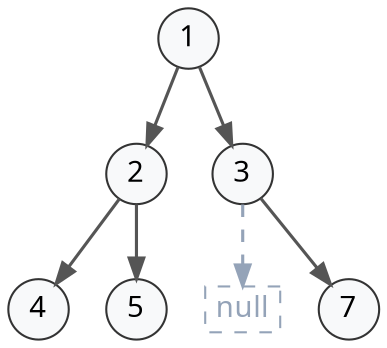
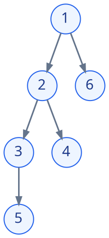

# 4.7 树结构代码题解析——从状态判定到换根模型

这篇文章是一篇解题指导，旨在通过对两道样例题目的深度解析，建立读者对如何解决本章相关题目的认识，架起知识与解题的桥梁。

---

## 4.7.1 Lab 04-E-03：二叉树的完全性检验

题目：给定一棵二叉树的层序序列化输入，判断该二叉树是否为完全二叉树。（完整题面可跳转至 [Lab 04-E-03](../../labs/chapter-04/exercise/E-04-03-complete-binary-tree-check/README.md)）

关键词：层序输入，完全二叉树

### 1. 从层序输入说起

如果没有特殊说明，本章题目大部分输入都是使用层序输入的。

在 [4.3.4 由遍历序列恢复二叉树](./03-binary-tree-traversal.md#_4-3-4-由遍历序列恢复二叉树) 中，我们提到，给定一个层序遍历序列，可以唯一确定一棵**完全（complete）二叉树**。但是，我们不总会遇到题目恰好需要使用完全二叉树的情形。因此，这里给出的层序序列化输入采用了 `null` 记号，意思就是说，对于一般的二叉树，我们把它的空位用 `null` 填上，作为一个占位标记。这样，我们就能在只使用层序序列的情况下唯一建立一棵一般的二叉树了。

下面这段输入就是一段标准的层序序列化输入：

```text
1 2 3 4 5 null 7
```

它表示 1 的左右孩子分别是 2 和 3，2 的左右孩子分别是 4 和 5，3 的左孩子为空（也就是 `null`），右孩子是 7。对应的二叉树结构如下图所示：


<!-- diagram id="level-order-input-tree" caption="含有空节点占位符 null 的层序序列化对应二叉树" -->

### 2. 领养一棵树

在了解了输入的形式以后，接下来我们就可以着手建立二叉树了。虽然加入 `null` 后，我们**能够**像完全二叉树一样根据层序序列确定这棵树，但是它**并不**满足完全二叉树的一些性质，比如说，节点序号之间的关系。因此，不能使用建立真正的完全二叉树时使用的利用序号关系建树的方法。

回忆我们实现层序遍历输出的时候，使用了队列 FIFO 的性质来实现从左到右，从上到下的输出。事实上，只需把输出的操作替换成新建节点的操作，同时维护一个扫描过整个输入数组的下标，就可以实现从左到右，从上到下的节点建立了。

有两个需要注意的点：第一，建立节点时需要注意对 `null` 节点，即空节点的判定，检测到 `null` 的时候不新建节点（即为空）；第二，无论是否为空节点，下标必须 +1，因为空节点在输入的数组中同样占有位置。

它的代码实现如下：

```cpp
TreeNode* buildTree(const vector<string>& input) {
    if (input.empty() || input[0] == "null") {
        return nullptr;
    }
    TreeNode* root = new TreeNode(stoi(input[0]));
    queue<TreeNode*> q;
    q.push(root);
    size_t i = 1;
    while (i < input.size() && !q.empty()) {
        TreeNode* curr = q.front();
        q.pop();
        if (i < input.size() && input[i] != "null") {
            curr->left = new TreeNode(stoi(input[i]));
            q.push(curr->left);
        }
        i++;
        if (i < input.size() && input[i] != "null") {
            curr->right = new TreeNode(stoi(input[i]));
            q.push(curr->right);
        }
        i++;
    }
    return root;
}
```

### 3. 完全二叉树的边界

要想判定一棵树是不是完全二叉树，我们需要仔细思考：完全二叉树到底有什么独一无二的性质？这个性质在含 `null` 的层序遍历中是怎么体现的？这个性质的边界在哪里？

回忆 [4.2.2 完全二叉树的定义](./02-binary-tree.md#_4-2-2-二叉树的特殊形态-满-full-完全-complete-完美-perfect)：

1. 除最后一层外全部填满；
2. 最后一层节点自左向右连续排列。

这两个条件，翻译成层序序列的语言，那就是说：**在层序序列中，一旦出现了第一个 `null`，后续就不能再出现任何非空节点**。换句话说，所有的非空节点和空节点都必须是连续的，不能在非空节点中插入一个空节点。这跟完全二叉树的第二个条件是类似的，但是扩展到了整个序列而不是单指最后一层。

下面这个层序序列就代表了一棵完全二叉树，它的非空节点段结束以后，全都只剩下空节点：

```text
1, 2, 3, 4, null, null, null
```

而前面第 1 节给出的例子序列就不是，因为 5 的下一个节点是 `null`，`null` 的下一个节点又是非空的 7，出现了空节点后又有非空节点。

你可能会好奇，我只是说出现 `null` 之后不能再出现非空节点，那我缺的这个填满在哪啊？事实上，这一条性质就已经保证了最后一层外的每一层都被填满。若不然，假设这一层的最右侧没有被填满，这个地方必然存在空节点，也就是 `null`，而连接到下一层的时候，又出现了非空节点，这就违背了 `null` 之后不能再出现非空节点的性质了。

因此，要想判断一棵树是不是完全二叉树，只需要看它出现 `null` 节点后还会不会出现非空节点就可以了。

### 4. 检验的实现

最容易想到的解法，就是在层序遍历的过程中维护一个 bool 量，在出现 `null` 节点的时候标记为真，假如这个 bool 量已经为真的情况下又遇到了一个非空的节点，就说明序列不符合完全二叉树的性质。反之，假如到遍历结束都没有出现，就说明这个二叉树是完全二叉树。

它的代码实现如下：

```cpp
bool isCompleteTree(TreeNode* root) {
    if (root == nullptr) {
        return true;
    }
    queue<TreeNode*> q;
    q.push(root);
    bool hasseen = false;            // 标记，表示是否已经见过null节点
    while (!q.empty()) {
        TreeNode* curr = q.front();
        q.pop();
        if (curr == nullptr) {         // 见到了null节点
            hasseen = true;
        } else {
            if (hasseen) {           // 见过null节点又见到了非空节点，返回false
                return false;
            } else {
                q.push(curr->left);  // 否则，继续遍历
                q.push(curr->right);
            }
        }
    }
    return true;
}
```

::: warning 易错点提醒
1. **遇到空节点不能直接 `continue`，必须入队作为状态哨兵**：完全二叉树的判定要求将 `nullptr` 正常压入队列。一旦出队遇到首个 `nullptr`，即触发“后续不得再出现任何非空节点”的状态标记。若粗心直接使用 `if (!node) continue;` 跳过，层序中出现的“空洞”会被无视，导致非完全二叉树被误判为合法。
2. **层序反序列化建树时，`null` 必须递增数组下标**：处理类似 `1 2 3 null 5` 序列建树时，扫描指针处理每个孩子都必须自增。遇到 `null` 虽然不创建节点、不入队，但必须消耗输入数组中的占位槽位，否则后续左右子树将完全错位。
:::

### 5. 延伸思考

假如不是检验完全二叉树，而是检验**满（full）二叉树**呢？**完美（perfect）二叉树**呢？

::: details 查看思考分析与参考实现（点击展开）

检验满二叉树简单一些，只需要先序遍历整棵树，查看每个节点是否都有 0 或 2 个节点即可。

```cpp
bool isFullTree(TreeNode* root) {
    // 1. 空树也是 Full
    if (!root) return true;

    // 2. 叶子节点（0 个孩子）：合法
    if (!root->left && !root->right) return true;

    // 3. 两个孩子都在（2 个孩子）：合法，递归检查左右子树
    if (root->left && root->right) {
        return isFullTree(root->left) && isFullTree(root->right);
    }

    // 4. 剩下情况必是“只有一个孩子”（度为 1）：非法！
    return false;
}
```

完美二叉树有几种做法：第一种做法是，你可以先获取树的高度 $h$，然后遍历计算节点数，看节点数是否满足 $2^h - 1$ 个，若满足则为完美二叉树。这个做法最直接，但是速度较慢。

```cpp
int height(TreeNode* root) {
    if (!root) return 0;
    return 1 + std::max(height(root->left), height(root->right));
}

int countNodes(TreeNode* root) {
    if (!root) return 0;
    return 1 + countNodes(root->left) + countNodes(root->right);
}

bool isPerfect2(TreeNode* root) {
    int h = height(root);
    int n = countNodes(root);
    return n == (1 << h) - 1;
}
```

另一种做法是利用递归和剪枝：完美二叉树要求**左右子树自身也必须是完美二叉树，且高度严格相等**。我们可以设计一个返回子树高度的递归函数：若发现子树不合法或左右高度不等，直接返回 `-1` 提前终止（剪枝）；只有两边都合法且高度相同时，才返回真实高度。

这样只需一次遍历，一旦出错立即退出：

```cpp
int check(TreeNode* root) {
    if (!root) return 0;
    int left = check(root->left);
    int right = check(root->right);
    // 任意一侧不合法，或左右高度不等，立即剪枝返回 -1
    if (left == -1 || right == -1 || left != right) return -1;
    return left + 1;
}

bool isPerfectTree(TreeNode* root) {
    return check(root) != -1;
}
```

这种剪枝的思想，我们在学习平衡树的时候会更加深入地了解。

:::

---

## 4.7.2 Lab 04-E-29：网络最优选址

题目：给定一棵带权树，计算以**每个节点**为配送中心时的总运输成本。（完整题面可跳转至 [Lab 04-E-29](../../labs/chapter-04/exercise/E-04-29-network-optimal-location/README.md)）

关键词：带权，树（非二叉树），每个节点

### 1. 邻接表简介

在前面做了一大排二叉树的题目之后看到这里，首先要提醒自己的是，题目给的是一般的树，而不是二叉树，因此，树的表示方法以及建立和我们前面用到的会有所不同。

在 [4.1.3 树的存储结构](./01-tree-basics.md#_4-1-3-树的存储结构) 中，我们学到一般的树可以用孩子表示法来表示，即建立了从父节点到子节点这两个相邻节点的单向联系。假如我们再花一点空间，把子节点到父节点的联系也存起来，实现父子的双向链接，这就是邻接表了。

定义上，邻接表指的是**表示图中与每一个顶点相邻的边集的集合**（参考文献：维基百科邻接表）。就是说，邻接表是用来存储图（graph）的，后面讲图的时候也会再讲到。只不过，树本身就可以被看作是一种图。在图论中，树被看作是**无向、连通、无环的图**，这和我们数据结构中学习到的树的有向性有些差异。

总之，在本题中，我们会用邻接表来表示需要的树。要通过邻接表建立一棵树也很简单。孩子表示法我们用一个一维数组存储孩子，只要把这个数组换成二维，然后父节点存一遍孩子，子节点存一遍父亲，这就形成了双向链接。本题题目多给了一个边的权值，只需要用 `pair` 多存一个数就行。

```cpp
vector<vector<pair<int, int>>> adj;

void creation(int u, int v, int w) {
    adj[u].push_back({v, w});
    adj[v].push_back({u, w});
}
```

### 2. 固定节点的运输成本

题目说，对每一个节点做为配送中心的情形，都要求出它的总运输成本。你的第一反应可能是，对于每个节点，我都去单独算一遍它的总运输成本（不是的话你打我）。

呃这当然是对的，问题我们等会再说。首先我们先来搞定，对于固定的单个节点，它的总运输成本怎么解决。

很显然，如果从根节点出发，一个一个去数每个节点走过了多少条边，计算会有大量的重复。我们之前有没有做过什么题目要处理类似的情况的呢？有的，就是 [4.6.5.2 二叉树最大路径和问题](./06-binary-tree-classic-problems.md#max-path-sum)。在那题中，我们注意到任意一个节点的局部路径和可以由**左子树最大收益 + 右子树最大收益 + 节点值本身**这个公式给出，将整棵树的大问题，分解为了子树的局部汇报。那这道题能不能用类似的思想来化简呢？

既然在那个问题中，我们对每个节点用到了它的左子树和右子树收益两个状态，那对于这题，我们也定义两个状态：

- $sz[u]$：以 $u$ 为根的子树所包含的**节点总数**（包括 $u$ 自身）；
- $subCost[u]$：以 $u$ 为根的子树内部，**所有节点走到 $u$ 的运输成本之和**。

假设父节点 $u$ 有一个子节点 $v$，边 $(u, v)$ 的权值为 $w$。要计算子树 $v$ 中的所有节点到 $u$ 的总运输成本，可以拆分成这两部分：

1. **先到 $v$ 集结**：子树 $v$ 内所有节点发出的货物先各自到达小中转站 $v$，所需要的费用就是 $subCost[v]$；
2. **再从 $v$ 一起到达 $u$**：子树 $v$ 内所有节点发出的货物一起跨过边 $(u, v)$ 到达大中转站 $u$，所需要的费用就是货物总数 $\times$ 边 $(u, v)$ 的权重，即 $sz[v] \times w$。

因此，子节点 $v$ 对父节点 $u$ 的总贡献就是：
$$\text{子树 } v \text{ 的贡献} = subCost[v] + sz[v] \times w$$

对于父节点 $u$ 的所有子节点的贡献，只需要遍历累加其子节点即可：
$$subCost[u] = \sum_{v \in \text{children}(u)} \Big( subCost[v] + sz[v] \times w \Big)$$
$$sz[u] = 1 + \sum_{v \in \text{children}(u)} sz[v]$$

以下面这棵树为例子，我们假设每条边的权值都是 1：


<!-- diagram id="rooted-tree-cost" caption="带权树以节点 1 为临时根时的节点拓扑结构" -->

- **看叶子节点（4、5、6）**：没有子节点，显然 $sz = 1, subCost = 0$。
- **看节点 3**：只有一个孩子 5（$w = 1, sz[5] = 1, subCost[5] = 0$）。
    - $subCost[3] = subCost[5] + sz[5] \times 1 = 0 + 1 \times 1 = 1$
    - $sz[3] = 1 + sz[5] = 2$
- **看节点 2**：有两个孩子 3 和 4（边权均为 1）。
    - 孩子 3 贡献：$subCost[3] + sz[3] \times 1 = 1 + 2 \times 1 = 3$
    - 孩子 4 贡献：$subCost[4] + sz[4] \times 1 = 0 + 1 \times 1 = 1$
    - 合计：$subCost[2] = 3 + 1 = 4$，$sz[2] = 1 + 2 + 1 = 4$
- **看根节点 1**：有两个孩子 2 和 6（边权均为 1）。
    - 孩子 2 贡献：$subCost[2] + sz[2] \times 1 = 4 + 4 \times 1 = 8$
    - 孩子 6 贡献：$subCost[6] + sz[6] \times 1 = 0 + 1 \times 1 = 1$
    - 合计：$subCost[1] = 8 + 1 = 9$

回头验算一下根节点 1 到所有节点的实际距离：

- 到 2 距离为 1；到 6 距离为 1；
- 到 3 距离为 $1 + 1 = 2$；到 4 距离为 $1 + 1 = 2$；
- 到 5 距离为 $1 + 1 + 1 = 3$；
- 总距离为 $1 + 1 + 2 + 2 + 3 = 9$！**完全吻合！**

至此，我们只用一次遍历，就求出了以 1 为中心时的总运输成本。

### 3. 换个中心试试

既然我们已经解决了固定中心的运输成本，接下来就要考虑怎么计算每一个节点做中心时候的运输成本了。我们之前的想法是，对于每个中心，都用一遍上面的方法计算。但是这样做不仅速度慢（需要两重遍历，时间复杂度为 $O(n^2)$），而且还浪费了我们辛辛苦苦算的 $sz[u]$。能不能换个方法？

还是上面那棵树，我们先看看把中心从 1 换到 2 距离有什么变化：
- 对于 2 子树内的节点，本来需要先到 2 聚集再一起走到 1，现在中心就在 2，不需要再走到 1 了，节省了 $sz[2] \times 1 = 4$ 的距离；
- 而对于不在 2 子树内的节点（1 和 6，共 $6 - sz[2] = 2$ 个点），就需要先走到 1，再到 2，多走了一段边 $(1, 2)$ 的距离，也就是增加了 $(6 - sz[2]) \times 1 = 2$ 的距离。

因此，总共的距离变化量就是：
$$\Delta = (6 - sz[2]) \times 1 - sz[2] \times 1 = 6 - 2 \times sz[2] = 6 - 8 = -2$$
以 2 为中心的新总距离就是：
$$totalCost[2] = totalCost[1] + (6 - 2 \times sz[2]) \times 1 = 9 - 2 = 7$$

推广到一般情况，假设当前中心为父节点 $u$，相邻子节点为 $v$，边 $(u, v)$ 权重为 $w$。当中心从 $u$ 转移到 $v$ 时：
$$totalCost[v] = totalCost[u] + (n - 2 \times sz[v]) \times w$$

也就是说，我把中心往相邻的节点搬，得到的新节点为中心的运输成本是一个只关于 $totalCost[u]$、$sz[v]$ 和权重 $w$ 的 $O(1)$ 公式。那我只需要从前面计算的那个节点开始，把中心挨个搬满整棵树，不就可以复用前面已经算好了的 $sz[v]$ 和 $subCost[u]$，从而大大简化计算了吗？

### 4. 代码实现

我们已经明确了固定节点为中心的运输成本计算和更换中心后的运输成本计算，接下来来看它们的具体代码实现。

```cpp
#include <vector>
#include <utility>

class NetworkOptimizer {
    using ll = long long;

private:
    int n;
    std::vector<std::vector<std::pair<int, int>>> adj; // 配送路线图：{目标仓库, 单位运输成本 w}
    std::vector<int> sz;                               // sz[u]：以 u 为根的子树所辖仓库总数
    std::vector<ll> subCost;                           // subCost[u]：辖区内所有仓库运到中转点 u 的内部总成本
    std::vector<ll> totalCost;                         // totalCost[u]：以 u 为全国配送中心时的全网总运输成本

    // 第一次 DFS（自底向上）：汇总辖区仓库规模与内部运输成本
    void dfs1(int u, int parent) {
        sz[u] = 1;       // 包含仓库 u 自身
        subCost[u] = 0;

        for (const auto& [v, w] : adj[u]) {
            if (v == parent) continue; // 防走回头路
            dfs1(v, u);

            sz[u] += sz[v];
            // 内部集结费 (subCost[v]) + 该路段全员过路费 (sz[v] * w)
            subCost[u] += subCost[v] + (ll)sz[v] * w;
        }
    }

    // 第二次 DFS（自顶向下）：换根推导每个候选配送中心的全网总成本
    void dfs2(int u, int parent) {
        for (const auto& [v, w] : adj[u]) {
            if (v == parent) continue;

            // 换根公式：配送中心由 u 迁至相邻仓库 v 时：
            // 辖区 v 内的 sz[v] 个仓库运输成本各减 w，辖区外的 (n - sz[v]) 个仓库成本各加 w
            totalCost[v] = totalCost[u] + (ll)(n - 2 * sz[v]) * w;
            dfs2(v, u);
        }
    }

public:
    explicit NetworkOptimizer(int n)
        : n(n), adj(n + 1), sz(n + 1, 0), subCost(n + 1, 0), totalCost(n + 1, 0) {}

    // 铺设双向运输道路：连接仓库 u 和 v，单位成本为 w
    void addEdge(int u, int v, int w) {
        adj[u].push_back({v, w});
        adj[v].push_back({u, w});
    }

    // 计算以每个仓库为配送中心时的总成本（返回 1-indexed 数组）
    std::vector<ll> solve() {
        if (n <= 1) {
            return totalCost; // 只有一个仓库时，自身配送成本为 0
        }
        // 1. 先以 1 号仓库为临时根，后序汇总子树成本
        dfs1(1, 0);
        // 2. 1 号仓库管辖了全国所有仓库，直接作为换根起点
        totalCost[1] = subCost[1];
        // 3. 自顶向下换根推导，一次遍历算出所有候选中心的总成本
        dfs2(1, 0);
        return totalCost;
    }
};
```

其中 `if (v == parent) continue;` 这句话是因为，邻接表是没有方向的，我们只想遍历节点 $u$ 的子节点，但邻居中也包含了 $u$ 的父节点，这时候不能算进去，而是要跳过。

还有一个小细节：两次 DFS 递归的时机并不一样：第一次 DFS 在计算当前节点的 $sz$ 和 $subCost$ 之前递归，因为要想计算当前节点的 $sz$ 和 $subCost$，必须先获取子树的相应数据（自底向上 / 后序）；而第二次 DFS 在换根之后递归，是因为我们需要先算好当前节点的数据，才能递归传递给它相邻的节点（自顶向下 / 先序）。

**复杂度分析**：
- **时间复杂度**：$O(n)$。建图与两次 DFS 都只遍历整棵树一次，换根计算仅需 $O(1)$，相比暴力遍历的 $O(n^2)$ 大幅优化。
- **空间复杂度**：$O(n)$。主要用于存储邻接表、状态数组以及递归调用栈（最坏退化为单链时栈深为 $O(n)$）。

::: warning 易错点提醒
1. **无向邻接表必须携带 `parent` 参数防死循环爆栈**：由于无向树的邻接表中父子互为邻居，DFS 遍历邻居时必须判断 `if (v == parent) continue;`。若遗漏该判断，递归将在父子两点间来回死循环，导致栈溢出（Segmentation Fault）。
2. **路径权值累加与乘法必须全程使用 64 位整型**：本题数据规模 $n \le 10^5$，边权 $w \le 10^4$。在链状退化树的最坏情况下，全网距离累加可达 $O(n^2 \cdot w) \approx 10^{14}$，远超 32 位 `int`（约 $2 \times 10^9$）上限。状态数组必须开 `long long`，中间乘法也必须显式转换为 64 位 `(ll)sz[v] * w`，否则高位截断会导致算出的答案为负数。
:::

### 5. 延伸思考与变式

#### 1. 变式探讨：真正的“最佳选址”与树的重心（Tree Centroid）
本题计算了每一个节点作为中心的总运输成本。如果题目进一步要求：**“选出运输成本最小的最佳物流中心；若有多个，输出编号最小者”**，我们应该怎么做？
- **实现方法**：在 `solve()` 计算完成后，直接遍历 `totalCost[1...n]` 打擂台求最小值及其对应的最小下标即可。
- **理论引申**：在所有边权均为 1 的无权树中，使全树距离之和最小的点，在图论中恰好被称为**树的重心（Tree Centroid）**——即删除该节点后，所分裂出的所有连通块中，最大连通块的节点数最小（不超过 $\lfloor n/2 \rfloor$）。寻找树的重心甚至不需要二次换根，只需在 `dfs1` 自底向上回溯时，判断断开该点后各子树及上方连通块的大小即可。

#### 2. 知识串联：通往本章挑战题的“通用骨架”
许多同学刷完二叉树后，看到习题末尾的多叉树挑战题往往无从下手。其实，我们在本题中建立的“**邻接表存储 + 带 parent 的无向树 DFS + 子树规模 sz 统计**”，正是解决本章后续压轴挑战题的通用底座：
- **[Lab 04-E-28 科研团队组建](../../labs/chapter-04/exercise/E-04-28-research-team-formation/README.md)**：在树上做有依赖的背包 DP，利用本题算出的子树大小 $sz[u]$ 控制背包容量上界，是实现复杂度从 $O(n \cdot k^2)$ 剪枝优化到 $O(n \cdot k)$ 的核心技巧。
- **[Lab 04-E-30 通信基站选址](../../labs/chapter-04/exercise/E-04-30-communication-base-station/README.md)**：在多叉树上求解最小支配集，同样依靠这套后序遍历自底向上汇聚覆盖状态并进行状态机贪心。
- **[Lab 04-E-31 树的同构判定](../../labs/chapter-04/exercise/E-04-31-tree-isomorphism/README.md)**：多叉无根树的同构检验，正是通过无根树 DFS 收集所有子树特征进行树哈希排序。

---

## 4.7.3 本章代码题分层训练路线

为了帮助大家循序渐进地掌握本章 31 道练习题，建议按照以下**由浅入深、由二叉树到多叉树**的四阶梯路线进行训练：

| 训练阶段 | 核心目标 | 推荐题号与题目 |
| :--- | :--- | :--- |
| **第一阶：二叉树基础与多叉表示** | 掌握二叉树性质、孩子兄弟链表及基础遍历 | **04E01**（叶子统计）、**04E02**（树高）、**04E03**（完全性检验）、**04E04**（最小深度）、**04E05**（合并二叉树）、**04E06**（左叶子之和） |
| **第二阶：遍历进阶与线索树** | 掌握迭代遍历、层序变式、序列恢复与线索化 | **04E07~04E12**（迭代遍历/层序/视图/叶子相似）、**04E13~04E14**（前序+中序/中序+后序建树）、**04E15~04E16**（中序线索化与后继查找） |
| **第三阶：森林转换与树上路径** | 攻克森林转换，掌握自底向上的树形路径分析 | **04E17~04E18**（森林与二叉树互转）、**04E19**（后根遍历）、**04E20~04E22**（最大宽度/对称树/展开链表）、**04E23~04E27**（路径总和/坡度/祖先LCA/直径/交错路径） |
| **第四阶：多叉图论与树形 DP（挑战）** | 从二叉指针跨越至邻接表图论遍历与高阶树形 DP | **04E29**（网络选址/换根 DP）、**04E28**（科研团队/树上背包）、**04E30**（基站选址/支配集）、**04E31**（树的同构判定） |
