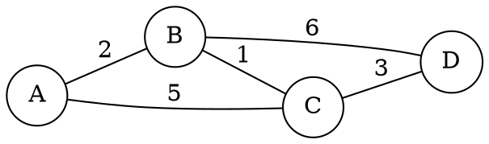

# 5.3 最小生成树与最短路径

连通无向图的**最小生成树**（MST）是包含全部顶点的无环连通子图，且边权总和最小；**单源最短路径**（SSSP）求从一个源点到所有顶点的最短路径。两者都是贪心算法的典型应用，但贪心策略与正确性论证不同。

## 学习目标

- 实现 Prim 与 Kruskal 算法，分析各自复杂度；
- 论证"切分定理"为什么保证贪心正确；
- 实现 Dijkstra 并说明其正确性为什么要求非负权；
- 说出何时选择哪种算法。

下面的带权图用于手算 Prim、Kruskal 或 Dijkstra。边权是非负的，因此可以用 Dijkstra；从 `A` 出发时，`A-B-C-D` 的路径权值为 `6`。


<!-- diagram id="graph-weighted-example" caption: "带非负权边的图：可用于最短路径与生成树练习" -->

## Prim 算法

从任意顶点开始，维护一棵逐渐生长的树：每一步选择**连接树内与树外**的最小权边，把新顶点并入树，直到覆盖全部顶点。以邻接矩阵或距离数组实现时：

$$
T(n) = O(n^2),
$$

朴素版本每次找最小 `O(n)`、共 `n` 轮；用堆优化可降到 $O((n + m) \log n)$，但稠密图上朴素版本反而更好。

**正确性（切分定理）**：对任意把顶点分成 `S` 与 `V-S` 的切分，跨越切分的最小权边必然属于某棵 MST。Prim 每一步选的都是跨越"树内外"切分的最小边，归纳成立。

## Kruskal 算法

把所有边按权值排序，从小到大逐条考虑：若边的两个端点尚不在同一连通分量，就加入并合并（用并查集维护连通性）。排序 $O(m \log m)$，并查集操作近似 `O(1)`，总复杂度 $O(m \log m)$——稀疏图明显优于 Prim 的 $O(n^2)$。

```cpp:line-numbers [kruskal.cpp]
int kruskal(const std::vector<Edge>& edges, int n) {
    sort(edges.begin(), edges.end());      // 按权值升序
    DSU dsu(n);
    int total = 0;
    for (auto [u, v, w] : edges) {
        if (dsu.find(u) != dsu.find(v)) {  // 不成环才加入
            dsu.unite(u, v);
            total += w;
        }
    }
    return total;                          // 前提：图连通
}
```

## Dijkstra 算法

维护 `dist[]`，每次从**未确定**顶点中选 `dist` 最小的（堆顶），"确定"它，并用它的边松弛邻居：

$$
dist[v] = \min(dist[v],\; dist[u] + w(u, v)).
$$

堆优化版本的复杂度为 $O((n + m) \log n)$。正确性依赖：一旦顶点出堆，它的 `dist` 就是最终最短距离——**这要求边权非负**，否则后发现的负权边可以继续缩短已确定的距离。

::: warning Dijkstra 不能处理负权边
图中有负权边时 Dijkstra 会给出错误结果。负权图需要使用 Bellman-Ford（`O(nm)`）或其他算法。判断"能否用 Dijkstra"时，先检查权值非负。
:::

## 算法选择

| 场景 | 推荐 | 复杂度 |
| --- | --- | --- |
| 稠密图 MST | Prim 朴素版 | $O(n^2)$ |
| 稀疏图 MST | Kruskal | `O(m log m)` |
| 稀疏图最短路径 | Dijkstra + 堆 | `O((n + m) log n)` |
| 稠密图最短路径 | Dijkstra 朴素版 | $O(n^2)$ |
| 存在负权边 | Bellman-Ford | `O(nm)` |

## 小结

三个算法共享"贪心"的外衣，但正确性论证各不相同：Prim 与 Kruskal 靠切分定理与环性质，Dijkstra 靠非负权下的三角不等式。选算法时先看图的表示（稠密/稀疏）与权值约束，再定实现。

## 练习

1. 为什么 Kruskal 需要并查集？不用会怎样？
2. 对一张 4 顶点的图手算 Prim 与 Kruskal，比较两者选边的顺序。
3. Dijkstra 在负权图上出错的具体例子是什么？画出图并给出错误 dist。
4. 所有边权相等的图：MST 有多少棵？Prim 与 Kruskal 会选同一棵吗？
5. 为什么堆优化 Dijkstra 中"已确定"的顶点可以跳过松弛？
