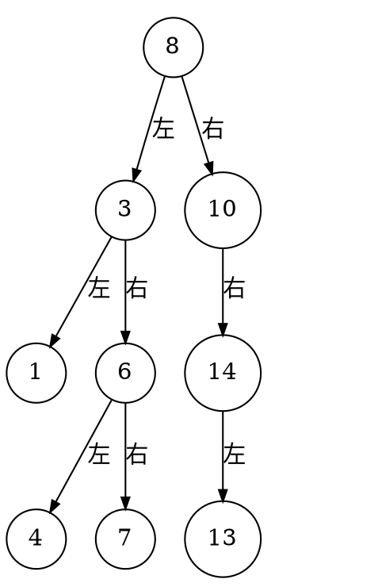
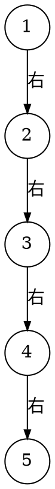
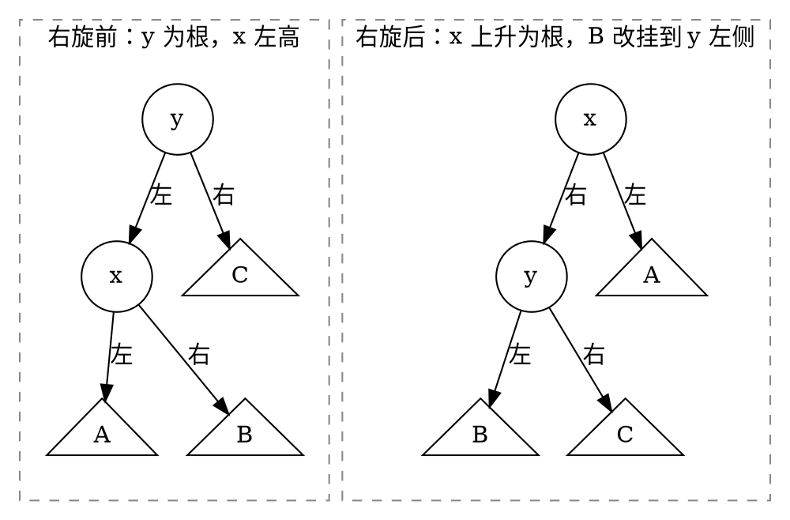
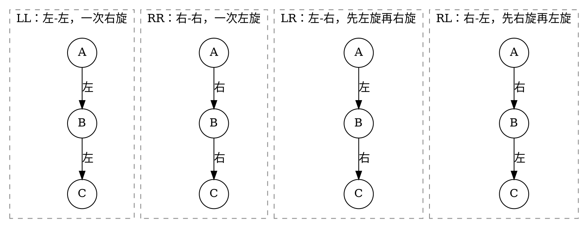
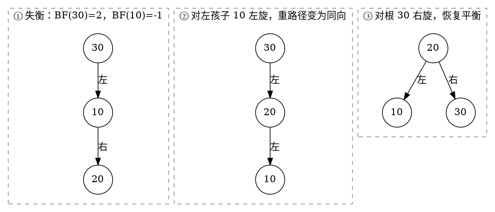

# 5.1 二叉搜索树与平衡

普通二叉树没有规定关键字应放在哪里，查找一个值往往要遍历整棵树。二叉搜索树把“比较结果”变成方向：小值向左，大值向右；AVL 树再通过旋转控制高度，让这种方向选择始终有效。

## 学习目标

- 准确陈述二叉搜索树的不变量，并完成查找、插入、删除；
- 区分前驱、后继与父子关系，解释删除双孩子节点的替换策略；
- 用树高 $h$ 推导 BST 操作复杂度，并构造退化反例；
- 理解旋转只改变局部形态、不改变中序次序；
- 识别 AVL 的 LL、RR、LR、RL 四类失衡，完成插入和删除后的再平衡；
- 阅读并解释一份维护高度与所有权的 C++ AVL 核心实现。

## 5.1.1 二叉搜索树：定义、有序性质、查找、插入、删除（含前驱/后继）

### 定义与有序不变量

::: definition 定义 · 二叉搜索树
一棵<dfn>二叉搜索树</dfn>（Binary Search Tree，BST）或者为空，或者对每个节点 `x` 都满足：

- `x` 左子树中的每个关键字都小于 `x.key`；
- `x` 右子树中的每个关键字都大于 `x.key`；
- 左右子树本身也都是二叉搜索树。

本页采用“关键字互异”的接口约定。若业务允许重复键，必须额外规定重复值统一放一侧，或在节点中维护计数；不能让不同操作各用一套规则。
:::

::: property 性质 · 中序序列有序
对关键字互异的 BST 做中序遍历，得到严格递增序列。反过来，若一次结构修改破坏了中序递增性，它就不再是合法 BST。
:::

例如，把 `8, 3, 10, 1, 6, 14, 4, 7, 13` 依次插入空树：


<!-- diagram id="bst-example-tree" caption: "示例 BST：每个节点的左子树全部更小、右子树全部更大" -->

中序遍历为 `1, 3, 4, 6, 7, 8, 10, 13, 14`。

### 查找与插入

查找从根开始：目标小于当前关键字就进入左子树，大于就进入右子树，相等则成功。插入执行同样的比较，直到遇到空链接，再把新节点接到那里。沿途不需要访问另一侧子树。

```cpp:line-numbers [bst-search-insert.cpp]
struct Node {
    int key;
    Node* left{};
    Node* right{};
};

Node* search(Node* root, int key) {
    while (root != nullptr && root->key != key) {
        root = key < root->key ? root->left : root->right;
    }
    return root;
}

bool insert(Node*& root, int key) {
    Node** link = &root;
    while (*link != nullptr) {
        if (key == (*link)->key) {
            return false;  // 本实现拒绝重复键
        }
        link = key < (*link)->key ? &(*link)->left : &(*link)->right;
    }
    *link = new Node{key};
    return true;
}
```

`Node** link` 指向“将被更新的指针槽位”，因此插入根节点和插入普通孩子可以使用同一段逻辑。真实工程还需要用 RAII 管理内存；这里先突出查找路径。

### 前驱与后继

对某个已存在节点 `x`：

- <dfn>前驱</dfn>是严格小于 `x.key` 的最大关键字；
- <dfn>后继</dfn>是严格大于 `x.key` 的最小关键字。

若 `x` 有左子树，前驱就是左子树中最靠右的节点；若有右子树，后继就是右子树中最靠左的节点。没有相应子树时，需要沿父链接向上，找到第一次从右孩子方向（求前驱）或左孩子方向（求后继）进入的祖先。若节点不保存父指针，也可以从根重新搜索并沿途记录候选者。

在上图中，`8` 的前驱是 `7`，后继是 `10`；`10` 没有左子树，它的前驱是向上找到的祖先 `8`。

### 删除的三种结构情况

删除必须同时满足两个目标：目标关键字消失，剩余节点的中序次序不变。

1. **叶节点**：直接断开。
2. **只有一个孩子**：用唯一孩子顶替目标节点的位置。
3. **有两个孩子**：用中序后继（右子树最小值）或前驱（左子树最大值）替换目标关键字，再删除那个至多只有一个孩子的替身节点。

::: example 示例 · 删除双孩子节点 `3`
上图中 `3` 的后继是 `4`。先把节点 `3` 的关键字改为 `4`，再删除原来位于 `6` 左侧的节点 `4`。替换前后的中序序列只少了 `3`，其他相对顺序不变。
:::

::: pitfall 易错点 · 复制关键字不等于复制整棵子树
删除双孩子节点时只把前驱或后继的“记录内容”移到目标位置，再在原位置删除替身。直接把替身节点指针覆盖到目标位置，若没有同时重接原左右子树，很容易丢失节点、制造重复所有权或破坏链接。
:::

## 5.1.2 二叉搜索树的实现、复杂度与退化【C/C++】

### 所有核心操作都受树高控制

设树高按边数记为 $h$。查找、插入和删除只沿一条根到节点的路径移动，删除双孩子节点时再沿一条子树边界寻找前驱或后继，因此：

::: complexity 复杂度 · 普通 BST
| 操作 | 时间 | 额外空间 |
| --- | --- | --- |
| 查找、插入、删除 | $O(h)$ | 迭代为 $O(1)$；递归为 $O(h)$ |
| 找最小/最大、前驱/后继 | $O(h)$ | 同上 |
| 完整中序遍历 | $\Theta(n)$ | 递归栈 $O(h)$ |

若树形接近平衡，$h=\Theta(\log n)$；若退化成链，$h=n-1$，单次操作变为 $\Theta(n)$。因此“BST 查找是 $O(\log n)$”只有在树高受控或随机形态假设成立时才准确。
:::

### 退化怎样发生

把 `1, 2, 3, 4, 5` 按递增顺序插入空 BST：


<!-- diagram id="bst-degenerate" caption: "递增插入使每个新节点都挂在右侧，树退化成与单链表等价的形态" -->

这棵树的结构与单链表相同。查找 `5` 要比较 5 次；若继续插入递增数据，第 $n$ 次插入也要走过接近 $n$ 个节点。

::: counterexample 反例 · 有序不等于高效
上面的退化树仍完全满足 BST 有序性质，中序序列也正确。问题不是“树错了”，而是有序不变量没有对高度作任何保证。仅检查中序递增，无法证明性能达标。
:::

### C++：用唯一所有权实现删除

下面的删除函数使用 `std::unique_ptr` 表达“父节点独占孩子”的所有权。返回值始终是删除后子树的新根，因此叶删除、单孩子顶替和根节点变化都能统一处理。

```cpp:line-numbers [bst-erase.cpp]
#include <memory>

struct BstNode {
    explicit BstNode(int value) : key(value) {}
    int key;
    std::unique_ptr<BstNode> left;
    std::unique_ptr<BstNode> right;
};

const BstNode& minimum(const BstNode& root) {
    const BstNode* current = &root;
    while (current->left) {
        current = current->left.get();
    }
    return *current;
}

std::unique_ptr<BstNode> erase(std::unique_ptr<BstNode> root, int key) {
    if (!root) {
        return nullptr;
    }
    if (key < root->key) {
        root->left = erase(std::move(root->left), key);
    } else if (key > root->key) {
        root->right = erase(std::move(root->right), key);
    } else {
        if (!root->left) {
            return std::move(root->right);
        }
        if (!root->right) {
            return std::move(root->left);
        }
        root->key = minimum(*root->right).key;
        root->right = erase(std::move(root->right), root->key);
    }
    return root;
}
```

递归深度仍为 $O(h)$。若普通 BST 可能接收恶意有序输入，退化深度还会带来调用栈风险；这正是平衡树要解决的问题。

## 5.1.3 平衡的思想与旋转操作

### 平衡不是让两边节点数完全相等

平衡策略的目标是控制树高，使根到任意叶的路径不会过长。不同平衡树使用不同约束：AVL 限制每个节点的左右子树高度差，红黑树限制颜色路径，B 树限制每个节点的关键字数量。这里先看 AVL 的局部修复工具——旋转。

::: definition 定义 · 旋转
旋转是在保持 BST 中序次序不变的前提下，重新连接一个节点、它的孩子和中间子树的局部操作。一次旋转只改常数个链接，时间为 $\Theta(1)$。
:::

右旋前后：


<!-- diagram id="avl-right-rotation" caption: "右旋让 x 上升、y 下降，中间子树 B 从 x 的右侧改挂到 y 的左侧；两侧中序均为 A, x, B, y, C" -->

旋转前后的中序序列都是 `A, x, B, y, C`。左旋是完全对称的操作：当 `y` 的右孩子 `x` 上升时，`x` 的左子树成为 `y` 的右子树。

::: property 性质 · 为什么旋转保持有序
旋转前有 `A < x < B < y < C`。旋转只重新分配 `x`、`y` 与中间子树 `B` 的父子关系，没有改变这五个区间的相对顺序，因此中序序列不变。
:::

每次旋转后必须自底向上更新受影响节点的高度。右旋时先更新下降的 `y`，再更新上升的 `x`；顺序反过来会读取旧高度。

## 5.1.4 AVL 树：平衡因子、四种失衡与单/双旋转、插入、删除【进阶】

### 平衡因子与 AVL 不变量

::: definition 定义 · AVL 树
AVL 树是满足 BST 有序性质，并且每个节点 `v` 都满足

$$
\operatorname{BF}(v)
=\operatorname{height}(v.left)-\operatorname{height}(v.right)
\in\{-1,0,1\}
$$

的二叉搜索树。本页约定空树高度为 $-1$，叶节点高度为 $0$。
:::

插入或删除只会改变搜索路径上节点的高度。回溯时找到 `|BF| > 1` 的节点，再根据“重的一侧内部又偏向哪边”选择旋转。

### 四种失衡

| 失衡类型 | 最低新节点/重路径 | 局部特征 | 修复 |
| --- | --- | --- | --- |
| LL | 左孩子的左侧 | `BF(root)=2` 且 `BF(left)>=0` | 对根右旋 |
| RR | 右孩子的右侧 | `BF(root)=-2` 且 `BF(right)<=0` | 对根左旋 |
| LR | 左孩子的右侧 | `BF(root)=2` 且 `BF(left)<0` | 先左旋左孩子，再右旋根 |
| RL | 右孩子的左侧 | `BF(root)=-2` 且 `BF(right)>0` | 先右旋右孩子，再左旋根 |

四种失衡的重路径形态如下。把从失衡根出发的两段方向连起来读，就是类型名称：


<!-- diagram id="avl-four-imbalances" caption: "四类失衡由失衡根向下的两段方向命名：同向的 LL 与 RR 用一次旋转，异向的 LR 与 RL 需要两次" -->

::: example 示例 · LR 双旋
依次插入 `30, 10, 20`：`30` 左侧过高，但新节点 `20` 位于左孩子 `10` 的**右**侧，属于 LR 型。单次右旋无法修复——`20` 会从 `10` 的右侧原样搬到 `30` 的左侧，重路径依然是折线。正确做法是先把折线“掰直”，再整体旋转：


<!-- diagram id="avl-lr-double-rotation" caption: "LR 双旋两步：先对左孩子左旋把折线拉成同向的 LL，再对根右旋完成修复" -->

第 ② 步之后重路径变成 `30 → 20 → 10` 的连续向左，正是 LL 型，因此第 ③ 步用一次右旋即可收尾。最终根为 `20`，左右孩子分别是 `10` 和 `30`，三个节点的 `BF` 全为 `0`。
:::

### 插入后的再平衡

AVL 插入先按 BST 规则把新节点接到叶位置，再沿递归返回路径更新高度与再平衡。对一次插入，从最低失衡点完成恰当旋转后，该局部子树高度恢复到插入前水平；继续向上仍要更新高度，但不会再产生新的插入失衡。

### 删除后的再平衡

AVL 删除先执行 BST 删除。与插入不同，删除可能让子树高度减少；一次旋转后，修复后的子树高度还可能继续下降，因此==必须一路检查到根==，不能修复第一个失衡点就停止。

删除判断还要允许重孩子的平衡因子为 `0`。例如根左侧过高且左孩子 `BF=0` 时，仍使用 LL 型右旋；若机械套用“新节点插入方向”，会漏掉删除特有情形。

::: pitfall 易错点 · 类型名称描述路径，不描述旋转方向
LL 失衡使用一次**右旋**，RR 失衡使用一次**左旋**。名称表示重路径从失衡根出发走向哪两个方向，不是要执行的旋转方向。
:::

## 5.1.5 AVL 树的实现与复杂度【C/C++】

下面的 C++ 核心实现把高度维护、单旋和双旋统一放在 `rebalance` 中。`insert` 与 `erase` 只负责 BST 语义，返回前都经过同一再平衡出口。

```cpp:line-numbers [avl-tree.cpp]
#include <algorithm>
#include <memory>

struct AvlNode {
    explicit AvlNode(int value) : key(value) {}
    int key;
    int height{0};
    std::unique_ptr<AvlNode> left;
    std::unique_ptr<AvlNode> right;
};

int height(const std::unique_ptr<AvlNode>& node) {
    return node ? node->height : -1;
}

void update(AvlNode& node) {
    node.height = 1 + std::max(height(node.left), height(node.right));
}

int balanceFactor(const AvlNode& node) {
    return height(node.left) - height(node.right);
}

std::unique_ptr<AvlNode> rotateRight(std::unique_ptr<AvlNode> root) {
    auto pivot = std::move(root->left);
    root->left = std::move(pivot->right);
    update(*root);                  // 先更新下降节点
    pivot->right = std::move(root);
    update(*pivot);
    return pivot;
}

std::unique_ptr<AvlNode> rotateLeft(std::unique_ptr<AvlNode> root) {
    auto pivot = std::move(root->right);
    root->right = std::move(pivot->left);
    update(*root);
    pivot->left = std::move(root);
    update(*pivot);
    return pivot;
}

std::unique_ptr<AvlNode> rebalance(std::unique_ptr<AvlNode> root) {
    update(*root);
    if (balanceFactor(*root) > 1) {
        if (balanceFactor(*root->left) < 0) {           // LR
            root->left = rotateLeft(std::move(root->left));
        }
        return rotateRight(std::move(root));             // LL
    }
    if (balanceFactor(*root) < -1) {
        if (balanceFactor(*root->right) > 0) {           // RL
            root->right = rotateRight(std::move(root->right));
        }
        return rotateLeft(std::move(root));              // RR
    }
    return root;
}

std::unique_ptr<AvlNode> insert(std::unique_ptr<AvlNode> root, int key) {
    if (!root) {
        return std::make_unique<AvlNode>(key);
    }
    if (key < root->key) {
        root->left = insert(std::move(root->left), key);
    } else if (key > root->key) {
        root->right = insert(std::move(root->right), key);
    } else {
        return root;                                    // 拒绝重复键
    }
    return rebalance(std::move(root));
}

const AvlNode& minimum(const AvlNode& root) {
    const AvlNode* current = &root;
    while (current->left) current = current->left.get();
    return *current;
}

std::unique_ptr<AvlNode> erase(std::unique_ptr<AvlNode> root, int key) {
    if (!root) return nullptr;
    if (key < root->key) {
        root->left = erase(std::move(root->left), key);
    } else if (key > root->key) {
        root->right = erase(std::move(root->right), key);
    } else {
        if (!root->left) return std::move(root->right);
        if (!root->right) return std::move(root->left);
        root->key = minimum(*root->right).key;
        root->right = erase(std::move(root->right), root->key);
    }
    return rebalance(std::move(root));
}
```

::: complexity 复杂度 · AVL 操作
AVL 树的最少节点数满足类似斐波那契的递推，因此高度为 $O(\log n)$。查找、插入、删除都只访问一条根到叶路径：

- 查找：$O(\log n)$；
- 插入：$O(\log n)$，旋转次数为常数级；
- 删除：$O(\log n)$，可能在多个祖先处旋转；
- 单次旋转：$\Theta(1)$；
- 递归辅助空间：$O(\log n)$；节点与高度字段总空间为 $O(n)$。
:::

### 实现自检不变量

每次公开操作后至少验证：

1. 中序序列严格递增；
2. 每个节点保存的高度等于 `1 + max(left, right)`；
3. 每个节点 `abs(balanceFactor) <= 1`；
4. 节点数与成功插入、删除记录一致；
5. 空树、单节点、根删除、连续递增插入和交替插删均不泄漏或重复拥有节点。

## 配套 Lab

| 实验 | 练习内容 |
| --- | --- |
| [BST 插入与查找](../../labs/chapter-05/exercise/E-05-01-bst-insert-search/README.md) | 沿比较方向下降，在空链接处接入新节点 |
| [BST 删除](../../labs/chapter-05/exercise/E-05-02-bst-delete/README.md) | 三种结构情况，尤其是双孩子节点的替身选择 |
| [验证 BST 先序序列](../../labs/chapter-05/exercise/E-05-03-validate-bst-preorder/README.md) | 用区间约束判断序列能否还原为合法 BST |
| [BST 第 k 小元素](../../labs/chapter-05/exercise/E-05-04-bst-kth-smallest/README.md) | 利用中序有序性，避免全量排序 |
| [AVL 插入与平衡](../../labs/chapter-05/exercise/E-05-05-avl-tree-insert/README.md) | 四类失衡的识别与单/双旋转实现 |

## 小结与自测

BST 用全序关系缩小查找范围，但性能仍由树高决定；AVL 在每次更新后用局部旋转恢复高度约束。旋转之所以安全，是因为它保持中序次序；旋转之所以高效，是因为只修改常数个链接。

1. 在示例 BST 中分别求 `6` 的前驱和后继；若删除 `6`，可选哪个节点替换？
2. 为什么递增插入得到的树仍是合法 BST，却不能保证 $O(\log n)$ 查找？
3. 依次插入 `50, 30, 40` 会产生哪类 AVL 失衡？画出两次旋转。
4. 为什么 AVL 删除可能一路向根继续旋转，而插入通常只需修复最低失衡点？
5. 若把高度约定改为“空树 0、叶节点 1”，哪些代码和公式要改，哪些判断不变？

::: details 查看自测答案
1. 示例 BST 的中序序列是 `1, 3, 4, 6, 7, 8, 10, 13, 14`。`6` 的前驱是**左子树中的最大值 `4`**，后继是**右子树中的最小值 `7`**。删除 `6` 时它有两个孩子，用前驱 `4` 或后继 `7` 顶替都可以：这两个值恰好是中序序列中 `6` 的紧邻元素，用它们替换不会破坏中序递增性。
2. 递增插入时每个新键都大于已有全部键，因而一路走右链接，最终形成只有右孩子的链。它仍满足“左子树 < 根 < 右子树”（左子树全为空，条件平凡成立），中序序列也正确，所以是合法 BST。但 BST 的有序不变量只约束**顺序**，对**高度**不作任何保证；此时树高为 $n-1$，查找退化为 $O(n)$。这正是需要额外平衡约束的原因。
3. 依次插入后，`50` 为根、`30` 为其左孩子、`40` 为 `30` 的右孩子。节点 `50` 的 $BF = h(\text{左}) - h(\text{右}) = 1 - (-1) = 2$，失衡且“左子树重、左子树内部右偏”，属于 **LR 型**，需要两次旋转：
   - 第 ① 步，对左孩子 `30` **左旋**，得到 `50 → 40 → 30` 的连续向左路径，问题转化为 LL 型；
   - 第 ② 步，对失衡点 `50` **右旋**，`40` 上升为根，`30` 与 `50` 成为它的左右孩子。
   最终形态为根 `40`、左 `30`、右 `50`，高度从 2 降为 1。
4. 关键差别在于**修复后子树的高度是否回到原状**。插入时，从最低失衡点完成恰当旋转后，该局部子树的高度恢复到插入前的水平，因此所有祖先的平衡因子都不再改变，一次旋转即可收工。删除则可能让子树高度**减少** 1，旋转修复后高度仍可能比原来低，于是父节点的平衡因子随之变化并可能产生新的失衡，必须一路检查到根。
5. 需要改的是**基准值**，不需要改的是**相对关系**：
   - 要改：空链接的哨兵返回值由 $-1$ 改为 $0$（`height()` 中的 `: -1`）；新节点的初值 `height{0}` 改为 `1`；所有把高度数值与节点数直接挂钩的公式整体平移 1。
   - 不变：`update()` 中的 `1 + max(left, right)` 递推形式；`balanceFactor()` 及其 `|BF| > 1` 的判定——因为平衡因子是两个高度的**差**，两者同时加 1 后差值不变；四种失衡类型的判别与旋转代码；$O(\log n)$ 的渐近结论。
:::

下一节进入[5.2 堆与优先队列](./02-heap-and-priority-queue.md)：它不维护完整排序，而是用更弱的局部偏序换取高效的最高优先级访问。
