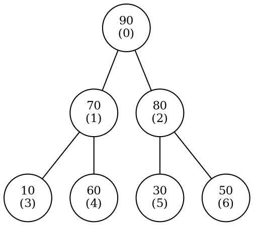

# 5.2 堆与优先队列

若任务只要求“反复取出当前最大值”，把所有元素完全排序往往做了多余工作。堆只维护父子之间的局部偏序：根保证是全局极值，其他元素不必排成完整顺序。这个更弱的不变量，正好支撑优先队列。

## 学习目标

- 准确定义大根堆、小根堆，并写出 0-based 数组的父子下标公式；
- 实现上浮、下沉、插入和删除堆顶，说明各自为什么保持堆序；
- 区分逐个插入建堆与自底向上 Heapify，推导后者的 $O(n)$ 时间；
- 解释堆排序的时间、空间和稳定性；
- 使用 `std::priority_queue` 表达最大/最小优先队列；
- 根据保留元素数量选择 Top-K、多路归并和任务调度方案。

## 5.2.1 堆的定义与数组表示（含父/子下标关系）

### 局部偏序性

::: definition 定义 · 二叉堆
<dfn>二叉堆</dfn>是一棵满足完全二叉树形态，并满足堆序性质的二叉树：

- 大根堆（max-heap）：每个节点的关键字不小于其孩子；
- 小根堆（min-heap）：每个节点的关键字不大于其孩子。

堆序只比较祖先和后代的局部关系，不保证同层节点或左右子树之间有序。
:::

大根堆的根一定是全局最大值：任意节点沿父链接回到根，关键字不会增加。小根堆同理保证根为全局最小值。

笔者要强调的是，堆只能维护最值，不能维护次值等信息。

::: counterexample 反例 · 堆不是有序数组
数组 `[90, 70, 80, 10, 60, 30, 50]` 是合法大根堆，但 `70 < 80`，数组前缀并非递减序列。不能在堆数组上使用二分查找，也不能认为第二个元素就是第二大值。
:::

### 数组表示

二叉堆的节点编号很容易表示，因为这是一颗完全二叉树。

完全二叉树逐层从左到右没有空洞，因此无需保存指针。对数组下标 `i`：

$$
\operatorname{parent}(i)=\left\lfloor\frac{i-1}{2}\right\rfloor\quad(i>0),
$$

$$
\operatorname{left}(i)=2i+1,\qquad
\operatorname{right}(i)=2i+2.
$$

孩子下标不小于数组长度时，对应孩子不存在。含 $n$ 个元素的堆，最后一个非叶节点下标是 $\lfloor n/2\rfloor-1$；下标从 $\lfloor n/2\rfloor$ 开始的元素都是叶节点。

以七个元素的大根堆为例，数组内容为：

| 下标 | 0 | 1 | 2 | 3 | 4 | 5 | 6 |
| --- | ---: | ---: | ---: | ---: | ---: | ---: | ---: |
| 关键字 | 90 | 70 | 80 | 10 | 60 | 30 | 50 |

按上面的下标公式还原出的树形是：


<!-- diagram id="heap-array-mapping" caption: "括号内是数组下标；每个节点的孩子下标由 2i+1、2i+2 直接算出，因此不需要保存任何指针。此处 n=7，最后一个非叶节点是下标 2，下标 3~6 全是叶节点" -->

::: property 性质 · 形态不需要额外维护
只要新元素追加在数组末尾、删除堆顶时用末尾元素填根，再调整堆序，数组始终对应一棵完全二叉树。插入和删除只需要修复偏序，不需要重新连接树形指针。
:::

## 5.2.2 上浮与下沉、插入与删除堆顶

以下实现以大根堆为例。

### 上浮：修复一条祖先路径

在数组末尾插入新值后，只有“新节点—父节点”关系可能违规。若新值大于父值，就交换并继续向上，直到到达根或父值已经不小于它。

```cpp:line-numbers [max-heap-sift-up.cpp]
// 上浮：把下标 index 处的元素逐层与父节点比较交换，恢复“父 >= 子”的大根堆性质
// 调用前提：除 index 到根的路径外，堆其余部分已满足堆序（例如刚在末尾 push 了新值）
void siftUp(std::vector<int>& heap, std::size_t index) {
    // ① 只要还没到达根（index == 0 即根），就继续向上检查
    while (index > 0) {
        // 完全二叉树中，下标 i 的父节点下标为 (i-1)/2
        // 必须先判 index > 0 再算 index-1：无符号下标在 0 处减 1 会下溢成巨大值
        const std::size_t parent = (index - 1) / 2;
        // ② 父值已经不小于当前值 -> 堆序恢复，立即停止
        if (heap[parent] >= heap[index]) break;
        // ③ 父子交换，当前元素上浮一层；下一轮检查新的父节点
        std::swap(heap[parent], heap[index]);
        index = parent;
    }
}

// 插入：先放到数组末尾（保持完全二叉树的形状），再上浮修复堆序
void push(std::vector<int>& heap, int value) {
    heap.push_back(value);              // 新元素暂居末尾，此时只有它到根的路径可能违规
    siftUp(heap, heap.size() - 1);      // 从末尾（新元素下标）开始上浮
}
```

### 下沉：在两个孩子中选择更强者

删除堆顶时，先保存根值，再把数组最后一个元素移到根并缩短数组。此时只有根到某个叶节点的路径可能违规。大根堆每一步必须与两个孩子中更大的那个比较；若误选较小孩子，交换后仍可能小于另一个孩子。

```cpp:line-numbers [max-heap-sift-down.cpp]
// 下沉：把下标 index 处的元素与两个孩子中较大者比较交换，恢复堆序
// 调用前提：除 index 到某片叶子的路径外，其余部分已满足堆序
void siftDown(std::vector<int>& heap, std::size_t index) {
    const std::size_t n = heap.size();
    while (true) {
        std::size_t best = index;       // best 记录“当前节点与两个孩子”中最大值的下标
        // 完全二叉树中，下标 i 的左右孩子下标为 2i+1、2i+2
        const std::size_t left = 2 * index + 1;
        const std::size_t right = left + 1;
        // ① 先与左孩子比（left < n 保证孩子存在，访问无符号下标前必须先判界）
        if (left < n && heap[left] > heap[best]) best = left;
        // ② 再与右孩子比，且比较对象是 heap[best] 而不是 heap[index]：
        //    大根堆每一步必须选两个孩子里的较大者，若误选较小者，
        //    交换后仍可能小于另一个孩子，堆序无法恢复
        if (right < n && heap[right] > heap[best]) best = right;
        // ③ 两个孩子都不比当前节点大 -> 堆序已恢复，结束
        if (best == index) break;
        std::swap(heap[index], heap[best]);  // 与较强孩子交换，当前元素下沉一层
        index = best;                        // 继续检查新位置
    }
}

// 删除堆顶：用末尾元素顶替根，再从根下沉
int pop(std::vector<int>& heap) {
    if (heap.empty()) throw std::out_of_range("empty heap");
    const int top = heap.front();       // ① 先保存堆顶作为返回值
    heap.front() = heap.back();         // ② 末尾元素移到根，保持完全二叉树形状
    heap.pop_back();                    //    数组缩短一格
    if (!heap.empty()) siftDown(heap, 0);  // ③ 新根可能小于孩子，从根下沉；
                                           //    仅剩一个元素时无需下沉
    return top;
}
```

::: complexity 复杂度 · 单次堆操作
含 $n$ 个元素的完全二叉树高度为 $\lfloor\log_2 n\rfloor$。上浮和下沉至多跨越一条根叶路径，因此：

- 查看堆顶：$\Theta(1)$；
- 插入：最坏 $O(\log n)$；
- 删除堆顶：最坏 $O(\log n)$；
- 数组存储：$O(n)$，调整只用 $O(1)$ 额外空间。
:::

::: pitfall 易错点 · 边界先于比较
计算孩子下标后必须先确认 `< n`，再访问数组。删除唯一元素后不能继续对下标 `0` 下沉。索引使用无符号类型时，也不能在 `index == 0` 时计算 `index - 1`。
:::

## 5.2.3 建堆与 Heapify 的 O(n) 分析、堆排序

### 两种建堆方式

给定 $n$ 个无序元素：

1. 从空堆逐个 `push`：每次最多 $O(\log n)$，总上界 $O(n\log n)$；
2. 直接把元素放进数组，再从最后一个非叶节点向根执行 `siftDown`：这就是自底向上的 <dfn>Heapify</dfn>。

```cpp:line-numbers [heapify.cpp]
// 沿用上一节的 siftDown 与其头文件
// 自底向上建堆（Heapify）：从最后一个非叶节点开始向根逐个下沉
// 正确性依据：对下标 i 做下沉时，它的左右子树已经是合法堆，
//             因此一次下沉即可让 i 的子树也成为合法堆，
//             自底向上处理保证了“子树先于父节点”这一顺序
void heapify(std::vector<int>& values) {
    if (values.size() < 2) return;      // 0 或 1 个元素的数组天然是堆
    // 完全二叉树中，下标 >= n/2 的节点都是叶子（没有孩子），无需处理，
    // 故只需对 0 .. n/2-1 这些非叶节点各做一次下沉
    // 循环条件 i-- > 0：先取用 i 再自减，使 i 依次取 n/2-1, ..., 1, 0
    // 若写成 i >= 0，i 在 0 之后下溢成 SIZE_MAX，会造成死循环
    for (std::size_t i = values.size() / 2; i-- > 0;) {
        siftDown(values, i);
    }
}
```

循环写成 `i-- > 0` 是为了安全处理无符号下标：循环体会依次得到 `n/2-1, ..., 0`，不会在 `0` 之后继续下溢。

### 为什么 Heapify 是 $O(n)$，不是 $O(n\log n)$

“有 $n$ 个节点，每个下沉 $O(\log n)$”只是宽松上界。实际大多数节点靠近叶层：约一半节点是叶子，根本不用下沉；约四分之一最多下沉一层；约八分之一最多下沉两层。

令距离叶层的高度为 $h$，相应节点数至多约为 $n/2^{h+1}$，总工作量满足：

$$
T(n)
\le \sum_{h\ge 0}\frac{n}{2^{h+1}}O(h)
=O(n)\sum_{h\ge0}\frac{h}{2^{h+1}}
=O(n).
$$

后面的无穷级数收敛为常数，所以自底向上建堆是 $\Theta(n)$。

::: intuition 直觉 · 昂贵节点很少
根可能下沉 $\Theta(\log n)$ 层，但只有一个根；靠近根的节点都很少。数量最多的叶节点不花调整成本，因此不能把最坏高度机械乘给所有节点。
:::

### 堆排序

升序堆排序先把数组建成大根堆，再反复交换堆顶与当前末尾，把堆范围缩短一格，并对新根下沉。每一轮把当前最大值固定到最终位置。

```cpp:line-numbers [heap-sort.cpp]
// 沿用上面的 heapify；siftDownRange 是 siftDown 的“限定右边界”版本
// 堆排序过程中数组被切成 [堆区 | 已排序区]：
//   已排序区是 values[end .. n-1]，堆区是 values[0 .. end-1)
// 因此下沉时只允许比较下标 < end 的孩子，end 充当堆区右边界
void siftDownRange(std::vector<int>& values, std::size_t index, std::size_t end) {
    while (true) {
        std::size_t best = index;
        const std::size_t left = 2 * index + 1;
        const std::size_t right = left + 1;
        // 与 siftDown 相同，只是越界判断改为 end：
        // end 之后的元素已经到达最终位置，绝不能把它们交换回堆区
        if (left < end && values[left] > values[best]) best = left;
        if (right < end && values[right] > values[best]) best = right;
        if (best == index) return;
        std::swap(values[index], values[best]);
        index = best;
    }
}

// 升序堆排序：大根堆 + 反复把堆顶交换到当前末尾
void heapSort(std::vector<int>& values) {
    heapify(values);                    // ① 先把整个数组建成大根堆
    // ② 每轮把堆顶（当前最大者）与堆区末尾交换，堆区缩小一格
    //    end 从 n 递减到 2；end == 1 时只剩一个元素，天然有序
    for (std::size_t end = values.size(); end > 1; --end) {
        std::swap(values[0], values[end - 1]);
        siftDownRange(values, 0, end - 1);  // ③ 新堆顶可能小于孩子，只在 [0, end-1) 内下沉
    }
}
```

::: complexity 复杂度 · 堆排序
建堆 $\Theta(n)$，随后执行 $n-1$ 次 $O(\log n)$ 下沉，总时间为 $\Theta(n\log n)$；原地实现只用 $O(1)$ 辅助空间。堆顶与末尾的远距离交换可能改变相等关键字的相对次序，因此堆排序通常**不稳定**。
:::

## 5.2.4 优先队列 ADT 与堆实现（Push / Top / Pop，含 `std::priority_queue`）

::: definition 定义 · 优先队列 ADT
优先队列保存一组带优先级的元素，至少提供：

- `Push(x)`：加入元素；
- `Top()`：读取当前最高优先级元素但不删除；
- `Pop()`：删除当前最高优先级元素；
- `Empty()` / `Size()`：查询状态。

ADT 只规定行为，不规定底层必须是堆。无序数组、平衡树和桶也能实现，但成本不同。
:::

| 实现 | `Push` | `Top` | `Pop` | 适用特点 |
| --- | ---: | ---: | ---: | --- |
| 无序数组 | $O(1)$ | $O(n)$ | $O(n)$ | 插入多、极少取顶 |
| 有序数组 | $O(n)$ | $O(1)$ | $O(1)$ | 批量静态、读取多 |
| 二叉堆 | $O(\log n)$ | $O(1)$ | $O(\log n)$ | 动态操作均衡 |
| 平衡搜索树 | $O(\log n)$ | $O(\log n)$ 或 $O(1)$ | $O(\log n)$ | 还需有序遍历/删除任意键 |

C++ 的 `std::priority_queue` 默认是大根优先队列：

```cpp:line-numbers [priority-queue.cpp]
#include <functional>
#include <queue>
#include <vector>

// std::priority_queue 默认是大根堆：堆顶为当前最大元素
std::priority_queue<int> maxQueue;
maxQueue.push(7);
maxQueue.push(2);
maxQueue.push(9);
int largest = maxQueue.top();  // 9：top() 只读取不删除；pop() 无返回值，两者要分开调用
maxQueue.pop();                // 删除堆顶 9

// 想要小根堆，必须显式给出全部三个模板参数：
//   元素类型、底层容器（保持默认 std::vector）、比较器（std::greater 让“小”的排前面）
std::priority_queue<int, std::vector<int>, std::greater<int>> minQueue;
minQueue.push(7);
minQueue.push(2);
minQueue.push(9);
int smallest = minQueue.top(); // 2
```

`pop()` 不返回被删除元素，应先 `top()` 再 `pop()`；空队列上调用两者都不合法。自定义任务通常把“优先级”和“稳定的到达序号”一起放进比较键，明确同优先级时谁先处理。

::: pitfall 易错点 · 比较器表达“低优先级”关系
`std::priority_queue<T, Container, Compare>` 会让“不应排在前面”的元素下沉。默认 `std::less<T>` 得到最大值在顶；使用自定义结构时，先用三个小样例验证顶端顺序，避免把比较方向写反。
:::

## 5.2.5 Top-K 与第 K 大 / 第 K 小【进阶】、多路归并与任务调度【拓展】

### Top-K 与第 K 大 / 第 K 小

要在 $n$ 个元素中找第 $k$ 大，可以维护一个大小至多为 $k$ 的**小根堆**：

1. 逐个读入元素并入堆；
2. 堆大小超过 $k$ 时删除最小值；
3. 最终堆中保留最大的 $k$ 个元素，堆顶就是第 $k$ 大。

```cpp:line-numbers [kth-largest.cpp]
#include <cstddef>
#include <functional>
#include <queue>
#include <stdexcept>
#include <vector>

// 求第 k 大：维护一个大小恰为 k 的小根堆 kept
// 核心不变量：kept 中保存“目前见过的最大的 k 个元素”，堆顶是这 k 个里的最小者
int kthLargest(const std::vector<int>& values, std::size_t k) {
    if (k == 0 || k > values.size()) throw std::out_of_range("invalid k");
    // greater 比较器 -> 小根堆，堆顶是当前 Top-K 中最小的那个
    std::priority_queue<int, std::vector<int>, std::greater<int>> kept;
    for (int value : values) {
        kept.push(value);                   // ① 新元素入堆
        if (kept.size() > k) kept.pop();    // ② 超过 k 个就弹掉最小者：
                                            //    新元素够大时顶替它，不够大时弹掉的正是新元素
    }
    return kept.top();  // ③ 堆里剩最大的 k 个，其中最小者即全体的第 k 大
}
```

时间为 $O(n\log k)$，额外空间为 $O(k)$。找第 $k$ 小则对称地维护大小为 $k$ 的大根堆。若数据全部已在内存，也可使用 Quickselect 获得平均 $O(n)$；堆方案的优势是稳定最坏界、易处理数据流，且无需保存全部输入。

### 多路归并

合并 $k$ 个各自有序的序列时，把每个序列当前最小元素连同“来自哪个序列、下一个位置”放进小根堆。每弹出一个元素，只补入同一序列的下一个元素。若总元素数为 $N$：

$$
T(N,k)=O(N\log k),\qquad S(k)=O(k).
$$

这比每轮扫描 $k$ 个序列头的 $O(Nk)$ 更适合路数较多的外部归并。

### 任务调度

优先队列可以按截止时间、剩余时间、风险等级或下一次执行时间选择任务。但“最高优先级先执行”不自动等于调度正确：

- 优先级是否会随等待时间变化？
- 同优先级是否要求先进先出？
- 已入堆任务的优先级能否修改？标准二叉堆通常没有直接的 decrease-key 句柄；
- 长期低优先级任务是否会饥饿？是否需要 aging？

::: example 示例 · 延迟任务队列
若任务以 `(nextRunTime, sequence)` 排序，小根堆顶就是最早应执行的任务；`sequence` 保证时间相同的任务按到达顺序稳定处理。任务执行后若要周期性重排，更新下一次时间并重新入堆，而不是直接修改堆内键值。
:::

## 5.2.6 对可合并性的讨论

二叉堆由于节点下标较为固定，难以实现合并。

笔者在此处简单拓展两个算法竞赛中常见的可并堆，以激发读者兴趣。

### 配对堆

配对堆是一个支持插入，查询/删除最小值，合并，修改元素等操作的数据结构，是一种可并堆．有速度快和结构简单的优势，但由于其为基于势能分析的均摊复杂度，无法可持久化．

### 左偏树

对于一棵二叉树，我们定义 **外节点** 为子节点数小于两个的节点，定义一个节点的dis为其到子树中最近的外节点所经过的边的数量．空节点的dis为 0．

左偏树是一棵二叉树，它不仅具有堆的性质，并且是「左偏」的：每个节点左儿子的 dist 都大于等于右儿子的 dis。因此，左偏树每个节点的dis都等于其右儿子的 dis 加一．

需要注意的是，dis 不是深度，**左偏树的深度没有保证**，一条向左的链也符合左偏树的定义．


## 配套 Lab

先做[堆题精练](../../labs/chapter-05/theory/T-05-05-heap-quiz/README.md)巩固下标公式与调整过程，再进入编程实验：

| 实验 | 练习内容 |
| --- | --- |
| [最小堆实现](../../labs/chapter-05/exercise/E-05-08-min-heap-implementation/README.md) | 上浮、下沉、插入与删除堆顶的完整实现 |
| [数据流中位数](../../labs/chapter-05/exercise/E-05-09-median-in-data-stream/README.md) | 用大根堆与小根堆对顶维护动态中位数 |
| [任务调度器](../../labs/chapter-05/exercise/E-05-10-task-scheduler/README.md) | 用优先队列按优先级与到达序号调度任务 |
| [前 K 个高频元素](../../labs/chapter-05/exercise/E-05-11-top-k-frequent/README.md) | 哈希计数配合大小为 k 的小根堆 |
| [吃苹果](../../labs/chapter-05/exercise/E-05-12-eat-apples/README.md) | 按到期日组织的最小堆，逐日贪心 |
| [可以到达的最远建筑](../../labs/chapter-05/exercise/E-05-13-furthest-building/README.md) | 梯子分配的最优性与堆反悔贪心 |
| [蚯蚓](../../labs/chapter-05/exercise/E-05-14-earthworms/README.md) | 三个单调队列配合偏移量的惰性堆 |

## 小结与自测

堆用完全二叉树保证高度，用父子偏序保证根为极值。上浮和下沉只修复一条路径；自底向上 Heapify 之所以线性，是因为绝大多数节点离叶层很近。优先队列把这些成本封装为行为接口，再延伸到 Top-K、多路归并和调度。

1. 对长度为 `10` 的 0-based 堆，下标 `4` 的父、左孩子和右孩子分别是什么？哪些存在？
2. 为什么大根堆下沉时必须先在两个孩子中选较大者？
3. 用“各高度节点数”解释 Heapify 为何不是 $O(n\log n)$。
4. 堆排序为什么能原地完成，却通常不稳定？
5. 有人提出另一种 Top-K 做法：**维护大小至多为 `k` 的大根堆，超出时弹出堆顶，最后取堆顶作为第 `k` 大**。请构造一个具体的小例子说明它为什么是错的，并指出这个做法实际求出的是什么。

::: details 查看自测答案
1. 对 0-based 堆，$\operatorname{parent}(4)=\lfloor(4-1)/2\rfloor=1$，$\operatorname{left}(4)=2\times4+1=9$，$\operatorname{right}(4)=10$。长度为 `10` 的数组合法下标是 `0..9`，所以父节点 `1` 和左孩子 `9` 存在，**右孩子 `10` 越界不存在**。这也说明下标 `4` 只有一个孩子，正是完全二叉树中最多只会出现一个的“半满”节点。
2. 因为下沉的目标是让当前节点与**两个**孩子同时满足偏序。若误选较小的孩子交换，新的父节点是原来较小的那个值，它仍可能小于另一个孩子，堆序在这一层就没有真正修复，而算法却继续向下走了。选较大者交换后，上升的值是三者中的最大值，必然不小于另外两个，该层一定合法。
3. 宽松上界“$n$ 个节点 $\times$ 每个 $O(\log n)$”把最坏高度机械地摊给了所有节点，但下沉成本只与节点**距离叶层的高度** $h$ 有关，而高度大的节点极少。距叶层高度为 $h$ 的节点至多约 $n/2^{h+1}$ 个（约一半是叶节点，$h=0$，完全不用下沉），于是
   $$T(n)\le\sum_{h\ge0}\frac{n}{2^{h+1}}O(h)=O(n)\sum_{h\ge0}\frac{h}{2^{h+1}}=O(n),$$
   其中级数 $\sum_{h\ge0} h/2^{h+1}$ 收敛到常数 $1$。代价最高的根只有一个，数量最多的叶子不花成本，因此总量是线性而非 $n\log n$。
4. **原地**：堆用数组隐式表示，父子关系由下标算出而非指针保存，排序全过程只需交换数组元素，辅助空间 $O(1)$。每轮把堆顶（当前最大值）与当前堆末尾交换，最大值就落到了它的最终位置，堆范围缩短一格。**不稳定**：堆顶与末尾的交换是**远距离**的，会跨越中间所有元素。例如对 `5a, 5b, 3`（`5a` 在前）建堆并排序后，两个 `5` 的相对次序可能被交换，而稳定性要求相等关键字保持原有先后。
5. 取 `values = [1, 2, 3, 4]`、`k = 2`，第 2 大应为 `3`。按该做法：压入 `1`、`2` 后堆为 `{1,2}`；压入 `3` 时超出大小，弹出堆顶最大值 `3`，剩 `{1,2}`；压入 `4` 时再弹出 `4`，仍剩 `{1,2}`，堆顶为 `2` $\ne$ `3`。**错因**：弹出堆顶就是不断丢弃当前最大值，最终留下的是最小的 `k` 个元素，堆顶给出的是**第 `k` 小**。要保留最大的 `k` 个，就必须每次丢弃其中最小者，这需要能在 $O(1)$ 时间拿到最小值的**小根堆**。（顺带可见，用大根堆求第 `k` 大也可以，但只能把全部 $n$ 个元素入堆再弹出 `k` 次，时间 $O(n+k\log n)$、空间 $O(n)$，在数据流场景下不可行。）
:::

下一节进入[5.3 赫夫曼树与赫夫曼编码](./03-huffman-tree-and-coding.md)：它会把小根优先队列作为贪心选择器，反复合并当前最小权重。
