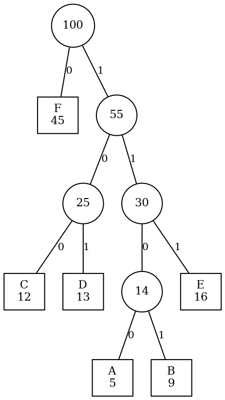

# 5.3 赫夫曼树与赫夫曼编码

若每个符号都使用相同长度的二进制码，频率差异不会影响总长度。赫夫曼编码利用“高频符号应更靠近根”的直觉，把符号权重转化为叶节点深度，并用贪心合并得到最小带权路径长度。

## 学习目标

- 计算节点带权路径长度和整棵树的 WPL；
- 说明最优前缀码问题与最优二叉树之间的对应；
- 用小根优先队列执行赫夫曼贪心构造，并手算合并过程；
- 判断一组码字是否具有前缀性质，完成逐位编码与解码；
- 阅读 C++ 赫夫曼树实现，分析构造、生成码表和解码复杂度；
- 识别码表开销、单符号输入、位封装等真实压缩边界。

## 5.3.1 带权路径长度 WPL 与最优二叉树

### 从路径长度到带权成本

::: definition 定义 · 带权路径长度
设节点 $i$ 的权重为 $w_i$，从根到该节点的路径长度（边数）为 $l_i$，则节点的带权路径长度为 $w_i l_i$。树的<dfn>带权路径长度</dfn>（Weighted Path Length，WPL）为指定叶节点带权路径长度之和：

$$
\operatorname{WPL}(T)=\sum_{i=1}^{\sigma} w_i l_i,
$$

其中 $\sigma$ 是带权叶节点数量。在编码问题中，权重通常是符号出现次数或概率，叶深就是码长。
:::

若权重是频数，WPL 等于用对应树形编码整段数据所需的总有效位数；若权重是概率，WPL 是平均码长。

::: example 示例 · 交换深度会怎样
两个符号权重分别为 `40` 与 `5`，深度分别为 `1` 与 `4`，贡献是 $40\times1+5\times4=60$。若交换深度，贡献变为 $40\times4+5\times1=165$。因此在其他结构相同的情况下，大权重不应比小权重更深。
:::

### 最优二叉树

::: definition 定义 · 赫夫曼树
给定一组正权重，以这些权重作为叶节点，在所有可行二叉树中 WPL 最小的树称为<dfn>赫夫曼树</dfn>（Huffman tree），也称最优二叉树。
:::

对正权重的最优前缀码，可以只考虑每个内部节点都有两个孩子的满二叉形态：若内部节点只有一个孩子，把其子树整体上移一层会严格减小 WPL。

::: property 性质 · 最优树不一定唯一
权重相同或某些合并和相等时，左右孩子选择与优先队列的 tie-break 可能生成不同树和不同码字，但它们的 WPL 可以相同。赫夫曼算法保证最优成本，不保证唯一编码。
:::

## 5.3.2 赫夫曼树的构造（贪心 + 优先队列）

### 贪心步骤

把每个符号视为一棵单节点树，重复执行：

1. 取出当前权重最小的两棵树；
2. 新建一个内部节点，以它们为左右子树；
3. 新节点权重等于两棵子树权重之和；
4. 把新树放回集合，直到只剩一棵树。

每轮都需要取两个最小值并插回合并值，小根优先队列正好提供 $O(\log \sigma)$ 的更新成本。

### 完整构造示例

给定频数：

| 符号 | A | B | C | D | E | F |
| --- | ---: | ---: | ---: | ---: | ---: | ---: |
| 权重 | 5 | 9 | 12 | 13 | 16 | 45 |

合并过程（每轮从小根堆弹出两个最小权重，合并后放回）：

| 轮次 | 取出的两个最小权重 | 新节点权重 | 合并后队列内容 |
| ---: | --- | ---: | --- |
| 起始 | — | — | 5, 9, 12, 13, 16, 45 |
| 1 | 5 (A) + 9 (B) | 14 | 12, 13, **14**, 16, 45 |
| 2 | 12 (C) + 13 (D) | 25 | 14, 16, **25**, 45 |
| 3 | 14 + 16 (E) | 30 | 25, **30**, 45 |
| 4 | 25 + 30 | 55 | 45, **55** |
| 5 | 45 (F) + 55 | 100 | **100**（队列只剩根，结束） |

$\sigma=6$ 个符号执行了 $\sigma-1=5$ 轮合并。最终树形为：


<!-- diagram id="huffman-tree-example" caption: "方框是符号叶节点（符号与权重），圆圈是合并产生的内部节点；沿根到叶读取边上的 0/1 即得码字，例如 C 为 100、A 为 1100。内部节点权重恒等于其子树叶权重之和" -->

从图中沿根到叶读取边标号，若约定左边记 `0`、右边记 `1`，可得到一组码：

| 符号 | 码字 | 深度 | WPL 贡献 |
| --- | --- | ---: | ---: |
| F | `0` | 1 | 45 |
| C | `100` | 3 | 36 |
| D | `101` | 3 | 39 |
| A | `1100` | 4 | 20 |
| B | `1101` | 4 | 36 |
| E | `111` | 3 | 48 |

总 WPL 为 $45+36+39+20+36+48=224$。

::: intuition 直觉 · 为什么每次合并最小的两个
在任意最优满二叉树中，可以把两个最小权重安排为最深层的一对兄弟而不增加 WPL。把这对兄弟收缩成权重之和的“伪叶”，原问题就变成规模减一的同类问题。赫夫曼算法反复使用这个最优子结构。
:::

更严格的交换论证是：最深兄弟的深度最大，把任何更小权重与其位置交换都不会增大 WPL；因此可令两个最小权重成为最深兄弟。收缩后若剩余树不是子问题最优解，用更优子树替换就会得到原问题的更优解，产生矛盾。

::: complexity 复杂度 · 构造赫夫曼树
用含 $\sigma$ 个符号的小根堆：建堆为 $O(\sigma)$，执行 $\sigma-1$ 轮，每轮两次弹出和一次插入，总时间 $O(\sigma\log\sigma)$，树与堆空间为 $O(\sigma)$。
:::

## 5.3.3 赫夫曼编码与前缀编码、编码与解码

### 前缀编码

::: definition 定义 · 前缀码
若一组码字中，没有任何一个码字是另一个码字的前缀，则称其为<dfn>前缀码</dfn>（prefix code）。把符号放在二叉树叶节点、左边标 `0`、右边标 `1`，每条根到叶路径天然形成前缀码。
:::

如果符号只放在叶节点，那么读到某个叶节点时就能立即确定一个符号；叶节点不可能还是另一个符号路径的中间点，所以无需分隔符也能唯一逐位解码。

::: counterexample 反例 · 非前缀码产生边界歧义
码字集合 `{A: 0, B: 01, C: 1}` 不是前缀码，因为 `0` 是 `01` 的前缀。比特串 `01` 既可能表示 `B`，也可能被切成 `A,C`。
:::

### 编码

先深度优先遍历赫夫曼树，记录每个叶的根叶路径，得到 `symbol -> bits` 码表。编码原文时逐符号查表并拼接比特。

使用上面的码表，`FACE` 逐符号查表拼接：

| 符号 | F | A | C | E |
| --- | --- | --- | --- | --- |
| 码字 | `0` | `1100` | `100` | `111` |

拼接结果为 `01100100111`，共 11 位。

### 解码

从根开始逐位读取：`0` 走左边，`1` 走右边；到达叶节点就输出该符号并回到根。输入结束时必须恰好停在根：若停在内部节点，说明末尾是一个不完整码字；若某一步没有对应孩子，说明比特流或码表损坏。

对 `01100100111` 逐位解码的完整轨迹：

| 步 | 剩余比特 | 从根出发读到的位 | 到达 | 输出 |
| ---: | --- | --- | --- | --- |
| 1 | `01100100111` | `0` | 叶 F | F |
| 2 | `1100100111` | `1`→`1`→`0`→`0` | 叶 A | A |
| 3 | `100111` | `1`→`0`→`0` | 叶 C | C |
| 4 | `111` | `1`→`1`→`1` | 叶 E | E |
| 5 | 空 | — | 停在根 ✓ | — |

解码结果 `FACE` 与原文一致，且最后一步恰好停在根，说明比特流完整。

::: pitfall 易错点 · 树边的 0/1 方向不是唯一标准
交换任意内部节点的左右子树会改变码字，却不改变每个叶的深度和 WPL。编码器与解码器必须共享同一棵树或同一份规范化码长/码表，不能各自“重新猜”左右方向。
:::

## 5.3.4 实现【C/C++】与数据压缩应用

### C++：构造树并生成码表

下面使用 `std::shared_ptr` 简化教学代码中的树节点生命周期；生产实现也可以把节点集中存进稳定容器，再由下标连接。

```cpp:line-numbers [huffman.cpp]
#include <memory>
#include <queue>
#include <stdexcept>
#include <string>
#include <unordered_map>
#include <unordered_set>
#include <utility>
#include <vector>

struct HuffmanNode {
    long long weight;
    char symbol{};
    std::shared_ptr<HuffmanNode> left;
    std::shared_ptr<HuffmanNode> right;

    HuffmanNode(long long nodeWeight, char nodeSymbol,
                std::shared_ptr<HuffmanNode> leftChild = {},
                std::shared_ptr<HuffmanNode> rightChild = {})
        : weight(nodeWeight), symbol(nodeSymbol),
          left(std::move(leftChild)), right(std::move(rightChild)) {}

    bool isLeaf() const { return !left && !right; }
};

using NodePtr = std::shared_ptr<HuffmanNode>;

struct Lighter {
    bool operator()(const NodePtr& a, const NodePtr& b) const {
        return a->weight > b->weight;  // 小权重位于队首
    }
};

NodePtr buildHuffman(const std::vector<std::pair<char, int>>& frequencies) {
    std::priority_queue<NodePtr, std::vector<NodePtr>, Lighter> queue;
    std::unordered_set<char> symbols;
    for (const auto& [symbol, weight] : frequencies) {
        if (weight <= 0) throw std::invalid_argument("weight must be positive");
        if (!symbols.insert(symbol).second) {
            throw std::invalid_argument("duplicate symbol");
        }
        queue.push(std::make_shared<HuffmanNode>(weight, symbol));
    }
    if (queue.empty()) return nullptr;

    while (queue.size() > 1) {
        NodePtr left = queue.top(); queue.pop();
        NodePtr right = queue.top(); queue.pop();
        queue.push(std::make_shared<HuffmanNode>(
            left->weight + right->weight, '\0', left, right));
    }
    return queue.top();
}

void buildCodes(const NodePtr& node, std::string path,
                std::unordered_map<char, std::string>& codes) {
    if (!node) return;
    if (node->isLeaf()) {
        codes[node->symbol] = path.empty() ? "0" : path;
        return;
    }
    buildCodes(node->left, path + '0', codes);
    buildCodes(node->right, path + '1', codes);
}
```

单符号输入没有树边。实现把唯一符号编码为 `0`，避免使用空码导致“重复多少次”无法从比特流判断；解码器也必须使用相同约定。

### 数据压缩中的完整成本

赫夫曼码只优化“按给定频率、使用整数位长前缀码”的数据部分。一个可解码文件还需要保存或约定：

- 频数表、树形或规范化码长；
- 原始符号数量或有效位数，用来忽略末字节填充位；
- 字符集、字节序和格式版本；
- 空输入、单符号输入与损坏数据的处理规则。

若文件很短，码表头部可能比节省的位数还多，压缩结果反而更大。若频率随数据位置变化，单一静态码表也可能不理想；可以分块统计、使用自适应模型，或选择其他熵编码，但这些都会增加实现复杂度。

::: complexity 复杂度 · 编码与解码
设原文含 $N$ 个符号，编码后共有 $B$ 位：

- 建树：$O(\sigma\log\sigma)$；
- 生成码表：访问 $O(\sigma)$ 个树节点，若把字符串复制成本计入则与码字总长度相关；
- 编码：查表均摊 $O(1)$ 时为 $O(N+B)$（输出 $B$ 位不可省略）；
- 解码：每位沿一条树边，时间 $\Theta(B)$；
- 树和码表空间：$O(\sigma)$ 加码字存储。
:::

::: warning 压缩器必须验证输入
解码时不要默认比特一定合法。必须拒绝不存在的分支、不完整末码、输出符号数超过声明值、权重和溢出等情况；否则损坏文件可能产生越界、无限输出或资源耗尽。
:::

## 配套 Lab

先做[哈夫曼树与编码题精练](../../labs/chapter-05/theory/T-05-03-huffman-tree-coding-quiz/README.md)核对手算合并与 WPL，再进入编程实验：

| 实验 | 练习内容 |
| --- | --- |
| [哈夫曼编码](../../labs/chapter-05/exercise/E-05-09-huffman-coding/README.md) | 构造赫夫曼树、生成码表并完成编码与解码 |
| [最优合并问题](../../labs/chapter-05/exercise/E-05-10-optimal-merge/README.md) | 同一贪心策略在合并代价最小化上的应用 |
| [k 叉哈夫曼树](../../labs/chapter-05/exercise/E-05-11-k-ary-huffman/README.md) | 推广到 $k$ 路合并，注意补虚节点的条件 |

## 小结与自测

WPL 把“频率高的符号应使用短码”写成可优化目标；赫夫曼算法通过反复合并两个最小权重得到最优前缀码树。树形保证无歧义解码，但真实压缩格式还要承担码表、位封装与错误检测成本。

1. 对权重 `2, 3, 7, 9` 手算全部合并步骤与 WPL。
2. 为什么最优前缀码树可以假设每个内部节点都有两个孩子？
3. 判断 `{0, 10, 110, 111}` 是否为前缀码，并说明理由。
4. 同一组权重为什么可能产生不同码字，却具有相同 WPL？
5. 单符号输入若使用空码会造成什么信息缺失？实现可以怎样约定？

::: details 查看自测答案
1. $\sigma=4$，执行 $\sigma-1=3$ 轮合并：

   | 轮次 | 取出的两个最小权重 | 新节点 | 合并后队列 |
   | ---: | --- | ---: | --- |
   | 1 | 2 + 3 | 5 | 5, 7, 9 |
   | 2 | 5 + 7 | 12 | 9, 12 |
   | 3 | 9 + 12 | 21 | 21（结束） |

   若约定先弹出者记 `0`，得到码字 `9 → 0`、`7 → 11`、`2 → 100`、`3 → 101`，深度分别为 1、2、3、3：
   $$\text{WPL}=9\times1+7\times2+2\times3+3\times3=9+14+6+9=38.$$
   也可用更快的校验方式：**WPL 等于全部内部节点权重之和**，即 $5+12+21=38$，两种算法结果一致。
2. 反证。设最优树中存在某个内部节点只有一个孩子，把这个节点删去、让它的孩子直接连到它的父节点（若它是根则让孩子成为新根）。这样做仍是一棵合法的前缀码树，但它子树内**每个叶节点的深度都减少 1**，在权重为正的前提下 WPL 严格变小，与“原树最优”矛盾。因此最优树中不存在单孩子的内部节点，即每个内部节点都有两个孩子（满二叉树）。
3. **是**前缀码。逐对检查：`0` 以 `0` 开头，其余三个都以 `1` 开头，互不为前缀；`10` 与 `110`、`111` 在第 2 位就分岔（`0` 对 `1`）；`110` 与 `111` 在第 3 位分岔。任意两个码字都在某一位上分开，谁也不是谁的前缀。更直观的判据是：把它们放到二叉树上，四个码字恰好都落在**叶节点**（`0`、`10`、`110`、`111` 对应四条互不延伸的根叶路径），而前缀码等价于“所有码字都在叶节点”。
4. 因为 WPL 只取决于每个符号所在的**深度**，与具体走了哪些边无关。两种情形都会改变码字而保持深度：其一，交换任意内部节点的左右子树，所有叶的深度不变，WPL 不变（正文的易错点已指出这一条）；其二，合并过程中出现**权重相等的并列**时，选择不同的两个节点合并，可能得到形状不同的树，但只要每步都取当前最小的两个，结果仍是最优解，WPL 同样等于最小值。这也说明赫夫曼树不唯一，而最优 WPL 唯一。
5. 只有一个符号时树没有边，根到叶的路径长度为 0，码字为空串。此时无论该符号重复多少次，编码结果都是**长度为 0 的比特流**，解码器无法从中恢复“重复了多少次”——丢失的正是**符号个数**这一信息。常见约定有两种：一是像正文实现那样把唯一符号强制编码为 `0`，使 $m$ 次重复产生 $m$ 位比特流；二是在文件头中单独记录原文长度，解码时按长度输出。两种做法都要求编码器与解码器共享同一约定，否则会在这个边界上产生分歧。
:::

下一节进入[5.4 并查集](./04-disjoint-set-union.md)：树将不再表达编码路径，而是维护“谁与谁属于同一集合”的代表关系。
