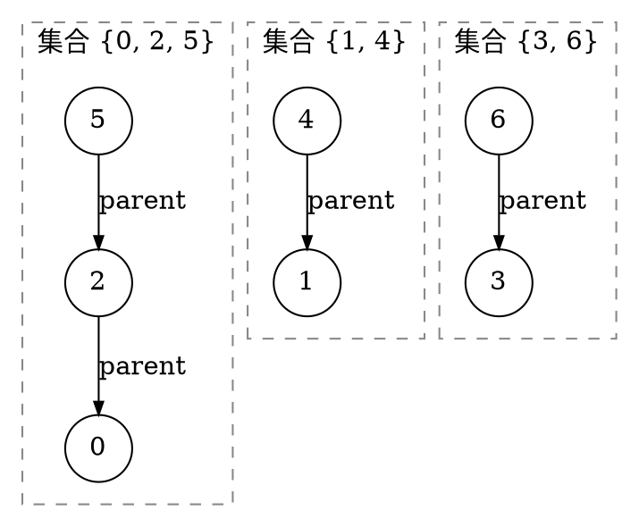
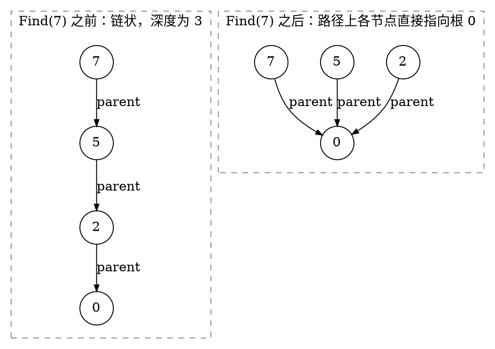

# 5.4 并查集

很多问题不关心集合内部的完整路径，只反复询问两件事：“这两个元素是否属于同一组？”以及“把两组合并”。并查集用一片树形森林保存代表关系，再通过路径压缩和合并启发式把树压得极浅。

## 学习目标

- 用不相交集合描述动态分组问题，并解释双亲数组的森林含义；
- 实现 `MakeSet`、`Find`、`Union`，说明每个操作维护的不变量；
- 区分路径压缩、按秩合并和按大小合并，避免混用元数据；
- 正确陈述 $O(m\alpha(n))$ 摊还复杂度的使用前提；
- 使用并查集处理增量动态连通性，并在 Kruskal 中判断加边是否成环；
- 识别并查集不支持删除、拆分、路径恢复等能力边界。

## 5.4.1 集合划分与树形表示（双亲数组）

### 集合划分

::: definition 定义 · 不相交集合族
给定全集 $U$，若干非空子集两两不相交，且它们的并集为 $U$，这些子集构成 $U$ 的一个<dfn>集合划分</dfn>。并查集（Disjoint Set Union，DSU）维护的就是随合并不断变化的集合划分。
:::

例如，全集 `{0,1,2,3,4,5,6}` 当前被划分为 `{0,2,5}`、`{1,4}`、`{3,6}`。每个集合选择一个<dfn>代表元</dfn>（representative）；代表元只用于识别集合，不必是最小值、最早值或业务上的“领导者”。

### 用森林表示集合

每个集合用一棵有根树表示：节点是元素，父链接指向同集合中的另一个元素，根作为代表元。多组集合就形成一片森林。

双亲数组 `parent` 保存：

| 元素 | 0 | 1 | 2 | 3 | 4 | 5 | 6 |
| --- | ---: | ---: | ---: | ---: | ---: | ---: | ---: |
| `parent` | 0 | 1 | 0 | 3 | 1 | 2 | 3 |

`parent[x] == x` 表示 `x` 是根，因此 `0`、`1`、`3` 是三个集合的代表元。它对应的森林是：


<!-- diagram id="dsu-forest" caption: "三个集合各由一棵树表示，箭头由孩子指向父节点；根 0、1、3 分别是各自集合的代表元" -->

本页采用“根的父节点是自己”的约定，即 `parent[root] == root`。有些教材用负数表示根，并顺便在负值中保存集合大小；两种表示都可以，但查根、初始化和元数据规则必须一致。

::: property 性质 · 并查集森林不变量
任意时刻都应满足：

- 每个元素下标合法，并且恰好属于一棵树；
- 沿 `parent` 反复向上一定到达唯一自环根，不出现长度大于 1 的环；
- 两个元素属于同一集合，当且仅当它们最终到达同一个根；
- 合并只连接两个不同集合的根，不改变集合内部成员。
:::

## 5.4.2 基本操作（MakeSet / Find / Union）

### MakeSet

`MakeSet(x)` 建立只含 `x` 的集合：

$$
parent[x]\leftarrow x.
$$

若元素编号是 `0..n-1`，通常一次性初始化 `parent[i]=i`。重复对已在集合中的元素执行 `MakeSet` 会把它与原集合断开，除非接口明确允许重置，否则应禁止。

### Find

`Find(x)` 沿父链接找到根并返回代表元。最基础的迭代版本是：

```cpp:line-numbers [dsu-basic-find.cpp]
#include <vector>

// Find：沿父链接一路向上，直到某个节点的父节点是它自己——那即是根
// 根就是该连通分量的代表元；本版本只读不改，不改变树的形状
int findRoot(const std::vector<int>& parent, int x) {
    while (parent[x] != x) {   // parent[x] == x 即到达根
        x = parent[x];         // 上跳一层
    }
    return x;
}
```

它不改变结构，时间与当前树高成正比。

### Union

`Union(a,b)` 先分别找到根。如果根相同，两个元素已经同组；否则把一个根连接到另一个根。

```cpp:line-numbers [dsu-basic-union.cpp]
// 沿用上面的 findRoot
// Union：把 b 所在集合并入 a 所在集合
bool unite(std::vector<int>& parent, int a, int b) {
    int rootA = findRoot(parent, a);   // ① 必须先找到两端的“根”
    int rootB = findRoot(parent, b);   //    直接挂任意节点会撕掉子树或制造环
    if (rootA == rootB) return false;  // ② 同根 -> 本来就同组，划分没有变化
    parent[rootB] = rootA;             // ③ 把一个根挂到另一个根下面
    return true;                       //    返回 true 表示发生了一次有效合并
}
```

返回 `false` 表示集合划分没有变化。这个布尔结果在 Kruskal 中可以直接表达“加边会不会形成环”。

::: pitfall 易错点 · 必须连接根，而不是任意节点
直接执行 `parent[b] = a` 可能把 `b` 的子树从原集合中撕下来，或者在 `a` 位于 `b` 子树时制造环。正确合并先 `Find` 两端，再连接两个根。
:::

如果每次都把一棵大树挂到单节点下面，树高可能增长到 $n-1$，基础 `Find` 最坏为 $\Theta(n)$。优化的目标就是阻止这种长链。

## 5.4.3 优化：路径压缩与按秩 / 按大小合并、复杂度分析【进阶】（含 $\alpha(n)$）

### 路径压缩

在 `Find(x)` 找到根后，把搜索路径上的节点直接指向根。以后从这些节点查询会更快。


<!-- diagram id="dsu-path-compression" caption: "路径压缩把查询路径上的每个节点直接挂到根下，链状树变为扁平的星形；箭头方向即 parent 指针方向" -->

递归写法非常短：

```cpp:line-numbers [path-compression.cpp]
// DisjointSetUnion 的成员函数片段，parent_ 为成员数组
// Find + 路径压缩（递归版）：
//   返回值不变（仍是根），副作用是把 x 到根路径上的每个节点直接挂到根下
int find(int x) {
    if (parent_[x] != x) {
        // 递归先找到根，再“回填”：赋值号左边的 parent_[x] 被改写为根
        // 一行同时完成“查根”和“压缩”，是最短写法
        parent_[x] = find(parent_[x]);
    }
    return parent_[x];
}
```

也可以分两次循环实现迭代路径压缩，避免极端初始长链导致递归栈过深。

### 按大小合并

为每个根维护集合节点数 `size[root]`。合并时总把小树根挂到大树根下面，并更新新根大小：

```cpp:line-numbers [union-by-size.cpp]
// 同为成员函数片段，需要 <utility> 提供 std::swap
// Union + 按大小合并：让小集合的根挂到大集合的根下
bool unite(int a, int b) {
    a = find(a);                       // ① 合并永远发生在“根”与“根”之间
    b = find(b);
    if (a == b) return false;          // ② 同根则无事发生
    if (size_[a] < size_[b]) std::swap(a, b);  // ③ 保证 a 是大树根、b 是小树根
    parent_[b] = a;                    //    小根挂大根：节点深度至多 O(log n) 增长
    size_[a] += size_[b];              // ④ 只有根节点的 size 有意义，新根累计两个集合大小
    return true;
}
```

不做路径压缩时，按大小合并已能保证任意节点深度为 $O(\log n)$：节点深度每增加 1，它所在集合大小至少翻倍，而集合大小最多为 $n$。

### 按秩合并

<dfn>秩</dfn>（rank）是树高的上界估计。总把低秩根挂到高秩根；只有两根秩相等时，新根秩加 1。路径压缩后，`rank` 不再等于真实高度，但仍是合法的合并启发式元数据，不能在压缩后重新按当前局部高度随意修改。

按大小与按秩二选一即可；同时维护两套但更新规则不一致，只会制造错误。

### 完整 C++ 实现

```cpp:line-numbers [disjoint-set-union.cpp]
#include <numeric>
#include <stdexcept>
#include <utility>
#include <vector>

// 完整并查集：路径压缩 + 按大小合并，单次操作均摊近似 O(alpha(n))
class DisjointSetUnion {
public:
    explicit DisjointSetUnion(int n)
        : parent_(checkedSize(n)), size_(checkedSize(n), 1), sets_(n) {
        // 初始时每个元素自成一个集合：i 的父节点是 i 自己，集合大小为 1
        std::iota(parent_.begin(), parent_.end(), 0);
    }

    // Find（迭代 + 两遍路径压缩）：
    //   第一遍循环只负责找到根；第二遍把 x 沿途的每个节点直接指向根。
    //   用迭代而非递归，避免极端长链下递归栈溢出
    int find(int x) {
        check(x);
        int root = x;
        while (parent_[root] != root) root = parent_[root];  // ① 先找到根
        while (parent_[x] != x) {           // ② 压缩：沿途节点全部改指根
            int next = parent_[x];
            parent_[x] = root;
            x = next;
        }
        return root;
    }

    // Union：按大小合并；返回 false 表示两端本来就连通
    bool unite(int a, int b) {
        a = find(a);                        // ① 先定位两个根（find 顺带完成路径压缩）
        b = find(b);
        if (a == b) return false;
        if (size_[a] < size_[b]) std::swap(a, b);  // ② 保证 a 是大树根
        parent_[b] = a;                     // ③ 小根挂大根
        size_[a] += size_[b];               // ④ 新根大小累加
        --sets_;                            // ⑤ 有效合并使连通分量数减 1
        return true;
    }

    // 便捷查询接口
    bool connected(int a, int b) { return find(a) == find(b); }  // 同根即连通
    int componentSize(int x) { return size_[find(x)]; }  // 只有根的 size 有定义，先 find
    int setCount() const { return sets_; }

private:
    // 防御负数规模：int 直接转 size_t 会变成天文数字，必须先检查
    static std::size_t checkedSize(int n) {
        if (n < 0) throw std::invalid_argument("negative size");
        return static_cast<std::size_t>(n);
    }

    // 防御越界元素编号：越界访问会让 parent_ 读到未定义位置
    void check(int x) const {
        if (x < 0 || x >= static_cast<int>(parent_.size())) {
            throw std::out_of_range("element out of range");
        }
    }

    std::vector<int> parent_;   // 父节点数组；parent_[i] == i 表示 i 是根
    std::vector<int> size_;     // 仅根节点的值有效：该集合的元素个数
    int sets_;                  // 当前连通分量总数
};
```

构造函数通过 `checkedSize` 在创建向量前拒绝负数，避免 `int` 先转换成巨大无符号长度。若接口改用 `std::size_t`，仍应在读取外部输入时先检查负数和范围。

::: complexity 复杂度 · $\alpha(n)$ 的准确表述
对 $n$ 个元素执行 $m$ 次 `MakeSet`、`Find`、`Union`，同时使用路径压缩与按秩或按大小合并时，总时间为

$$
O\bigl((n+m)\alpha(n)\bigr),
$$

常见简写为每次操作摊还 $O(\alpha(n))$。$\alpha$ 是反阿克曼函数，在现实规模下增长极慢，但这是一组操作序列的**摊还上界**，不是声称每次 `Find` 都严格常数时间，也不是任意朴素实现都自动拥有该界。
:::

## 5.4.4 应用与拓展

接下来笔者将介绍并查集在图论方面的应用，以及并查集的一些拓展。

### 增量动态连通性

并查集可以用来快速维护图的连通性，并且同时得到图的连通分量。

无向图开始时没有边，每加入一条边 `(u,v)` 就执行 `unite(u,v)`；询问两点是否连通时执行 `connected(u,v)`。并查集不保存具体路径，只保存连通分量划分，因此比每次从头 DFS/BFS 更适合“只加边、频繁问连通”的场景。

::: example 示例 · 网络逐步连通
有 5 台设备，依次连线 `(0,1)`、`(3,4)`、`(1,4)`：

- 前两次合并后有 `{0,1}`、`{2}`、`{3,4}` 三个分量；
- 加入 `(1,4)` 后变成 `{0,1,3,4}` 与 `{2}`；
- `connected(0,3)` 为真，`connected(0,2)` 为假，`setCount()` 为 2。
  :::

::: pitfall 易错点 · DSU 父边不是原图的边
路径压缩会把节点直接连到代表根，这条父链接可能根本不是原图中的边。因此不能沿 `parent` 输出网络路径、MST 边或证明距离。
:::


### 带删除并查集

作为拓展内容

普通的并查集无法支持删除操作，是因为删除一个节点的时候，不可避免地会将以它为根的子树上所有节点都删除．为了解决这一问题，在带删除操作的并查集中，可以通过建立虚点的方法保证所有实际存储数据的节点总是叶子节点．为此，需要在初始化时，就为每个数据节点都建立一个虚点，并将数据节点的父节点设置为该虚点．由于每次合并两个集合时，都只会将两个集合的树根连接，所以，从始至终只有虚点会有子节点．这就保证了删除一个节点时，不会误删其他节点．

注意，删除单个节点后，需要重新为该节点建立一个虚点作为其父节点；否则，无法正确执行后续的合并和删除操作．

### 带权并查集

我们还可以在并查集的边上定义某种权值和这种权值在路径压缩时产生的运算，从而解决更多的问题．

为了维护并查集中的边权，需要将边权下放到子节点中存储．因此，每个节点存储的都是它到它的父节点之间的边权．只有当一个节点的父节点发生变化时，才需要相应地调整边权．一般情形中，这可能发生在路径压缩和合并两个节点时．例如，如果边权是当前节点与父节点之间的距离，那么，在路径压缩时，每次将当前节点的父节点替换为根节点，都需要将父节点到根节点的距离加到当前节点存储的边权上；类似地，在合并两个节点所在集合时，需要计算两个根节点之间新连接的边的权值．

### 可撤销并查集

笔者先要说明一点，删除操作与撤销操作是不同的。撤销是对操作序列反向进行，比直接删除有着更好的性质。

对于可撤销并查集，我们记录每一步合并的两个DSU树根是什么，撤销的时候直接拆开就行。

需要着重强调的是，这种并查集是不允许路径压缩的 ！！！ 路径压缩会导致无法撤销。只能使用按秩合并的方法优化复杂度 ！！！


## 配套 Lab

先做[并查集题精练](../../labs/chapter-05/theory/T-05-04-disjoint-set-union-quiz/README.md)确认 `Find` 与 `Union` 的不变量，再进入编程实验：

| 实验 | 练习内容 |
| --- | --- |
| [并查集实现](../../labs/chapter-05/exercise/E-05-18-disjoint-set-union/README.md) | 路径压缩与按大小合并的完整实现 |
| [动态连通性查询](../../labs/chapter-05/exercise/E-05-19-dynamic-connectivity/README.md) | 增量加边与连通性询问 |
| [食物链](../../labs/chapter-05/exercise/E-05-20-food-chain-dsu/README.md) | 带权并查集：用相对关系维护多类别约束 |
| [银河英雄传说](../../labs/chapter-05/exercise/E-05-21-galaxy-heroes-dsu/README.md) | 带权并查集：在压缩路径时同步维护距离 |
| [亲戚](../../labs/chapter-05/exercise/E-05-22-relatives-dsu/README.md) | 关系传递的朴素应用，路径压缩与按大小合并 |
| [冗余连接](../../labs/chapter-05/exercise/E-05-23-redundant-connection/README.md) | 找到使树成环的最后一条边 |
| [关押罪犯](../../labs/chapter-05/exercise/E-05-24-prison-enemy-dsu/README.md) | 扩展域并查集：把“必须分开”化为“属于同一对立域” |
| [星球大战](../../labs/chapter-05/exercise/E-05-25-planet-war-reverse-dsu/README.md) | 倒序处理删除操作，转化为逐个加边的并查集 |

## 小结与自测

并查集把每个集合表示为一棵代表树。`Find` 识别根，`Union` 连接两个根；路径压缩优化重复查询，按大小或按秩合并阻止小集合成为大树的父节点。两种优化共同给出近常数的摊还成本，但普通 DSU 只擅长合并，不擅长拆分和路径恢复。

1. 按给定 `parent` 数组画出森林，并写出每个元素的代表元。
2. 为什么 `parent[b]=a` 不能替代“先 Find 再连接根”？
3. 证明按大小合并且不压缩路径时，节点深度至多为 $O(\log n)$。
4. 路径压缩后为什么不能把 `rank` 直接解释为当前真实高度？
5. Kruskal 中 `unite(u,v)` 返回 `false` 为什么表示加边会成环？

::: details 查看自测答案
1. 按 `parent = [0, 1, 0, 3, 1, 2, 3]` 逐个元素读出父指针：`0`、`1`、`3` 的父亲是自己，因此它们是三个根。其余元素 `2→0`、`5→2→0`、`4→1`、`6→3`。森林即正文图示的三棵树：`{0, 2, 5}` 以 `0` 为根、`{1, 4}` 以 `1` 为根、`{3, 6}` 以 `3` 为根。代表元为：`0, 2, 5` 的代表元是 `0`；`1, 4` 的代表元是 `1`；`3, 6` 的代表元是 `3`。
2. 因为 `b`（以及 `a`）**未必是根**。`parent[b] = a` 只是把 `b` 这一个节点的父指针改掉，会造成两类破坏：其一，若 `b` 原本有父亲，这条赋值等于把 `b` 从原来的树上**扯下来**，`b` 原来所在集合的其余成员并没有跟着合并，集合划分就错了；其二，若 `a` 不是根，合并后两个集合的根依然不同，`Find` 得到的代表元不一致，后续判同组会失败。只有“先 `Find` 求出两个根，再把一个根挂到另一个根下”，才能保证整棵子树随之转移、且合并后集合只剩一个根。
3. 只按大小合并（不压缩路径）时，一个节点的深度**仅在它所在的树被挂到另一棵树下面时加 1**。而按大小合并规定：小树的根挂到大树的根下。设节点 $x$ 的深度因某次合并从 $d$ 增到 $d+1$，说明 $x$ 所在集合是较小的那个，设其大小为 $s$，另一集合大小 $\ge s$，故合并后新集合大小 $\ge 2s$——即 $x$ **每加深一层，它所在集合的大小至少翻倍**。初始时 $x$ 独自成集，大小为 1；集合大小最多为 $n$。若 $x$ 的深度为 $d$，则 $2^d\le n$，即 $d\le\log_2 n$。故任意节点深度为 $O(\log n)$，`Find` 与 `Union` 均为 $O(\log n)$。
4. 因为 `rank` 只增不减，而路径压缩会**降低真实高度却不回改 `rank`**。一次 `Find` 把整条路径上的节点直接挂到根下，树可能从高度 3 被压平到高度 1，但压缩过程不去更新根的 `rank`，它仍保留压缩前的旧值。所以压缩之后 `rank` 只是真实高度的一个**上界**，是用于决定“谁挂到谁下面”的启发式元数据。这不影响正确性：作为上界它依然让较“大”的树当父节点，摊还复杂度的证明也建立在 `rank` 的单调性上，而不是它等于真实高度。反过来，若在压缩后自作主张按当前局部高度改小 `rank`，就会破坏这一单调性。
5. `unite(u,v)` 内部先求 `u`、`v` 的根，根相同时返回 `false`。根相同意味着 `u` 与 `v` **已经在同一个连通分量里**，即此前选中的边已经在它们之间提供了一条通路。此时再加入边 $(u,v)$，这条新边与那条已有通路首尾相接，就构成一个环。生成树要求无环，因此必须跳过。反之返回 `true` 时两点分属不同分量，加边把两个分量连成一个且不可能成环——这正是 Kruskal 用并查集做**环检测**的依据。
:::

下一节进入[5.5 B 树与 B+ 树](./05-b-tree-and-b-plus-tree.md)：它会把“降低树高”的思路从旋转和路径压缩扩展到外存页中的高分支节点。
