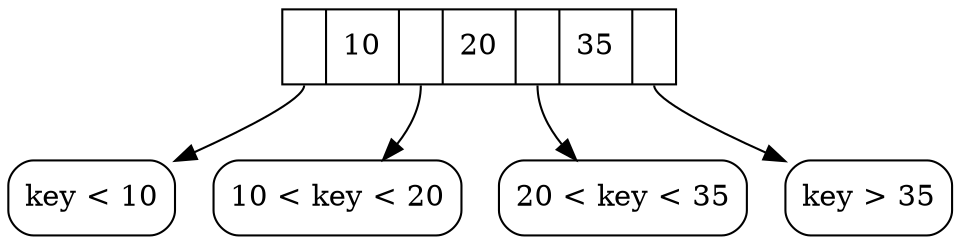
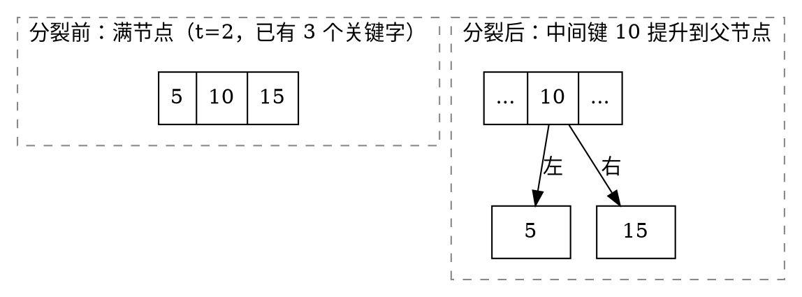
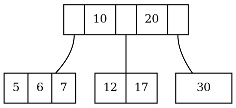
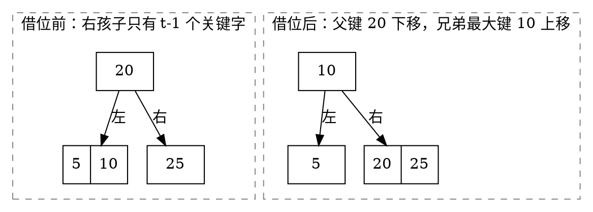
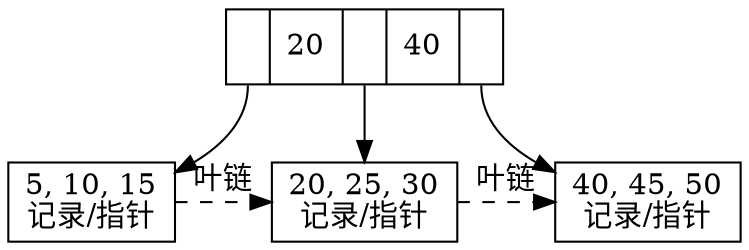

# 5.5 B 树与 B+ 树

AVL 树把高度控制到 $O(\log_2 n)$，但每个节点只有两个方向。若节点位于磁盘或 SSD 页中，一次页读取远比页内几十次比较昂贵；让一个页节点保存大量关键字与孩子，能把树高进一步压到很小。这就是多路搜索树的出发点。

## 学习目标

- 区分内存比较成本与外存页 I/O 成本，解释高分支的价值；
- 使用最小度数 $t$ 准确定义 B 树的关键字数、孩子数与平衡约束；
- 手算 B 树查找、插入、分裂、删除、借位和合并；
- 描述 B+ 树内部节点、叶节点与叶链的职责；
- 比较 B 树与 B+ 树的点查、范围查和数据存放方式；
- 解释数据库索引为何常采用 B+ 树家族，同时识别真实实现中的页、缓存与并发因素。

## 5.5.1 为什么需要多路搜索树（外存与磁盘 I/O）

### 成本单位变了

在内存数据结构中，我们常数比较、赋值和指针访问；在外存索引中，节点通常对应固定大小的页。一次查找的主要成本更接近“读取多少个页”，而不是“做多少次整数比较”。

假设一个二叉平衡树有一百万个关键字，高度约为 $20$。若每层节点都可能触发一次随机页读取，代价很高。若一个页能容纳约 `200` 个孩子，高度大致是：

$$
\log_{200}(10^6) < 3.
$$

即使每个页内需要二分比较多个分隔键，减少十几次页 I/O 通常更划算。

::: intuition 直觉 · 一个节点就是一页
多路树不是为了让节点“看起来更复杂”，而是让一次昂贵读取带回更多分支信息。页越满，分支因子越高；分支因子越高，从根到叶需要读取的页越少。
:::

### 为什么普通多叉搜索树还不够

如果只允许节点无限增加关键字，单页会溢出；若节点过空，分支因子下降、空间浪费。B 树用上下界控制每个节点的占用，并通过分裂、借位和合并保持：

- 节点不超过页容量；
- 除根外节点不会过空；
- 所有叶位于同一深度；
- 查找始终沿一条根叶路径完成。

::: complexity 复杂度 · 外存视角
若每个内部节点平均有 $B$ 个孩子，含 $n$ 个关键字的多路平衡树高度为 $O(\log_B n)$。点查通常需要同阶页 I/O；页内查找可用线性扫描、二分或 SIMD 等方式，但不会改变根叶页数的主导结构。
:::

## 5.5.2 B 树的定义、查找、插入与分裂、删除与合并借位

不同教材对“m 阶 B 树”的最小孩子数有不同取整约定。本页采用经典的<dfn>最小度数</dfn> $t\ge2$ 定义，所有容量界都由 $t$ 唯一确定。

### B 树定义

::: definition 定义 · 最小度数为 $t$ 的 B 树
一棵非空 B 树满足：

1. 每个节点的关键字严格递增；含 $k$ 个关键字的内部节点恰有 $k+1$ 个孩子，孩子子树分别落在分隔区间中；
2. 每个节点至多有 $2t-1$ 个关键字，至多有 $2t$ 个孩子；
3. 除根外，每个节点至少有 $t-1$ 个关键字；除根外的内部节点至少有 $t$ 个孩子；
4. 非叶根至少有 1 个关键字和 2 个孩子；空树或仅含根的树是边界情况；
5. 所有叶节点位于同一深度。
:::

当节点达到 `2t-1` 个关键字时称为满节点。以 $t=2$ 为例，每个非根节点含 `1..3` 个关键字，这类 B 树也常称 2-3-4 树。

### 查找

在节点的有序关键字中找到第一个不小于目标的下标 `i`：

- 若 `keys[i] == target`，查找成功；
- 若当前是叶节点，失败；
- 否则进入 `children[i]`。


<!-- diagram id="b-tree-search-branch" caption: "含 3 个关键字的节点有 4 个孩子，每个孩子覆盖相邻分隔键之间的开区间" -->

页内可以二分定位分支，沿途每层只读取一个孩子页。

下面给出节点结构与查找的最小骨架。分裂、借位与合并的完整实现留给配套实验 [B 树的插入](../../labs/chapter-05/exercise/E-05-16-btree-insertion/README.md)：

```cpp:line-numbers [b-tree-search.cpp]
#include <memory>
#include <vector>

struct BTreeNode {
    explicit BTreeNode(bool leaf) : isLeaf(leaf) {}

    bool isLeaf;
    std::vector<int> keys;                              // 至多 2t-1 个，严格递增
    std::vector<std::unique_ptr<BTreeNode>> children;   // 内部节点为 keys.size()+1 个

    bool isFull(int t) const {
        return static_cast<int>(keys.size()) == 2 * t - 1;
    }
};

// 找到第一个不小于 target 的关键字下标；页内可改用二分
int lowerBoundIndex(const BTreeNode& node, int target) {
    int i = 0;
    while (i < static_cast<int>(node.keys.size()) && node.keys[i] < target) {
        ++i;
    }
    return i;
}

const BTreeNode* search(const BTreeNode* node, int target) {
    while (node != nullptr) {
        const int i = lowerBoundIndex(*node, target);
        if (i < static_cast<int>(node->keys.size()) && node->keys[i] == target) {
            return node;                    // 命中，B 树可在内部节点提前结束
        }
        if (node->isLeaf) {
            return nullptr;                 // 落到叶仍未命中
        }
        node = node->children[i].get();     // 下降一层，对应一次页读取
    }
    return nullptr;
}
```

`search` 的循环次数等于树高，因此页 I/O 次数为 $O(\log_t n)$；`lowerBoundIndex` 的开销发生在页内，不额外触发 I/O。

### 插入与分裂

插入最终发生在叶节点。若直接下降到满孩子后再插入，可能临时产生溢出并需要向上回溯。一个常用的自顶向下策略是：==绝不下降到满孩子==。

1. 若根已满，创建新根并先分裂旧根，树高增加 1；
2. 在内部节点准备进入孩子 `i` 前，若该孩子已满，先把它分裂；
3. 分裂把中间关键字提升到父节点，较小的 `t-1` 个关键字留在左节点，较大的 `t-1` 个移入新右节点；
4. 根据目标与提升关键字的比较，选择左右非满孩子继续下降；
5. 到达非满叶后，在有序位置插入关键字。


<!-- diagram id="b-tree-split" caption: "分裂把中间关键字提升到父节点，较小的 t-1 个留在左节点，较大的 t-1 个进入新的右节点" -->

::: example 示例 · $t=2$ 的插入全过程
向空 B 树依次插入 `10, 20, 5, 6, 12, 30, 7, 17`。$t=2$ 表示每个节点最多 `3` 个关键字，达到 `3` 即为满节点。按“下降前先分裂满孩子”的策略，全过程只触发两次分裂：

| 步骤 | 插入 | 判断与动作 | 结果 |
| ---: | :--- | :--- | :--- |
| 1 | `10` | 树空，建立根 | `[10]` |
| 2 | `20` | 根有 1 键，未满，直接插入 | `[10\|20]` |
| 3 | `5` | 根有 2 键，未满，有序插入 | `[5\|10\|20]` |
| 4 | `6` | 根已满 → **分裂**：中间键 `10` 升为新根，`5` 留左、`20` 入右；`6<10` 进左孩子 | `[10]` / `[5\|6]` `[20]` |
| 5 | `12` | 根未满；`12>10` 进右孩子 `[20]`，未满 | `[10]` / `[5\|6]` `[12\|20]` |
| 6 | `30` | `30>10` 进右孩子，有 2 键未满 | `[10]` / `[5\|6]` `[12\|20\|30]` |
| 7 | `7` | `7<10` 进左孩子 `[5\|6]`，未满 | `[10]` / `[5\|6\|7]` `[12\|20\|30]` |
| 8 | `17` | `17>10` 应进右孩子，但它已满 → **分裂**：中间键 `20` 升入根，`12` 留左、`30` 入右；再比较 `17<20` 进入 `[12]` | `[10\|20]` / `[5\|6\|7]` `[12\|17]` `[30]` |

最终形态：


<!-- diagram id="btree-t2-final" caption: "t=2 时插入 10,20,5,6,12,30,7,17 的最终形态；所有叶同层，每个非根节点含 1~3 个关键字，三个孩子分别覆盖 <10、10<key<20、>20 三个区间" -->

注意第 8 步：分裂发生在**下降之前**，而不是等 `17` 插入后再处理溢出。这正是自顶向下策略的关键——每次进入孩子前先确保它不满，因此插入永远不需要向上回溯。
:::

### 删除：先保证将进入的孩子足够大

B 树删除比插入复杂，因为删掉关键字可能让节点低于 `t-1` 的下界。自顶向下删除常保持一个更强的不变量：准备进入某个孩子时，先保证它至少有 `t` 个关键字。这样即使递归中删除一个，仍不会下溢。

#### 情况 A：关键字位于叶节点

直接删除。由于下降前已保证该节点至少有 `t` 个关键字，删除后仍至少有 `t-1` 个。

#### 情况 B：关键字位于内部节点

设目标关键字为 `k`，左右相邻孩子为 `L`、`R`：

1. 若 `L` 至少有 `t` 个关键字，用 `L` 中最大前驱替换 `k`，再递归删除前驱；
2. 否则若 `R` 至少有 `t` 个关键字，用 `R` 中最小后继替换 `k`，再递归删除后继；
3. 否则 `L`、`R` 都只有 `t-1` 个关键字：把 `L + k + R` 合并成一个含 `2t-1` 个关键字的节点，再进入合并节点删除。

#### 情况 C：目标不在当前内部节点

准备进入的孩子若只有 `t-1` 个关键字：

- 相邻兄弟至少有 `t` 个关键字时，向兄弟**借位**：父分隔键下移到目标孩子，兄弟边界键上移到父节点；内部节点还要同步转移一个孩子指针；
- 两侧兄弟都只有 `t-1` 个关键字时，与一个兄弟及中间父键**合并**，再下降到合并节点。


<!-- diagram id="b-tree-borrow" caption: "向左兄弟借位是一次旋转：父分隔键下移到目标节点，兄弟的边界键上移填补父位置" -->

若根在合并后失去全部关键字，就用唯一孩子替代根，树高减少 1。根是唯一允许低于普通最小占用的节点。

::: pitfall 易错点 · 借位不是直接复制兄弟关键字
兄弟关键字不能越过父分隔键直接进入目标节点。正确旋转顺序是“父键下移、兄弟边界键上移”，内部节点还必须转移对应孩子指针，否则关键字区间与孩子数都会失配。
:::

::: complexity 复杂度 · B 树操作
查找、插入和删除都经过 $O(\log_t n)$ 个节点。若把一个节点视为一个外存页，页 I/O 为 $O(\log_t n)$；页内对至多 $2t-1$ 个关键字定位，可用二分比较 $O(\log t)$。分裂、借位、合并需要在一个或少数页内移动 $O(t)$ 个键/指针，真实成本取决于页容量与存储实现。
:::

## 5.5.3 B+ 树（定义、叶节点、查找）与 B 树的区别

### 定义与叶链

::: definition 定义 · B+ 树
B+ 树是一族多路平衡搜索树。常见实现满足：

- 内部节点只保存用于导航的分隔键和孩子指针；
- 全部数据记录或记录指针存放在叶节点；
- 所有叶位于同一层，并按关键字顺序通过链指针相连；
- 查找即使在内部节点遇到相等分隔键，也继续下降到叶节点取得记录。
:::

不同系统对分隔键使用“右子树最小键的副本”还是其他高键约定、叶节点双向还是单向链接、节点最小占用率等细节可能不同。分析具体实现时，应先读取它的页格式和分裂约定，不把某一本教材的图当作唯一标准。


<!-- diagram id="b-plus-tree-structure" caption: "B+ 树的全部记录位于叶层，内部节点只保存导航用分隔键；叶节点之间用虚线所示的叶链按序相连" -->

### 点查与范围查

点查从根按分隔键下降，最终在叶节点定位记录。范围查询 `[low, high]` 先用一次根叶查找找到 `low` 所在叶，再沿叶链顺序扫描，直到超过 `high`；无需反复回到内部节点。

::: property 性质 · 叶链把树序变成顺序访问
B+ 树的内部节点负责“快速到达起点”，叶链负责“从起点连续输出”。这使点查与范围扫描共享同一索引结构，也是数据库常用 B+ 树家族的重要原因。
:::

### B 树与 B+ 树对比

| 维度 | B 树 | B+ 树（常见实现） |
| --- | --- | --- |
| 数据记录位置 | 可在内部节点和叶节点 | 全部在叶节点 |
| 内部关键字 | 关键字本身可对应记录 | 主要作为导航分隔键，可能是叶键副本 |
| 成功点查终点 | 可能在内部节点提前结束 | 总是到叶节点 |
| 叶节点 | 通常不要求相连 | 通常按序链接 |
| 范围扫描 | 需中序式跨节点 | 找到起点后沿叶链 |
| 内部节点扇出 | 受记录载荷影响，可能较低 | 只存键与指针，通常更高 |
| 键重复出现 | 通常一处 | 分隔键可能在内部与叶同时出现 |

更高扇出通常让 B+ 树更矮，但具体高度还取决于键宽、指针宽、页头、填充率与压缩方式。

::: pitfall 易错点 · B+ 树内部命中不代表找到记录
内部键用于导航。即使目标等于内部节点中的分隔键，也必须按实现约定进入相应孩子并在叶节点确认记录；直接返回内部位置会把索引副本误当成数据。
:::

## 5.5.4 数据库索引【拓展】

### 为什么索引常使用 B+ 树家族

数据库把节点设计成与存储页接近的大小，并利用缓冲池缓存常访问的根和上层页。B+ 树提供：

- **高扇出**：内部页只保存分隔键和页指针，一棵很矮的树可覆盖大量记录；
- **稳定根叶路径**：所有记录在叶层，访问流程统一；
- **范围友好**：叶页有序链接，顺序扫描具有较好的局部性；
- **动态更新**：分裂、借位或合并局部调整，不必重写整个有序文件；
- **多列词典序**：复合键按列顺序比较，可支持匹配索引前缀的查询。

### 聚簇与非聚簇只是数据落点不同

在某些数据库术语中，聚簇索引的叶层保存完整行或决定数据页顺序；非聚簇索引叶层保存记录定位信息。具体含义因系统而异，但结构分析仍应问：叶项保存什么、一次命中后是否还要回表、范围扫描访问哪些页。

### 复杂度不是全部

真实数据库索引还要处理：

1. **页分裂与填充率**：页留多少空位影响未来写入与空间利用；
2. **缓存**：根和上层页常驻内存后，实际物理 I/O 少于树高；
3. **并发控制**：查找、分裂和合并需要锁、闩或乐观协议保护结构变化；
4. **崩溃恢复**：多页修改要配合日志，保证故障后结构一致；
5. **键宽与前缀压缩**：更短内部键能提高扇出；
6. **写放大与存储介质**：SSD、持久内存和日志结构方案可能改变最佳取舍。

::: example 示例 · 复合索引顺序
索引键为 `(course_id, score)` 时，叶项先按 `course_id`，同课程内再按 `score` 排序。它适合查某课程或某课程的分数区间；只按 `score` 查询时，数据在不同 `course_id` 段中分散，通常不能直接获得同样高效的连续范围扫描。
:::

::: warning 索引不是越多越好
每新增一个索引，插入、删除和更新都要同步维护额外树页，并占用缓存和存储空间。应根据真实查询、排序与约束需求选择索引，而不是给每一列机械建立 B+ 树。
:::

## 本章回顾 · 五种结构横向对比

学完全章后，回到 [章节概览](./00-overview.md) 提出的三个问题：维护什么不变量、一次操作触碰多少节点、成本单位是什么。逐列对照即可看清这些结构的分工（BST 与 AVL、B 树与 B+ 树各自的差异较大，下表分行列出）。

| 结构 | 维护的不变量 | 一次操作触碰的范围 | 查找/主操作复杂度 | 成本单位与存放位置 |
| --- | --- | --- | --- | --- |
| [BST](./01-binary-search-tree-and-avl.md) | 左子树 < 根 < 右子树（中序序列有序） | 一条根到叶路径 | 平均 $O(\log n)$，最坏 $O(n)$ | 比较次数，内存指针 |
| [AVL](./01-binary-search-tree-and-avl.md) | BST 序 **加上** 每个节点平衡因子 $\in\{-1,0,1\}$ | 一条根到叶路径；插入最多 1 次旋转，删除最多 $O(\log n)$ 次 | 稳定 $O(\log n)$ | 比较次数，内存指针 |
| [堆](./02-heap-and-priority-queue.md) | 完全二叉树形态 **加上** 父子间局部偏序 | 一条根到叶或叶到根的路径 | 插入/删除堆顶 $O(\log n)$，建堆 $\Theta(n)$ | 比较与交换，内存数组（无指针） |
| [赫夫曼树](./03-huffman-tree-and-coding.md) | 满二叉树，符号只在叶节点，WPL 最小 | 构造期每轮触碰堆顶两项；编解码走一条根叶路径 | 构造 $O(\sigma\log\sigma)$，解码每符号 $O(\text{码长})$ | 比较次数，内存；构造后不再动态维护 |
| [并查集](./04-disjoint-set-union.md) | 森林，每棵树的根即该集合代表元 | Find 走一条到根的路径并就地压平 | 均摊 $O(\alpha(n))$，实际近似常数 | 数组访问，内存数组 |
| [B / B+ 树](./05-b-tree-and-b-plus-tree.md) | 所有叶同层 **加上** 每个非根节点含 $t-1\sim 2t-1$ 个关键字 | 一条根到叶路径，长度仅 $O(\log_t n)$ | $O(\log_t n)$ 次页 I/O | **页 I/O**，外存磁盘页 |

三条贯穿全章的线索：

1. **不变量越强，形态越受控，但维护代价越高。** BST 只约束顺序，可能退化成链；AVL 追加高度约束换来稳定 $O(\log n)$，代价是插入删除要旋转。没有免费的平衡。
2. **绝大多数操作只触碰一条路径。** 上表六行无一例外——这正是树形结构高效的根本原因，也是分析复杂度时应当先问“路径有多长”的原因。
3. **成本单位决定结构设计。** 前几种以比较次数计费，于是二分支足够；B 树以页 I/O 计费，一次页读取的代价远超页内比较，于是把分支数提高到几百，用“页内多做工作”换“少读几页”。

## 配套 Lab

| 实验 | 练习内容 |
| --- | --- |
| [B 树的插入](../../labs/chapter-05/exercise/E-05-16-btree-insertion/README.md) | 实现自顶向下分裂，与本节手算过程对照 |
| [B+ 树的范围查询](../../labs/chapter-05/exercise/E-05-17-bplus-range-query/README.md) | 定位起点叶节点后沿叶链连续扫描 |

## 小结与自测

B 树通过高分支和占用下界控制外存树高，插入用分裂处理上溢，删除用借位与合并处理下溢。B+ 树把记录集中在叶层并连接叶页，使高扇出点查与连续范围扫描兼得。分析这类结构时，成本单位应从“比较次数”升级为“页 I/O + 页内工作”。

1. 最小度数为 `t=3` 的非根节点最少、最多各有多少关键字和孩子？
2. 为什么自顶向下插入要在下降前分裂满孩子？
3. 删除时，向左兄弟借位需要移动哪一个父键和哪一个兄弟键？
4. B+ 树在内部节点命中目标键后为什么仍需到叶层？
5. 复合索引 `(a,b)` 为什么通常适合只按 `a` 查询，却不一定适合只按 `b` 查询？

::: details 查看自测答案
1. 按定义，非根节点含 $t-1$ 至 $2t-1$ 个关键字，孩子数比关键字数多 1。代入 $t=3$：

   | | 关键字数 | 孩子数（内部节点） |
   | --- | ---: | ---: |
   | 最少 | $t-1=2$ | $t=3$ |
   | 最多 | $2t-1=5$ | $2t=6$ |

   即每个非根节点含 2~5 个关键字；若它是内部节点，则有 3~6 个孩子（叶节点没有孩子）。根节点是唯一例外，最少可以只有 1 个关键字。
2. 为了让插入**只需一趟自顶向下、永不向上回溯**。若等到关键字插入后再处理溢出，分裂产生的中间键要上交父节点，父节点可能因此也满而继续分裂，这条连锁反应会一路传到根，需要保留回溯路径（或父指针）。反过来，下降前就把满孩子分裂掉，则进入孩子时它至多有 $2t-2$ 个关键字，**一定还能再容纳一个**，于是当前节点永远不会因为下层插入而被动溢出。代价是可能分裂了一些本来不必分裂的节点，换来的是单趟、无回溯、每层只需固定住当前页的算法——这在页 I/O 昂贵的外存场景中尤其划算。
3. 这是一次**旋转**，动的是两个键：把**父节点中位于两者之间的那个分隔键**下移到发生下溢的节点，再把**左兄弟的最大键（最右一个）**上移填补父节点空出的位置。正文的图示即：父键 `20` 下移进右侧节点，左兄弟 `[5|10]` 的最大键 `10` 上移成为新的父分隔键。顺序不能颠倒，也不能让兄弟键越过父键直接进入目标节点，否则关键字的区间划分会失配。若节点是内部节点，还必须同时转移对应的**孩子指针**：左兄弟最右侧的那个孩子要跟着成为目标节点最左侧的孩子，否则孩子数与关键字数不匹配。
4. 因为 B+ 树的内部节点只存**导航用的分隔键**，不存记录。内部节点中出现的键通常只是某个叶键的副本，它标记的是“区间边界”而非数据所在位置——真正的记录（或行指针）全部集中在叶层。即使目标值恰好等于某个内部分隔键，那里也没有可返回的记录，必须按实现约定继续下降到叶节点确认。这带来两个附带好处：所有查找的路径长度一致（性能可预测），且叶层有序链接使点查与范围扫描共用同一结构。
5. 因为复合索引的叶项是按 **`(a, b)` 字典序**排列的：先按 `a` 排，`a` 相同的项内部再按 `b` 排。只按 `a` 查询时，同一个 `a` 值的全部记录在叶层**连续存放**，一次根叶查找定位起点后沿叶链扫描即可，这正是 B+ 树最擅长的访问方式（这也是所谓“最左前缀”原则）。只按 `b` 查询则不然：`b` 只在各个 `a` 段的**内部**有序，全局上同一个 `b` 值被打散在不同 `a` 段中，彼此不相邻。索引无法用一次下降定位到一段连续区间，通常退化为扫描整个索引甚至回表，因此不一定比不用索引更快。若这种查询很常见，应另建以 `b` 打头的索引。
:::

至此，本章从二叉搜索树的有序性出发，经历堆的局部偏序、赫夫曼的权重、并查集的代表森林，最后抵达外存多路树。可回顾本页上方的“五种结构横向对比”，用“维护的不变量、操作路径、成本单位”把五类结构串成一条线索，再回到[本章导览](./00-overview.md)检查学习目标是否已经达成。
