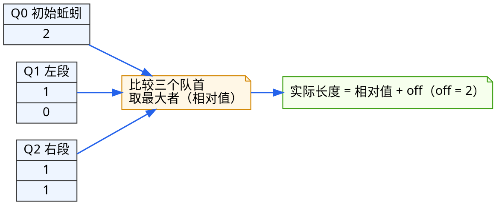
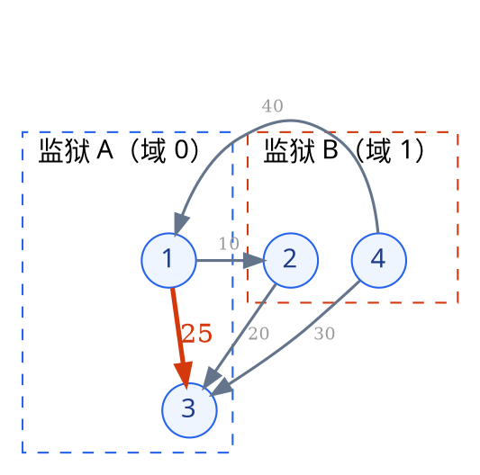

# 5.6 树的应用代码题解析——优化时间复杂度

这篇文章是一篇解题指导，旨在通过对两道样例题目的深度解析，建立读者对如何解决本章相关题目的认识，架起知识与解题的桥梁。

笔者希望通过这篇文章，让读者能够认识到数据结构在优化时间复杂度方面的重要性，以及如何利用好数据结构。

---

## 5.6.1 Lab 05-E-14：蚯蚓

题目：菜地里有 $n$ 条蚯蚓，每秒所有蚯蚓等量变长 $q$ 毫米，然后取出当前最长的一条切成两段。请输出前 $m$ 秒每秒被切断蚯蚓的长度，以及第 $t$ 秒结束后全部蚯蚓的长度（升序）。（完整题面可跳转至 [Lab 05-E-14](../../labs/chapter-05/exercise/E-05-14-earthworms/README.md)）

关键词：模拟，单调性，偏移量

### 1. 模拟的代价

拿到题目，最自然的想法是：每秒给所有蚯蚓加上 $q$，排个序取出最长的，切开，再把两段放回去。这个做法的问题有两个：

1. **每次排序太慢**。菜地里的蚯蚓数量每秒都在增加，第 $t$ 秒结束时共有 $n + t$ 条。若每秒都排序一次，总复杂度是 $O\big((n + t)^2 \log(n + t)\big)$，在 $n \le 10^5,\ t \le 2 \times 10^5$ 的规模下完全无法接受。
2. **"每条都加 $q$"这个动作本身就无法逐条执行**。每秒对几十万条蚯蚓各做一次加法，仅仅维护长度就要 $O(n + t)$ 每秒，还没开始切就已经超时了。

也就是说，这道题逼着我们去回答两个问题：**最长者如何快速取得**？**集体变长如何快速维护**？我们在 [5.2 堆与优先队列](./02-heap-and-priority-queue.md) 中学过"只维护局部偏序就能 $O(\log n)$ 取出极值"，但这里还有更妙的结构可以利用。

### 2. 观察一：有序性

先盯着"取最长"看。假如我们有一个**始终按长度降序排列的队列**，取最大值就是取队首，$O(1)$ 完成。那切开产生的两段会破坏这个有序性吗？

关键在于**切断值是单调不增的**。第 1 秒切的是全场最长者，第 2 秒切的一定不会比它长——因为其他蚯蚓只是等量变长，而最长的那段已经被切碎了。同理，第 $s$ 秒切出的左段 $A_s = \lfloor u \cdot x_s / v \rfloor$ 和右段 $B_s = x_s - A_s$ 都随 $s$ 单调不增。

于是我们可以把蚯蚓按来源分成三队，**每一队内部天然单调**：

- $Q_0$：初始的 $n$ 条蚯蚓，开局降序排序后就不再改动；
- $Q_1$：每秒切出的左段，按被切出的先后顺序入队；
- $Q_2$：每秒切出的右段，同样按顺序入队。

$Q_1, Q_2$ 的队首就是各自队列的最长者，而三个队首的最大值就是当前全场的最长者。每秒钟我们只需比较三个队首，$O(1)$ 取出最长者切开，再把两段分别从队尾推入 $Q_1$ 和 $Q_2$。

这其实就是 [5.2](./02-heap-and-priority-queue.md) 里"多路归并"思想的对偶：归并是把 $k$ 个有序序列合成一个有序序列，而这里是**维护 $k$ 个各自有序的序列，永远只关心跨队首的最大值**。因为各队内部的有序性由"切断值单调"这份免费的不变量保证，我们连堆都不需要。


### 3. 观察二：统一偏移量

接下来处理第二个问题：每秒每条蚯蚓 $+q$。

如果每秒真的去改每一条的长度，那就掉回 $O(n + t)$ 每秒的泥潭了。但换个角度想：**所有蚯蚓每秒加的量完全一样**。既然大家的变化步调一致，我们就不必记录每条蚯蚓的"绝对长度"，而是只记录它们相对于某个基准的长度，把基准的变化单独记在一个变量里。

这个基准变量就是**偏移量** `off`：队列里存放的都不是真实长度，而是"比真实长度少 `off` 毫米"的相对值。每秒开始时：

1. `off += q`：全体等量变长，但没有任何一条蚯蚓的存值被修改——因为大家都加了同样的 $q$，相对大小关系纹丝不动；
2. 取出最长者，设其相对值为 `best`，则切断时刻的**实际长度**是 $x = \text{best} + \text{off}$；
3. 切出两段 $A = \lfloor u \cdot x / v \rfloor$、$B = x - A$，它们是以**当前偏移**为基准被切出来的。要让它们从下一秒起与其他蚯蚓同步生长，入队时应存相对值 `A - off` 和 `B - off`。

换句话说，偏移量把"每秒 $n + t$ 次加法"折叠成了**每秒 1 次加法**。

下面以题目样例 `3 2 1 1 2 3`（$n=3, m=2, q=1, u=1, v=2, t=3$，初始长度 `3 3 2`）追踪一遍三个队列的状态（队列中存的是**相对值**）：

| 时刻 | 操作 | `off` | $Q_0$ | $Q_1$ | $Q_2$ |
| --- | --- | --- | --- | --- | --- |
| 初始 | 排序 | 0 | `[3, 3, 2]` | 空 | 空 |
| 第 1 秒 | `off=1`；三队首最大为 $Q_0$ 的 3，实际 $x = 3 + 1 = 4$；切出 2 与 2，入队相对值 `2-1=1` | 1 | `[3, 2]` | `[1]` | `[1]` |
| 第 2 秒 | `off=2`；三队首为 $Q_0=3,\ Q_1=1,\ Q_2=1$，取 3，实际 $x = 5$；切出 2 与 3，入队相对值 `0, 1` | 2 | `[2]` | `[1, 0]` | `[1, 1]` |
| 第 3 秒 | `off=3`；三队首都是 2，任取其一（答案不受影响），实际 $x = 5$ | 3 | — | — | — |

第 2 秒结束时的队列状态如下图所示：三条"传送带"各自的队首候选汇入同一个比较器，取走最大者后，新的两段又被送回传送带尾部。


<!-- diagram id="earthworm-three-queues" caption="第 2 秒结束后三队列的相对值状态与取最大流程" -->

### 4. 代码实现

把两个观察拼起来，就是本题的完整解法：三个单调队列负责"取最长"，偏移量负责"集体变长"，合计 $O(n + t \log n)$，瓶颈只在开头的排序。


```cpp
#include <algorithm>
#include <climits>
#include <deque>
#include <iostream>
#include <vector>
using namespace std;

int main() {
    ios::sync_with_stdio(false);
    cin.tie(nullptr);
    long long n, m, q, u, v, t;
    cin >> n >> m >> q >> u >> v >> t;
    vector<long long> a(n);
    for (auto& x : a) cin >> x;
    sort(a.begin(), a.end(), greater<long long>());   // Q0：初始蚯蚓，降序

    deque<long long> q1, q2;   // Q1、Q2：切出的左段、右段（各自单调不增）
    long long off = 0;         // 偏移量：队列内存的是“实际长度 - off”
    size_t p = 0;              // Q0 的队首下标
    vector<long long> cut;     // 前 m 秒的切断长度

    for (long long s = 1; s <= t; ++s) {
        off += q;                              // ① 本秒生长量先计入偏移
        // ② 比较三个队首，取相对值最大者
        long long best = LLONG_MIN;
        int which = 0;
        if (p < a.size() && a[p] > best) { best = a[p]; which = 0; }
        if (!q1.empty() && q1.front() > best) { best = q1.front(); which = 1; }
        if (!q2.empty() && q2.front() > best) { best = q2.front(); which = 2; }
        if (which == 0) ++p;                   // 出队：移动对应队列的队首
        else if (which == 1) q1.pop_front();
        else q2.pop_front();

        long long x = best + off;              // ③ 切断时刻的实际长度
        if (s <= m) cut.push_back(x);
        long long left = x * u / v;
        long long right = x - left;
        q1.push_back(left - off);              // ④ 以当前偏移为基准入队
        q2.push_back(right - off);             //    从下一秒起自然同步生长
    }

    for (int i = 0; i < (int)cut.size(); ++i) {
        if (i) cout << ' ';
        cout << cut[i];
    }
    cout << '\n';
    // 收集第 t 秒后的实际长度并升序输出
    vector<long long> rest;
    for (; p < a.size(); ++p) rest.push_back(a[p] + off);
    for (auto x : q1) rest.push_back(x + off);
    for (auto x : q2) rest.push_back(x + off);
    sort(rest.begin(), rest.end());
    for (int i = 0; i < (int)rest.size(); ++i) {
        if (i) cout << ' ';
        cout << rest[i];
    }
    cout << '\n';
    return 0;
}
```

**复杂度分析**：

- **时间复杂度**：$O(n \log n + t)$。初始排序 $O(n \log n)$，之后每秒只做常数次队首比较与入队，共 $O(t)$。
- **空间复杂度**：$O(n + t)$。三条队列合计存放 $n + t$ 条蚯蚓的相对值。

::: warning 易错点提醒
1. **`off += q` 必须发生在取队首之前**：本秒的生长量要先计入偏移，这样 `best + off` 才是切断时刻的实际长度。若顺序写反，切出的两段长度会系统性偏小 $q$。
2. **新入队的两段必须减去当前 `off`**：两段是以此刻的实际长度 $A, B$ 被切出的，而队列的约定是"存相对值"。只有以 `A - off` 入队，它们才能与其他蚯蚓共用同一个偏移量、从下一秒起同步生长。忘记减 `off` 会导致这两段被"二次生长"。
3. **三队首相等时任取其一**：题目只要求输出切断长度，相等时无论从哪个队列取，$x$ 都相同，不影响答案；但实现时要保证"取走"与"入队"是同一个来源，不能比较时用 A 队列、出队时却弹出 B 队列。
:::

### 5. 延伸思考

ps. 笔者说明一点，这题实际上还可以用一个单调队列解决，时间复杂度不变。读者可以仔细思考这一点，设计出单调队列做法，体会两种做法的实现有差异但时间复杂度相同这一点。


假如题目改成"每过一秒蚯蚓**变短** $q$ 毫米"（比如自然风化），上面的框架还成立吗？

::: details 查看思考分析

框架依然成立，但有一个致命的前提变化：蚯蚓变短意味着"切断值单调不增"可能不再成立——如果某秒没有切到最长者（因为大家都在变短，切出的小段可能比留在地里的还短），三个队列的单调性就会被破坏。

不过在本题的原始设定里，我们**每秒钟切走的恰恰是当前最长者**，所以切断值天然单调。这提示我们：三队列技巧的核心不是"队列"本身，而是"**切断值单调**"这个由贪心规则免费赠送的不变量。遇到同类模拟题时，先问自己一句：被我逐轮取走的那个量，随轮次单调吗？若单调，就能Queue化；若不单调，才需要回到堆。

另一个变式是：如果切割规则从固定比例 $\lfloor u \cdot x / v \rfloor$ 改为"切成任意指定的两段"，单调性同样消失，因为后切出的段长度完全取决于输入。此时应退回 $O\big((n + t) \log (n + t)\big)$ 的堆做法——也就是 [5.2](./02-heap-and-priority-queue.md) 中优先队列的标准用法。**能Queue就不用堆，不能Queue才用堆**，这正是分析不变量带来的复杂度红利。

:::

---

## 5.6.2 Lab 05-E-24：关押罪犯

#### 笔者提示一下，此题难度较高，不要求掌握

题目：监狱有 $n$ 名罪犯，要分到两座监狱。$m$ 对罪犯之间有怨念值 $w$，同狱者的怨念会引爆。请安排分狱方案，使**同狱罪犯之间的最大怨念值尽可能小**；若能让所有有怨念的罪犯都不同狱，输出 $0$。（完整题面可跳转至 [Lab 05-E-24](../../labs/chapter-05/exercise/E-05-24-prison-enemy-dsu/README.md)）

关键词：最小化最大值，扩展域并查集，贪心

### 1. 从"最小化最大值"说起

"使最大的那个尽可能小"是竞赛中的经典题型，标准开场是**二分答案**：猜一个阈值 $W$，问题转化为判定问题——**能不能让所有怨念值 $> W$ 的罪犯对都分处不同监狱？** 随着 $W$ 增大，约束变松，判定单调（能行就能行到底），于是二分 $W$ 即可。

那判定问题怎么做？"怨念大的必须分狱"正是**二分图判定**：把罪犯看作顶点，怨念值 $> W$ 的对连边，问题变成这张图能否二染色。BFS 染色是 $O(n + m)$，总复杂度 $O\big((n + m) \log w\big)$，已经能过题。

但如果你已经在 [5.4 并查集](./04-disjoint-set-union.md) 里泡过一阵子，会觉得二分图染色有点"重"：我们能不能用并查集直接维护"谁和谁必须分狱"？难点在于——**并查集天生维护的是"同类"关系，而题目给的是"对立"关系**。

### 2. 扩展域：把对立关系变成同类关系

并查集只认识"朋友"，不认识"敌人"，那我们就给每个人发**两张身份证**。

为每名罪犯 $x$ 准备两个编号：$x$ 表示"$x$ 所在的监狱阵营"，$x + n$ 表示"$x$ 的对立阵营"（也就是"$x$ 的敌人们该去的地方"）。这样，一条怨念约束"$a$ 和 $b$ 不能同狱"就可以翻译成两条**同类**约束：

1. $a$ 必须与"$b$ 的对立阵营"同类——$\text{unite}(a,\ b + n)$；
2. $b$ 必须与"$a$ 的对立阵营"同类——$\text{unite}(a + n,\ b)$。

为什么这样是对的？想象处理一条怨念边 $a - b$：把 $a$ 并入 $b$ 的敌人域，意味着"$a$ 与 $b$ 的所有已知敌人同狱"；对称地，$b$ 也并入 $a$ 的敌人域。如果之后再处理怨念边 $b - c$，$c$ 就会被并入"$b$ 的敌人域"，自然与 $a$ 同狱——这正是"敌人的敌人是朋友"的传递闭包。全部怨念边处理完后，同一域里的罪犯被判进同一座监狱，两个对立域各领一座，约束全部满足。

判定冲突的方法也随之而来：处理怨念边 $a - b$ 时，若发现 $a$ 与 $b$ **已经在同一个域**，说明此前的约束链已经把两人绑进了同一座监狱，这条怨念不可避免了。


<!-- diagram id="prison-enemy-domain" caption="样例的分狱结果：只有怨念 25 的 1-3 对被迫同狱，其余对均分处两座监狱" -->

以样例为例（4 名罪犯，怨念对 `1-2(10)、2-3(20)、3-4(30)、4-1(40)、1-3(25)`）：怨念最大的 `4-1` 先被处理，$1$ 并入 $4$ 的敌人域、$4$ 并入 $1$ 的敌人域；接着 `3-4` 迫使 $3$ 与 $4$ 分狱——此时 $1$ 和 $3$ 都被绑在"$4$ 的敌人域"，即两人**同狱**。轮到 `1-3(25)` 时发现两人同域，怨念不可避免，答案就是 $25$。剩下的 `2-3(20)`、`1-2(10)` 不再影响最优值。上图就是这个方案的图示：五条怨念边中，只有同处监狱 A 的 $1-3$ 会引爆。

### 3. 从大到小的贪心

其实一旦有了扩展域，连二分都可以省掉。直接**按怨念值从大到小依次处理**每条边：

- 若 $a, b$ 已同域，这条怨念不可避免——而由于我们是从大到小处理的，**当前这条就是所有方案都避不开的最小最大值**，即为答案；
- 否则执行两条同类合并，继续。

这个贪心为什么对？假设答案是 $W^*$，那么所有 $w > W^*$ 的边都必须被成功分狱，而某条 $w = W^*$ 的边必然冲突。从大到小处理时，我们恰好先处理完所有 $w > W^*$ 的边（全部成功），然后第一次撞上 $w = W^*$ 的边并发现冲突——第一次冲突的边权就是 $W^*$。总复杂度 $O(m \log m + m\,\alpha(n))$，瓶颈只在排序。

### 4. 代码实现

```cpp
#include <algorithm>
#include <cstdio>
#include <tuple>
#include <vector>
using namespace std;

struct DSU {
    vector<int> fa;
    explicit DSU(int n) : fa(n + 1) {
        for (int i = 1; i <= n; i++) fa[i] = i;
    }
    int find(int x) {                       // 迭代版路径压缩
        while (fa[x] != x) { fa[x] = fa[fa[x]]; x = fa[x]; }
        return x;
    }
    void unite(int x, int y) { fa[find(x)] = find(y); }
};

int main() {
    int n, m;
    scanf("%d %d", &n, &m);
    vector<tuple<int, int, int>> e(m);
    for (auto& [a, b, w] : e) scanf("%d %d %d", &a, &b, &w);

    // 怨念越大越要优先分狱：从大到小处理
    sort(e.begin(), e.end(),
         [](const auto& x, const auto& y) { return get<2>(x) > get<2>(y); });

    DSU d(2 * n);                    // x 与 x+n 分别代表两个对立阵营
    int ans = 0;
    for (auto& [a, b, w] : e) {
        if (d.find(a) == d.find(b)) {   // 已同域：这条怨念不可避免
            ans = w;
            break;
        }
        d.unite(a, b + n);              // a 与 b 的敌人同狱
        d.unite(a + n, b);              // b 与 a 的敌人同狱
    }
    printf("%d\n", ans);
    return 0;
}
```

**复杂度分析**：

- **时间复杂度**：$O(m \log m + m\,\alpha(n))$。排序 dominates，并查集操作近似线性。
- **空间复杂度**：$O(n + m)$。并查集开 $2n + 1$ 个域，怨念边存 $m$ 条。

::: warning 易错点提醒
1. **并查集必须开两倍大小**：数组下标范围是 $1 \sim 2n$（$x + n$ 最大为 $2n$）。若只开 $n$，合并 `unite(a, b + n)` 时直接越界，且这种错误在小样例上可能"恰好能跑"，到大数据才崩溃。
2. **一条怨念边要合并两次，且方向交叉**：只合并 `unite(a, b + n)` 会丢失对称性——"$a$ 与 $b$ 的敌人同狱"并不自动蕴含"$b$ 与 $a$ 的敌人同狱"（在路径未压缩时两者未必等价）。漏掉第二次合并会导致敌对关系传递不完整，出现误判。
3. **冲突判定要在合并之前**：先查 `find(a) == find(b)` 再合并。顺序写反的话，同域检测永远失败，答案恒为 $0$。
:::

### 5. 延伸思考

扩展域的思想可以走多远？

::: details 查看思考分析

**第一类延伸：阵营不止两个。** 若题目变成"分到 $k$ 座监狱，使同狱最大怨念最小"，扩展域就不够用了——$k > 2$ 时"对立"不再是二元的。此时应回到二分答案 + 图的 $k$ 染色判定（一般图 $k \ge 3$ 染色是 NP-hard，但二分图判定永远是多项式的，所以 $k = 2$ 的场景并查集才能完胜）。

**第二类延伸：关系带权。** [Lab 05-E-20 食物链](../../labs/chapter-05/exercise/E-05-20-food-chain-dsu/README.md) 中，物种间不是"同狱/分狱"的对立，而是"A 吃 B、B 吃 C、C 吃 A"的**循环三分类**，每个节点要记录它到根的相对类别（偏移 0/1/2），这就是**带权并查集**——在 `find` 的路径压缩过程中同步维护到父节点的权值差。本题的扩展域相当于"权值只有 0/1 两种、且用两倍数组代替权值"的特例。掌握了扩展域，再去理解带权并查集会轻松很多：从"开两倍数组记阵营"到"开一个数组记偏移"，只是一步之遥。

**第三类延伸：敌人也要精细化管理。** [Lab 05-E-21 银河英雄传说](../../labs/chapter-05/exercise/E-05-21-galaxy-heroes-dsu/README.md) 要求回答"两艘战舰之间隔了多少艘"，这需要在并查集里维护**集合内距离**。可以看到一条清晰的能力路线：维护同类（基础并查集）→ 维护对立（扩展域）→ 维护相对类别（带权）→ 维护距离（带权 + 距离累加）。这条线的终点，就是 [5.4](./04-disjoint-set-union.md) 末尾提到的 $\alpha(n)$ 几乎常数复杂度带来的巨大威力。

:::

---

## 5.6.3 本章代码题分层训练路线

为了帮助大家循序渐进地掌握本章 27 道练习题，建议按照以下**由结构实现到技巧进阶、再到外存索引**的五阶梯路线进行训练：

| 训练阶段 | 核心目标 | 推荐题号与题目 |
| :--- | :--- | :--- |
| **第一阶：BST 与有序序列** | 掌握全序关系下的查找、插入、删除与二分 | **05E01**（插入查找）、**05E02**（删除）、**05E03**（先序验证）、**05E04**（第 k 小）、**05E06**（BST 变平衡）、**05E07**（祭坛三元组） |
| **第二阶：平衡与堆的实现** | 手写旋转与堆调整，理解不变量维护成本 | **05E05**（AVL 插入）、**05E08**（最小堆）、**05E09**（数据流中位数）、**05E10**（任务调度器） |
| **第三阶：贪心与最优编码** | 用堆做贪心决策，理解赫夫曼的最优性 | **05E11**（前 K 高频）、**05E12**（吃苹果）、**05E13**（最远建筑）、**05E14**（蚯蚓）、**05E15～05E17**（哈夫曼编码、最优合并、k 叉哈夫曼） |
| **第四阶：并查集进阶（挑战）** | 从基础连通性到扩展域、带权与逆向技巧 | **05E18**（并查集实现）、**05E19**（动态连通性）、**05E22**（亲戚）、**05E23**（冗余连接）、**05E20**（食物链）、**05E21**（银河英雄）、**05E24**（关押罪犯）、**05E25**（星球大战） |
| **第五阶：外存索引** | 手算多路平衡树的分裂与合并 | **05E26**（B 树插入）、**05E27**（B+ 树范围查询） |
