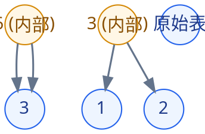

# 5.7 树的应用代码题解析——贪心最优性

既然这章都提到了哈夫曼树，那不妨以此为基础拓展出一类贪心问题的证明思路-交换论证

---

## 5.7.1 Lab 05-E-16：最优合并问题

题目：给定 $n$ 个有序表的长度，每次只能合并两个表，代价为两表长度之和。求把所有表合并成一个有序表的最小总代价。（完整题面可跳转至 [Lab 05-E-16](../../labs/chapter-05/exercise/E-05-16-optimal-merge/README.md)）

关键词：贪心，交换论证，哈夫曼树

### 1.分析

这在OI里是一道经典题目，出自 [NOIP 2004 提高组] 合并果子

下文中的果子指的就是此题的表，果子数量就是表的长度

交换论证的精髓在于通过小范围的讨论得到合适的贪心策略，这题取3堆果子来看

假设现在只有 3 堆果子，果子的数量分别为 a,b,c，假设 a≤b≤c（a,b,c 的顺序与答案无关），现在开始需要先取 a,b 一定是最优的。

第一种情况：先取 a,b，最终答案为 (a+b)+(a+b+c)=2a+2b+c。

第二种情况：先取 a,c，最终答案为 (a+c)+(a+b+c)=2a+b+2c。

第二种情况：先取 b,c，最终答案为 (b+c)+(a+b+c)=a+2b+2c。

现在需要比较 2a+2b+c,2a+b+2c,a+2b+2c 的大小关系。

因为三个式子都含有 a+b+c，所以可以消掉 把三个式子同时减去 a+b+c。

现在问题就变成了比较 a+b,a+c,b+c 的大小关系。

因为 a≤b≤c，所以 a+b≤a+c≤b+c。

所以第一种情况（先取 a,b）一定是最优的。

再举个例子说明，比如 a=3,b=5,c=9。

第一种情况（先取 a,b）的答案是 2a+2b+c=25。

第二种情况（先取 a,c）的答案是 2a+b+2c=29。

第三种情况（先取 b,c）的答案是 a+2b+2c=31。

通过比较也可以发现第一种情况（先取 a,b）是最优的。

也即我们的贪心策略就是每次取最小的两堆合并

### 2.与哈夫曼编码的同一性

看清了这一点，代码就毫无悬念了：本题和 [Lab 05-E-15 哈夫曼编码](../../labs/chapter-05/exercise/E-05-15-huffman-coding/README.md) 是**同一道题**——最小堆维护当前所有表长，每次弹出两个最小值合并、把和压回堆，并把合并代价累加到答案。样例 `1, 2, 3` 的合并树如下，总代价 $3 + 6 = 9$：

<!-- diagram id="optimal-merge-tree" caption="样例的合并树：总代价 = 两个内部节点权值之和 = 3 + 6 = 9" -->

**复杂度分析**：

- **时间复杂度**：$O(n \log n)$，瓶颈在 $n$ 次堆操作；
- **空间复杂度**：$O(n)$。

::: warning 易错点提醒
1. **`long long` 从读入第一行就该开**：合并代价的上界是 $O(n \cdot \sum a_i)$，$n \le 10^5$、单表长可达 $10^5$ 时答案轻松突破 $2^{31}$。`int` 溢出是本题第一大 WA/RE 来源。
2. **$n = 1$ 时答案是 $0$**：只有一个表，一次合并都不需要。`while (pq.size() > 1)` 的循环条件天然处理了它，但若你手写"循环 $n-1$ 次"就要单独特判。
3. **别真的合并数组**：有些同学习惯用"两个有序数组归并"来模拟，那是 $O(n^2)$ 的思路。本题只问代价，合并树是抽象结构，不需要实体数据。
:::

### 3. 延伸思考

交换论证的生命力远超本题。

::: details 查看思考分析

**变式一：$k$ 路合并。** 若每次可以合并 $k$ 个表呢？贪心仍然是"每次取最小的 $k$ 个"，但有一个前置条件：$k > 2$ 时合并树的内部节点必须**恰好**有 $k$ 个孩子，叶子数 $n$ 与 $k$ 必须满足 $(n - 1) \bmod (k - 1) = 0$，否则要先补零。这正是 [Lab 05-E-17 k 叉哈夫曼树](../../labs/chapter-05/exercise/E-05-17-k-ary-huffman/README.md) 的全部内容——做完本题顺着做它，你会对"为什么二叉时不用补零"（因为 $(n-1) \bmod 1 \equiv 0$ 恒成立）有透彻的理解。

**变式二：证明的边界。** 交换论证依赖"交换不更差"，这要求代价函数对**深度单调**——越深的叶子贡献越大。若题目改成"合并两个表的花费与它们的**内容**有关"（比如逆序对数），交换论证就失效了，贪心不再保证最优。竞赛中遇到"合并果子"的变种，先问一句：代价还是"长度之和"吗？是，则哈夫曼；不是，则要另寻 DP 或图论建模。

**变式三：从合并到拆分。** 洛谷 P1192 及其进阶（石子合并）把"合并"换成"环形拆分"，代价模型类似但最优子结构不同——环形石子合并需要区间 DP 而非贪心，因为分裂点的选择影响后续所有子问题，"局部最优"不再"全局最优"。贪心与 DP 的分界线，往往就画在"交换论证是否成立"上。

:::

---

证明贪心的正确性（交换论证）在设计贪心算法的过程中很重要。27 道本章练习题的分层训练路线见 [5.6.3](./06-problem-solving.md#563-本章代码题分层训练路线)。
