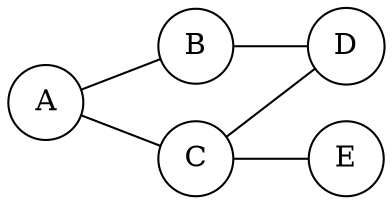

# 7.1 图的遍历

遍历图意味着按某种顺序访问可达顶点。与树不同，图可能存在回路、交叉边与多个连通分量，必须显式记录“是否已经发现”，否则会重复访问甚至无限循环。

## 学习目标

- 实现 DFS（递归或显式栈）与 BFS（队列）；
- 处理非连通图，保证每个顶点恰好归入一个遍历分量；
- 分析邻接表与邻接矩阵上的遍历复杂度；
- 解释 BFS 为什么得到无权图最短步数；
- 根据连通性、分层和回溯需求选择遍历方式。

下面这张小图同时包含一个回路和从 `A` 出发的多条路径。DFS 会沿一条路径深入后回溯，BFS 则按距离逐层发现顶点；两者都必须在发现顶点时记录 `visited`。


<!-- diagram id="graph-traversal-example" caption: "同一张无向图上的 DFS 深入与 BFS 分层" -->

## DFS：深度优先

从起点出发，访问一个顶点后立刻深入它的某个未访问邻居；没有可继续的邻居时回溯。

```cpp:line-numbers [dfs.cpp]
void dfs(const GraphList& graph, int u, std::vector<bool>& visited) {
    visited[u] = true;  // 先标记，再递归
    for (const Edge& edge : graph.neighbors(u)) {
        if (!visited[edge.to]) {
            dfs(graph, static_cast<int>(edge.to), visited);
        }
    }
}
```

递归调用栈保存“回到哪里继续扫描”。图可能退化成很深的路径，若输入规模可能超过调用栈限制，应改用显式栈，并让栈帧记录顶点及下一个待检查邻居位置。

## BFS：广度优先

BFS 用队列逐层扩散。起点距离为 0；从距离为 `d` 的顶点第一次发现邻居时，邻居距离为 `d+1`。

```cpp:line-numbers [bfs.cpp]
#include <queue>
#include <vector>

void bfs(const GraphList& graph, int start, std::vector<int>& distance) {
    std::queue<int> queue;
    distance[start] = 0;
    queue.push(start);

    while (!queue.empty()) {
        int u = queue.front();
        queue.pop();
        for (const Edge& edge : graph.neighbors(u)) {
            int v = static_cast<int>(edge.to);
            if (distance[v] == -1) {
                distance[v] = distance[u] + 1;
                queue.push(v);
            }
        }
    }
}
```

::: theorem 结论 · BFS 的无权最短步数
队列按发现顺序处理顶点。所有距离为 `d` 的顶点都会在任何距离为 `d+1` 的顶点之前出队，因此一个顶点第一次被发现时，记录的距离就是从起点出发的最少边数。
:::

::: pitfall 易错点 · 入队时标记
必须在顶点**入队时**设置距离或访问标记。若等到出队才标记，同一顶点可能被多个邻居重复入队，不仅浪费空间，还会让前驱和距离的第一次确定语义变得混乱。
:::

## 非连通图与遍历森林

一次 DFS/BFS 只覆盖起点所在分量。遍历整张图时，在外层按顶点编号检查未访问顶点，每遇到一个就启动一次遍历：

```cpp:line-numbers [graph-components.cpp]
std::vector<bool> visited(vertexCount, false);
int components = 0;
for (int u = 0; u < vertexCount; ++u) {
    if (!visited[u]) {
        ++components;
        dfs(graph, u, visited);
    }
}
```

每次启动产生一棵 DFS/BFS 树，全部启动结果组成遍历森林。对无向图，启动次数就是连通分量数；对有向图，这个简单外层循环不等于强连通分量算法。

## 复杂度与适用场景

::: complexity 复杂度 · 图遍历
- 邻接表：每个顶点至多发现一次，每条邻接记录至多扫描一次，时间 $\Theta(n+m)$，访问数组与栈/队列空间 $O(n)$；
- 邻接矩阵：每处理一个顶点都扫描长度为 $n$ 的矩阵行，时间 $\Theta(n^2)$，辅助空间仍为 $O(n)$。

DFS 递归栈最坏 $O(n)$；BFS 队列在宽图中也最坏保存 $O(n)$ 个顶点。
:::

| 问题 | 更自然的起点 |
| --- | --- |
| 连通性、连通分量 | DFS 或 BFS |
| 无权图最短步数 | BFS |
| 拓扑排序、时间戳、回边检测 | DFS |
| 按距离分层、逐层扩散 | BFS |
| 深度受控的回溯搜索 | DFS |

遍历顺序还受邻接表内部顺序影响。同一张图可能有多种合法 DFS/BFS 序列；需要确定性输出时，应明确邻居排序规则。

## 小结与自测

图遍历的核心是“发现标记 + 邻居次序 + 栈或队列”。标记控制重复，容器控制深度或广度优先，外层循环覆盖非连通分量，存储表示决定扫描边的真实成本。

1. 为什么 BFS 在入队时标记，而不是出队时？
2. 无向图 DFS 判环为什么要排除回到父节点的边？
3. 同一张图改变邻接表顺序，会改变哪些结果，哪些性质不变？
4. 邻接矩阵和邻接表上的 DFS 复杂度分别是什么？
5. 外层启动次数为什么不能直接表示有向图强连通分量数？

下一节进入[7.2 最小生成树与最短路径](./02-applications.md)。
