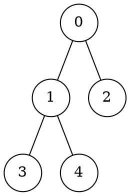

# 7.1 图的遍历：DFS 与 BFS

图没有"第一个元素"，也没有"下一个元素"。想系统地访问一张图，必须先约定一条路线——这就是**图遍历**（graph traversal）。本节的两条经典路线是深度优先搜索（DFS）和广度优先搜索（BFS）：DFS 认准一条路走到黑，走不通再回头；BFS 先访问近的，再一层一层往外扩。它们解决的问题相同，差别只在**先走哪一步**。

本节先用一张小图走通这两条路线，再逐步补上定义、代码、复杂度与证明。四个问题贯穿全节：

1. 为什么必须标记"已访问"？什么时候标记？
2. DFS 怎么走？递归和显式栈有什么不同？
3. BFS 怎么走？为什么它能求无权图最短距离？
4. 两种遍历的代价各是多少？什么时候该选哪一个？

## 学习目标

完成本节后，你应该能够：

- 说出图遍历要解决什么问题，以及 `visited` 标记的作用；
- 手推 DFS 与 BFS 在给定邻接表上的访问顺序；
- 用递归与显式栈实现 DFS，用队列实现 BFS；
- 解释"入队/入栈时标记"为什么优于"出队/出栈时标记"；
- 说明 BFS 为什么能得到无权最短距离，DFS 为什么不能；
- 比较两种遍历在邻接表与邻接矩阵下的时间、空间复杂度；
- 用发现时间与完成时间描述 DFS 树中的祖先关系（括号化定理）；
- 对 DFS 产生的边进行分类，并用后向边判断有向图是否存在环。

## 一张小图，两条路线

下面这张图有 5 个顶点、4 条边。本节所有示例都用它，方便对比两种走法：


<!-- diagram id="dfs-bfs-example-graph" caption: "7.1 示例图：5 个顶点、4 条边的无向图" -->

从顶点 `0` 出发：

- **DFS：认准一条路走到底，走不通就回头换一条。**

  ```text
  第 1 条路：0 → 1 → 3     3 走不通，退回 1
  第 2 条路：1 → 4         4 走不通，退回 0
  第 3 条路：0 → 2         2 走不通，结束
  访问顺序：0, 1, 3, 4, 2
  ```

- **BFS：先访问近的，再一层一层往外扩。**

  ```text
  第 0 层：{0}
  第 1 层：{1, 2}
  第 2 层：{3, 4}
  访问顺序：0, 1, 2, 3, 4
  ```

两种走法访问的顶点完全相同，顺序不同。后面所有概念——标记、栈、队列、复杂度、最短距离——都围绕这两张路线图展开：==先记住"怎么走"，再研究"为什么"==。

::: tip 示例图为什么没有环
这张示例图故意不设环，先把"怎么走"看清。环会在后面的标记部分专门处理——正是它逼出了 `visited` 数组。
:::

## 遍历问题与前置约定

### 什么是图遍历

::: definition 定义 · 图遍历
设 $G=(V,E)$ 是无向图，$s\in V$ 是起点。从 $s$ 出发的**图遍历**指按某条规则沿边访问 $s$ 所在连通分量中的顶点，且**每个顶点至多访问一次**。图不连通时，单次遍历只覆盖起点所在的分量。
:::

::: tip 有向图怎么办
有向图的情形类似，只是沿边走必须遵守边的方向：邻居列表换成出边列表，"连通分量"相应改成"可达分量"。本节示例与复杂度分析均针对无向图，先掌握无向图；有向图只是把方向约束加回去，其余思路不变。
:::

为什么"至多一次"要专门写出来？因为图里可能有**环**：`A → B → C → A` 这样的环会让"沿边一直走"永远停不下来。无向图的边也会带来同样的麻烦——`0` 和 `1` 相邻，从 `1` 回头就能走回 `0`。标记数组 `visited` 记录哪些顶点已经访问过，是遍历正确性的前提，不是可选项。

::: property 性质 · 两种标记时机
- **第一时间标记**：进入递归函数时、入队时或入栈时立刻标记，顶点在等待期间不会被重复加入；
- **延迟标记**：等到取出顶点时才标记（出队时、出栈时），同一顶点可能在等待期间被多次加入，队列或栈会膨胀，还得额外去重。

本节所有实现都采用第一种：==第一时间标记==。注意，递归 DFS 没有显式的"出栈"动作，重复入栈问题只出现在显式栈版本里。
:::

### 用什么存图：邻接表

遍历的代价取决于“找邻居”的成本。[6.2 图的存储结构](../chapter-06-graph-foundations/02-graph-storage.md)介绍了两种主要表示：邻接矩阵能以 $O(1)$ 判断两点是否相邻，但枚举一个顶点的全部邻居需要 $O(n)$；邻接表只保存实际邻居，因此更常用于图算法。下面用邻接表建图，并将每个顶点的邻居按升序排列：

```cpp:line-numbers [adjacency-list.cpp]
#include <algorithm>
#include <iostream>
#include <vector>

int n = 0, m = 0;
std::cin >> n >> m;
std::vector<std::vector<int>> graph(n);   // graph[u] 是顶点 u 的邻居列表
for (int i = 0; i < m; ++i) {
    int u = 0, v = 0;
    std::cin >> u >> v;
    graph[u].push_back(v);
    graph[v].push_back(u);   // 无向边记录两个方向
}
// 升序排列邻居，让遍历结果唯一可复现
for (auto& neighbors : graph) std::sort(neighbors.begin(), neighbors.end());
```

这段代码做四件事：读入顶点数 $n$ 和边数 $m$；为每个顶点建一个空列表；把每条无向边 $(u,v)$ 的两个方向都记进去（`graph[u]` 里放 `v`，`graph[v]` 里放 `u`）；最后把每个顶点的邻居按编号升序排好。之后遍历时，只需要不断问"当前顶点的邻居是谁"。

::: tip 为什么排序邻居
遍历结果取决于"先访问哪个邻居"。题目要求结果唯一时，通常规定邻居按编号升序访问，本文示例也是如此。代码里最后一行 `sort` 就是为这个约定服务的。
:::

## DFS：深度优先搜索

### 直觉：走到底，再回头

DFS 的规则一句话：**能深入就深入，深入不了就退回一步，换下一个没走过的邻居**。前面小图里，`0 → 1 → 3` 走到死路后退回 `1` 换走 `4`；`4` 也走不通，再一路退回 `0` 走 `2`——这个过程就是==回溯==（backtracking）。

::: intuition 直觉 · 与树的先序遍历同构
一棵树的 DFS 就是[第 4 章二叉树](../chapter-04-tree/02-binary-tree.md)的**先序遍历**：访问根，再依次先序遍历每个子树。图的 DFS 只是多了一道约束——图里有环，要用 `visited` 挡住"走回祖先"的回头路。图的递归代码和树的递归代码几乎一样，只是把 `left/right` 换成了"邻居列表"。
:::

### 递归实现

递归代码直接对应规则：访问当前顶点，再对每个未访问的邻居递归进入。

```cpp:line-numbers [dfs-recursive.cpp]
#include <vector>

void dfs(int u, const std::vector<std::vector<int>>& graph,
         std::vector<bool>& visited, std::vector<int>& order) {
    // 进入顶点时立即标记
    visited[u] = true;          // [!code highlight]
    order.push_back(u);         // 记录访问顺序
    for (int v : graph[u]) {
        if (!visited[v]) dfs(v, graph, visited, order);
    }
}
```

函数体只有三件事：`visited[u] = true` 标记当前顶点；`order.push_back(u)` 记录访问顺序；`for` 循环逐个处理未访问的邻居，对每个邻居递归调用自身。某个邻居的整棵子树走完后，函数返回，循环继续检查下一个邻居——代码里的"返回"就是直觉里的"回头"。

::: example 示例 · 递归 DFS 怎么走
对照路线图，从 `0` 出发，邻居升序：

| 步骤 | 动作 | 调用栈（自底向上） | 访问顺序 |
| --- | --- | --- | --- |
| 1 | 进入 0 | 0 | 0 |
| 2 | 进入 1 | 0, 1 | 0, 1 |
| 3 | 进入 3 | 0, 1, 3 | 0, 1, 3 |
| 4 | 3 无路可走，返回 1 后进入 4 | 0, 1, 4 | 0, 1, 3, 4 |
| 5 | 4 无路可走，一路返回 0 后进入 2 | 0, 2 | 0, 1, 3, 4, 2 |
| 6 | 2 无路可走，依次返回 | 空 | 完成 |

第 4、5 步是关键：`3` 只有邻居 `1` 且已访问，函数就一层层返回；回到 `1` 发现还有没走过的 `4`，于是进入第二条路。这就是"走不通就回头换一条"。
:::

上面的 `order` 记录的是**发现顺序**：顶点第一次被访问的顺序。如果把 `order.push_back(u)` 移到递归调用全部返回之后，记录的就是**完成顺序**——它对应树的"后序遍历"，在拓扑排序（给有向图的顶点排一个"依赖在前"的线性顺序）等场景中更有用。两种顺序都是 DFS 的合法输出，题目问哪一种，要看它要求输出什么。

### 显式栈实现

递归的调用栈（系统自动保存"回到哪里继续"的栈）由系统维护。如果图是一条很长的链，递归深度会达到顶点数 $n$，可能**栈溢出**（系统分配给递归调用的内存被用尽）。显式栈版本自己管理"下一步去哪"，行为等价，但深度可控：

若要求与递归版严格一致，显式栈必须保存“顶点 + 下一个邻居下标”的递归帧，逐个处理升序邻居；简单地把所有邻居逆序压栈并在入栈时标记，只能保证可达集合相同，遇到交叉边时访问顺序可能不同。

```cpp:line-numbers [dfs-stack.cpp]
#include <stack>
#include <vector>

void dfs_iterative(int start, const std::vector<std::vector<int>>& graph,
                   std::vector<bool>& visited, std::vector<int>& order) {
    std::stack<int> pending;
    pending.push(start);
    // 入栈时标记，避免同一顶点重复入栈
    visited[start] = true;      // [!code highlight]
    while (!pending.empty()) {
        int u = pending.top();
        pending.pop();
        order.push_back(u);
        // 逆序入栈，弹出时即按升序访问
        for (int i = static_cast<int>(graph[u].size()) - 1; i >= 0; --i) {
            int v = graph[u][i];
            if (!visited[v]) {
                visited[v] = true;
                pending.push(v);
            }
        }
    }
}
```

上面的简化代码只用于说明“待访问顶点”栈；严格模拟递归时，应将待处理邻居下标一并保存于栈帧中。这样每次只深入一个邻居，返回后再继续当前顶点的下一个邻居，才能在交叉边场景保持完全相同的发现顺序。

::: pitfall 易错点 · 两种 DFS 的访问顺序不必相同
- **区别**：递归版在进入时标记、立即深入；显式栈版在入栈时标记、出栈后才访问。
- **后果**：入栈顺序、标记时机不同，访问顺序可能不同；始终一致的是"访问过的顶点集合"。
- **约定**：想和递归版顺序一致，应使用“递归帧 + 逐邻居推进”；逆序批量压栈不提供严格顺序保证。
:::

### 复杂度

::: complexity 复杂度 · DFS
令 $n=|V|$、$m=|E|$。邻接表上每个顶点进入一次、每条边扫描一次，时间为 $O(n+m)$；`visited` 与栈各占 $O(n)$ 空间，递归版的系统栈最坏也是 $O(n)$——渐近相同，但栈帧开销更大、受系统限制更紧，深度大时应改用显式栈。邻接矩阵上扫邻居要 $O(n^2)$ 时间，存储本身还要 $O(n^2)$ 空间。
:::

### DFS 能做什么

"深入 + 回溯"适合需要**探索完整路径**的问题：

- **连通分量**：一次 DFS 覆盖起点所在分量；对所有未访问顶点各启动一次，就能数出全图有几个分量；
- **环检测**：无向图中，DFS 遇到"已访问但不是父顶点"的邻居，说明存在环。这里"父顶点"指从它一步走到当前顶点的那个顶点；
- **回溯枚举**：八皇后、排列组合、迷宫路径这类"试一条路、不行就退"的问题，本质都是 DFS。

::: warning DFS 不保证最短
DFS 优先深入，第一次到达某顶点时走过的边数**未必最少**。无权图的最短距离要交给 BFS。
:::

### DFS 时间戳与括号化定理

DFS 除了输出"访问顺序"，还可以给每个顶点记下两个时间戳，从而精确刻画顶点在 DFS 树中的祖先关系。递归版 DFS 在进入顶点时记录**发现时间**，在所有邻居处理完毕、返回之前记录**完成时间**：

```cpp:line-numbers [dfs-timestamps.cpp]
#include <vector>

int timer = 0;   // 全局时钟
void dfs(int u, const std::vector<std::vector<int>>& graph,
         std::vector<bool>& visited, std::vector<int>& d, std::vector<int>& f) {
    visited[u] = true;
    d[u] = ++timer;            // 发现时间：进入顶点时
    for (int v : graph[u]) {
        if (!visited[v]) dfs(v, graph, visited, d, f);
    }
    f[u] = ++timer;            // 完成时间：全部邻居处理完后
}
```

上面的 `dfs` 只从 `u` 出发，覆盖 `u` 所在的可达分量。若想让全图每个顶点都有时间戳（构造完整 DFS 森林），需要在外层对所有未访问顶点各启动一次：

```cpp:line-numbers [dfs-forest.cpp]
for (int v = 0; v < n; ++v) {
    if (!visited[v]) dfs(v, graph, visited, d, f);
}
```

::: definition 定义 · 发现时间与完成时间
顶点 $u$ 的**发现时间** $d[u]$ 是 $u$ 第一次被访问（进入递归调用）的时刻；**完成时间** $f[u]$ 是 $u$ 的所有邻居都处理完毕、即将返回的时刻。单次 `dfs(u)` 只覆盖 $u$ 所在的可达分量：该分量含 $k$ 个顶点时产生 $2k$ 个时间戳。对整张 $n$ 个顶点的图做一次完整遍历（对所有未访问顶点各启动一次 DFS，构造 DFS 森林），才会使用 $1, 2, \dots, 2n$ 共 $2n$ 个时间戳，分别对应每个顶点的"进入"与"离开"。
:::

::: theorem 定理 · 括号化定理
对同一棵 DFS 树中的任意两个顶点 $u$、$v$，以下三种情况恰好有一种成立：

1. $u$ 是 $v$ 的祖先，且 $d[u] < d[v] < f[v] < f[u]$，即 $u$ 的区间完整包含 $v$ 的区间；
2. $v$ 是 $u$ 的祖先，且 $d[v] < d[u] < f[u] < f[v]$；
3. $u$、$v$ 互不为祖先，两个区间互不相交。
:::

::: pitfall 易错点 · 只看完成时间不够
仅由 $f[u] > f[v]$ 不能推出"$u$ 是 $v$ 的祖先"：$u$、$v$ 位于两个互不相交的子树时同样满足。祖先关系的充要条件是区间嵌套：$d[u] < d[v] < f[v] < f[u]$ 当且仅当 $u$ 是 $v$ 的祖先。
:::

### DFS 边分类

DFS 过程中顶点的状态可以看作三种"颜色"：**白色**（尚未发现）、**灰色**（已发现、尚未完成，仍在递归栈中）、**黑色**（已完成）。当 DFS 检查一条边 $(u,v)$ 时，按 $v$ 此时的状态把边分类。以下四类边针对**有向图**；无向图每条边会被两个端点各扫描一次，DFS 只会产生**树边**与**后向边**，不会出现前向边与交叉边。

::: definition 定义 · DFS 边的四种类型
- **树边**：$v$ 为白色，$(u,v)$ 成为 DFS 树中的一条边；
- **后向边**：$v$ 为灰色，即 $v$ 是 $u$ 的祖先；
- **前向边**：$v$ 为黑色且是 $u$ 的后代；
- **交叉边**：$v$ 为黑色但不是 $u$ 的后代。
:::

::: example 示例 · 后向边与交叉边
有向图边集 $\{1\to2,\ 2\to3,\ 3\to1,\ 1\to4,\ 4\to2\}$，从顶点 1 出发 DFS（邻居按编号升序）：$1\to2\to3$ 后，边 $3\to1$ 指向灰色的 1，是后向边；3、2 依次完成后，从 1 再进入 4，边 $4\to2$ 指向已完成的 2，且 2 不是 4 的祖先，是交叉边。
:::

::: property 性质 · 无后向边与无环
有向图存在环，当且仅当其 DFS 森林中存在后向边。因此 DFS 森林中无后向边等价于该图是无环有向图（DAG），而 DAG 一定存在拓扑排序。
:::

## BFS：广度优先搜索

### 直觉：一圈一圈往外扩

本节讨论的是**无权图**，即每条边的代价都视为 1；BFS 的"按层"只在这一前提下成立，带权图要改用[7.3 节](./03-shortest-path.md)的 Dijkstra（一种求带权最短路径的经典算法）。BFS 的规则一句话：**先访问起点，再访问起点的全部邻居，再访问邻居的邻居**。前面小图里，`{1, 2}` 是第 1 层，`{3, 4}` 是第 2 层，BFS 严格按层访问。队列的"先进先出（FIFO）"恰好保证这一点：先入队的（更近的）一定先出队。第 2 章的[队列应用](../chapter-02-stack-queue/03-applications.md)已预告过这种"按层扩散"，这里正式用在图上。

::: definition 定义 · 按层访问
把到起点 $s$ 需要最少 $k$ 条边的顶点称为**第 $k$ 层**。第 0 层是 $s$ 自己；第 $k+1$ 层由第 $k$ 层顶点的未访问邻居构成。BFS 按第 0、1、2……层依次访问。
:::

### 队列实现

DFS 用栈（后进先出，先深入），BFS 用队列（先进先出，先扩散）——这是两者唯一的本质差别。下面代码同时维护访问顺序 `order` 和距离 `dist`：`dist[v]` 表示 $s$ 到 $v$ 的最少边数，用 `-1` 兼作"未访问"标记。

```cpp:line-numbers [bfs.cpp]
#include <queue>
#include <vector>

void bfs(int start, const std::vector<std::vector<int>>& graph,
         std::vector<int>& order, std::vector<int>& dist) {
    int n = static_cast<int>(graph.size());
    dist.assign(n, -1);         // -1 表示未访问
    std::queue<int> pending;
    pending.push(start);
    // 入队时标记：起点距离为 0
    dist[start] = 0;            // [!code highlight]
    while (!pending.empty()) {
        int u = pending.front();
        pending.pop();
        order.push_back(u);
        for (int v : graph[u]) {
            if (dist[v] != -1) continue;   // 已入过队的顶点跳过
            // 邻居比当前顶点远一层
            dist[v] = dist[u] + 1;         // [!code highlight]
            pending.push(v);
        }
    }
}
```

这份代码里，`pending` 是"等待访问"的队列：每轮取出队首顶点 `u` 访问，再把它尚未访问的邻居 `v` 加入队尾，同时用 `dist[v] = dist[u] + 1` 记下"v 比 u 远一层"。因为队列先进先出，先入队的顶点一定先被处理，这正是按层扩散。`dist` 第一次被赋值时就是最短距离，下一小节会给出证明。

注意 `-1` 的双重语义：遍历过程中 `dist[v] == -1` 表示"尚未发现"；遍历结束后仍为 `-1` 的顶点才是真正不可达。用同一个值兼任标记与最终结果，是常见的省空间写法，区分靠的是"遍历是否结束"。

::: example 示例 · BFS 队列变化
对照路线图，从 `0` 出发：

| 步骤 | 出队 | 新入队 | 队列（队首 → 队尾） | 距离 |
| --- | --- | --- | --- | --- |
| 初始 | — | 0 | 0 | `dist[0] = 0` |
| 1 | 0 | 1, 2 | 1, 2 | `dist[1] = dist[2] = 1` |
| 2 | 1 | 3, 4 | 2, 3, 4 | `dist[3] = dist[4] = 2` |
| 3 | 2 | — | 3, 4 | — |
| 4 | 3 | — | 4 | — |
| 5 | 4 | — | 空 | — |

访问顺序 `0, 1, 2, 3, 4`，距离 `dist = [0, 1, 1, 2, 2]`。注意第 1 层 `{1, 2}` 全部先于第 2 层 `{3, 4}` 出队——这正是"先进先出"的效果。
:::

### 为什么 BFS 第一次到达就是最短距离

这是 BFS 最重要的一条性质，也是它和 DFS 的根本区别。先约定记号：$\delta(s,v)$ 表示 $s$ 到 $v$ 的**最少边数**，也就是最短距离。

::: theorem 定理 · BFS 的无权最短距离
无权图 $G=(V,E)$ 上从 $s$ 出发 BFS，顶点 $v$ **首次入队**时，`dist[v]` 就等于 $\delta(s,v)$。
:::

::: proof
先用队列的性质：FIFO 保证第 $k$ 层的顶点全部在第 $k+1$ 层的顶点之前入队，也因此在它们之前出队——队列严格按层推进。

对层数 $k$ 归纳证明"所有距离为 $k$ 的顶点，入队时得到的 `dist` 都等于 $k$"。$k=0$ 时只有 $s$，`dist[s]=0`，成立。假设第 $k$ 层成立。处理第 $k$ 层的顶点 $u$ 时，未访问邻居 $v$ 首次入队，记 `dist[v] = dist[u] + 1 = k + 1`。若 $\delta(s,v)\le k$，则 $v$ 属于第 $k$ 层或更低层，按归纳假设应已入队，与"未访问"矛盾；而经过 $u$ 的路径又给出 $\delta(s,v)\le k+1$。所以 $\delta(s,v)=k+1$，首次入队即最短。
:::

::: corollary 推论 · 无权图最短路径
边权相同（无权）的图中，从 $s$ 到所有可达顶点的最短距离，一次 BFS 就能在 $O(n+m)$ 内全部求出；不可达顶点保持 `-1`。
:::

### 复杂度

::: complexity 复杂度 · BFS
邻接表上每个顶点入队一次、每条边扫描一次，时间为 $O(n+m)$；`dist` 与队列各占 $O(n)$ 空间。邻接矩阵上扫邻居要 $O(n^2)$ 时间。
:::

### BFS 能做什么

- **无权最短路径**：`dist` 数组就是答案；
- **按层处理**：需要"先处理近的，再处理远的"的问题，如状态空间（把每种局面抽象成一个顶点的图）最少步数、迷宫最短路；
- **二分图判定**：给顶点交替染色，BFS 逐层扩散时若发现相邻同色，就不是二分图。

## 一张表对比

| 维度 | DFS | BFS |
| --- | --- | --- |
| 辅助结构 | 栈（递归或显式栈） | 队列 |
| 访问顺序 | 沿一条链深入，回头换链 | 按层逐圈扩散 |
| 无权最短距离 | 不保证 | 首次入队即最短 |
| 空间 | $O(n)$（栈深度） | $O(n)$（队列宽度） |
| 实现形态 | 递归直观；显式栈防爆栈 | 迭代 + 队列 |
| 典型场景 | 连通分量、环检测、回溯 | 无权最短路、按层处理 |

邻接表下两者都是 $O(n+m)$，选谁取决于**问题性质**：要最短距离选 BFS，要探索完整路径选 DFS。

渐近空间都是 $O(n)$，但瓶颈形状不同：链状图（顶点排成一条长链）里 DFS 的栈深是 $O(n)$、BFS 的队列只有 $O(1)$；星形图（一个中心顶点连着其余所有顶点）则相反。选型时可以把图结构也纳入考虑。

## 易错点

::: pitfall 易错点 · 标记时机
- **错误做法**：等到出队/出栈时才标记。
- **后果**：同一顶点被多个邻居反复加入，队列或栈膨胀到 $O(n^2)$ 量级。
- **正确做法**：入队/入栈/进入时立刻标记。
:::

::: pitfall 易错点 · 非连通图只访问一个分量
- **错误做法**：只从起点跑一次遍历，就以为访问了全图。
- **后果**：其余分量的顶点完全没被访问。
- **正确做法**：对每个尚未访问的顶点依次启动遍历；只问"从 $s$ 可达"时，不可达顶点保留 `-1`。
:::

::: pitfall 易错点 · 递归深度爆栈
- **错误做法**：深图（如 $n=10^5$ 的链）上直接递归 DFS。
- **后果**：递归深度等于路径长度，系统栈溢出。
- **正确做法**：改用显式栈 DFS，或换 BFS。
:::

::: pitfall 易错点 · 邻居顺序影响结果
- **错误做法**：不排序，直接按输入顺序访问邻居。
- **后果**：同一张图可能输出不同的遍历序列。
- **正确做法**：题目要求结果唯一时，先看邻居顺序规定（通常升序），再写代码。
:::

::: pitfall 易错点 · 栈与队列混用
- **错误做法**：把 BFS 的 `queue` 换成 `stack`，或把 DFS 的栈换成队列。
- **后果**：程序不会崩溃，但访问顺序变成另一种风格——BFS 用栈会"沿一条链深入"，`dist` 也不再是最短距离。
- **正确做法**：写完先在小图上手推一遍（比如本文示例图），确认顺序符合直觉再提交。
:::
## 练习

**复述**

1. 为什么 BFS 必须入队时标记？改成出队时标记，时间和空间分别会怎样？

**推演**

2. 用本节示例图，手推从顶点 `3` 出发的 DFS 与 BFS 访问顺序，比较差异。
3. 若图改用邻接矩阵存储，BFS 的复杂度变成多少？稀疏图为什么必须避免邻接矩阵？
4. 图不连通时，单次 BFS 能得到全部顶点的最短距离吗？要怎么做？

**迁移**

5. 画一个从 $s$ 到 $t$ 的图，使 DFS 从 $s$ 出发优先访问的路径不是最短路径，并标注 DFS 的访问顺序，说明为什么 DFS 第一次到达 $t$ 的边数可能不是最少的。
6. 显式栈 DFS 的"逆序入栈"和"入栈时标记"各自解决什么问题？去掉其中一个，示例顺序会怎么变？
7. 递归 DFS 在 $n=10^6$ 的链状图上会怎样？换成显式栈后，时间复杂度和空间复杂度分别发生了什么变化？为什么系统栈会爆而显式栈不会？

