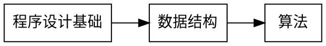
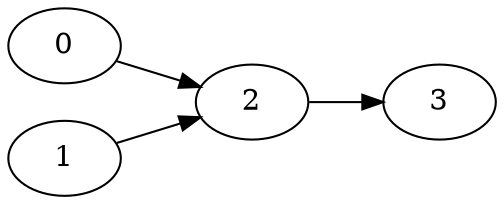
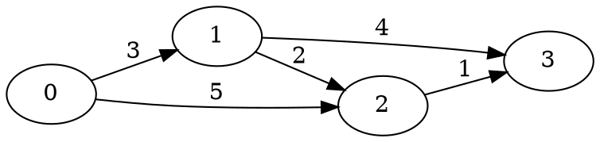

# 7.2 拓扑排序与有向无环图

上一节的 DFS 关心“怎样访问顶点”。这一节把注意力转向有向图中的**先后关系**：课程有先修课，程序有编译依赖，工程有活动依赖。它们都可以用一条有向边表达“必须先完成”。

例如，学习《算法》前需要先学习《数据结构》，学习《数据结构》前需要先学习《程序设计基础》。用边表示“先修课 → 后续课程”：


<!-- diagram id="topological-prerequisites" caption="7.2 课程先修关系：箭头方向表示必须先完成的课程" -->

如果我们把所有课程排成一个线性序列，并保证每条边都从左指向右，这个序列就是一个合法的学习顺序。对图来说，这就是**拓扑排序**。

## 1. DAG 与拓扑序

::: definition 定义 · 拓扑序
有向图 $G=(V,E)$ 的一个拓扑序，是顶点的一个排列 $v_1,v_2,\dots,v_n$，使得对每条有向边 $u\to v$，顶点 $u$ 都出现在 $v$ 之前。
:::

::: definition 定义 · 有向无环图
不含有向环的有向图称为**有向无环图**（Directed Acyclic Graph，DAG）。
:::

拓扑序与 DAG 之间有一个非常重要的等价关系：

::: theorem 定理 · 拓扑排序存在条件
一个有向图存在拓扑序，当且仅当它是 DAG。
:::

::: proof
如果图有拓扑序，那么沿着每条边都必须向序列右侧前进。若存在有向环，沿环走一圈会要求某个顶点既在自己之前又在自己之后，矛盾，所以有拓扑序的图一定无环。

反过来，设图是 DAG。DAG 必然至少有一个入度为 `0` 的顶点：如果每个顶点都有入边，就从任意顶点沿入边不断向前走；顶点数有限，最终会重复某个顶点，形成有向环，矛盾。取出一个入度为 `0` 的顶点，删除它和它发出的边，剩余图仍是 DAG。重复这个过程，便能依次得到所有顶点的拓扑序。
:::

拓扑序通常不唯一。例如图中只有 `A → C` 和 `B → C` 两条边时，`A B C` 与 `B A C` 都合法。若题目要求唯一输出，必须额外规定并列时如何选择；下面的 Kahn 实现用小根堆保证得到字典序最小的拓扑序。

## 2. Kahn 算法：从入度为 0 的顶点开始

### 2.1 为什么入度为 0 就能先做

顶点的入度是指向它的边数。入度为 `0` 表示没有尚未完成的前置任务，因此它可以排在当前序列的下一个位置。

选择顶点 `u` 后，所有 `u → v` 的依赖都被满足，所以可以把这些边从图中“删除”：`v` 的入度减 `1`。如果 `v` 的入度因此变成 `0`，就把 `v` 放入待处理集合。

以课程图为例：


<!-- diagram id="kahn-course-example" caption="7.2 Kahn 算法示例图：0 和 1 可以先处理，随后才能处理 2、3" -->

初始入度为 `indegree = [0, 0, 2, 1]`，所以 `0`、`1` 可以先选。若先选 `0`，`2` 的入度变为 `1`；再选 `1`，`2` 变为 `0`，随后才能选 `2`，最后选 `3`。

### 2.2 手推一个有环例子

考虑 `0 → 1 → 2 → 0`。三个顶点的入度都是 `1`，开始时没有任何入度为 `0` 的顶点，队列为空，算法无法输出一个顶点。更一般地，如果算法结束时输出数小于 `n`，剩下的顶点必然形成环或依赖在环上。

### 2.3 C++ 实现：队列版

下面的代码使用普通队列。它适合只要求“任意一个拓扑序”的题目：

::: details 可编译 C++17 完整实现 · 队列版拓扑排序
```cpp:line-numbers [topological-sort-queue.cpp]
#include <iostream>
#include <queue>
#include <vector>

using namespace std;

int main() {
    ios::sync_with_stdio(false);
    cin.tie(nullptr);

    int n, m;
    cin >> n >> m;
    vector<vector<int>> graph(n);
    vector<int> indegree(n, 0);

    for (int i = 0; i < m; ++i) {
        int u, v;
        cin >> u >> v;
        graph[u].push_back(v);
        ++indegree[v];
    }

    queue<int> ready;
    for (int u = 0; u < n; ++u) {
        if (indegree[u] == 0) ready.push(u);
    }

    vector<int> order;
    while (!ready.empty()) {
        int u = ready.front();
        ready.pop();
        order.push_back(u);

        for (int v : graph[u]) {
            --indegree[v];
            if (indegree[v] == 0) ready.push(v);
        }
    }

    if (static_cast<int>(order.size()) != n) {
        cout << "cycle\n";
        return 0;
    }
    for (int i = 0; i < n; ++i) {
        if (i) cout << ' ';
        cout << order[i];
    }
    cout << '\n';
}
```
:::

### 2.4 C++ 实现：字典序最小的拓扑序

如果当前有多个入度为 `0` 的顶点，使用 `priority_queue<int, vector<int>, greater<int>>` 取编号最小者。注意：这不是拓扑排序的必要条件，而是为了让输出确定，方便评测和复现。

::: details 可编译 C++17 完整实现 · 字典序最小拓扑排序
```cpp:line-numbers [topological-sort-lexicographic.cpp]
#include <functional>
#include <iostream>
#include <queue>
#include <vector>

using namespace std;

int main() {
    ios::sync_with_stdio(false);
    cin.tie(nullptr);

    int n, m;
    cin >> n >> m;
    vector<vector<int>> graph(n);
    vector<int> indegree(n, 0);

    for (int i = 0; i < m; ++i) {
        int u, v;
        cin >> u >> v;
        graph[u].push_back(v);
        ++indegree[v];
    }

    priority_queue<int, vector<int>, greater<int>> ready;
    for (int u = 0; u < n; ++u) {
        if (indegree[u] == 0) ready.push(u);
    }

    vector<int> order;
    while (!ready.empty()) {
        int u = ready.top();
        ready.pop();
        order.push_back(u);
        for (int v : graph[u]) {
            if (--indegree[v] == 0) ready.push(v);
        }
    }

    if (static_cast<int>(order.size()) != n) {
        cout << "cycle\n";
    } else {
        for (int u : order) cout << u << ' ';
        cout << '\n';
    }
}
```
:::

::: complexity 复杂度 · Kahn 算法
邻接表中每个顶点入队一次，每条边恰好减少一次入度。使用普通队列时，时间复杂度为 $O(n+m)$；使用小根堆保证字典序最小时，时间复杂度为 $O((n+m)\log n)$。图、入度数组和待处理集合占用 $O(n+m)$ 空间。
:::

## 3. DFS 后序拓扑排序

Kahn 算法从“入度为 0”出发；DFS 算法从“后继全部完成”出发。对顶点 `u`，先递归处理所有邻居，等所有后继完成后再把 `u` 放进结果。最后把结果反转。

为什么要反转？如果有边 `u → v`，DFS 只有在 `v` 完成后才会完成 `u`，所以 `u` 的完成时间比 `v` 晚。按完成时间从大到小输出，`u` 就会排在 `v` 前面。

DFS 还要检测环。用三种颜色表示状态：

- `0`：白色，尚未进入；
- `1`：灰色，已经进入但还没有返回；
- `2`：黑色，所有后继都处理完。

如果访问 `u → v` 时 `color[v] == 1`，说明 `v` 仍在当前递归路径上，`u → v` 就闭合了一个有向环。

::: details 可编译 C++17 完整实现 · DFS 后序拓扑排序
```cpp:line-numbers [topological-sort-dfs.cpp]
#include <algorithm>
#include <iostream>
#include <vector>

using namespace std;

vector<vector<int>> graph;
vector<int> color, order;
bool has_cycle = false;

void dfs(int u) {
    color[u] = 1;
    for (int v : graph[u]) {
        if (color[v] == 0) {
            dfs(v);
        } else if (color[v] == 1) {
            has_cycle = true;
        }
    }
    color[u] = 2;
    order.push_back(u);
}

int main() {
    ios::sync_with_stdio(false);
    cin.tie(nullptr);

    int n, m;
    cin >> n >> m;
    graph.assign(n, {});
    color.assign(n, 0);
    for (int i = 0; i < m; ++i) {
        int u, v;
        cin >> u >> v;
        graph[u].push_back(v);
    }

    for (int u = 0; u < n; ++u) {
        if (color[u] == 0) dfs(u);
    }
    if (has_cycle) {
        cout << "cycle\n";
        return 0;
    }
    reverse(order.begin(), order.end());
    for (int u : order) cout << u << ' ';
    cout << '\n';
}
```
:::

这段程序展示了教材中最直接的 DFS 写法：图、颜色、结果和环标志是统一的全局状态，`dfs(u)` 只表达“完成顶点 `u` 的后序处理”。如果图可能是一条长度达到 `10^5` 的深链，递归可能栈溢出，此时应改用显式栈；Kahn 算法则不受递归深度影响。

## 4. DAG 上的最长路径

在一般图中，求“经过每个顶点至多一次的最长路径”可能非常困难；DAG 没有环，所以顶点一旦按拓扑序处理，所有能影响它的前驱都已经处理完成。

设源点为 `s`，`dist[v]` 表示 `s` 到 `v` 的最长路径长度。初始化 `dist[s] = 0`，其他点为负无穷。沿拓扑序扫描边 `u → v`：

```text
dist[v] = max(dist[v], dist[u] + weight(u, v))
```

例如：


<!-- diagram id="dag-longest-path-example" caption="7.2 DAG 最长路径示例：0 到 3 的最长路径为 0→1→3，长度 7" -->

处理 `0` 后 `dist[1]=3`、`dist[2]=5`；处理 `1` 后 `dist[3]=7`；处理 `2` 后 `dist[3]=6`，所以答案是 `7`。如果误用普通 DFS 顺序而不是拓扑序，可能在前驱尚未确定时就更新后继，得到错误结果。

## 5. 应用：关键路径分析（AOE 网）

### 5.1 活动网络的含义

在 AOE（Activity On Edge）网络中：

- 顶点表示事件，例如“设计完成”“施工开始”；
- 有向边表示活动，例如“完成设计”，边权是活动持续时间；
- 只有所有进入一个事件的活动完成后，该事件才发生。

因此 AOE 网络必须是 DAG。工程总工期不是任意一条路径的长度，而是从开始事件到结束事件的**最长路径**：只有最长的那条链完成，整个工程才完成。

### 5.2 最早时间与最晚时间

`ve[v]` 表示事件 `v` 最早能发生的时间。按拓扑序正推：

```text
ve[v] = max(ve[v], ve[u] + w(u, v))
```

设总工期为所有汇点 `ve` 的最大值。`vl[v]` 表示在不延误总工期的前提下，事件 `v` 最晚发生的时间。初始化所有 `vl` 为总工期，再按逆拓扑序反推：

```text
vl[u] = min(vl[u], vl[v] - w(u, v))
```

对活动 `u → v`：

- 最早开始时间：`e(u,v) = ve[u]`；
- 最晚开始时间：`l(u,v) = vl[v] - w(u,v)`；
- 时间余量：`slack = l - e`。

`slack == 0` 的活动不能延迟，称为关键活动；关键活动连接出的路径就是关键路径。

### 5.3 C++ 实现

下面程序读入一个 DAG，输出总工期和每条活动的时间余量。它也会检查输入是否有环。

::: details 可编译 C++17 完整实现 · AOE 关键路径
```cpp:line-numbers [critical-path.cpp]
#include <algorithm>
#include <iostream>
#include <limits>
#include <queue>
#include <tuple>
#include <vector>

using namespace std;
using Edge = tuple<int, int, long long>;

int main() {
    ios::sync_with_stdio(false);
    cin.tie(nullptr);

    int n, m;
    cin >> n >> m;
    vector<vector<pair<int, long long>>> graph(n);
    vector<int> indegree(n, 0);
    vector<Edge> edges;

    for (int i = 0; i < m; ++i) {
        int u, v;
        long long w;
        cin >> u >> v >> w;
        graph[u].push_back({v, w});
        ++indegree[v];
        edges.push_back({u, v, w});
    }

    queue<int> ready;
    for (int u = 0; u < n; ++u) {
        if (indegree[u] == 0) ready.push(u);
    }

    vector<int> order;
    while (!ready.empty()) {
        int u = ready.front();
        ready.pop();
        order.push_back(u);
        for (auto [v, w] : graph[u]) {
            (void)w;
            if (--indegree[v] == 0) ready.push(v);
        }
    }
    if (static_cast<int>(order.size()) != n) {
        cout << "cycle\n";
        return 0;
    }

    vector<long long> ve(n, 0);
    for (int u : order) {
        for (auto [v, w] : graph[u]) {
            ve[v] = max(ve[v], ve[u] + w);
        }
    }

    long long project_time = 0;
    for (long long value : ve) project_time = max(project_time, value);
    vector<long long> vl(n, project_time);
    for (int i = n - 1; i >= 0; --i) {
        int u = order[i];
        for (auto [v, w] : graph[u]) {
            vl[u] = min(vl[u], vl[v] - w);
        }
    }

    cout << "project_time = " << project_time << '\n';
    for (auto [u, v, w] : edges) {
        long long earliest = ve[u];
        long long latest = vl[v] - w;
        cout << u << " -> " << v
             << ", slack = " << latest - earliest << '\n';
    }
}
```
:::

::: complexity 复杂度 · DAG 动态规划
拓扑排序和最长路径动态规划都只扫描每个顶点和每条边常数次，时间复杂度为 $O(n+m)$，空间复杂度为 $O(n+m)$。
:::

## 6. 常见错误

::: pitfall 易错点 · 把出度当入度
Kahn 算法寻找的是入度为 `0` 的顶点；处理 `u` 后减少的是每个后继 `v` 的入度。
:::

::: pitfall 易错点 · 把任意 DFS 顺序当拓扑序
只有“完成后压入结果，再整体反转”的后序 DFS 才能得到拓扑序；发现顺序不具备这个性质。
:::

::: pitfall 易错点 · 每个汇点单独计算工期
AOE 网络可能有多个汇点。总工期应取所有汇点最早时间的最大值，关键活动也必须相对于这个全局工期计算。
:::

## 代码题练习

按 [Ch7 题集学习清单](./00-exercise-guide.md)练习：

- [T06 · 07E06 · 课程表](../../labs/chapter-07/exercise/E-07-06-course-schedule/README.md)
- [T07 · 07E07 · 课程表 II](../../labs/chapter-07/exercise/E-07-07-course-schedule-ii/README.md)
- [T08 · 07E08 · 找到最终的安全状态](../../labs/chapter-07/exercise/E-07-08-eventual-safe-states/README.md)
- [T09 · 07E09 · 最大食物链计数](../../labs/chapter-07/exercise/E-07-09-food-chain-count/README.md)
- [T10 · 07E10 · 并行课程 III](../../labs/chapter-07/exercise/E-07-10-parallel-courses/README.md)
- [T11 · 07E11 · 关键路径分析（AOE 网）](../../labs/chapter-07/exercise/E-07-11-critical-path/README.md)
