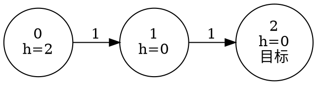

<script setup>
import { withBase } from "vitepress";

const demoUrl = withBase("/demos/astar-pathfinding.html");
</script>

# 7.5 A* 寻路：从直觉到实现

## 从 Dijkstra 到 A*

Dijkstra 只按 `g(n)`（起点到当前点的已知代价）选择候选。在网格上，它会像水波一样向各个方向扩散，直到目标被确定。A* 仍然维护同一套最短路代价，但把“还要走多远”的估计加入优先级：

$$
f(n)=g(n)+h(n).
$$

启发式 `h(n)` 让搜索更早关注目标方向。`h(n)=0` 时 A* 完全退化为 Dijkstra；启发式越接近真实剩余代价，通常展开的节点越少，但不能为了少搜索而牺牲正确性。

## 启发式函数的两个性质

**可采纳（admissible）** 要求 `h(n)` 不高估从 `n` 到目标的真实最短代价，并且 `h(target)=0`。四方向、单位代价网格中的曼哈顿距离满足这一条件；将它乘以 `2` 则可能高估，A* 可能更快但不再保证最优。

**一致（consistent）** 要求每条边 `u -> v` 都满足：

$$
h(u)\le w(u,v)+h(v).
$$

一致性意味着沿任意边前进时 `f` 不会下降，因此节点以当前最小有效记录弹出时，其 `g` 已经确定，不需要重新打开。可采纳但不一致的启发式仍可能找到最优解，但图搜索必须允许重新打开已关闭节点。

## 实现骨架：维护 `g`、`h` 和 `f`

实现只比 Dijkstra 多一个 `h`，以及开放集中的优先级由 `g` 改为 `g+h`。优先队列允许同一节点存在多条旧记录，因此弹出时必须跳过 `current_g != g[u]` 的过期项；目标以有效记录弹出时才可以结束。

```text [astar-skeleton.pseudo]
g[start] = 0，其他顶点为 INF
open.push((g[start] + h(start), g[start], start))
while open 非空:
    (f, current_g, u) = open.pop()
    if current_g != g[u]: continue
    if u == target: return current_g
    for (u, v, w) in edges:
        if current_g + w < g[v]:
            g[v] = current_g + w
            parent[v] = u
            open.push((g[v] + h(v), g[v], v))
return 不可达
```

A* 既记录从起点到当前状态已经付出的代价，也估计当前状态到终点还需要多远，并优先探索总评分较小的候选：

- $g(n)$：从起点到当前节点的已知代价；
- $h(n)$：从当前节点到终点的启发式估计；
- $f(n)$：优先队列中的综合评分。

若 $h(n)=0$，A* 退化为 Dijkstra。若启发式从不高估真实剩余代价，并配合正确的重复状态处理，A* 可以保持最优性；更有信息量的启发式通常减少无关探索。

## 交互式演示

点击“播放”观察完整过程，也可以逐步前进、拖动时间线、画墙或移动起点和终点。开放集表示已发现但尚未展开的候选，关闭集表示已经展开的格子，最终路径在到达终点后回溯得到。

<iframe
  :src="demoUrl"
  title="A* 寻路交互式可视化"
  class="astar-demo-frame"
  loading="lazy"
></iframe>

::: tip 观察三个对照
分别尝试无障碍网格、只有一条窄通道的网格，以及需要远离终点绕行的网格。比较开放集大小、节点展开顺序和最终路径，理解启发式只改变搜索效率，不应改变满足前提时的最优结果。
:::

## 完整解题范例

### 范例一：A* 网格寻路

#### 题目解读

网格中 `0` 表示空地、`1` 表示障碍。起点固定为左上角 `(0,0)`，终点固定为右下角 `(rows-1,cols-1)`；每次只能向上、下、左、右移动一格，每步代价为 `1`。求最少移动次数，不可达或端点是障碍时输出 `-1`。

状态是一个可通行格子；`g` 是已经走过的步数，`h` 使用到终点的曼哈顿距离。因为每次移动至多让曼哈顿距离减少 `1`，`h` 不会高估真实剩余距离，并且满足一致性。

#### 算法分析

维护每个格子的最小已知代价 `distance`，开放集使用按 `(f,g,编号)` 排序的小根堆。找到更小的 `g` 时更新并重新入堆；弹出状态时跳过过期记录。由于启发式一致，当终点以当前有效记录从堆中弹出时，`g` 就是最短距离。

令 $V=rows\times cols$。每个格子只有常数条边，最坏时间复杂度为 $O(V\log V)$，空间复杂度为 $O(V)$。启发式通常减少实际展开量，但不改变最坏阶。

#### 伪代码

```text [astar-grid.pseudo]
若起点或终点是障碍: 输出 -1
将所有 g 初始化为 INF，g[start] = 0
把 (g[start] + h(start), g[start], start) 放入开放集
while 开放集非空:
    (f, current_g, u) = 弹出最小项
    if current_g != g[u]: continue
    if u 是终点: 输出 current_g
    for u 的四个相邻格 v:
        if v 越界或是障碍: continue
        if current_g + 1 < g[v]:
            g[v] = current_g + 1
            压入 (g[v] + h(v), g[v], v)
输出 -1
```

#### 最终代码

::: details 可编译 C++17 实现

```cpp:line-numbers [astar-grid-example.cpp]
#include <functional>
#include <iostream>
#include <limits>
#include <queue>
#include <tuple>
#include <vector>

int main() {
    std::ios::sync_with_stdio(false);
    std::cin.tie(nullptr);

    int rows = 0, cols = 0;
    if (!(std::cin >> rows >> cols)) return 0;
    std::vector<std::vector<int>> grid(rows, std::vector<int>(cols));
    for (auto& row : grid) {
        for (int& cell : row) std::cin >> cell;
    }

    if (grid[0][0] || grid[rows - 1][cols - 1]) {
        std::cout << -1 << '\n';
        return 0;
    }

    const int INF = std::numeric_limits<int>::max() / 4;
    const int target = rows * cols - 1;
    std::vector<int> distance(rows * cols, INF);
    using State = std::tuple<int, int, int>;  // f, g, vertex
    std::priority_queue<State, std::vector<State>, std::greater<State>> open;
    distance[0] = 0;
    open.push({rows + cols - 2, 0, 0});

    const int dr[] = {-1, 0, 1, 0};
    const int dc[] = {0, 1, 0, -1};
    while (!open.empty()) {
        auto [f, g, u] = open.top();
        open.pop();
        (void)f;
        if (g != distance[u]) continue;
        if (u == target) {
            std::cout << g << '\n';
            return 0;
        }

        int row = u / cols;
        int col = u % cols;
        for (int direction = 0; direction < 4; ++direction) {
            int next_row = row + dr[direction];
            int next_col = col + dc[direction];
            if (next_row < 0 || next_row >= rows ||
                next_col < 0 || next_col >= cols ||
                grid[next_row][next_col]) {
                continue;
            }

            int v = next_row * cols + next_col;
            if (g + 1 >= distance[v]) continue;
            distance[v] = g + 1;
            int h = rows - 1 - next_row + cols - 1 - next_col;
            open.push({distance[v] + h, distance[v], v});
        }
    }

    std::cout << -1 << '\n';
}
```

:::

#### 拓展、思考与变式

- 若允许八方向移动，曼哈顿距离不再匹配动作模型；单位对角移动可考虑切比雪夫距离；
- 若不同格子的进入代价不同，应把 `g+1` 改为真实边权，并重新证明启发式可采纳；
- 若需要输出路径，松弛时保存 `parent[v]=u`，终点确定后反向还原；
- 对应练习：[T23 · 07E23 · A* 网格寻路](../../labs/chapter-07/exercise/E-07-23-astar-grid/README.md)；随后可挑战 [T25 · 07E25 · 八数码问题](../../labs/chapter-07/exercise/E-07-25-eight-puzzle/README.md)。

### 范例二：判定启发式是否可采纳且一致

下面的小图以顶点 `2` 为目标。启发式 $h=[2,0,0]$ 没有高估真实距离，所以可采纳；但边 $0\to1$ 上有 $2>1+0$，因此不一致。


<!-- diagram id="astar-heuristic-counterexample" caption="7.4 可采纳但不一致的启发式：顶点 0 的估计未高估目标距离，却违反边上的一致性不等式" -->

#### 题目解读

给定非负权有向图、目标点 `target` 和若干组非负启发式值 `h`。分别判断：

- 可采纳：`h[target]=0`，且每个能到目标的点都满足 $h(u)\le d(u,target)$；
- 一致：`h[target]=0`，且每条边 `u→v` 都满足 $h(u)\le w(u,v)+h(v)$。

无法到达目标的点，其真实距离视为正无穷，所以任何有限非负估计都不会高估；但它所在分量中的边仍必须参加一致性检查。

#### 算法分析

把每条原边 `u→v` 反向为 `v→u`，从目标点运行一次 Dijkstra，即可得到所有 `d(u,target)`。之后对每组启发式扫描全部顶点检查可采纳性，再扫描全部原边检查一致性。

反向 Dijkstra 为 $O((n+m)\log n)$；若有 `k` 组启发式，检查成本为 $O(k(n+m))$，总空间为 $O(n+m)$（若边读入后逐组处理，则无须同时保存全部启发式）。

#### 伪代码

```text [heuristic-validation.pseudo]
反向保存所有边
从 target 在反图上运行 Dijkstra，得到 distance[u] = d(u, target)
for 每组启发式 h:
    admissible = (h[target] == 0)
    consistent = (h[target] == 0)
    for u = 0 .. n-1:
        if distance[u] 有限且 h[u] > distance[u]: admissible = false
    for 每条原边 (u, v, w):
        if h[u] > w + h[v]: consistent = false
    输出两个判断
```

#### 最终代码

::: details 可编译 C++17 实现

```cpp:line-numbers [heuristic-validation-example.cpp]
#include <functional>
#include <iostream>
#include <limits>
#include <queue>
#include <tuple>
#include <utility>
#include <vector>

int main() {
    std::ios::sync_with_stdio(false);
    std::cin.tie(nullptr);

    int n = 0, m = 0, target = 0, count = 0;
    if (!(std::cin >> n >> m >> target >> count)) return 0;

    using Edge = std::tuple<int, int, long long>;
    std::vector<Edge> edges;
    std::vector<std::vector<std::pair<int, long long>>> reversed(n);
    for (int i = 0; i < m; ++i) {
        int u = 0, v = 0;
        long long w = 0;
        std::cin >> u >> v >> w;
        edges.push_back({u, v, w});
        reversed[v].push_back({u, w});
    }

    const long long INF = std::numeric_limits<long long>::max() / 4;
    std::vector<long long> distance(n, INF);
    using Entry = std::pair<long long, int>;
    std::priority_queue<Entry, std::vector<Entry>, std::greater<Entry>> ready;
    distance[target] = 0;
    ready.push({0, target});

    while (!ready.empty()) {
        auto [d, u] = ready.top();
        ready.pop();
        if (d != distance[u]) continue;
        for (auto [v, w] : reversed[u]) {
            if (d + w >= distance[v]) continue;
            distance[v] = d + w;
            ready.push({distance[v], v});
        }
    }

    while (count-- > 0) {
        std::vector<long long> h(n);
        for (long long& value : h) std::cin >> value;
        bool admissible = h[target] == 0;
        bool consistent = h[target] == 0;

        for (int u = 0; u < n; ++u) {
            if (distance[u] != INF && h[u] > distance[u]) {
                admissible = false;
            }
        }
        for (auto [u, v, w] : edges) {
            if (h[u] > w + h[v]) consistent = false;
        }

        std::cout << (admissible ? "YES" : "NO") << ' '
                  << (consistent ? "YES" : "NO") << '\n';
    }
}
```

:::

#### 拓展、思考与变式

- 一致性配合 `h(target)=0` 时，对任何能到达目标的顶点沿路径逐边累加即可推出可采纳性；实现仍按定义分别检查并输出；
- 若边权允许为负，反向 Dijkstra 不再适用，应改用能处理负权的最短路算法；
- 构造启发式时，可从真实距离乘以 $0\le c\le1$ 得到一族可采纳启发式，再检查是否保持一致；
- 对应练习：[T24 · 07E24 · 启发式函数有效性判定](../../labs/chapter-07/exercise/E-07-24-heuristic-validation/README.md)。

## 易错点

::: pitfall 易错点 · 首次发现目标不等于已经最优
目标第一次被加入开放集，只说明找到了一条路径。应在目标以当前有效的最小优先级记录弹出时结束，并跳过所有过期 `g` 记录；否则可能提前返回次优答案。
:::

::: pitfall 易错点 · 可采纳不等于一致
可采纳只比较 `h(u)` 与真实终点距离；一致性检查的是原图中的每一条边。只检查最短路树，或忽略无法到达目标的分量中的边，都会漏掉不一致反例。
:::

## 练习与自测

1. 当 $h(n)=0$ 时，为什么 A* 与 Dijkstra 使用相同的优先级？若希望节点选择顺序也完全相同，还需要什么条件？
2. 在只允许上下左右移动、每步代价为 1 的网格中，曼哈顿距离为什么不会高估真实剩余代价？
3. 若把曼哈顿距离乘以 2 作为启发式，它可能带来什么后果？
4. “可采纳”只要求不高估终点距离；“一致”还要求对每条边 $(u,v)$ 满足 $h(u)\le w(u,v)+h(v)$。一致性为什么能避免已关闭节点被重新打开？
5. 当多个节点的 $f$ 值相同时，改变 tie-breaking 会影响最终最短路径长度吗？会影响什么？

::: details 查看参考思路
1. 此时 $f(n)=g(n)$，两者都优先展开当前已知起点距离最小的节点。若要让具体选择顺序也完全相同，还必须采用相同的并列处理和过期记录处理规则。
2. 每次移动至多让横纵坐标差之和减少 1，因此到达终点至少需要曼哈顿距离所给出的步数。
3. 它可能高估真实距离，使 A* 更激进、展开更少节点，但失去最优性保证。
4. 一致性保证沿路径的 $f$ 值不下降；节点以最小 $f$ 出队关闭时，其最优 $g$ 已经确定，不会再由后续路径改善。若启发式仅可采纳但不一致，图搜索实现通常必须允许重新打开节点。
5. 在启发式和重复状态处理满足最优性前提时，最短代价不变；具体选中的等长路径、节点展开顺序和展开数量可能变化。
:::

<style scoped>
.astar-demo-frame {
  display: block;
  width: 100%;
  height: 980px;
  margin: 20px 0;
  border: 1px solid var(--vp-c-divider);
  border-radius: 10px;
  background: var(--course-code-bg);
}

@media (max-width: 720px) {
  .astar-demo-frame {
    height: 1500px;
  }
}
</style>


## 代码题练习

按[Ch7 题集学习顺序](../../content/chapter-07-graph-traversal/00-exercise-guide.md)练习。清单的规划节编号与当前文章标题对照见该清单；下列入口使用稳定 Lab 编号。

- [T23 · 07E23 · A* 网格寻路](../../labs/chapter-07/exercise/E-07-23-astar-grid/README.md)
- [T24 · 07E24 · 启发式函数有效性判定](../../labs/chapter-07/exercise/E-07-24-heuristic-validation/README.md)
- [T25 · 07E25 · 八数码问题（A*）](../../labs/chapter-07/exercise/E-07-25-eight-puzzle/README.md)
