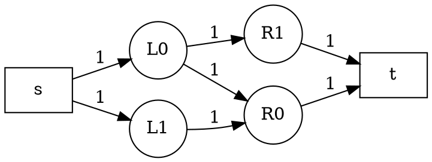

# 7.6 网络流与二分图匹配

本节是第 7 章的拓展。

我们从一个容易画图的问题开始：

> 有几位学生和几门项目，每位学生只能参加一个项目，每个项目也只能安排一位学生。已知每位学生愿意参加哪些项目，最多能安排多少对？

这就是**二分图最大匹配**。解决它时会遇到一个关键困难：当前看起来合适的选择，可能会堵住后面的选择。算法需要允许“撤销旧选择、改走另一条路”。这个思想自然引出残量网络和最大流。

## 1. 二分图与匹配

::: definition 定义 · 二分图
如果顶点可以分成两个不相交的集合 $L$ 和 $R$，且每条边都连接一个左部顶点和一个右部顶点，那么这个图是二分图。
:::

::: definition 定义 · 匹配
匹配是一组没有公共端点的边。也就是说，每个顶点最多出现在一条被选中的边中。边的数量最大的匹配叫最大匹配。
:::

例如，左部是学生 `A,B`，右部是项目 `1,2`，边为 `A-1`、`A-2`、`B-1`。先选 `A-1` 并不代表 `B` 无法安排：可以把 `A` 改到 `2`，再让 `B` 使用 `1`。

### 1.1 增广路

把当前匹配边和未匹配边交替排列。如果一条路径从未匹配的左点出发，经过交替边，最后到达未匹配的右点，那么它是一条**增广路**。沿增广路：

- 未匹配边改成匹配边；
- 原来匹配的边取消匹配；
- 路径上的匹配数增加 `1`。

上面的“学生—项目”例子中，`B - 1 - A - 2` 是增广路。它先用未匹配边 `B-1`，再沿当前匹配边 `1-A` 退回，最后用未匹配边 `A-2`，于是匹配从 `A-1` 变成 `A-2、B-1`。

::: theorem 定理 · 增广路定理
一个匹配是最大匹配，当且仅当图中不存在增广路。
:::

直观上，只要还有增广路，就能多匹配一个左点；如果没有增广路，任何想增加一条匹配边的尝试都会撞到已有匹配，无法继续扩展。

### 1.2 匈牙利算法

对每个左部顶点 `u`，尝试 DFS 找一个右部顶点 `v`：

1. 如果 `v` 本轮没有访问过，就标记它；
2. 如果 `v` 尚未匹配，直接匹配 `u-v`；
3. 如果 `v` 已匹配给 `old`，就递归尝试为 `old` 找另一个右点；
4. 若 `old` 成功换走，`u` 就可以占用 `v`。

`visited` 必须“每轮清空”，因为它表示本轮增广搜索已经尝试过的右点，不是永久访问标记。

::: details 可编译 C++17 完整实现 · 匈牙利算法
```cpp:line-numbers [bipartite-matching.cpp]
#include <iostream>
#include <vector>

using namespace std;

vector<vector<int>> graph;
vector<int> match_right;
vector<bool> visited;

bool find_augmenting_path(int u) {
    for (int v : graph[u]) {
        if (visited[v]) continue;
        visited[v] = true;
        if (match_right[v] == -1 ||
            find_augmenting_path(match_right[v])) {
            match_right[v] = u;
            return true;
        }
    }
    return false;
}

int main() {
    ios::sync_with_stdio(false);
    cin.tie(nullptr);

    int left_count, right_count, edge_count;
    cin >> left_count >> right_count >> edge_count;
    graph.assign(left_count, {});
    for (int i = 0; i < edge_count; ++i) {
        int u, v;
        cin >> u >> v;
        graph[u].push_back(v);
    }

    match_right.assign(right_count, -1);
    int answer = 0;
    for (int u = 0; u < left_count; ++u) {
        visited.assign(right_count, false);
        if (find_augmenting_path(u)) ++answer;
    }

    cout << answer << '\n';
    for (int v = 0; v < right_count; ++v) {
        if (match_right[v] != -1) {
            cout << match_right[v] << ' ' << v << '\n';
        }
    }
}
```
:::

这段程序的递归不是“盲目回退”：它只沿当前匹配边把旧左点换到别的位置，因此每次成功返回时，匹配仍然合法。设左部有 $|L|$ 个顶点、边数为 $E$，朴素匈牙利算法复杂度为 $O(|L|E)$，空间复杂度为 $O(|L|+|R|+E)$。

## 2. 从匹配到最大流

把二分图转换成网络：


<!-- diagram id="matching-to-flow" caption="7.6 二分图匹配转网络流：所有边容量均为 1" -->

- 源点 `s` 到每个左点连容量 `1`；
- 每条二分图边左点 → 右点连容量 `1`；
- 每个右点到汇点 `t` 连容量 `1`。

一条从 `s` 到 `t` 的单位流对应一条匹配边。容量 `1` 保证每个左点和右点至多承载一单位流，因此最大流值等于最大匹配数。

这个转换很有价值：二分图匹配中的“换位置”，在网络流中就是沿反向残量边撤销旧流。

## 3. 流网络的基本概念

::: definition 定义 · 容量与流量
带源点 $s$ 和汇点 $t$ 的有向图称为流网络。每条边 $u\to v$ 有容量 $c(u,v)\ge0$，流量 $f(u,v)$ 满足 $0\le f(u,v)\le c(u,v)$；除 $s,t$ 外，每个顶点都满足流入量等于流出量。
:::

### 3.1 残量网络

如果正向边容量为 `10`，当前已经发送 `4` 单位流，那么：

- 正向还可以发送 `6`，残量为 `6`；
- 反向可以撤销 `4`，残量为 `4`。

所以代码中每条边必须和一条反向边成对保存。反向边初始容量为 `0`，增广 `delta` 后：

```text
forward.capacity -= delta
reverse.capacity += delta
```

这里的反向边不是输入图中的“另一条真实边”，而是算法为了撤销流量而建立的辅助边。若输入本身有平行边或同时有 `u→v`、`v→u`，也不能合并它们。

## 4. Edmonds-Karp 最大流

Edmonds-Karp 每次在残量网络中用 BFS 找一条 `s` 到 `t` 的最短（按边数）增广路，然后沿路增加尽可能多的流：

1. `parent[v]` 记录 BFS 到达 `v` 时使用的边；
2. 从 `t` 沿 `parent` 回到 `s`，求路径上的最小残量 `delta`；
3. 再沿路径回去，减少正向残量、增加反向残量；
4. 重复直到 BFS 找不到汇点。

::: details 可编译 C++17 完整实现 · Edmonds-Karp 最大流
```cpp:line-numbers [edmonds-karp.cpp]
#include <algorithm>
#include <iostream>
#include <limits>
#include <queue>
#include <vector>

using namespace std;

struct Edge {
    int to;
    long long capacity;
    int reverse_index;
};

int main() {
    ios::sync_with_stdio(false);
    cin.tie(nullptr);

    int n, m, source, sink;
    cin >> n >> m >> source >> sink;
    vector<vector<Edge>> graph(n);

    auto add_edge = [&](int u, int v, long long capacity) {
        int u_index = static_cast<int>(graph[u].size());
        int v_index = static_cast<int>(graph[v].size());
        graph[u].push_back({v, capacity, v_index});
        graph[v].push_back({u, 0, u_index});
    };

    for (int i = 0; i < m; ++i) {
        int u, v;
        long long capacity;
        cin >> u >> v >> capacity;
        add_edge(u, v, capacity);
    }

    long long max_flow = 0;
    while (true) {
        vector<pair<int, int>> parent(n, {-1, -1});
        queue<int> pending;
        pending.push(source);
        parent[source] = {source, -1};

        while (!pending.empty() && parent[sink].first == -1) {
            int u = pending.front();
            pending.pop();
            for (int i = 0; i < static_cast<int>(graph[u].size()); ++i) {
                const Edge& edge = graph[u][i];
                if (parent[edge.to].first == -1 && edge.capacity > 0) {
                    parent[edge.to] = {u, i};
                    pending.push(edge.to);
                }
            }
        }

        if (parent[sink].first == -1) break;
        long long delta = numeric_limits<long long>::max();
        for (int v = sink; v != source; v = parent[v].first) {
            auto [u, edge_index] = parent[v];
            delta = min(delta, graph[u][edge_index].capacity);
        }
        for (int v = sink; v != source; v = parent[v].first) {
            auto [u, edge_index] = parent[v];
            Edge& edge = graph[u][edge_index];
            Edge& reverse = graph[edge.to][edge.reverse_index];
            edge.capacity -= delta;
            reverse.capacity += delta;
        }
        max_flow += delta;
    }

    cout << max_flow << '\n';
}
```
:::

::: theorem 定理 · 增广终止条件
当残量网络中不存在从 `s` 到 `t` 的路径时，当前流是最大流。
:::

证明思路是割：从 `s` 能在残量网络中到达的顶点组成集合 `S`，其余顶点组成 `T`。从 `S` 到 `T` 的原边已经没有正向残量，流量等于容量；从 `T` 到 `S` 的边没有可撤销的流。于是 `S,T` 构成一个容量等于当前流值的最小割，任何流都不可能超过它。

Edmonds-Karp 的时间复杂度为 $O(VE^2)$，空间复杂度为 $O(V+E)$。它不是所有大规模题目的最快实现，却非常适合初学者观察“BFS 找路 + 反向边改路”。

## 5. 最小费用最大流

如果每单位流量还有费用，就要在“流量最大”的前提下让费用最小。例如运输网络中，边容量是最多运输量，边费用是每件货物的运输成本。

残量边的费用规则是：

- 正向边费用为 `cost`；
- 反向边费用为 `-cost`。

这样撤销一单位正向流，就会在总费用中减去原来的 `cost`。算法反复寻找当前残量网络中的最小费用增广路，直到不能继续增广。

教学规模可以用 Bellman-Ford 找最小费用路，因为残量网络中可能出现负费用反向边：

::: details 可编译 C++17 完整实现 · 最小费用最大流
```cpp:line-numbers [min-cost-max-flow.cpp]
#include <algorithm>
#include <iostream>
#include <limits>
#include <queue>
#include <tuple>
#include <vector>

using namespace std;
using Edge = tuple<int, long long, long long, int>;

int main() {
    ios::sync_with_stdio(false);
    cin.tie(nullptr);

    int n, m, source, sink;
    cin >> n >> m >> source >> sink;
    vector<vector<Edge>> graph(n);

    auto add_edge = [&](int u, int v, long long capacity, long long cost) {
        int forward = static_cast<int>(graph[u].size());
        int reverse = static_cast<int>(graph[v].size());
        graph[u].push_back({v, capacity, cost, reverse});
        graph[v].push_back({u, 0, -cost, forward});
    };

    for (int i = 0; i < m; ++i) {
        int u, v;
        long long capacity, cost;
        cin >> u >> v >> capacity >> cost;
        add_edge(u, v, capacity, cost);
    }

    const long long inf = numeric_limits<long long>::max() / 4;
    long long flow = 0, total_cost = 0;
    while (true) {
        vector<long long> distance(n, inf);
        vector<pair<int, int>> parent(n, {-1, -1});
        vector<bool> in_queue(n, false);
        queue<int> pending;
        distance[source] = 0;
        pending.push(source);
        in_queue[source] = true;

        while (!pending.empty()) {
            int u = pending.front();
            pending.pop();
            in_queue[u] = false;
            for (int i = 0; i < static_cast<int>(graph[u].size()); ++i) {
                auto [v, capacity, cost, reverse_index] = graph[u][i];
                if (capacity == 0 || distance[v] <= distance[u] + cost) {
                    continue;
                }
                distance[v] = distance[u] + cost;
                parent[v] = {u, i};
                if (!in_queue[v]) {
                    in_queue[v] = true;
                    pending.push(v);
                }
            }
        }

        if (distance[sink] == inf) break;
        long long delta = inf;
        for (int v = sink; v != source; v = parent[v].first) {
            auto [u, edge_index] = parent[v];
            delta = min(delta, get<1>(graph[u][edge_index]));
        }
        for (int v = sink; v != source; v = parent[v].first) {
            auto [u, edge_index] = parent[v];
            auto& edge = graph[u][edge_index];
            int next = get<0>(edge);
            int reverse_index = get<3>(edge);
            get<1>(edge) -= delta;
            get<1>(graph[next][reverse_index]) += delta;
        }
        flow += delta;
        total_cost += delta * distance[sink];
    }

    cout << flow << ' ' << total_cost << '\n';
}
```
:::

这段实现的 Bellman-Ford 队列优化适合本节的教学规模；生产级大图通常使用势能（potential）消除负边后配合 Dijkstra。题目若要求“先最大流、再最小费用”，应继续增广到没有路径，而不是遇到某条费用为正的路径就停止。

## 6. 三类问题如何互相转换

| 问题 | 顶点/边含义 | 增广对象 | 结果 |
| --- | --- | --- | --- |
| 二分图匹配 | 学生与项目 | 交替增广路 | 最大匹配数 |
| 最大流 | 网络节点与容量边 | 残量网络路径 | 最大可运输量 |
| 最小费用最大流 | 容量边再附加单位费用 | 最小费用残量路径 | 最大流量及其最小费用 |

写程序时始终检查三个不变量：

1. 每条边的流量不超过容量；
2. 除源点和汇点外，每个顶点流入等于流出；
3. 每条正向残量边都能通过反向边撤销。

## 代码题练习

按本节下方的 Lab 入口练习：

- [T26 · 07E26 · BFS 二分图判定](../../labs/chapter-07/exercise/E-07-26-bfs-bipartite/README.md)
- [T27 · 07E27 · 二分图最大匹配（匈牙利）](../../labs/chapter-07/exercise/E-07-27-bipartite-matching/README.md)
- [T28 · 07E28 · 飞行员配对方案](../../labs/chapter-07/exercise/E-07-28-pilot-pairing/README.md)
- [T29 · 07E29 · 最大流（Edmonds-Karp）](../../labs/chapter-07/exercise/E-07-29-edmonds-karp/README.md)
- [T30 · 07E30 · 最小费用最大流](../../labs/chapter-07/exercise/E-07-30-min-cost-max-flow/README.md)
