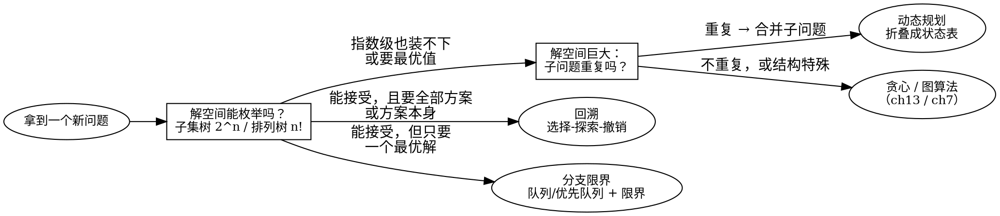
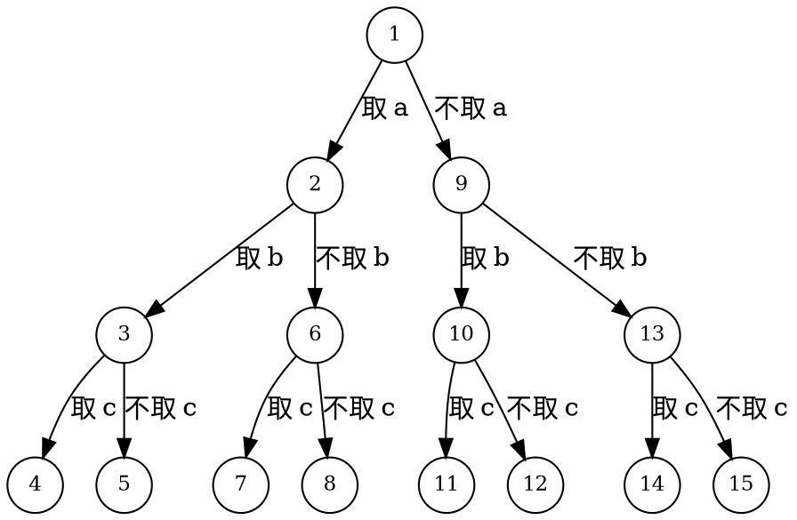

# 第 15 章 回溯与搜索：把解空间变成一棵可以搜索的树

[上一章](../chapter-14-dynamic-programming/00-overview.md)的结论是：当不同的搜索路径反复到达同一个子问题，就把搜索树折叠成状态表。本章补上另一半：很多问题里子问题几乎不重复——全排列中每个前缀只出现一次，N 皇后中放法不同则局面不同。折叠无从谈起，我们只能老老实实把解空间走一遍，但要走得有章法：按统一的顺序访问每个候选、提前离开注定失败的分支、必要时换一种访问策略。

这就是本章的两个主角。<dfn>回溯</dfn>在隐式的状态空间树上做深度优先遍历，靠「选择—探索—撤销」覆盖所有候选；<dfn>分支限界</dfn>换用广度或优先级次序，靠界函数争先走向最优解。两者的差别不在代码长相，而在**以什么顺序、按什么规则遍历一棵通常不会显式画出来的树**。

## 学习目标

完成本章核心内容后，你应该能够：

- 把一个约束满足或组合问题写成解向量 $(x_1,\dots,x_n)$，并写出每个分量的取值域；
- 对给定问题画出子集树或排列树，直接数出 $2^n$ 或 $n!$ 个叶子；
- 用「选择→探索→撤销」写出回溯模板，并指出每处撤销负责还原哪份共享状态；
- 用完备性论证检查自己的枚举「不漏、不重」；
- 在具体搜索树上指出可行性剪枝、限界剪枝与对称剪枝各剪掉了哪块子树，并说出正确性前提；
- 为 0-1 背包回溯版写出贪心上界限界函数，并论证它不会误剪最优解；
- 说清回溯与分支限界在搜索方式、求解目标、存储结构和剪枝时机上的区别；
- 面对一道新题，能给出「回溯还是分支限界还是动态规划」的选择及理由。

## 方法判别：把上一章留下的半句话展开

[第 14 章的判别表](../chapter-14-dynamic-programming/00-overview.md)里埋着一行线索：「状态空间不大，且需要枚举具体方案 → 搜索/回溯」。当时它只是占位，本章把这半句话展开成完整的方法选择。判别的核心不是题目名词，而是三个问题：**你要全部方案还是一个最优解？子问题重复吗？解空间能接受吗？**

| 你要什么 | 决定性特征 | 更值得先尝试 | 仍需确认 |
| --- | --- | --- | --- |
| 全部方案，或判定「是否存在一种方案」 | 解向量各维依次取值，约束可提前检查 | 回溯（15.1–15.3） | 树的规模能否接受？约束够不够剪枝？ |
| 只要一个最优（或可行）解 | 能对部分解算出乐观界 | 分支限界（15.4） | 界是否便宜、是否可能误剪最优解？ |
| 只要最优值 | 子问题重复出现且无后效性 | 动态规划（第 14 章） | 若还要具体方案，需额外记录决策或改回溯 |
| 每一步有可证明的安全局部选择 | 贪心选择性质 | 贪心（第 13 章） | 局部最优能否推出全局最优？ |
| 显式图上的遍历或最短路 | 状态就是顶点，边就是转移 | 图算法（第 7 章） | 状态是输入给出的，还是运行中生成的？ |

把这张表压成一张导图：左侧是问题特征，右侧是方法。

<!-- diagram id="ch15-method-map" caption: "方法选择导图：三个判别问题把新问题引向回溯、分支限界或动态规划" -->

注意图中的分岔点：==「要不要全部方案」「子问题是否重复」「能否设计乐观界」这三个答案，基本决定了一个问题该用哪种方法==。本章负责左侧两条路（回溯与分支限界），中间那条已在第 14 章展开。

### 回溯就是在一棵隐式的树上做 DFS

先把「回溯」翻译成一次具体的行走。设元素为 $a,b,c$，每个元素只有「取 / 不取」两种决定，就得到一棵 $n=3$ 的子集树；下图中结点里的数字是深度优先访问的次序。

<!-- diagram id="ch15-search-as-dfs" caption: "n=3 子集树的 DFS 访问次序：每个叶子对应一个子集，从左到右依次是 {a,b,c} 到空集" -->

访问次序 1→2→3→4 先一路「取」到底，到达第一个叶子 $\{a,b,c\}$；随后逐层退回、换下一个取值，最后访问的叶子反而是空集 $\varnothing$。==「回溯」这个名字就来自这种退回动作==：每个叶子对应一个子集，8 个叶子恰好枚举了 $\{a,b,c\}$ 的全部 $2^3=8$ 个子集。

::: intuition 直觉 · 回溯 = 隐式状态空间树上的 DFS

第 7 章的 DFS 访问的图是输入显式给出的；这里的树不在任何输入里，由算法边生成边访问：递归调用栈记住当前路径，函数返回相当于退回父结点，撤销选择后再试下一个取值相当于访问「下一个邻居」。差别只有一处——这棵树的结点由约束定义，必须在生成时就判断它是否还值得走下去，而不是生成完再筛。

:::

## 本章地图

| 小节 | 解决的问题 | 关键产出 |
| --- | --- | --- |
| [15.1 回溯框架](./01-backtracking-framework.md) | 用什么语言描述解空间？模板长什么样？ | 解向量、子集树/排列树、完备性定理与证明 |
| [15.2 经典问题](./02-classic-problems.md) | 三棵具体的树：排列树、子集树、皇后树 | 全排列、子集和、N 皇后的五步建模卡 |
| [15.3 剪枝](./03-pruning.md) | 怎样让树变小但不丢解？ | 可行性/限界/对称剪枝与正确性前提 |
| [15.4 分支限界](./04-branch-and-bound.md) | 只要一个最优解时换什么策略？ | 队列式/优先队列式搜索与回溯对比表 |

前置知识与衔接：

- [图的遍历：DFS 与 BFS](../chapter-07-graph-traversal/01-dfs-and-bfs.md)：本章直接复用其 DFS 骨架与 BFS 队列，15.4 会说明分支限界的队列式搜索就是显式图 BFS 的推广；
- [递归建模：函数契约与规模递减](../chapter-12-divide-conquer-recursion/01-recursion-contracts.md)：函数合同、基本情况与递归调用栈，是阅读回溯模板的前提；
- [第 14 章 动态规划](../chapter-14-dynamic-programming/00-overview.md)：方法判别的另一半；15.3 的 0-1 背包回溯版与[背包动态规划](../chapter-14-dynamic-programming/04-knapsack-dp.md)是同一道题的两种解法，值得对照阅读。

::: tip 学习建议

读 15.2 之前，先在纸上亲手画一次 $n=3$ 的子集树和 $\{1,2,3\}$ 的排列树。本章所有复杂度结论（$2^n$、$n!$、$O(n\cdot n!)$）都能从这两张图直接数出来，不背公式。

:::

## 参考与延伸

- [OI Wiki：搜索](https://oi-wiki.org/search/)提供回溯与剪枝的系统性词条，可用于校验「活结点 / 扩展结点 / 限界函数」等术语（这些词也是 408 大纲的标准用语）。
- 八皇后问题由 Max Bezzel 于 1848 年提出；其全部 92 个解（12 个本质解）可以用 15.2 的程序直接复算，是检验实现正确性的经典基准。
- 分析搜索树规模时，可回看[时间与空间复杂度](../chapter-00-introduction/02-time-and-space-complexity.md)，把「叶子数 × 每叶成本」落实为可核验的量。
