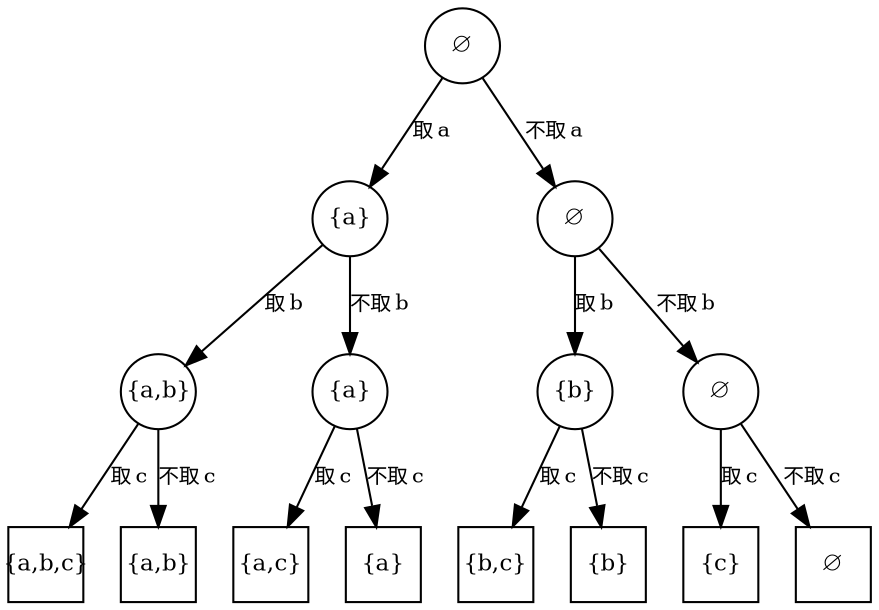
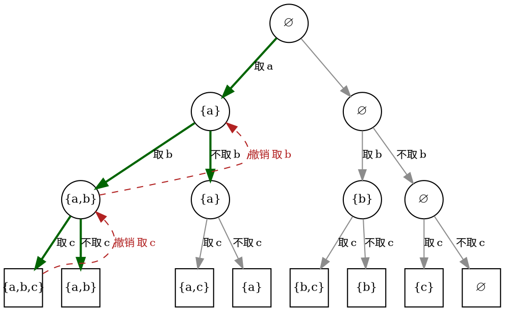

# 15.1 回溯框架：解向量、状态空间树与回溯模板

求 $\{a,b,c\}$ 的全排列时，你大概会这样想：第 1 位放谁（3 种），第 2 位放剩下中的谁（2 种），第 3 位没得选（1 种）。把每次回答记下来，一串决定就唯一确定了一个排列。求子集、放皇后、装背包，全都可以这样「一列决定」地回答。

本节把这种直觉固定成三个可复用的对象：**解向量**（决定序列本身）、**状态空间树**（所有决定序列的组织方式）和**选择-探索-撤销模板**（遍历这棵树的固定骨架）。后两节的全部例题都只是往这三件东西里填内容。

## 解向量与结点的三种状态

::: definition 定义 · 解向量与约束

一个问题的解被写成 <dfn>解向量</dfn> $x=(x_1,x_2,\dots,x_n)$，其中第 $i$ 个分量 $x_i$ 取自取值域 $D_i$。约束分两类：<dfn>显式约束</dfn>只限制单个分量的取值（如「$x_i$ 是剩余元素之一」），它决定 $D_i$；<dfn>隐式约束</dfn>约束分量之间的关系（如「两个皇后不同列、不同对角线」）。满足全部约束的完整解向量称为一个<strong>可行解</strong>；只填了前 $k$ 维的 $(x_1,\dots,x_k)$ 称为<strong>部分解</strong>。

:::

全排列里 $D_i$ 是「尚未使用的元素」，由前面的选择动态决定；N 皇后按行放置时 $x_i$ 是第 $i$ 行皇后的列号，隐式约束排除同列与同对角线。**建模的第一步永远是写出 $x_i$ 与 $D_i$**，15.2 的每张建模卡第一行都是它。

::: definition 定义 · 活结点、扩展结点与死结点

在状态空间树上：已被生成、但还没被探索完的结点叫 <dfn>活结点</dfn>；当前正在生成孩子结点的活结点叫 <dfn>扩展结点</dfn>；不再会被扩展的结点（孩子已全部处理完、或已被约束排除）叫 <dfn>死结点</dfn>。

:::

回溯做深度优先遍历，任一时刻**只有一个扩展结点**，活结点构成一条从根到它的路径（恰好存在调用栈里）；15.4 的分支限界做广度或优先级遍历，同时持有整批活结点。这是两种方法在存储上的分水岭，术语先在此统一。

## 两棵基本的树：子集树与排列树

::: definition 定义 · 子集树与排列树

<dfn>子集树</dfn>：第 $i$ 层的每条边决定「第 $i$ 个元素取或不取」，共 $n$ 层决策、$2^n$ 个叶子。适用于子集枚举、0-1 背包这类「每个对象选/不选」的问题。<dfn>排列树</dfn>：第 $i$ 层的每条边决定「把哪个剩余元素放到位置 $i$」，共 $n$ 层决策、$n!$ 个叶子。适用于全排列、TSP 这类「给每个位置配一个互不相同的对象」的问题。

:::

多数约束问题的空间树都是这两类之一或其变体（N 皇后按行放置：每层 $n$ 种取值、需剪枝，形态上更像「受限的排列树」）。先看子集树的完整样子：第 $i$ 层决定第 $i$ 个元素取或不取，方框叶子是解向量已完整的结点。


<!-- diagram id="ch15-subset-tree" caption: "完整的 n=3 子集树：圆圈是部分解，方框叶子是 2^3=8 个完整解" -->

两个读图要点：其一，**树按路径区分结点，不按标签区分**——图中出现三个 $\varnothing$、两个 $\{a\}$，但它们代表不同的决策序列（解向量前缀），这正是回溯与动态规划的分界：我们不合并同值结点，因为要枚举的是每个具体方案本身。其二，从叶子数直接数出规模：高为 $n$ 的满二叉树有 $2^n$ 个叶子。

## 选择-探索-撤销：一个骨架，三步纪律

::: example 示例 · 回溯模板（以子集枚举为例）

```cpp:line-numbers {10-19} [backtracking-skeleton.cpp]
#include <iostream>
#include <vector>

void dfs(int depth, int n, std::vector<char>& chosen) {
    if (depth == n) {                       // 终态：解向量完整
        std::cout << "{";
        for (std::size_t i = 0; i < chosen.size(); ++i) {
            if (i) std::cout << ",";
            std::cout << chosen[i];
        }
        std::cout << "}\n";
        return;
    }
    for (int take = 1; take >= 0; --take) {  // 先「取」后「不取」：对应图中左、右分支
        if (take == 1) {
            chosen.push_back(static_cast<char>('a' + depth));  // ① 做选择
        }
        dfs(depth + 1, n, chosen);                             // ② 探索
        if (take == 1) {
            chosen.pop_back();                                 // ③ 撤销
        }
    }
}

int main() {
    std::vector<char> chosen;
    dfs(0, 3, chosen);   // 输出 {a,b,c} {a,b} {a,c} {a} {b,c} {b} {c} {} 共 8 行
}
```

所有回溯程序都是这个形状：`if (终态) 记录`，然后 `for (取值 : 取值域) { 做选择 → dfs → 撤销 }`。区别只在三处——终态怎么判、取值域怎么生成、约束怎么查。

:::

注意「不取」这个分支：它也是一个选择，只是没有需要还原的共享状态，所以 ③ 对它是空操作。**只有真正修改了共享状态的选择才需要撤销**——这半句话是下面执行的钥匙。

### 执行轨迹：把代码跑成图上的一次行走

把上面的程序执行到第二个叶子为止，用缩进表示递归深度，可以逐行对应到下图中的结点与虚线边。左列注释里的「①②③」即代码中的三步。

```text
进入 dfs(depth=0)        部分解 ∅            ← 根结点
  ① 做选择：取 a          chosen={a}
  进入 dfs(depth=1)      部分解 {a}
    ① 做选择：取 b        chosen={a,b}
    进入 dfs(depth=2)    部分解 {a,b}
      ① 做选择：取 c      chosen={a,b,c}
      进入 dfs(depth=3)  叶子：记录子集 {a,b,c}
      ③ 撤销：弹出 c      chosen={a,b}
      ① 做选择：不取 c
      进入 dfs(depth=3)  叶子：记录子集 {a,b}
      返回（不取 c，无需还原）
    返回 → ③ 撤销：弹出 b  chosen={a}      ← dfs(depth=2) 的取值域耗尽
    ① 做选择：不取 b ……
    （后续按同样模式继续，直到枚举完 8 个子集）
```

## 为什么不会漏：完备性

下图把上面的轨迹画回树里：深色实线是前进（做选择），虚线是撤销回跳。仔细看两条虚线——它们分别对应轨迹中「弹出 c」与「弹出 b」两处撤销。


<!-- diagram id="ch15-choose-undo-path" caption: "在子集树上高亮一次选择-探索-撤销：实线为前进，虚线为撤销回跳，随后换到不取 b 的分支" -->

撤销之后算法换到了「不取 b」的分支，$\{a,c\}$、$\{a\}$ 两棵子树照常被探索——**没有因为走过 $\{a,b\}$ 子树而丢掉任何解**。这不是巧合，而是模板的保证：

::: theorem 定理 · 回溯的完备性

设解向量长度为 $n$，各分量取值域有限。若模板满足三个前提：(a) 每层枚举该分量取值域中的**全部**取值；(b) 只对「不可能扩展出任何解」的分支做剪枝；(c) 每次探索返回后，共享状态被完整还原——则每个可行解（以解向量为准）被访问恰好一次：不漏，不重。

:::

::: proof

对已确定的分量个数 $k$ 归纳。$k=0$ 时只有根，成立。假设所有长度为 $k$ 的合法前缀各由一条从根出发的决策路径唯一产生——因为每层枚举全部取值，「决策序列」与「前缀」一一对应，没有两条路径产生同一前缀。对任一这样的前缀 $p$：扩展到第 $k+1$ 维时，循环遍历 $D_{k+1}$ 的全部取值，故 $p$ 的每个可行延伸恰被探索一次；(b) 保证被剪掉的分支不含任何可行解，故不漏；(c) 保证探索完一个延伸后，共享状态与进入时完全相同，于是后续延伸面对的状态与「只探索了自己」时一致，各延伸的判断互不残留、互不干扰。归纳完成，每个完整解恰对应一条被完整走过的决策路径。

:::

::: intuition 直觉 · 为什么「撤销」不能省

递归返回只负责把「执行位置」退回父结点；`chosen`、`used` 这类**共享状态不会自己退回去**。如果不撤销，下一个分支会在被上一个分支污染的状态上做判断——完备性证明中的前提 (c) 被破坏，定理不再适用。这也是为什么模板把「做选择」与「撤销」写成一对照对出现。对照[第 7 章的 DFS](../chapter-07-graph-traversal/01-dfs-and-bfs.md)：显式图遍历只需一个 `visited` 集合，因为结点身份由顶点编号决定；这里的状态由决策路径决定，每深入一层都可能新增若干份共享状态，撤销纪律必须逐一兑现。

:::

## 复杂度：从树的规模数出来

::: complexity 复杂度 · 无剪枝回溯的成本

前提：约束检查与每结点扩展为 $O(1)$（若每次约束检查要扫 $O(n)$ 个已有选择，成本再乘 $n$）。子集树有 $2^n$ 个叶子、$2^{n+1}-1$ 个结点，时间 $\Theta(2^n)$；排列树有 $n!$ 个叶子、$\sum_{k=0}^{n}\frac{n!}{(n-k)!} < e\cdot n!$ 个结点。若每个解还要 $O(n)$ 时间复制或输出（如全排列打印），总成本为 $O(n\cdot n!)$。额外空间只有递归栈与解向量本身，为 $O(n)$——这份「省内存」在 15.4 会被分支限界打破。

:::

::: pitfall 易错点 · 撤销不完整与终态判断错位

**撤销不完整**：忘记还原与解向量同步修改的共享状态（`used` 标记、行列占用数组、当前重量），后续分支读到上一分支的残留，解被悄悄污染且往往不崩溃、只出错。自查方法：==每个修改共享状态的「做选择」必须有且仅有一个配对「撤销」，且从函数的任何出口离开前都已执行==——在循环中途 `return` 而绕过撤销是最常见的写法来源。**终态判断错位**：「到达即记录」与「叶子才记录」是两种语义，若问题要求解向量满 $n$ 维才算解，却写了 `if (满足当前约束) 记录`，会把部分解当完整解输出；反过来，子集类问题的部分解本身可能就是合法答案（如「是否存在和为 target 的子集」中前缀和已等于 target 时可提前成功），记录位置要跟题目语义走，不跟手感走。

:::

## 下一步

骨架就位后，剩下的全是「填内容」：终态、取值域、约束。下一节[子集树与排列树实战](./02-classic-problems.md)用全排列、子集和与 N 皇后三道题各填一遍，并把「题面 → 解向量 → 约束 → 空间树 → 复杂度」固定成一张五步建模卡；填完你会发现约束检查的位置，正是 15.3 剪枝的落点。
