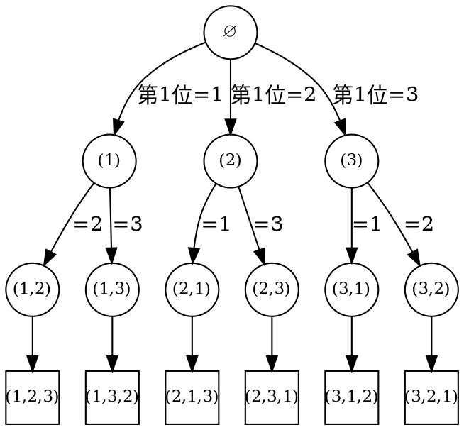
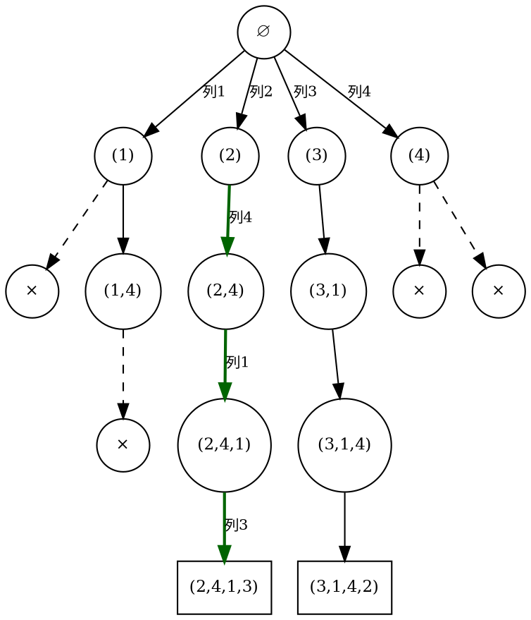

# 15.2 子集树与排列树：全排列、子集和与 N 皇后

[15.1](./01-backtracking-framework.md) 给了骨架：解向量、状态空间树、选择-探索-撤销。本节做三次「填空」——每道题都按同一张卡推进，**题面 → 解向量 → 约束 → 空间树形态 → 复杂度**。这张卡的作用与第 14 章的状态设计卡相同：写代码之前先把每个决定说清楚，代码只是卡的直译。

三道题各占一种树：全排列是排列树，子集和是子集树，N 皇后是「每层取值随约束收缩」的第三种形态。读完应当能独立复述：同一副骨架如何长出三棵不同的树。

## 完整案例 1 · 全排列：排列树的标准形

### 建模卡

| 步骤 | 内容 |
| --- | --- |
| 题面 | 输出 $\{1,2,\dots,n\}$ 的全部 $n!$ 个排列 |
| 解向量 | $x_i$ = 排列第 $i$ 位放的元素 |
| 约束 | 显式：$x_i\in\{1,\dots,n\}$；隐式：各分量互不相同（等价于 $D_i$ = 尚未使用的元素） |
| 空间树 | 排列树：第 1 层 $n$ 个分支，第 2 层各 $n-1$ 个，……共 $n!$ 个叶子 |
| 复杂度 | 时间 $O(n\cdot n!)$（每个叶子 $O(n)$ 输出）；额外空间 $O(n)$ |

先看树的形状，注意它与子集树的差别：


<!-- diagram id="ch15-permutation-tree" caption: "{1,2,3} 的排列树：第 1 层 3 个分支、第 2 层各 2 个、第 3 层各 1 个，共 3!=6 个叶子" -->

对比 15.1 的子集树：同样是 3 层决策，排列树每往下一层，**取值域就收缩一个元素**（3 支 → 2 支 → 1 支），所以叶子是 $3!=6$ 而不是 $2^3=8$。「取值域随选择收缩」是排列树的标志，也解释了为什么它的实现必须维护「哪些还没用」。

### 实现 A：used 标记（显式维护取值域）

```cpp:line-numbers {9-21} [permutations-used.cpp]
#include <iostream>
#include <vector>

std::vector<int> perm;                    // 解向量前缀

void dfs(const std::vector<int>& a, std::vector<bool>& used) {
    if (perm.size() == a.size()) {        // 终态：n 个位置都填满
        for (int v : perm) std::cout << v;
        std::cout << '\n';
        return;
    }
    for (std::size_t i = 0; i < a.size(); ++i) {
        if (used[i]) continue;            // 隐式约束：互不相同
        used[i] = true;                   // ① 做选择
        perm.push_back(a[i]);
        dfs(a, used);                     // ② 探索
        perm.pop_back();                  // ③ 撤销：两份共享状态各还原一次
        used[i] = false;
    }
}

int main() {
    std::vector<int> a{1, 2, 3};
    std::vector<bool> used(a.size(), false);
    dfs(a, used);   // 按（近似）字典序输出 6 个排列
}
```

注意撤销是**成对还原**：`perm` 与 `used` 都是跨分支共享的状态，各需一次还原，少一处就出现 15.1 易错点说的「残留污染」。

### 实现 B：原地交换（把取值域藏进数组尾部）

```cpp:line-numbers {6-14} [permutations-swap.cpp]
#include <algorithm>
#include <iostream>
#include <vector>

void dfs(std::vector<int>& a, int depth) {
    if (depth == static_cast<int>(a.size())) {
        for (int v : a) std::cout << v;
        std::cout << '\n';
        return;
    }
    for (int i = depth; i < static_cast<int>(a.size()); ++i) {
        std::swap(a[depth], a[i]);   // ① 做选择：把候选换到第 depth 位
        dfs(a, depth + 1);           // ② 探索（前缀 [0,depth] 已定）
        std::swap(a[depth], a[i]);   // ③ 撤销：再换一次，数组复原
    }
}

int main() {
    std::vector<int> a{1, 2, 3};
    dfs(a, 0);
}
```

实现 B 没有 `used`、没有 `perm`：**数组前缀 `[0, depth)` 就是部分解，后缀 `[depth, n)` 就是取值域**。每次把一个候选交换到 `depth` 位置，等于「从取值域里取出它」；递归后原样换回，等于撤销。代价是输出顺序不再是字典序。两版时间同为 $O(n\cdot n!)$——常数与缓存行为不同，但树是同一棵。

## 完整案例 2 · 子集和：子集树与判定问题

### 建模卡

| 步骤 | 内容 |
| --- | --- |
| 题面 | 正整数数组 `a[0..n-1]`，问能否选出若干个数使其和恰为 `target`（变体：输出全部选法） |
| 解向量 | $x_i\in\{0,1\}$：第 $i$ 个数取 / 不取 |
| 约束 | 显式：$x_i$ 二值；隐式：$\sum_i x_i\,a_i = target$ |
| 空间树 | 子集树：$2^n$ 个叶子，每个叶子对应一个子集 |
| 复杂度 | 判定版最坏 $O(2^n)$、空间 $O(n)$；DP 版 $O(n\cdot target)$（伪多项式，见第 14 章） |

### 实现：判定版 + 一行雏形剪枝

```cpp:line-numbers {5-10} [subset-sum-backtracking.cpp]
#include <iostream>
#include <vector>

bool dfs(const std::vector<int>& a, std::size_t i, int remaining) {
    if (remaining == 0) return true;   // 已选部分和恰为目标：提前成功
    if (i == a.size()) return false;   // 元素用尽仍未凑出
    if (a[i] <= remaining && dfs(a, i + 1, remaining - a[i])) return true;
    return dfs(a, i + 1, remaining);   // 不取 a[i]
}

int main() {
    std::vector<int> a{3, 34, 4, 12, 5, 2};
    std::cout << (dfs(a, 0, 9) ? "yes" : "no") << '\n';   // yes：9 = 4 + 5
}
```

两个值得停留的细节。其一，`remaining == 0` 提前返回是**到达即成功**的终态判断——部分解本身就是答案，不必等叶子（对比全排列必须等满 $n$ 位）。其二，`a[i] <= remaining` 排除「装不下」的分支：==这一行就是最简单的可行性剪枝==，15.3 会把它发展成系统方法。

::: complexity 复杂度 · 与位运算枚举对照

位运算 `for (int mask = 0; mask < (1<<n); ++mask)` 同样枚举全部子集，但每个 `mask` 都要 $O(n)$ 展开，共 $O(n\cdot 2^n)$，且**无法中途放弃**某个前缀。回溯版的提前成功与剪枝虽然不改变最坏 $O(2^n)$，但平均行为可以远小于它；若要输出全部选法，把 `return true` 换成记录即可，代价回到叶子数 $\Theta(2^n)$。与[背包动态规划](../chapter-14-dynamic-programming/04-knapsack-dp.md)对照：DP 用 $O(n\cdot target)$ 只回答存在性/最值，回溯慢于多项式但能顺路给出每个具体方案——这正是第 15 章概览判别表那两行的分工。

:::

## 完整案例 3 · N 皇后：让约束消失在建模里

### 建模卡

| 步骤 | 内容 |
| --- | --- |
| 题面 | $n\times n$ 棋盘放 $n$ 个皇后，互不同行、同列、同对角线；输出一个（或全部）解 |
| 解向量 | $x_i$ = 第 $i$ 行皇后所在列 |
| 约束 | 显式：$x_i\in\{1,\dots,n\}$；隐式：任意 $i\ne j$，$x_i\ne x_j$ 且 $\lvert x_i-x_j\rvert\ne\lvert i-j\rvert$ |
| 空间树 | 每层至多 $n$ 叉、深 $n$；同列约束把第 $i$ 层分支收缩到至多 $n-i+1$，形态上似排列树 |
| 复杂度 | 按行枚举 + $O(1)$ 约束检查，完整路径上界 $O(n\cdot n!)$；实际远小（$n=8$ 共 92 解） |

::: example 示例 · 按行建模：把行约束变成「结构上不可能」

最直白的解向量是「$n^2$ 格里挑 $n$ 格」，树有 $\binom{n^2}{n}$ 量级的叶子。但 $n$ 个皇后互不同行，而棋盘恰有 $n$ 行，所以**每行恰好一个皇后**是题面的推论。把这一事实直接编码进解向量——$x_i$ 就是第 $i$ 行的列号——行冲突从此不可能发生，连检查都省了。==好的建模不是检查更多约束，而是让一部分约束从结构上无法被违反==：树从 $\binom{n^2}{n}$ 级收缩成每层至多 $n$ 叉、深 $n$。

:::

### 约束检查的两个方向

放第 `row` 行皇后到列 `c` 时，需检查与前 `row` 行都不同列、不同对角线。两个实现方向：

- **显式检查**：扫描前 `row` 行，判断 `cols[j] == c || |cols[j] - c| == row - j`。单次 $O(n)$，胜在不用额外数组；
- **标记数组**：`usedCol[c]` 记列；同一条副对角线上 `row + c` 为定值，同一条主对角线上 `row - c` 为定值（平移 `+n-1` 避免负下标），三个 `bool` 数组各 $O(1)$ 判定。本质是 15.1 说的「共享状态 + 成对撤销」，用空间换检查时间。

### 实现：标记数组版（输出 4 皇后第一个解）

```cpp:line-numbers {9-22} [n-queens.cpp]
#include <iostream>
#include <vector>

int n;
std::vector<int> cols;                       // cols[i]：第 i 行皇后的列号
std::vector<bool> usedCol, usedD1, usedD2;   // 列 / 主对角线(row-c+n-1) / 副对角线(row+c)

bool dfs(int row) {
    if (row == n) {
        for (int c : cols) std::cout << c + 1;
        std::cout << '\n';
        return true;                         // 只要一个解：找到即返回
    }
    for (int c = 0; c < n; ++c) {
        if (usedCol[c] || usedD1[row - c + n - 1] || usedD2[row + c]) continue;
        usedCol[c] = usedD1[row - c + n - 1] = usedD2[row + c] = true;  // ①
        cols.push_back(c);
        if (dfs(row + 1)) return true;                                  // ②
        cols.pop_back();                                                // ③ 撤销三份共享状态
        usedCol[c] = usedD1[row - c + n - 1] = usedD2[row + c] = false;
    }
    return false;
}

int main() {
    n = 4;
    usedCol.assign(n, false);
    usedD1.assign(2 * n - 1, false);
    usedD2.assign(2 * n - 1, false);
    dfs(0);   // 输出 2413
}
```

撤销在这里要还原**三份**标记加一份 `cols`——比全排列还多，是检验「成对撤销」纪律的好练习。若把 `return true` 全部去掉（改为 `void` 并在 `row==n` 处打印），同一程序就枚举全部解：4 皇后恰有两个，`(2,4,1,3)` 与 `(3,1,4,2)`；2、3 皇后无解，程序直接静默结束。

### 4 皇后的树长什么样

下图画出按列序 $1,2,3,4$ 尝试的 4 皇后搜索树：圆圈是通过约束检查的部分解（括号内是各行列号），× 表示该前缀在扩展下一行时**没有任何合法列**，沿虚线到达 × 即折返；加粗路径是深度优先遇到的第一个解。


<!-- diagram id="ch15-nqueens-tree" caption: "4 皇后按行搜索树：列 1 的整棵子树死亡，加粗路径到达第一个解 (2,4,1,3)" -->

读图结论：列 1 的整棵子树没有解（两支都死在 ×），列 2 一路到底命中第一个解 `(2,4,1,3)`，列 3 给出第二个解 `(3,1,4,2)`，列 4 的两支也都死亡。**搜索顺序决定哪个解先被找到，完备性保证一个都不漏**——两解合计恰好 2 个，与已知结论一致。

### 棋盘视角：同一过程的两张面孔

上面的树换一个视角，就是棋盘上「放 Q → 死局 → 移除 → 换列」的往复。每块棋盘标注当前已放的行；死局指该行扫完所有列都放不进去。

```text
（一）行1=列1      （二）行2=列3      死局：行3 无列可放
Q . . .           Q . . .           → 撤销：移除行2，行2 改放列4
. . Q .           . . Q .
. . . .           . . . .
. . . .           . . . .

（三）行2=列4      （四）行3=列2      死局：行4 无列可放
Q . . .           Q . . .           → 撤销行3、行2；行2 无列可换
. . . Q           . . . Q           → 继续撤销行1，行1 改放列2
. . . .           . Q . .
. . . .           . . . .

（五）行1=列2      （六）行2=列4      （七）行3=列1、行4=列3
. Q . .           . Q . .           . Q . .
. . . .           . . . Q           . . . Q
. . . .           . . . .           Q . . .
. . . .           . . . .           . . Q .
```

把七块棋盘与上图对照：（一）（二）对应 `(1)` 子树的第一次下探与死亡，（三）（四）是 `(1,4)` 支的挣扎，（五）到（七）正是加粗路径 `(2,4,1,3)`。**树视角看「访问了哪些结点」，棋盘视角看「每一步为什么放不下去」**——两幅图合起来才是完整的过程。

::: pitfall 易错点 · 重复元素让排列数重

输入含重复元素（如 $\{1,1,2\}$）时，本节程序会输出重复排列——$\{1_a,1_b,2\}$ 与 $\{1_b,1_a,2\}$ 被当成两个解。这不是完备性被破坏（按「下标选择序列」确实不漏不重），而是**题目要的是本质不同的排列，取值域里却留着同值候选**。修法是先排序、再在每层跳过「与前一个候选同值且前一个候选未被使用」的分支；为什么这个条件恰好保证不重不漏，放到[下一节](./03-pruning.md)的对称去重剪枝里完整推导。先记住症状与归因：==结果重复，多半是取值域里同值候选未被合并，而不是撤销写错==。

:::

## 建模卡复盘

三张卡并排看，规律立刻浮现：

| | 解向量 | 隐式约束 | 空间树 | 终态判断 |
| --- | --- | --- | --- | --- |
| 全排列 | 第 $i$ 位放谁 | 互不相同 | 排列树，$n!$ 叶 | 叶子（填满 $n$ 位） |
| 子集和 | 第 $i$ 个取/不取 | 和恰为 target | 子集树，$2^n$ 叶 | 到达即成功（提前返回） |
| N 皇后 | 第 $i$ 行放哪列 | 不同列、不同对角线 | 受限排列树 | 叶子（放满 $n$ 行） |

三道题里，取值域、约束、终态各不相同，但骨架、撤销纪律和完备性一个字都不用改。下一节处理真正的难点：[约束检查不够用时，怎样在树上提前止损](./03-pruning.md)。
