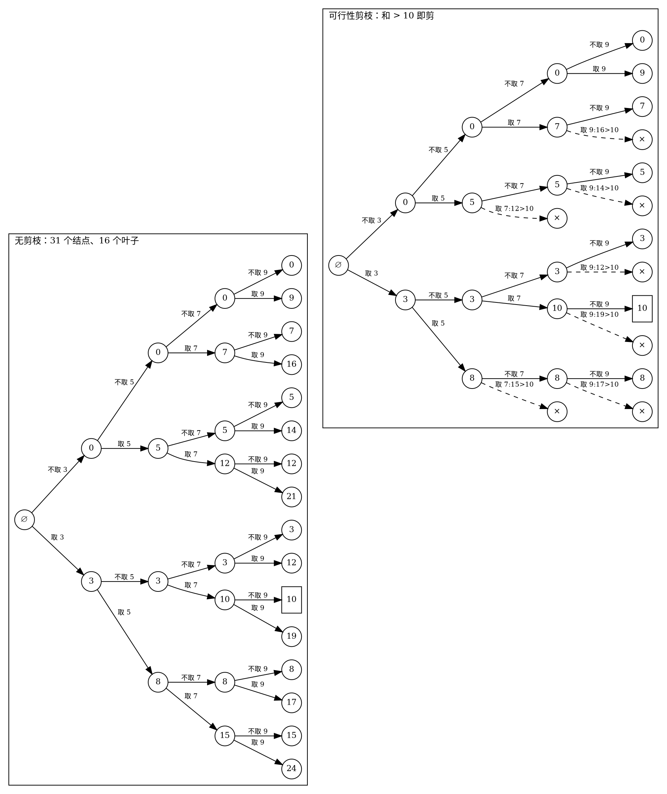
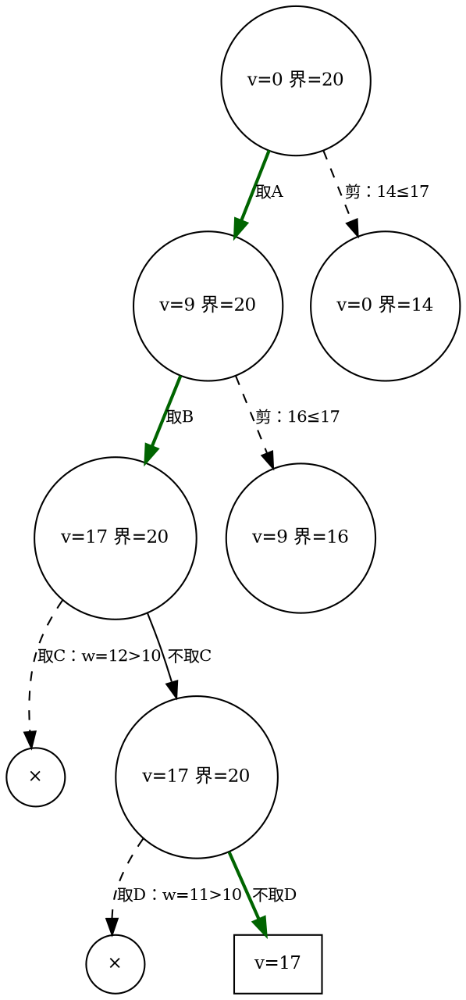

# 15.3 可行性、限界与对称去重剪枝

前面两节其实已经剪过两次枝：15.2 的 `a[i] <= remaining`（子集和装不下）与 N 皇后的同列、对角线排除。它们都属于本节的第一类剪枝。本节把散落的技巧收拢成三类，回答两个问题：**凭什么剪掉一个分支不丢解？剪枝到底省了多少？**

先记住一个总原则：==剪枝不改变最坏复杂度，改变的是具体实例上的树的实际规模==。对指数空间的问题，这常常是「能算」与「不能算」的分界。

## 三类剪枝

::: definition 定义 · 三类剪枝

<dfn>可行性剪枝</dfn>（约束剪枝）：当前部分解已违反约束，则它的任何延伸都不可能成为可行解，整棵子树剪掉。子集和的「装不下」、皇后的「同列/对角线」都是它在放入时刻的检查。

<dfn>最优性剪枝</dfn>（限界剪枝）：求最优解时，用<dfn>限界函数</dfn>给部分解算一个**乐观估计**——它 ≥（最大化问题）该子树内任何解的价值；若这个界已不优于目前找到的最优解，子树剪掉。

<dfn>对称/去重剪枝</dfn>：取值域中存在等价候选（同值元素、镜像对称的局面），它们产生的解或搜索树彼此同构，只探索其中一个代表。

:::

三类剪枝作用的位置不同：可行性剪枝在「生成孩子」时拦下非法扩展；限界剪枝在「扩展结点」处放弃整棵子树；去重剪枝在「同一层」合并等价候选。位置不同，正确性论证也各不相同，但都能归结为一句话：

::: property 性质 · 剪枝正确性的唯一前提

任何剪枝安全，当且仅当==被剪掉的子树中不含任何（更优的）解==。三类剪枝分别用不同的事实保证这一点：

- 可行性剪枝靠约束的**前缀单调性**：部分解违反约束 ⟹ 它的一切延伸仍违反约束（否则「剪掉违反者」会漏掉「先违反后修正」意义上的解——若题目允许修正历史，此剪枝不合法）；
- 限界剪枝靠**界的可靠性**：乐观估计在深入时单调不增（最大化问题中，剩余可选的东西只会变少），且初始值已 ≥ 子树内一切解；
- 去重剪枝靠**等价类划分**：被剪候选与保留候选产生的解集完全相同。

:::

## 可行性剪枝：n=4 子集和的树对比

用一道具体题看清剪枝「剪掉了哪块」：数组 $\{3,5,7,9\}$，判断能否选出和恰为 10 的子集（能：$3+7$）。约束：已选之和超过 10 就剪。下图中每层依次决定 3、5、7、9 的取/不取（上支取、下支不取），结点里是当前部分和。

<!-- diagram id="ch15-pruning-compare" caption: "同一棵 n=4 子集和树的剪枝前后对比：右侧 7 处 × 各代表一整棵被放弃的子树" -->

右图每处 × 不是剪掉一个结点，而是**一整棵子树**：如左上角 `8 →×15` 剪掉的 $\{3,5,7\}$ 子树自身还有 3 个结点。数一数：左树 31 个结点，右树实际访问 20 个、画出 7 个 ×——而右图中唯一的解 $\{3,7\}=10$ 完好保留。这不是巧合，是可行性剪枝正确性前提的直接体现：超过 10 的部分和，延伸后只会更大。

## 限界剪枝：0-1 背包的贪心上界

可行性剪枝只看「是否违法」；求最优解时还要看「有没有希望赢」。0-1 背包回溯版是最标准的练习：物品按单位价值降序排列后决定取/不取，已找到一个候选解 `best`，对每个部分解问一句——**这棵子树里还可能翻盘吗？**

### 限界函数：把剩余容量按分数背包装满

::: example 实例 · 贪心上界限界函数

物品已按 $v/w$ 降序排列（这是[第 13 章分数背包](../chapter-13-greedy/02-classic-problems.md)的贪心序）：

| 物品 | A | B | C | D |
| --- | --- | --- | --- | --- |
| 重量 w | 3 | 4 | 5 | 4 |
| 价值 v | 9 | 8 | 5 | 4 |

容量 `C = 10`。<dfn>限界函数</dfn>：装入当前部分解后，把剩余容量按贪心序装剩下的物品——**整件装得下就整件装，遇到第一件装不下的，按比例装入其一部分**，然后停止。这个值就是「分数背包在剩余物品上的最优值」。

以根结点为例：装 A（剩 7）、装 B（剩 3）、C 装不下 → 装 3/5 的 C（价值 3）。界 $=9+8+3=20$。而真实的 0-1 最优是 17（A+B）——界比真实值乐观，这正是「上界」的含义。

:::

::: property 性质 · 为什么这个界不会误剪

对任何结点，其子树内任何 0-1 可行解的价值 ≤ 该结点的贪心上界。

:::

::: proof

子树内的 0-1 可行解是「剩余物品 + 剩余容量」上分数背包的一个可行装法（0-1 允许的，分数都允许）。而按 $v/w$ 降序的贪心装法是分数背包的**最优解**（交换论证见第 13 章）。所以分数背包最优值 ≥ 子树内一切 0-1 解的价值，即界可靠；又因为深入子树只会减少剩余物品与容量，界沿路径单调不增。两件事合起来：界 ≤ 当时最优 ⟹ 子树内没有更好的解，剪之不丢。

:::

### 完整搜索过程（n=4，容量 10）

深度优先、每件先试「取」。手算每个结点的界：

| 结点（决策序列） | 价值 | 剩余容量 | 乐观界 | 与当时最优比 | 动作 |
| --- | --- | --- | --- | --- | --- |
| ∅ | 0 | 10 | 9+8+3=20 | 最优=0 | 扩展 |
| 取A | 9 | 7 | 9+8+3=20 | 最优=9 | 扩展 |
| 取A取B | 17 | 3 | 17+3=20 | 最优=17 | 扩展 |
| 取A取B取C | — | — | w=12>10 | — | 可行性剪枝 |
| 取A取B不取C | 17 | 3 | 17+3=20 | 最优=17 | 扩展 |
| ……取D | — | — | w=11>10 | — | 可行性剪枝 |
| ……不取D | 17 | 0 | 叶子 | 最优=17 | 记录 |
| 取A不取B | 9 | 7 | 9+5+2=16 | 最优=17 | 界16≤17，剪 |
| 不取A | 0 | 10 | 8+5+1=14 | 最优=17 | 界14≤17，剪 |

「取优先」的顺序让子树 $\{A,B\}$ 先产出 17，两个尚未探索的兄弟分支立刻被界杀死。完整树 31 个结点，实际只走 7 个（含 2 个可行性剪枝与 2 个限界剪枝）：

<!-- diagram id="ch15-knapsack-bound" caption: "0-1 背包限界剪枝的完整搜索：虚线是两类被剪分支，加粗路径到达最优解 17" -->

::: complexity 复杂度 · 限界版 0-1 背包

最坏仍是 $O(2^n)$（界全部失效，例如容量大到什么都能装）；空间 $O(n)$ 递归栈。上例 $n=4$：31 个结点 → 7 个。界计算本身 $O(n)$，故实际成本 = 访问结点数 × $O(n)$——这解释了为什么「界太松」不但不省反而更慢（见本节末尾易错点）。

:::

### 剪枝省多少：两个具体数字

- **最坏 vs 最好**：`n = 20` 的子集和，无剪枝完整遍历访问 $2^{21}-1 = 2\,097\,151$ 个结点；若 `target = a[0]+a[1]` 且取优先搜索，第 3 次函数调用就命中 `remaining == 0` 返回——**2,097,151 对 3**。
- **中间地带**：若 target 无法凑出（且所有 `a[i] ≤ remaining` 都成立），剪枝一个分支都触发不了，仍是全树。==剪枝的收益完全取决于实例与剪枝条件的匹配程度==，这正是指数算法工程化的常态。

## 对称/去重剪枝：同值候选与镜像局面

### 兑现 15.2 的伏笔：排列去重

::: theorem 定理 · 同层去重规则

数组已排序（同值元素相邻）。在排列树的每一层，若候选下标 `i` 满足 `a[i] == a[i-1]` 且 `used[i-1] == false`，则跳过 `i`。如此枚举出的排列恰为所有**本质不同**的排列各一次。

:::

::: proof

同值元素不可区分，所以「本质不同」以值序列为准。**不重**：若某条路径在第 $k$ 层使用了候选 `i` 且当时 `used[i-1]==false`，把这条路径中两个同值元素的身份整体互换——本层改用 `i-1`，后续层中原来用 `i` 的地方改用 `i-1`、原来用 `i-1` 的地方改用 `i`。因为两元素同值，值序列不变，而新路径在每层都不违反「同层不跳过」的条件，故该值序列由一条保留路径产生：被剪路径不产生新值序列。**不漏**：对任何本质排列，取「同值元素按编号递增使用」的唯一代表路径——它每层用的同值候选都是当前未用的最小编号，从不触发跳过条件，因此必然被枚举。两者合并，保留路径与本质排列一一对应。

:::

::: example 示例 · 去重效果量化

$\{1,1,2\}$：原程序 6 条路径输出 6 行（重复 3 对），去重后输出 3 行 `112,121,211`。极端情况 $n$ 个全同元素：路径数 $n!$，本质排列 1 个——去重剪枝把树缩了 $n!$ 倍。重复元素越多，这项剪枝越值钱。

:::

### N 皇后：镜像局面只搜一半

棋盘左右镜像把解映射成解：$(x_1,\dots,x_n)$ 与 $(n+1-x_1,\dots,n+1-x_n)$ 同为解或同为非解。于是第一行只需尝试列 $1..\lceil n/2\rceil$，解的个数翻倍（这对偶数 $n$ 严格成立；奇数 $n$ 时第一行落在正中列的解互为镜像、成对出现在同一列——如 $n=5$ 的 31425 与 35241——翻倍前需把它们单独清点）。用 4 皇后验证：第一行只试列 1、2——列 1 子树 0 个解（15.2 的图里整支死亡），列 2 子树 1 个解 $(2,4,1,3)$，合计 $2\times1=2$ ✓，与完整搜索一致。注意：==数解个数或找一个解时放心用；要**列出**全部解时镜像必须各自输出==，剪掉的只是搜索、不是解本身。

## 限界函数的两个极端

::: counterexample 反例 · 限界过强：把最优解一起剪掉

容量 10，物品按决策序为 Z(w=9,v=9)、X(w=5,v=6)、Y(w=5,v=6)。真实的 0-1 最优是 $X+Y=12$（Z 装不下第二件）。假设有人把限界函数「简化」成：**当前价值 + 第一个装得下物品的价值**（只看一件）。

- 取Z：价值 9，剩余容量 1，什么都装不下 → `best = 9`；
- 不取Z：错误界 $= 0 + 6 = 6 \le 9$ → **剪掉整棵子树**；
- 程序输出 9，正确答案 12 在被剪的子树里（$\{X,Y\}$）。

用正确的贪心上界检查同一结点：装 X（剩 5）、装 Y → 界 $=12 > 9$，不剪 → 搜索找到 12。==错误根源：界低估了子树（6 < 12），违反了「界 ≥ 子树内一切解」的前提——过强的界配上「≤ best 就剪」，剪掉的就是最优解本身，而且程序毫无异常==。

:::

::: pitfall 易错点 · 限界过弱等于没剪，甚至更慢

另一个极端：用「剩余物品总价值」当界——它确实 ≥ 子树内一切解，永远安全，但几乎从不 ≤ `best`（除非找遍了几乎全部），一个分支都剪不掉。更糟的是每个结点都要花 $O(n)$ 算一遍界。==剪枝净收益 = 剪掉的子树规模 − 计算界的累计成本==；从不触发的限界函数是纯开销。写完限界函数，先在最小实例上确认两件事：**触发过至少一次**（过弱）且**没剪掉已知最优**（过强）。分支限界法会把界用到极致，15.4 直接复用本节的函数。

:::

## 复盘与去向

| 剪枝 | 判断发生在 | 依据 | 典型代价 |
| --- | --- | --- | --- |
| 可行性 | 生成孩子时 | 约束的前缀单调性 | 常数次检查 |
| 限界 | 扩展结点时 | 乐观界 ≥ 子树一切解 | 每结点 $O(n)$ |
| 对称/去重 | 同层候选间 | 等价类代表唯一 | 一次比较/排序 |

三类剪枝都服务于同一个骨架——回溯的 DFS。但当目标从「全部解」缩成「一个最优解」时，DFS 不再是唯一合理次序：[下一节](./04-branch-and-bound.md)把遍历次序换成队列与优先队列，让界不只负责剪枝、还负责引路。
