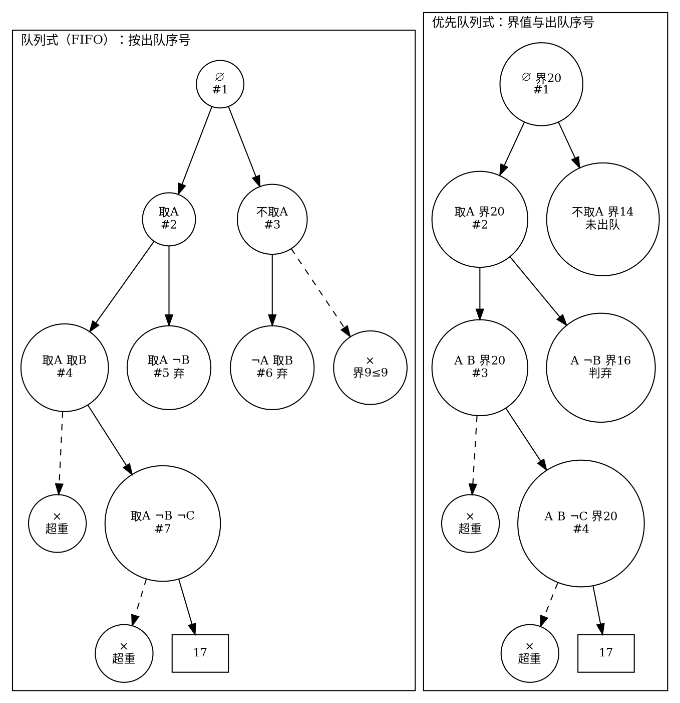
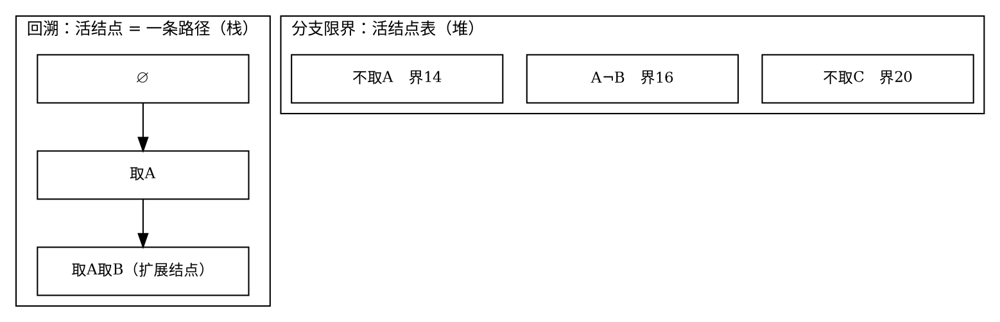

# 15.4 分支限界：队列式与优先队列式搜索

15.3 里，限界函数只干一件事：**杀**——界不优于最优解就剪掉子树。本节给界升职：它还要**选**——决定下一个扩展哪个结点。深度优先「认准一条路走到黑」，好解来得早则剪枝早、来得晚则全程空转；既然手里有界，不如每一步都挑界最有希望的活结点先走。这就是分支限界法。

## 定义与两种队列

::: definition 定义 · 分支限界法

<dfn>分支限界法</dfn>是状态空间树的广度优先或最佳优先搜索加上限界函数：从活结点表中取出一个结点扩展，把通过可行性检查的子结点加入表，直到找到所需的解或表空。<dfn>队列式（FIFO）分支限界</dfn>用普通队列按层扩展；<dfn>优先队列式分支限界</dfn>用堆按限界函数值排序，每次取出**界最有希望**的活结点。扩展结点一旦处理完毕即成死结点，不会回头——这是与回溯「可以回到祖先换分支」的本质差异。

:::

::: intuition 直觉 · 两种次序，两种赌注

回溯赌的是「先深入能撞上好解」：撞上了，后面的兄弟分支全被界杀死；撞不上，一路空转。分支限界不赌单条路径——FIFO 按层铺开保证不偏科，优先队列直接押注界最大的结点。代价在存储：回溯只欠调用栈的账，分支限界要把整批活结点捧在内存里。

:::

## 实例 · 0-1 背包的优先队列式分支限界

沿用 15.3 的实例与限界函数：物品按 $v/w$ 降序 A(3,9)、B(4,8)、C(5,5)、D(4,4)，容量 10，界 = 当前价值 + 剩余容量的分数背包贪心值。约定三件事：

1. 结点出队时先更新 `best`（背包的「不超过容量」语义下，**每个部分解都是候选答案**）；
2. 子结点生成时做可行性检查（装不下即丢）与**入队检查**（界 ≤ `best` 不入队）；
3. 堆顶的界 ≤ `best` 时，堆里所有结点都不可能更优——**直接结束**（这是优先队列独有的整体剪枝，FIFO 做不到）。

逐队列演化（`取A·20` 表示结点「取 A」、界为 20）：

```text
步骤 | FIFO：出队 → 队列（前→后）                    | 优先队列：出队(界) → 堆
  1  | 出队 ∅        → [取A·20, 不取A·14]           | 出队 ∅·20      → {取A·20, 不取A·14}
     | best=0                                       | best=0
  2  | 出队 取A      → [不取A·14, AB·20, A¬B·16]    | 出队 取A·20    → {AB·20, A¬B·16, 不取A·14}
     | best=9                                       | best=9
  3  | 出队 不取A    → [AB·20, A¬B·16, ¬AB·14]      | 出队 AB·20     → {不取C·20, A¬B·16, 不取A·14}
     | best=9（¬A¬B 界9≤9，未入队）                  | best=17
  4  | 出队 AB       → [A¬B·16, ¬AB·14, A¬B¬C·20]   | 出队 不取C·20  → {A¬B·16, 不取A·14}
     | best=17（取C 超重，未入队）                    | best=17（取D 超重；叶子17 不入队）
  5  | 出队 A¬B·16   → 丢弃（16≤17）                 | 堆顶 A¬B·16：16≤17 → 直接结束
  6  | 出队 ¬AB·14   → 丢弃（14≤17）                 | （不取A·14 从未出队）
  7  | 出队 A¬B¬C·20 → 叶子17，队空 → 答案 17        |
```

同一道题、同一把界：FIFO 出队 7 次、入队 6 个；优先队列出队 4 次、入队 5 个。差距的来源在第 3 步——FIFO 排到「不取A」就老老实实展开它的子树，而优先队列把它压在堆底，直到死掉都没碰过。下图并排画出两条扩展次序：


<!-- diagram id="ch15-bb-expansion" caption: "同一棵 0-1 背包搜索树的两种扩展次序：FIFO 逐层展开不取A 的子树，优先队列让它至死未出队" -->

右树里「不取A」没有子树——堆还没轮到它，堆顶 A¬B 的界 16 已 ≤ best 17，整体终止；左树则为它白付了一次扩展（生成 ¬AB 与 ×）。这就是「界既杀又选」的具体形状。

### 代码骨架：优先队列式核心

```cpp:line-numbers {17-33} [knapsack-best-first.cpp]
#include <algorithm>
#include <iostream>
#include <queue>
#include <vector>

struct Item { int w, v; };

double bound(const std::vector<Item>& a, std::size_t i, int cap, double value) {
    for (; i < a.size() && a[i].w <= cap; ++i) { value += a[i].v; cap -= a[i].w; }
    if (i < a.size()) value += static_cast<double>(cap) / a[i].w * a[i].v;
    return value;                       // 15.3 的贪心上界，一字未改
}

struct Node { std::size_t i; int value, cap; double ub; };
struct ByUb { bool operator()(const Node& x, const Node& y) const { return x.ub < y.ub; } };

int bestFirstKnapsack(const std::vector<Item>& a, int capacity) {
    int best = 0;
    std::priority_queue<Node, std::vector<Node>, ByUb> pq;   // 堆顶 = 界最大
    pq.push({0, 0, capacity, bound(a, 0, capacity, 0)});
    while (!pq.empty() && pq.top().ub > best) {              // 堆顶界≤best：全体终结
        Node cur = pq.top(); pq.pop();
        best = std::max(best, cur.value);                    // 部分解也是候选答案
        if (cur.i == a.size()) continue;                     // 叶子：只更新 best
        if (a[cur.i].w <= cur.cap) {                         // 取第 i 件（可行性）
            int v = cur.value + a[cur.i].v, c = cur.cap - a[cur.i].w;
            double ub = bound(a, cur.i + 1, c, v);
            if (ub > best) pq.push({cur.i + 1, v, c, ub});   // 入队检查
        }
        double ub = bound(a, cur.i + 1, cur.cap, cur.value); // 不取第 i 件
        if (ub > best) pq.push({cur.i + 1, cur.value, cur.cap, ub});
    }
    return best;
}

int main() {
    std::vector<Item> a{{3, 9}, {4, 8}, {5, 5}, {4, 4}};
    std::cout << bestFirstKnapsack(a, 10) << '\n';   // 输出 17
}
```

对照 15.3 的回溯版：`bound` 相同，变化只有三处——递归栈换成 `priority_queue`，「取/不取」的次序由循环内的固定顺序换成堆的排序，`while` 条件兼任整体剪枝。搜索策略变了，正确性论证没变：界可靠 + 只跳过不可能更优的结点。

## 回溯 vs 分支限界：408 高频对比

| 维度 | 回溯 | 分支限界 |
| --- | --- | --- |
| 搜索方式 | 深度优先；任一时刻只有一个扩展结点 | 广度优先或按界优先；同时持有一批活结点 |
| 求解目标 | 通常求**全部**解（也可求任一解） | 通常只求**一个**最优（或可行）解 |
| 存储结构 | 递归栈，只存当前路径，$O(n)$ | 队列/优先队列常驻活结点，最坏指数级 |
| 剪枝时机 | 扩展时即时判断，判断完立即回退 | 生成时筛、出队时判；界还决定扩展次序 |
| 典型问题 | 要方案本身：排列、子集、N 皇后 | 要最优值且界好算：背包、调度、TSP 上界 |

最常考的是第三行：==回溯的空间是栈深 $O(n)$，分支限界要为所有活结点买单==。第 1 节说过，回溯的活结点恰好构成一条根到扩展结点的路径；分支限界的活结点表没有这种结构保证。把它画成同一时刻的内存快照——左图是 15.3 回溯版扩展到「取A取B」时的调用栈，右图是本节优先队列版出队「AB」时的堆：


<!-- diagram id="ch15-live-nodes" caption: "同一时刻的内存快照：回溯的活结点是栈上一条路径，分支限界的活结点散在堆中" -->

快照对应上文的队列演化表第 3 步：回溯此刻正深入「取A取B」；分支限界手里却同时攥着三个未决结点——它能挑界最大的先走，代价是这三个结点都常驻内存。

## 与第 7 章 BFS 的关系

把分支限界的定义读一遍：「从活结点表取结点扩展，子结点入表」——这正是[图的广度优先搜索](../chapter-07-graph-traversal/01-dfs-and-bfs.md)的循环。队列式分支限界在显式图上就是 BFS；反过来，BFS 求无权最短路可以读成一种分支限界：**界 = 已走步数**，FIFO 次序保证第一次取出某状态时步数最小，于是第一次到达终点即最短路径。两个细节区分两者：图 BFS 的结点显式存在于输入，需要 `visited` 数组去重；状态空间树的结点按决策路径天然唯一，一般不去重——若发现不同路径大量产生相同状态，该合并它们，那就滑回第 14 章的动态规划了。

::: complexity 复杂度 · 空间是分支限界的主要代价

时间：与访问结点数同阶，每个结点的界计算 $O(n)$——数量级与回溯相同。空间：回溯 $O(n)$ 栈深；分支限界的队列/堆常驻全部活结点，若界从不剪枝，第 $k$ 层有 $\binom{n}{k}$ 个活结点，堆大小 $\Theta(2^n)$。==用指数级内存换「更早找到最优解」，是分支限界的基本交易==。

:::

::: pitfall 易错点 · 界的重复计算与假活结点

两个工程坑。其一，每生成一个子结点都调用一次 $O(n)$ 限界函数，同一批兄弟结点的界大量重复计算——`n` 稍大，算界本身就成了瓶颈，可考虑缓存或随决策增量维护。其二，入队检查用的是**当时的** `best`：结点入队后 `best` 被别的分支抬高，堆里滞留的旧结点界可能已经失效。出队时必须再判一次（本节的 `while` 条件就是出队终判），否则已死的「假活结点」还会被展开、生成更多假活结点，内存雪崩。==界是随 best 失效的易腐品，不是一次检验终身有效的标签==。

:::

## 全章复盘

回到第 15 章开头那张判别表，现在每一行都有了着落：

| 问题特征 | 方法 | 本章依据 |
| --- | --- | --- |
| 要全部方案/判定存在性 | 回溯（DFS + 选择-探索-撤销） | 15.1 骨架与完备性，15.2 三棵树 |
| 树太大 | 三类剪枝 | 15.3 可行性/限界/对称，正确性前提一句话 |
| 只要一个最优解 | 分支限界（FIFO/优先队列 + 界） | 15.4 界「既杀又选」 |
| 要最优值且子问题重复 | 动态规划（第 14 章） | 两章判别表互为另一半 |

一句话带走：==搜索类算法的全部差别，在于以什么次序、按什么规则遍历一棵由解向量定义的树==。DFS 加撤销是回溯，队列加界是分支限界，能合并结点时折叠成表就是动态规划。

## 参考与延伸

- [OI Wiki：搜索](https://oi-wiki.org/search/)与[分支限界相关词条](https://oi-wiki.org/search/opt/)可用于校验「活结点表、限界函数、队列式/优先队列式」等术语表述。
- 0-1 背包回溯/分支限界版与[背包动态规划](../chapter-14-dynamic-programming/04-knapsack-dp.md)的 DP 版是同一道题的三种解法；三者复杂度对比（$O(2^n)$ 剪枝后、$O(n\cdot capacity)$ 伪多项式）是检验「实例相关 vs 渐近记号」的好例子。
- 优先队列的实现与堆性质，见[堆与优先队列](../chapter-05-tree-applications/02-heap-and-priority-queue.md)；本节直接使用 C++ `std::priority_queue`。
