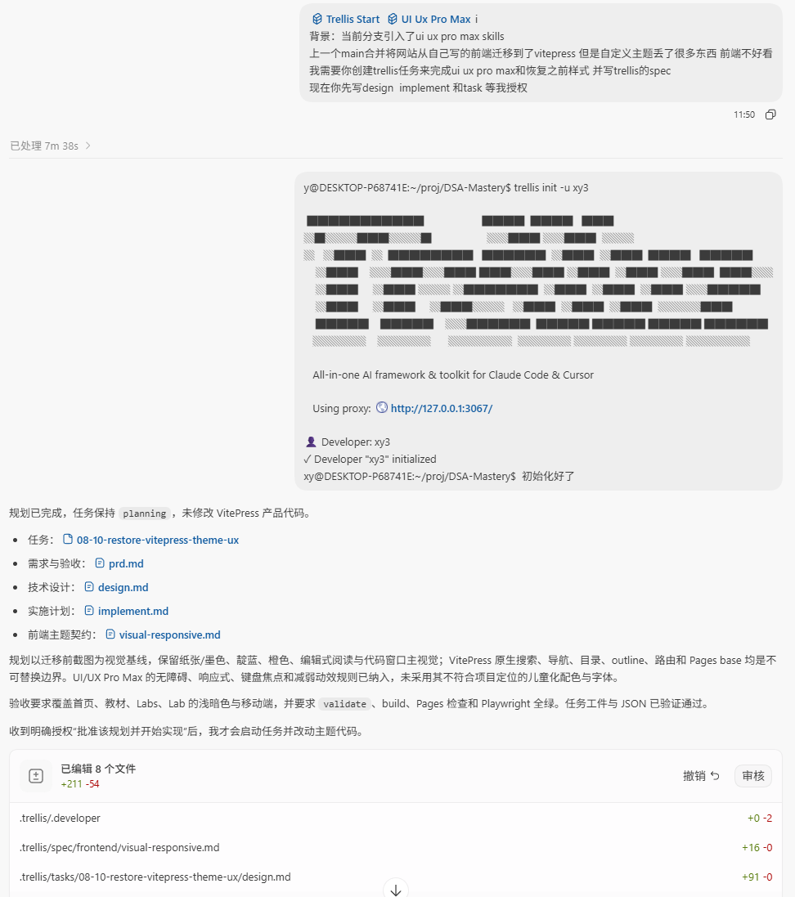
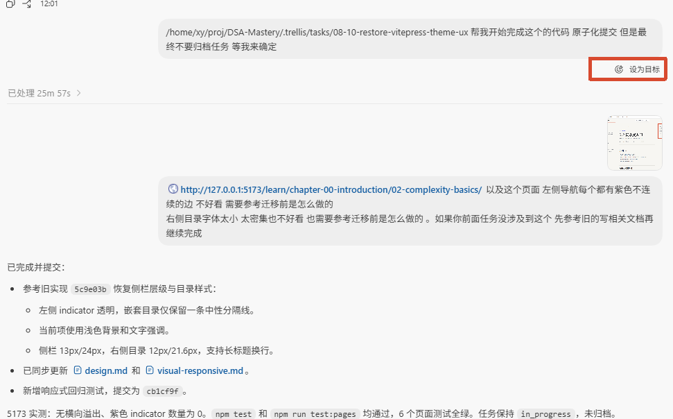
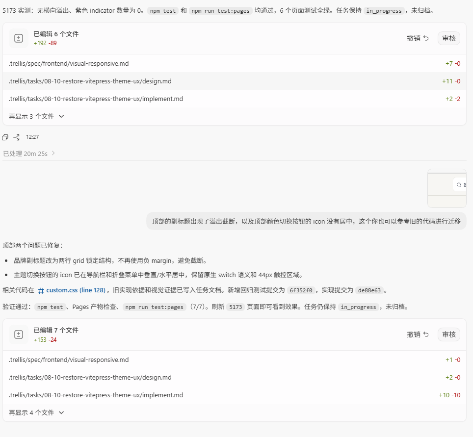
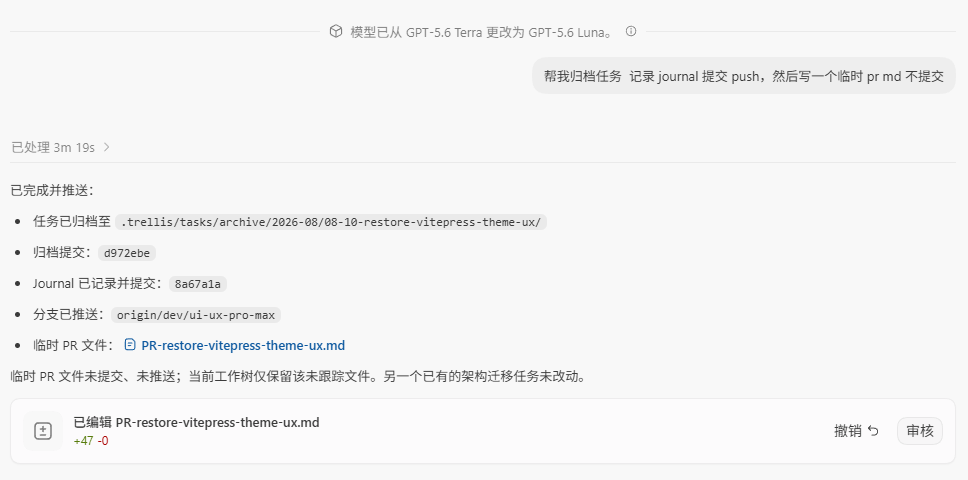

# 开发者指南

## 推荐前置视频

【让你的 Claude Code 和 Codex 效率提升 10 倍！Trellis 使用教程】 [https://www.bilibili.com/video/BV1RgGi6sENH/?share_source=copy_web&amp;vd_source=d57cf3b068e05eb5b643a66e39687907](https://www.bilibili.com/video/BV1RgGi6sENH/?share_source=copy_web&vd_source=d57cf3b068e05eb5b643a66e39687907)
【Git+Github核心概念大串讲，从零到一全攻略，详细实战教程】 [https://www.bilibili.com/video/BV1ySLc6QEcB/?share_source=copy_web&amp;vd_source=d57cf3b068e05eb5b643a66e39687907]([https://www.bilibili.com/video/BV1ySLc6QEcB/?share_source=copy_web&vd_source=d57cf3b068e05eb5b643a66e39687907]())
建议观看这两个视频
第一个视频教如何安装使用trellis的
第二个视频讲的git基本概念 分支 pr 工作区 commit这些概念需要了解

## 环境配置

### nodejs

[nodejs.org/zh-cn/download](https://nodejs.org/zh-cn/download)

### ai cli

推荐claude code，opencode，codex三选一

使用cc-Switch管理中转站：[github.com/farion1231/cc-switch](https://github.com/farion1231/cc-switch)

可以用他们推荐的中转站，也可以用DeepSeek（不支持图像识别）：[api-docs.deepseek.com/zh-cn/quick_start/agent_integrations/claude_code](https://api-docs.deepseek.com/zh-cn/quick_start/agent_integrations/claude_code)

### cli安装

trellis：

```
npm install -g @mindfoldhq/trellis@latest
```

ui-ux-pro-max

```
npm install -g ui-ux-pro-max-cli
```

### 初始化开发者

在clone完仓库之后，在仓库目录执行：

```
trellis init -u your-name
```

## 开发教程

### 创建分支

在vscode侧边栏先回到main分支，在最新main分支基础上创建分支

目前还未讨论分支命名规范，暂定为dev/short-name

### 创建task

可参考类似下面提示词：

```
[$trellis-start](/home/xy/proj/DSA-Mastery/.agents/skills/trellis-start/SKILL.md) [$ui-ux-pro-max](/home/xy/proj/DSA-Mastery/.agents/skills/ui-ux-pro-max/SKILL.md) 
需求：
背景：当前分支引入了ui ux pro max skills
上一个main合并将网站从自己写的前端迁移到了vitepress 但是自定义主题丢了很多东西 前端不好看
我需要你创建trellis任务来完成ui ux pro max和恢复之前样式 并写trellis的spec

现在你先写design  implement 和task 等我授权
```



在他创建完prd之后，可以人工审阅修改，如果不需要修改则到下一步。

### 挂goal模式执行

用codex的goal模式让ai完成刚刚的任务，但是不要归档任务



### 人工验收归档

等goal模式结束后，人工验收看看效果，效果不满意则继续改



满意的话则让他归档任务，提交journal，然后就可以发pr了


