# Windows 学生实验环境安装指南

> 适用对象：在 Windows 10/11 上完成 DSA Mastery 本地 C++ Lab 的学生。

## 1. 安装 Git

下载地址：[Git for Windows](https://git-scm.com/download/win) 一般X64处理器选图片这个

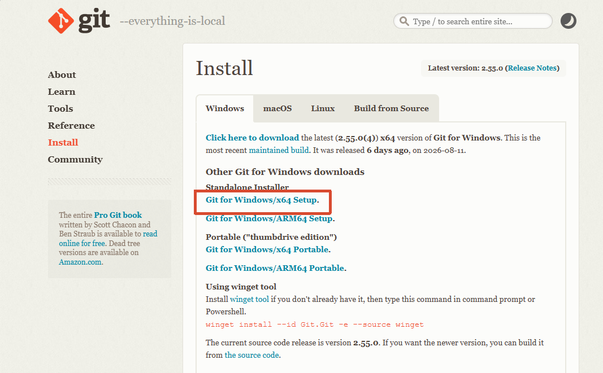

安装时大部分选项保持默认即可。遇到 PATH 相关选项时，选择：

```text
Add a Git Bash Profile to Windows Terminal
```

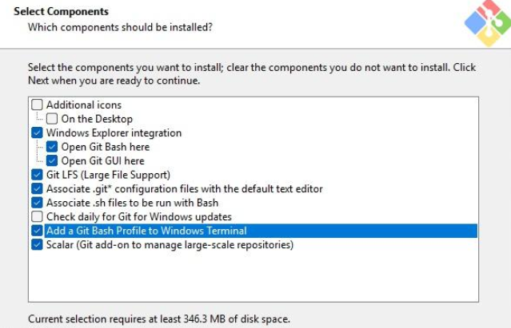

安装完成后打开 PowerShell，执行：

```powershell
git --version
```

能看到 Git 版本号即可。

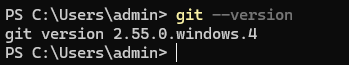

## 2. 安装 Node.js 和 pnpm

下载地址：[Node.js 官方下载页](https://nodejs.org/zh-cn/download/)

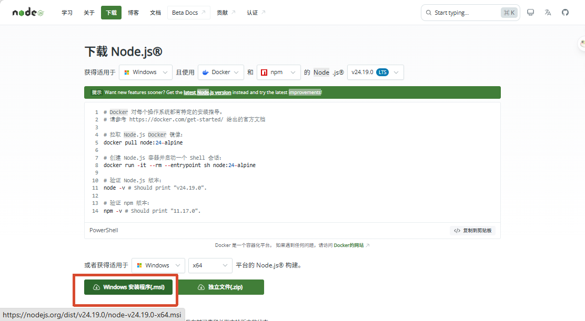

安装完成后，重新打开 PowerShell，执行：

```powershell
node --version
```

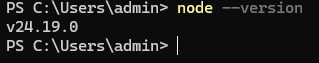

然后启用 Corepack，并确认 pnpm 版本：

```powershell
corepack enable
pnpm --version
```

本仓库固定使用 pnpm `11.1.1`。如果显示的版本不是 `11.1.1`，可以执行：

```powershell
corepack install --global pnpm@11.1.1
pnpm --version
```

如果 PowerShell 提示找不到 `pnpm`，先关闭当前终端，重新打开一个 PowerShell 再试。

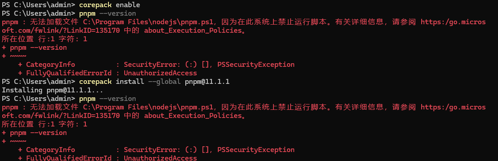

如果提示：“因为在此系统上禁止运行脚本。有关详细信息”，使用管理员打开powershell执行`Set-ExecutionPolicy RemoteSigned -Scope CurrentUser`然后重试

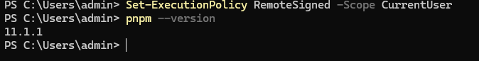

3. 安装 MSVC Build Tools

下载地址：[Visual Studio C++ Build Tools](https://visualstudio.microsoft.com/visual-cpp-build-tools/)

这里安装的是编译器工具链，不是完整的 Visual Studio IDE。

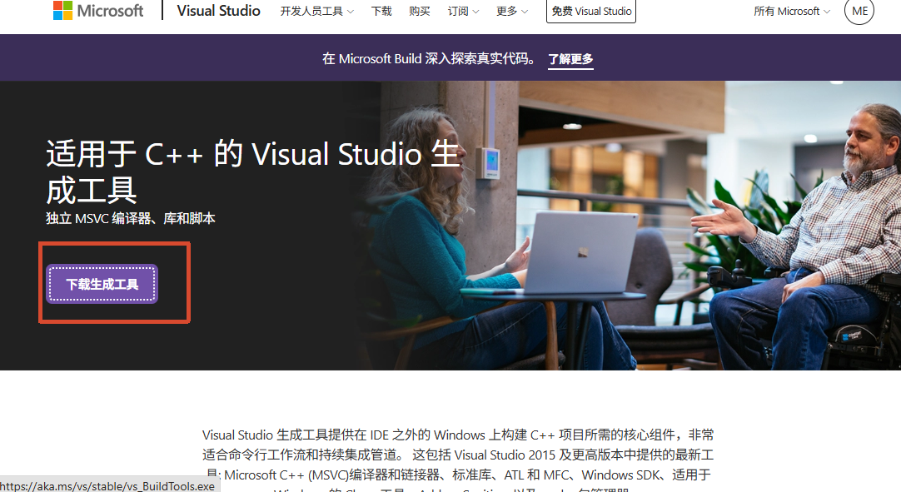

在 Visual Studio Installer 中选择工作负载：

```text
Desktop development with C++
```

确认右侧组件至少包含：

- MSVC v143 C++ build tools
- Windows 10 SDK 或 Windows 11 SDK
- C++ CMake tools for Windows

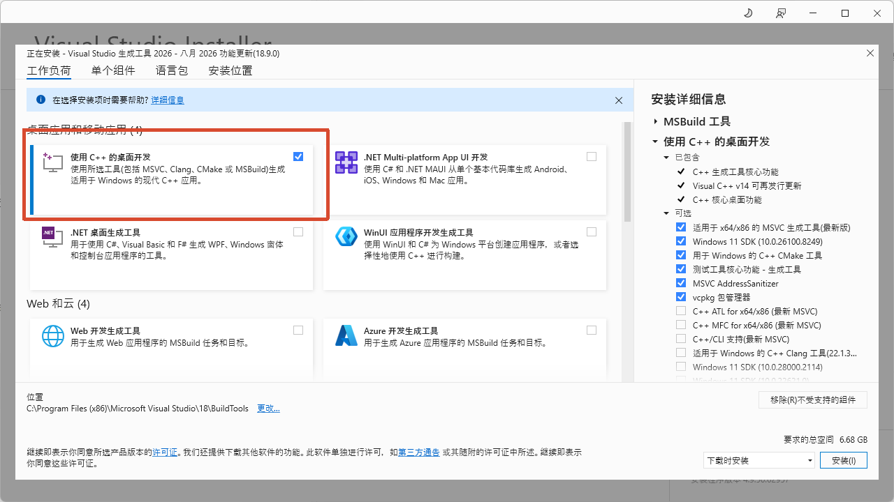

安装完成后，从开始菜单打开：

```text
Developer Command Prompt for VS
```

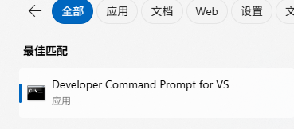

执行：

```powershell
cl
```

如果输出中包含 Microsoft C/C++ 编译器版本信息，说明 MSVC 已经可以使用。显示“没有输入文件”之类的提示也不代表安装失败；这里主要检查是否能找到 `cl.exe`。

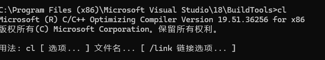

## 4. 安装 VS Code

下载地址：[Visual Studio Code 官方下载页](https://code.visualstudio.com/Download)

建议安装以下扩展：

- [C/C++](https://marketplace.visualstudio.com/items?itemName=ms-vscode.cpptools)：代码补全、错误提示和调试
- [CMake Tools](https://marketplace.visualstudio.com/items?itemName=ms-vscode.cmake-tools)：Project Lab 的 CMake 配置和构建，可选

VS Code 是编辑器，不包含 C++ 编译器。即使已经安装 VS Code，仍然需要安装前面的 MSVC Build Tools。

## 5. 验证完整环境

建议从 **Developer PowerShell for VS 2022** 打开 VS Code 的终端，依次执行：

```powershell
git --version
node --version
pnpm --version
cmake --version
cl
```

版本要求：

| 工具    | 要求                                     |
| ------- | ---------------------------------------- |
| Node.js | `22.13.0` 或更高                       |
| pnpm    | `11.1.1`                               |
| MSVC    | Visual Studio 2022，MSVC`19.30` 或更高 |
| CMake   | `3.25` 或更高                          |

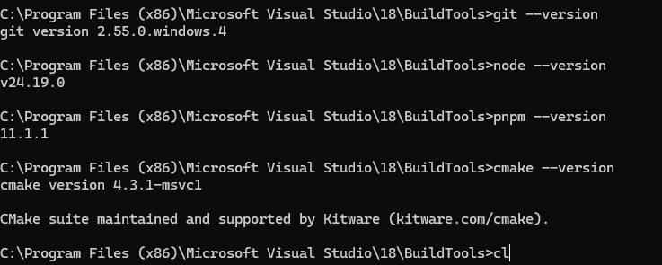

## 6. 下载仓库

先创建一个放代码仓库的文件夹，再放本实验仓库过来，路径不要包含中文

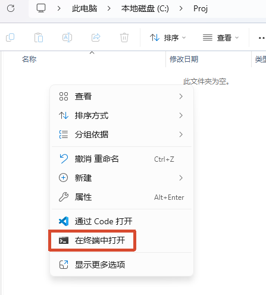

在希望存放代码的目录打开 PowerShell或者 Developer Command Prompt for VS，执行：

```powershell
git clone https://github.com/AzenAnn/DSA-Mastery
cd DSA-Mastery
pnpm install --frozen-lockfile
```

也可以通过下载zip来放置，但是下载zip不方便同步最新的仓库

## 7. 运行第一个 Program Lab

使用Developer Command Prompt for VS来运行

先cd过去，比如刚刚我放在`C:\Proj\DSA-Mastery`

```
cd C:\Proj\DSA-Mastery
```

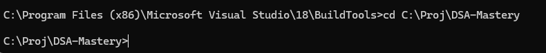

先使用环境检查命令：

```powershell
pnpm lab:doctor -- labs/chapter-01/lab-01-03-problem-template
```

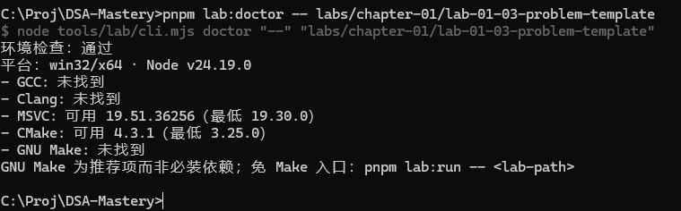

如果环境检查通过，可以运行公开测试：

```powershell
pnpm lab:run -- labs/chapter-01/lab-01-03-problem-template
```

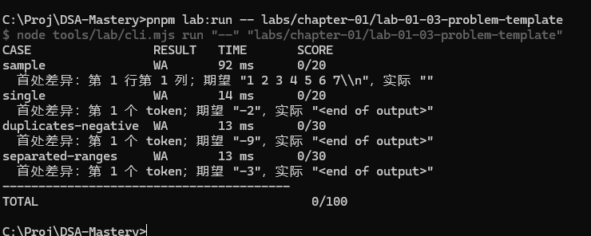

也可以只运行示例测试：

```powershell
pnpm lab:run -- labs/chapter-01/lab-01-03-problem-template --case sample
```

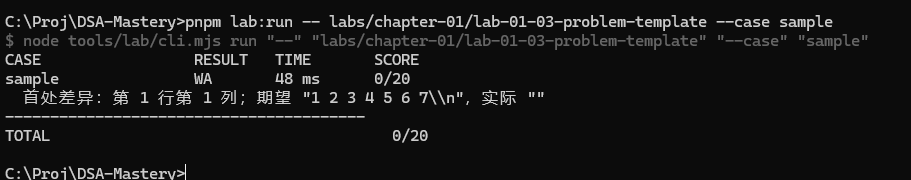

## 8. 运行 Project Lab

Project Lab 除了 MSVC，还需要 CMake。可以先检查：

```powershell
pnpm lab:doctor -- labs/chapter-04/lab-04-02-huffman-coding
```

然后运行 Project Lab：

```powershell
pnpm lab:run -- labs/chapter-04/lab-04-02-huffman-coding
```

也可以运行指定 task 和测试用例：

```powershell
pnpm lab:run -- labs/chapter-04/lab-04-02-huffman-coding --task frequency --case weighted
```

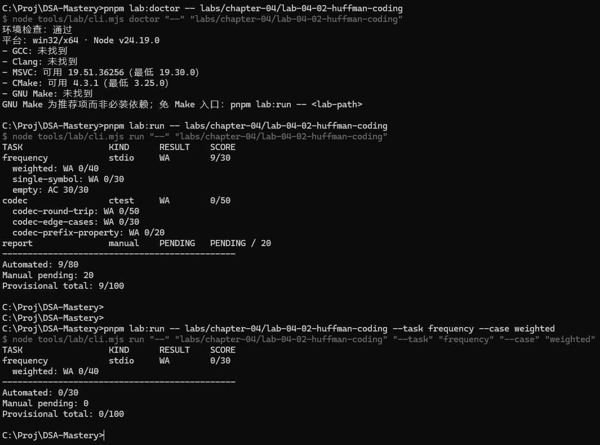