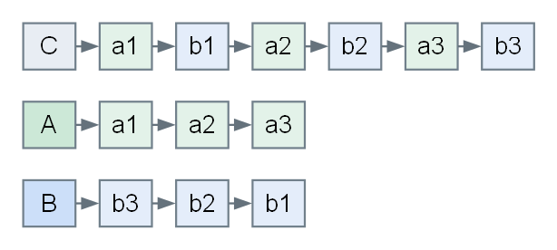

# Lab 01-T-06：线性表理论大题训练

## 目标与训练安排

- 从有序性、值域和结点结构中提取可利用的条件，设计符合题意的算法。
- 用不变量或排除论证说明正确性，给出能够推翻错误做法的反例。
- 分清输入空间、输出空间和辅助空间，以及结点的读取、复用、分配与释放。

前置阅读：[线性表 ADT](../../../../content/chapter-01-linear-list/01-abstract-data-type.md)、[顺序表](../../../../content/chapter-01-linear-list/02-sequential-list.md)、[链表](../../../../content/chapter-01-linear-list/03-linked-list.md)及[数组到链表的解题迁移](../../../../content/chapter-01-linear-list/06-array-to-linked-list-problem-solving.md)。

| 组别 | 题号 | 核心任务 | 分值 | 建议用时 |
| --- | --- | --- | --- | --- |
| 一 | 1～5 | 有序性、候选消去与扫描方向 | 50 分 | 75～90 分钟 |
| 二 | 6～10 | 原地修改、重排与拆分 | 50 分 | 75～90 分钟 |
| 三 | 11～15 | 集合运算、匹配、判环与自调整 | 50 分 | 75～90 分钟 |

共 **15 道理论大题，每题 10 分，总计 150 分，全部人工自评**。可分三次完成；每题提交一份包含设计思路、关键伪代码、正确性说明和复杂度分析的书面答案。环境为现代浏览器及纸笔，无需编译器。

以下题面保留原题的核心条件，增补了证明、反例或边界小问，统一按本训练的 10 分细则评分。伪代码中数组下标从 0 开始，赋值按行执行，`NULL` 表示空指针；除第 14 题明确说明外，链表均带有效头结点且无环。分配和释放一个结点按常数时间计，整数运算须使用足以容纳结果的类型。

## 第一组：有序性与扫描

### 第 1 题：两个等长升序序列的中位数

来源：2011 年统考第 42 题（题面整理）；题目标识：`ds-2011-42`。

长度为 $L$ 的非降序序列，其第 $\lceil L/2\rceil$ 个元素称为中位数。给定长度均为 $n\ge1$ 的非降序数组 $A,B$，求它们合并排序后的中位数。**总长为 $2n$，本题取第 $n$ 个元素，不取中间两数的平均值。**

例如 $A=(11,13,15,17,19)$、$B=(2,4,6,8,20)$，答案为 11。

1. 设计 $O(\log n)$ 时间、$O(1)$ 辅助空间的算法，不实际合并数组。
2. 写出搜索状态和排除规则，证明找到的值是第 $n$ 小的元素。
3. 说明 $n=1$、两表值域完全分离、存在重复值时如何处理，并分析直接归并到第 $n$ 项的时间与辅助空间。

::: details 第 1 题参考答案与评分要点

**设计：二分左半部从 A 取多少项。** 令 $i$ 个 A 元素、$j=n-i$ 个 B 元素进入合并序列的左半部。左半部恰有 $n$ 项，只需满足两条跨数组边界条件：

$$A[i-1]\le B[j],\qquad B[j-1]\le A[i].$$

越过数组左界的值视为 $-\infty$，越过右界视为 $+\infty$；这是比较约定，无需在数组中存放哨兵值。

```text
lo = 0; hi = n
while lo <= hi:
    i = lo + (hi - lo) // 2
    j = n - i
    AL = -infinity if i == 0 else A[i - 1]
    AR = +infinity if i == n else A[i]
    BL = -infinity if j == 0 else B[j - 1]
    BR = +infinity if j == n else B[j]
    if AL > BR: hi = i - 1
    else if BL > AR: lo = i + 1
    else: return max(AL, BL)
```

**正确性。** 各数组内部已有序；两条跨界不等式成立时，左半部任意值均不大于右半部任意值，故左半部最大值就是第 $n$ 小。若 `AL > BR`，A 取多了：增大 $i$ 只会令 `AL` 不减、`BR` 不增，因此可以排除当前及更大的 $i$；另一个失败条件对称。真实合并序列的前 $n$ 项必能构成一个合法划分，二分不会把全部合法划分排除。

样例可取 $i=1,j=4$，左边界为 11 和 8，右边界为 13 和 20，答案为 11。$n=1$ 时返回两项中较小者；完全分离时可取 $i=0$ 或 $i=n$；重复值使用非严格比较，仍然成立。

**复杂度与边界。** 搜索 $n+1$ 个划分位置，时间 $O(\log(n+1))$，通常记为 $O(\log n)$；辅助空间 $O(1)$。直接双指针归并至第 $n$ 项为 $O(n)$ 时间，但只保留当前值即可做到 $O(1)$ 辅助空间，并不一定需要完整结果数组。

**评分要点（10 分）：** 下中位数与划分状态 2 分；二分伪代码及边界 3 分；正确性和单调排除证明 3 分；复杂度及重复/分离情形 2 分。

:::

### 第 2 题：主元素的候选与验证

来源：2013 年统考第 41 题（题面整理）；题目标识：`ds-2013-41`。

给定长度 $n\ge1$ 的整数数组 $A$，其中 $0\le A[i]<n$。出现次数**严格超过** $n/2$ 的值称为主元素。存在时返回该值，否则返回 -1。

例如 $(0,5,5,3,5,7,5,5)$ 的主元素为 5，而 $(0,5,5,3,5,1,5,7)$ 没有主元素。

1. 设计 $O(n)$ 时间、$O(1)$ 辅助空间的算法。
2. 证明“成对消去不同值”不会消掉真正的主元素；解释为什么候选仍需第二遍验证。
3. 用 $(0,1,2,3)$ 追踪候选与计数；说明计数是否等于候选的总出现次数。

::: details 第 2 题参考答案与评分要点

**设计：摩尔投票，两遍扫描。** 第一遍维护尚未成对消去的同值元素；第二遍计算候选的真实频数。

```text
candidate = undefined; count = 0
for x in A:
    if count == 0:
        candidate = x; count = 1
    else if x == candidate: count += 1
    else: count -= 1
times = 0
for x in A:
    if x == candidate: times += 1
return candidate if times > n // 2 else -1
```

**正确性。** 扫描后的已处理前缀可分解成若干对不同值与 `count` 个相同候选。设主元素出现 $f>n/2$ 次：删除一对不同值至多删除一个主元素，若删了一个，则 $f-1>(n-2)/2$；若未删主元素，其比例更高。因此若主元素存在，抵消到最后的候选必为它。反过来，没有主元素时也可能留下候选，必须验证。

| 扫入值 | candidate | count |
| --- | --- | --- |
| 0 | 0 | 1 |
| 1 | 0 | 0 |
| 2 | 2 | 1 |
| 3 | 2 | 0 |

此时候选字段仍为 2，但出现次数仅 1，返回 -1。`count` 是未抵消的余额，不是总频数；实现不同可能留下不同候选，都不能省略验证。

**复杂度与边界。** 两遍时间 $O(n)$、辅助空间 $O(1)$。单元素必是主元素；恰好出现 $n/2$ 次不合格；返回 -1 不与给定非负值域冲突。比较 `times > n // 2` 可避免计算 `2 * times` 时的溢出。

**评分要点（10 分）：** 候选消去思路 2 分；两遍算法 3 分；消去证明与反例 3 分；复杂度及严格过半边界 2 分。

:::

### 第 3 题：最小未出现正整数

来源：2018 年统考第 41 题（题面整理）；题目标识：`ds-2018-41`。

给定 $n\ge1$ 个整数，找出未出现的最小正整数。例如 $(-5,3,2,3)$ 的答案为 1，$(1,2,3)$ 的答案为 4。本题优先要求时间高效，允许辅助数组。

1. 证明答案一定在 $[1,n+1]$ 内，并设计线性时间算法。
2. 给出标记下标的合法条件，说明负数、0、重复值和远大于 $n$ 的值如何处理。
3. 分析所有步骤的时间与空间；若要求保留原数组，标记法是否满足？

::: details 第 3 题参考答案与评分要点

**设计：只标记 1 到 n。** $n$ 个位置不可能覆盖 $n+1$ 个不同的正整数；若 $1,\ldots,n$ 全部出现，答案恰为 $n+1$，否则就是其中最小的缺失值。

```text
mark[0..n] = all false
for x in A:
    if 1 <= x and x <= n:
        mark[x] = true
for x = 1 .. n:
    if not mark[x]: return x
return n + 1
```

**正确性。** 标记完成后，对每个 $x\in[1,n]$，`mark[x]` 为真当且仅当原数组包含 $x$。从小到大的第一次未标记即为最小缺失值；若均已标记，结合值域上界得到 $n+1$。

例如 $(-2,0,1,1,9)$ 中 $n=5$，只标记 1，答案为 2。不能只判断 `x > 0` 就访问 `mark[x]`，否则 9 会越界。重复标记不影响结果，非正数与大于 $n$ 的数均不参与标记。

**复杂度与边界。** 初始化、标记和找答案各为 $O(n)$，总时间 $O(n)$；辅助空间 $O(n)$。算法只读 A，保留原内容。单元素 $(1)$ 返回 2，其他单元素若不是 1 则返回 1。允许修改原数组时还可讨论原地置换，但不能将本题的 $O(n)$ 辅助数组解误写成 $O(1)$ 空间。

**评分要点（10 分）：** 候选范围证明 2 分；标记和扫描算法 3 分；正确性及下标防护 3 分；完整复杂度与边界 2 分。

:::

### 第 4 题：三个有序集合的最小距离

来源：2020 年统考第 41 题（题面整理）；题目标识：`ds-2020-41`。

三个非空整数集合分别按递增次序保存在数组 $S_1,S_2,S_3$ 中，长度为 $m,n,p$。定义

$$D(a,b,c)=|a-b|+|b-c|+|c-a|.$$

求 $a\in S_1,b\in S_2,c\in S_3$ 时的最小距离。整数可以为负数。例如 $S_1=(-1,0,9)$、$S_2=(-25,-10,10,11)$、$S_3=(2,9,17,30,41)$，最小距离为 2，对应 $(9,10,9)$。

1. 化简距离式，设计优于枚举全部 $mnp$ 个三元组的算法。
2. 证明每次前移当前最小元素所在数组的指针不会错过更优答案；最小值并列时如何处理？
3. 给出停止条件、复杂度和整数运算的注意事项。

::: details 第 4 题参考答案与评分要点

**设计：三个指针维护一个窗口。** 将三项排序为 $x\le y\le z$，可得

$$D=(y-x)+(z-y)+(z-x)=2(z-x).$$

```text
i = 0; j = 0; k = 0; best = +infinity
while i < m and j < n and k < p:
    x = min(S1[i], S2[j], S3[k])
    z = max(S1[i], S2[j], S3[k])
    best = min(best, 2 * (z - x))
    if best == 0: return 0
    if S1[i] == x: i += 1
    else if S2[j] == x: j += 1
    else: k += 1
return best
```

**排除证明。** 假设当前最小值为 `S1[i]=x`。固定它，另外两个指针以后只会指向不小于当前的值，所以最大值不会减小、最小值仍为 $x$；这些组合的距离不小于刚检查过的距离。已经扫描过的前缀又在此前被同样的规则安全排除，因此可以舍弃当前 `S1[i]`。最小值并列时，任选其中一个指针前移仍满足该论证。

每轮记录当前三元组后才移动。任一数组耗尽时，该数组的每个元素都已安全排除，剩余组合不可能改善记录值。距离下界为 0，遇到 0 可以提前结束。

**复杂度与边界。** 每轮至少推进一个指针，总时间 $O(m+n+p)$，辅助空间 $O(1)$。数组非空是前提；单元素数组、跨数组相等元素、负数均适用。应先把操作数提升到足够宽的整数类型，再做 `z - x` 和乘 2；仅将已经溢出的结果转为宽类型无效。

**评分要点（10 分）：** 距离恒等式 2 分；三指针算法 3 分；安全舍弃与停止证明 3 分；复杂度和边界 2 分。

:::

### 第 5 题：每个元素与后缀的最大乘积

来源：2025 年统考第 41 题（题面整理）；题目标识：`ds-2025-41`。

给定长度为 $n\ge1$ 的整数数组 A 与同长度输出数组 res，要求

$$\operatorname{res}[i]=\max_{i\le j<n}\big(A[i]\cdot A[j]\big).$$

例如 $A=(1,4,-9,6)$，结果为 $(6,24,81,36)$。保留 A 的内容，以线性时间、常数辅助空间计算 res。

1. 说明扫描方向与需要维护的状态，写出算法。
2. 证明同时维护后缀最大值和最小值是充分的，并说明为什么必须包含 $j=i$。
3. 给出“只维护后缀最大值”和“先计算再更新极值”的反例；区分输出空间与辅助空间。

::: details 第 5 题参考答案与评分要点

**设计：从右向左扩展后缀。** 固定 $A[i]$ 后，若它非负，乘后缀最大值最好；若它为负，乘后缀最小值最好。

```text
suffixMin = A[n - 1]; suffixMax = A[n - 1]
for i = n - 1 down to 0:
    suffixMin = min(suffixMin, A[i])
    suffixMax = max(suffixMax, A[i])
    res[i] = max(A[i] * suffixMin,
                 A[i] * suffixMax)
```

**不变量。** 计算 `res[i]` 前，两变量恰为 $A[i..n-1]$ 的极值。新一轮只加入 $A[i]$，由上轮后缀极值更新即可；对固定乘数，乘积随另一个因子单调不减或单调不增，因此极值足以求出最大乘积。

| i | A[i] | 后缀最小值 | 后缀最大值 | res[i] |
| --- | --- | --- | --- | --- |
| 3 | 6 | 6 | 6 | 36 |
| 2 | -9 | -9 | 6 | 81 |
| 1 | 4 | -9 | 6 | 24 |
| 0 | 1 | -9 | 6 | 6 |

**反例。** $A=(-2,3)$ 时，只乘后缀最大值会得到 -6，而正确结果包含自乘 4。$A=(5,1)$ 时，在纳入 5 前用旧后缀算乘积会得到 5，正确结果应为 25。由 $j=i$ 合法可知，每项结果至少为 $A[i]^2$。

**复杂度与边界。** 时间 $O(n)$，辅助空间 $O(1)$；调用方提供的 res 有 $O(n)$ 个输出位置，不应计成额外后缀数组。全负、含 0、单元素都适用；乘法在足够宽的类型中完成。

**评分要点（10 分）：** 逆向扫描与双极值 2 分；更新顺序和算法 3 分；不变量及两个反例 3 分；复杂度和整数范围 2 分。

:::

## 第二组：原地修改与拆分

### 第 6 题：稳定删除顺序表中的所有指定值

来源：顺序表笔记综合题 9；题目标识：`ds-drill-sequential-list-103-delete-all-x`。

无序数组 A 的前 $n\ge0$ 项保存线性表，要求原地删除所有等于 x 的元素，保持其余元素的原相对顺序，返回新长度 k。仅要求 A 的前 k 项正确，尾部剩余槽位的内容不作要求。

例如 $(3,7,3,5,8,3,2)$ 删除 3 后，有效前缀为 $(7,5,8,2)$，返回 4。

1. 设计一趟扫描、$O(1)$ 辅助空间的算法。
2. 写出读写下标的不变量，证明不会覆盖尚未读取的数据，且结果稳定。
3. 分析每遇到 x 就把整个后缀左移的最坏代价，并给出空表、全删、不删时的结果。

::: details 第 6 题参考答案与评分要点

**设计：读指针检查，写指针压缩。**

```text
write = 0
for read = 0 .. n - 1:
    if A[read] != x:
        A[write] = A[read]
        write += 1
return write
```

**不变量。** 每次循环开始时，`A[0..write-1]` 恰是原数组已读前缀 `A_original[0..read-1]` 删除 x 后的结果，且 $0\le write\le read$。若当前值需保留，只写入当前位置或更早的位置，不会破坏尚未检查的后缀；保留值按读取顺序依次追加，所以稳定。扫描结束后不变量覆盖原表全部元素。

样例中各轮结束后的 write 依次为 $0,1,1,2,3,3,4$；不能把 k 之后残留的旧值当作仍在逻辑表中。

**复杂度与边界。** 时间 $O(n)$，辅助空间 $O(1)$。逐个删除并搬移后缀，在全部元素等于 x 时搬移次数为 $(n-1)+(n-2)+\cdots+0=\Theta(n^2)$。空表和全删都返回 0，不删返回 n；值为负数或 0 不改变处理方式。尾部交换删除虽可很快，但一般会破坏稳定性。

**评分要点（10 分）：** 读写双指针 2 分；算法与新长度 3 分；不覆盖及稳定性证明 3 分；复杂度、边界和慢算法反例 2 分。

:::

### 第 7 题：折半查找后的交换或插入

来源：顺序表笔记综合题 11；题目标识：`ds-drill-sequential-list-105-binsearch-swap-or-insert`。

数组 A 的前 $n\ge0$ 项严格递增，容量至少为 $n+1$。对给定 x 执行**一次**操作：若查到 x 且它不是尾元素，将它与右邻交换；若它已是尾元素，保持不变；若查不到，将 x 插入到合适位置，使该分支的结果仍严格递增。返回新长度。

例如 $(1,3,5,7,9)$ 查找 5 得 $(1,3,7,5,9)$，查找 6 得 $(1,3,5,6,7,9)$。

1. 写出折半查找与两类后续处理的伪代码。
2. 说明查找失败时插入位置如何由搜索边界确定，为什么搬移必须从后往前。
3. 分别分析查找成功、失败插入的复杂度，并判断能否直接在修改后的数组上重复本算法。

::: details 第 7 题参考答案与评分要点

**设计：用 lower_bound 统一找到第一个不小于 x 的位置。** 半开区间 `[lo,hi)` 使空表也能自然处理。

```text
lo = 0; hi = n
while lo < hi:
    mid = lo + (hi - lo) // 2
    if A[mid] < x: lo = mid + 1
    else: hi = mid
pos = lo
if pos < n and A[pos] == x:
    if pos + 1 < n: swap(A[pos], A[pos + 1])
    return n
for j = n down to pos + 1:
    A[j] = A[j - 1]
A[pos] = x
return n + 1
```

**正确性。** 二分保持 `lo` 左侧全小于 x、`hi` 及其右侧全不小于 x；当两边界重合时，pos 就是第一个不小于 x 的位置。若该处相等，执行题目指定交换；否则 pos 两侧分别小于和大于 x，将它插入不会打破递增次序。从后往前搬移，源位置在被覆盖前已完成读取；正向右移会重复传播旧值。

**关键区别。** 查到非尾元素后的交换**会破坏有序性**，这是题意指定结果。例如 $(1,3,5,7,9)$ 变为 $(1,3,7,5,9)$。此时不能未经恢复就再次使用以全表有序为前提的二分查找。

**复杂度与边界。** 成功分支为 $O(\log(n+1))$ 查找加 $O(1)$ 交换。失败分支另需移动 $n-pos$ 项，最坏 $O(n)$，不能只算二分成本。辅助空间均为 $O(1)$。空表插在 0；尾部命中不交换；失败时也可能在首部或尾部插入。

**评分要点（10 分）：** 两分支合同 2 分；二分及搬移算法 3 分；插入位置证明与有序性反例 3 分；复杂度和边界 2 分。

:::

### 第 8 题：按绝对值保留首次出现的结点

来源：2015 年统考第 41 题（题面整理）；题目标识：`ds-2015-41`。

带头结点的单链表保存 m 个整数，$|data|\le n$，其中 n 为正整数。对绝对值相同的结点，仅保留从头遍历时第一次出现的结点，删除并释放其余结点。

例如 $21\to-15\to-15\to-7\to15$ 变为 $21\to-15\to-7$。

1. 利用有限值域设计算法，写出删除与保留两种情况下的指针更新。
2. 证明保留的是第一次出现的**原结点**，并说明 0、连续重复值和正负成对出现时的处理。
3. 令 m 与 n 独立变化，把标记数组初始化计入总时间；比较两两查重和使用哈希集合的代价。

::: details 第 8 题参考答案与评分要点

**设计：绝对值作为下标，单趟扫描链表。** 标记数组需要 `n+1` 项，因为 0 也合法。这里统一把链域写作 `next`。

```text
seen[0..n] = all false
pre = H
while pre.next != NULL:
    p = pre.next
    key = abs(p.data)
    if seen[key]:
        pre.next = p.next
        free(p)
    else:
        seen[key] = true
        pre = p
release seen
```

**不变量。** 已处理部分中，每个绝对值仅有第一次出现的原结点被保留，`seen` 恰记录这些绝对值。首次出现时标记并推进 pre；再次出现时跳过并释放当前结点，pre 不动，因此连续重复者不会漏检。结点 data 不被修改，原相对顺序保留。

例如 $(0,0,-2,2,-2)$ 保留第一个 0 和第一个 -2。比较的是绝对值，不能直接用带符号的 data 作下标，也不能因两个结点值符号不同就同时保留。

**复杂度与边界。** 清零标记表为 $\Theta(n)$，扫描为 $\Theta(m)$，故总时间是 $O(m+n)$，辅助空间 $O(n)$。只写 $O(m)$ 漏掉初始化。两两查重为 $O(m^2)$ 时间、$O(1)$ 辅助空间；哈希集合在通常散列假设下期望 $O(m)$ 时间、$O(m)$ 空间，并非无条件最坏线性。当 n 远大于 m 时，不能笼统认为直接寻址一定更省。

空链表无需删除；若分配标记数组失败，应在改链前返回失败。实际语言中先用足够宽的有符号类型取绝对值，保证 key 能表示且处于 $[0,n]$；释放后不得再读取 p。

**评分要点（10 分）：** 值域标记 2 分；保留/删除算法 3 分；首次原结点与边界证明 3 分；包含初始化的复杂度和方案比较 2 分。

:::

### 第 9 题：单链表的首尾交错重排

来源：2019 年统考第 41 题（题面整理）；题目标识：`ds-2019-41`。

带头结点的单链表保存 $L=(a_1,a_2,\ldots,a_n)$。要求重新连接**原结点**，得到

$$L'=(a_1,a_n,a_2,a_{n-1},a_3,a_{n-2},\ldots).$$

不得只改 data，不申请或释放数据结点，辅助空间为 $O(1)$。

1. 设计线性时间算法，说明如何切分、逆置和交替连接。
2. 对长度 5 和 6 分别写出两段的结点序列及最终结果。
3. 证明奇偶长度都不丢结点、不成环，并分析从头结点出发找中点时容易出现的偏差。

::: details 第 9 题参考答案与评分要点

**设计：前半长度取 $\lceil n/2\rceil$，后半取 $\lfloor n/2\rfloor$。** 快慢指针都从首元结点出发；断开两段后逆置后半，再逐项交错。

```text
if H.next == NULL or H.next.next == NULL: return
slow = H.next; fast = H.next
while fast.next != NULL and fast.next.next != NULL:
    slow = slow.next
    fast = fast.next.next
cur = slow.next
slow.next = NULL
right = NULL
while cur != NULL:
    saved = cur.next
    cur.next = right
    right = cur
    cur = saved
p = H.next; q = right
while q != NULL:
    pn = p.next; qn = q.next
    p.next = q
    q.next = pn
    p = pn; q = qn
```

| 长度 | 前半 | 逆置后的后半 | 最终次序 |
| --- | --- | --- | --- |
| 5 | 1,2,3 | 5,4 | 1,5,2,4,3 |
| 6 | 1,2,3 | 6,5,4 | 1,6,2,5,3,4 |

**正确性。** 切断后两段互不共享结点；逆置保持后半结点集合不变。每次交错将前半的下一结点与后半的下一结点加入结果，得到目标前缀。前半不短于后半，故 q 存在时 p 必存在；奇数长度最终留下前半的中间结点，偶数长度同时取尽。每轮先保存两段后继，旧尾部已经断开，因此不会丢失未处理结点或留下回指环。

**边界与反例。** 若把上述初始化机械改为 `slow=fast=H` 而保持循环条件不变，长度 5 时 slow 停在 $a_2$：两段成为长 2 与长 3。若交替连接在前半耗尽时退出，最后的 $a_3$ 就会丢失。空表、单元素不重排；长度 2 的结果仍为原序。

**复杂度。** 找中点、逆置、交错各为线性扫描，总时间 $O(n)$，辅助空间 $O(1)$。结点身份及 data 均保持，变化仅在 next。

**评分要点（10 分）：** 三阶段与正确切分 2 分；完整伪代码 3 分；结点守恒、无环及奇偶证明 3 分；复杂度与错误中点反例 2 分。

:::

### 第 10 题：一趟拆成正序与逆序两条链

来源：单链表笔记综合题 6；题目标识：`ds-drill-singly-linked-list-102-split-alternating`。

带头结点的 C 保存 $2n$ 个数据结点，次序为 $(a_1,b_1,a_2,b_2,\ldots,a_n,b_n)$，允许 $n=0$。另给两个预分配的空头结点 A、B，三个头结点不同。只扫描原链一趟，复用原数据结点，将其拆成

$$A=(a_1,a_2,\ldots,a_n),\qquad B=(b_n,b_{n-1},\ldots,b_1),$$

并使 C 只剩头结点。不新建数据结点，不修改 data。



1. 写出单趟算法，并区分“按原位序奇偶”与“按元素值奇偶”。
2. 给出处理前 t 个结点后的不变量，以及原后继、A 链尾、C 头链的处理顺序。
3. 对三对结点跟踪 A、B 的结果，分析时间、空间及空表情形。

::: details 第 10 题参考答案与评分要点

**设计：奇数位尾插 A，偶数位头插 B。** 原始位序决定去向，与结点 data 的数值无关。

```text
p = C.next; C.next = NULL
tail = A; odd = true
while p != NULL:
    saved = p.next
    if odd:
        p.next = NULL
        tail.next = p
        tail = p
    else:
        p.next = B.next
        B.next = p
    odd = not odd
    p = saved
```

**不变量。** 已处理的奇数位结点构成 A 的正序链，已处理的偶数位结点构成 B 的逆序链；两条结果链的结点集合不交，p 指向尚未处理的原后缀。每次先存 `saved`，再改 p.next；尾插时立即断开新尾，保证 A 不会暂时挂着未处理的后缀。`C.next=NULL` 则明确原链头已不再拥有数据结点。

| 已处理到 | A | B |
| --- | --- | --- |
| b1 | a1 | b1 |
| b2 | a1,a2 | b2,b1 |
| b3 | a1,a2,a3 | b3,b2,b1 |

**正确性与边界。** 每个原结点恰被 saved 链接访问一次、分配到恰一条结果链；尾插保序，头插逆序，所以满足目标且无丢失、重复或交叉拥有。$n=0$ 时循环不执行，三个头结点均对应空表。A、B 必须在调用前为空，不能直接覆盖一条已有链而不处理其原结点。

**复杂度。** 共处理 $2n$ 个数据结点，时间 $O(n)$，辅助空间 $O(1)$。若 A 尾插时每次重新找尾，会变为 $O(n^2)$；“两趟仍为线性”也不能满足本题的单趟限制。

**评分要点（10 分）：** 位序分流与头/尾插 2 分；伪代码与后继保存 3 分；不变量及结点所有权 3 分；复杂度和空表 2 分。

:::

## 第三组：集合运算与链结构

### 第 11 题：不破坏原表的公共元素链

来源：单链表笔记综合题 7；题目标识：`ds-drill-singly-linked-list-103-common-elements-nondestructive`。

两个带头结点的单链表 A、B 各自严格递增，长度分别为 m、n。给定另一个预分配的空头结点 C，将两表共同元素按递增次序放入 C。**A、B 的数据和链接均须保持原样；C 的每个数据结点必须新建，不得借用输入结点。**

例如 $A=(1,3,5,7,9)$、$B=(2,3,7,10)$，C 应为 $(3,7)$。

1. 利用有序性设计 $O(m+n)$ 时间的算法。
2. 说明为什么移动局部指针不会破坏原表，以及为什么把 C 直接接到 A 的某个结点不符合题意。
3. 设交集有 k 个元素，区分输出结点空间和额外工作空间；若中途分配失败，如何保证 C 回到空表而 A、B 不变？

::: details 第 11 题参考答案与评分要点

**设计：双指针归并比较，新结点尾插。**

```text
p = A.next; q = B.next; tail = C
while p != NULL and q != NULL:
    if p.data < q.data: p = p.next
    else if p.data > q.data: q = q.next
    else:
        s = newNode(p.data)
        if s == NULL:
            releaseAllData(C)
            return false
        s.next = NULL
        tail.next = s
        tail = s
        p = p.next; q = q.next
return true
```

`releaseAllData(C)` 表示从 `C.next` 开始，每次先保存后继、再释放当前结点，最后置 `C.next=NULL`；保留预分配的头结点 C。

**正确性。** 若 `p.data < q.data`，B 的未扫描后缀均不小于 q，p 不可能再产生匹配，故可跳过；反向情况对称。相等时输出这个共同值，两侧同时前进，严格递增保证每个共同值只输出一次。由此 C 始终是已确定公共值的有序前缀；任一表耗尽即完成。

**结点所有权。** `p=p.next` 只改变局部变量，未写入输入结点。写链接只发生在 C 的头结点或新建结点上，因此输入拓扑不变。即使输出值恰与 A 相同，也必须新建副本；直接借用会让 C 与 A 共享结点，之后释放或改写 C 可能影响 A。

**复杂度与边界。** 双指针总前进次数至多 $m+n$；新建 k 个输出结点，占 $O(k)$ 输出空间，额外游标空间为 $O(1)$。如果把新建输出也计入额外分配量，应明确写 $O(k)$。分配失败时最多释放已建的 k 个结点，仍为 $O(m+n)$ 时间；A、B 始终未被写入。任一输入为空、没有交集时，C 为空且成功；两表相同也输出独立新结点。

**评分要点（10 分）：** 有序双指针 2 分；新建、尾插和失败回收 3 分；完整性与输入不变证明 3 分；空间口径和边界 2 分。

:::

### 第 12 题：在 A 链中就地保留交集

来源：单链表笔记综合题 8；题目标识：`ds-drill-singly-linked-list-104-intersection-destructive`。

A、B 是各自严格递增的带头结点单链表，**两表的头结点和数据结点互不共享**。要求把 $A\cap B$ 直接保存在 A 中，保留命中的 A 原结点；A 中其余数据结点全部释放。A 的头结点、B 的全部结点及链接保持不变，不得新建结点。

例如 $A=(1,3,5,7,9)$、$B=(2,3,7,10)$，结束时 A 仅剩原来存 3、7 的结点。

1. 给出 $O(m+n)$ 时间、$O(1)$ 辅助空间的算法。
2. 说明保留、删除、仅移动 B 指针三种分支中，A 的前驱指针何时前进。
3. 解释 B 先耗尽时的处理；若放宽“结点不共享”的约定，说明输入不变性的证明还需检查什么。

::: details 第 12 题参考答案与评分要点

**设计：比较决定保留或摘除，前驱跟随保留链。**

```text
pre = A; p = A.next; q = B.next
while p != NULL and q != NULL:
    if p.data == q.data:
        pre = p
        p = p.next; q = q.next
    else if p.data < q.data:
        saved = p.next
        pre.next = saved
        free(p)
        p = saved
    else:
        q = q.next
pre.next = NULL
while p != NULL:
    saved = p.next
    free(p)
    p = saved
```

**不变量。** pre 是 A 中已确定保留前缀的尾部，`pre.next=p` 指向尚未决定的 A 后缀；q 指向 B 中尚可能参与匹配的部分。相等时保留 p 并推进 pre；A 值较小时，该值不在 B 剩余部分，摘除 p 而不推进 pre；B 值较小时只推进 q。每次被排除的较小值都不可能再匹配，因此保留集合恰是交集。

**收尾。** 若 A 先耗尽，p 已为 NULL；若 B 先耗尽，A 剩余结点全部不属于交集，先将保留链尾置空，再逐个释放该后缀。不能只断链而不释放，也不能释放后再读 p.next。

**所有权前提。** 对 B 不直接赋值，并不自动等于 B 不受影响：若修改或释放共享结点，B 也会受到影响。本题采用不共享的约定，可直接据写入对象证明 B 不变。若允许共享，则必须另证共享结点不被释放、链接不被改变。对这里的严格递增无环单链表，共享部分只能是公共尾段，且该尾段所有值都在交集中；本算法会完整保留这段，仍可成立。不能把“需要补充别名证明”误说成“有共享就一定出错”。

**复杂度与边界。** 两个扫描指针总计前进 $O(m+n)$ 次，A 每个删除结点恰释放一次，辅助空间 $O(1)$。B 为空时清空 A 的所有数据结点；A 为空时无需释放；完全相同的值序列会保留 A 全部原结点；无交集则 A 只剩头结点。

**评分要点（10 分）：** 原地交集与前驱状态 2 分；三分支及收尾代码 3 分；正确性和共享结点风险 3 分；复杂度及空表 2 分。

:::

### 第 13 题：单链表上的连续子序列匹配

来源：单链表笔记综合题 9；题目标识：`ds-drill-singly-linked-list-105-is-sublist`。

整数序列 A、B 分别保存在带头结点的单链表中，长度为 m、n。判断 B 是否为 A 的**连续**子序列，不得修改原链，要求 $O(1)$ 辅助空间。B 为空时约定返回真，本题接受朴素匹配的最坏 $O(mn)$ 时间。

例如 $(3,5)$ 不是 $(1,2,3,4,5)$ 的连续子序列；而 $(1,2,3)$ 是 $(1,2,1,2,3)$ 从第 3 项开始的连续子序列。

1. 给出保留尝试起点的匹配算法。
2. 解释失配后为什么必须从原起点的后继重新尝试，不能直接从失配位置的后继继续。
3. 构造使比较次数达到 $\Theta(mn)$ 量级的一组输入，并讨论通常 KMP 方案的辅助空间。

::: details 第 13 题参考答案与评分要点

**设计：保存 start，每次完整尝试一个起点。**

```text
if B.next == NULL: return true
start = A.next
while start != NULL:
    p = start; q = B.next
    while p != NULL and q != NULL and p.data == q.data:
        p = p.next; q = q.next
    if q == NULL: return true
    if p == NULL: return false
    start = start.next
return false
```

**正确性。** 内层循环中，B 的已匹配前缀与从 start 开始的等长连续片段相等。q 到空表示全部匹配；发生失配只排除了当前 start，下一轮检查其后继，不漏中途可能开始的新匹配。若 p 已耗尽而 q 未耗尽，则从当前 start 起的剩余长度不足，后续起点更短，均不可能匹配。

在 $A=(1,2,1,2,3),B=(1,2,3)$ 中，第一次在 A 的第 3 项失配。若直接从失配位置的后继继续，就跳过了真正的起点 3。保存 start 并逐一推进，可以依次排除起点 1、2，再于 3 成功。

**复杂度反例。** 取 $m\ge2n$，A 的 m 项全为 1，B 为 $n-1$ 个 1 后接一个 2。至少 $m-n+1$ 个完整起点都要比较 n 次才失败，故最坏为 $\Theta(mn)$；只有两个比较游标和一个起点指针，辅助空间 $O(1)$。这不是归并扫描，不能因只有两个游标就声称线性。

空 B 返回真；空 A 与非空 B 返回假；值重复不代表结点共享。通常的 KMP 方案可将 B 复制到数组并建立失配表，获得 $O(m+n)$ 时间，但使用 $O(n)$ 辅助空间，不符合本题的常数空间限制。

**评分要点（10 分）：** start 与连续性 2 分；匹配/回退算法 3 分；完整性和漏起点反例 3 分；最坏复杂度与空表 2 分。

:::

### 第 14 题：快慢指针为什么一定能判环

来源：单链表笔记综合题 11；题目标识：`ds-drill-singly-linked-list-107-detect-cycle`。

本题单链表**没有哨兵头结点**，head 指向第一个数据结点，空链表为 NULL。判断沿 next 是否最终回到已经访问过的结点。不得修改结点或使用与链长同阶的集合，辅助空间要求 $O(1)$。

1. 写出快慢指针判环算法，说明空指针检查和比较相遇的顺序。
2. 若入环前有 $\mu$ 个结点、环长为 $\lambda$，证明有限轮内一定相遇，并给出时间上界。
3. 分别分析空链、单结点无环、单结点自环、重复值但无环四种情况。

::: details 第 14 题参考答案与评分要点

**设计：每轮 slow 一步、fast 两步，移动后比较地址。**

```text
slow = head; fast = head
while fast != NULL and fast.next != NULL:
    slow = slow.next
    fast = fast.next.next
    if slow == fast: return true
return false
```

**有环证明。** slow 至多经 $\mu$ 轮进入环，此时 fast 也已经在环中。此后每轮两者的相对位置按模 $\lambda$ 增加 1；至多再走 $\lambda$ 轮，这个差必为 0，故相遇。总时间为 $O(\mu+\lambda)$，即对可达不同结点数线性。应在“两者都已入环”之后使用相对位置论证，不能把 fast 首次入环就当成 slow 也已入环。

**无环证明。** fast 沿有限链前进，终将为 NULL 或满足 `fast.next=NULL`，然后退出。不同轮数的位置不会让先行的 fast 与 slow 再次落在同一数据结点，因此移动后的地址相等可以确认存在环。

| 情形 | 结果与原因 |
| --- | --- |
| head=NULL | 不进入循环，假 |
| 唯一结点 next=NULL | 不进入循环，假 |
| 唯一结点 next 指自己 | 第一轮移动后相等，真 |
| 不同结点都存相同值、尾部为 NULL | 假；比较地址而非 data |

初始时 `slow==fast==head`，若在首次移动前就据此返回真，所有非空无环链都会被误判。短路条件也必须先检查 fast，再读 fast.next。辅助空间仅两个指针，为 $O(1)$。

**评分要点（10 分）：** 不同速度与地址判定 2 分；安全伪代码 3 分；有环/无环证明 3 分；复杂度和四种边界 2 分。

:::

### 第 15 题：按访问频度前移的双链表

来源：双链表笔记综合题 1；题目标识：`ds-drill-doubly-linked-list-101-locate-with-freq`。

带头结点的**非循环双链表**中，每个数据结点具有 `data, freq, pre, next`。头结点 H.pre=NULL，尾结点 next=NULL，所有 freq 初始为 0。定义 `Locate(H,x)`：找到 data=x 的结点 p（保证存在且数据值唯一），令 p.freq 加 1，再前移 p，使全表按 freq 非增序排列；**频度相同时，最近访问的结点排在前面**。从未访问的结点保持原相对次序。

只允许修改被访问结点的 freq 和必要的 pre、next，不能交换 data，也不能申请或释放数据结点。

1. 写出查找、定位前移目标、摘链和插入的关键操作。
2. 初始次序为 A,B,C,D,E，依次访问 C,E,C,E，写出每次操作后的结点顺序与非零频度。
3. 证明重排后满足频度和最近访问两条规则，分析首元、尾元、唯一结点和频度并列时的边界。

::: details 第 15 题参考答案与评分要点

**设计：只向前跨过频度不大于新频度的结点。** 增频后 p 不可能需要后移。从原前驱向前找第一个 freq **严格大于** p.freq 的结点 q；若没有，q 就是头结点。

```text
p = H.next
while p.data != x: p = p.next
p.freq += 1
q = p.pre
while q != H and q.freq <= p.freq:
    q = q.pre
if q == p.pre: return p

p.pre.next = p.next
if p.next != NULL: p.next.pre = p.pre
after = q.next
p.pre = q; p.next = after
if after != NULL: after.pre = p
q.next = p
return p
```

头结点的 freq 没有数据意义，不参与比较；这里检查 `q!=H` 后才读取 q.freq。q 在 p 之前且二者不相邻时才执行摘插，故摘链后 q 仍在有效主链中。

| 访问 | data 次序 | 非零频度 |
| --- | --- | --- |
| C | C,A,B,D,E | C:1 |
| E | E,C,A,B,D | E:1，C:1 |
| C | C,E,A,B,D | C:2，E:1 |
| E | E,C,A,B,D | E:2，C:2 |

**正确性。** 操作前按 freq 非增排列，p 增频只可能违反它与前方结点的顺序。向前跨过所有 `freq<=p.freq` 的结点，将 p 插在第一个严格更大者之后，前方频度更大、后方频度不大于 p，因此全局非增。跨过等频结点又把本次最新访问的 p 放到等频组最前，其余结点相对次序不变，两条规则同时成立。

**边界与复杂度。** 找到首元或唯一结点时 q=H 且 q 为原前驱，直接返回；从尾部摘除时 `p.next=NULL`，不能访问它的 pre。等频必须继续前移，若比较写成 `<` 就违背最近访问优先。查找与目标定位各最多 $O(n)$，摘插 $O(1)$，总时间 $O(n)$、辅助空间 $O(1)$；已知 p 也不保证全部操作常数时间，因为仍可能需要前移定位。

**评分要点（10 分）：** 频度和等频规则 2 分；摘插与边界代码 3 分；顺序证明和四次追踪 3 分；复杂度与特殊结点 2 分。

:::

## 完成清单与复盘

- [ ] 15 题均写出输入前提、算法、正确性依据、复杂度和至少一个边界情况。
- [ ] 第 1、3、4、5 题分别说明了中位数口径、标记范围、舍弃规则和极值更新时机。
- [ ] 第 8 题把标记数组初始化计入时间；第 9、10 题用结点身份验证了重排/拆分没有遗漏。
- [ ] 第 11、12 题区分了新建、复用、释放及别名风险；第 13～15 题给出了回退、相遇、前移的论证。
- [ ] 按每题 10 分独立自评，对失分点记录一条能暴露错误的具体输入。

复盘思考：哪些证明依赖有序性，哪些依赖结点互不共享，哪些依赖固定值域？任选两题，删除其中一个前提，给出原算法失效的反例，并写明需要改变的步骤或代价。
