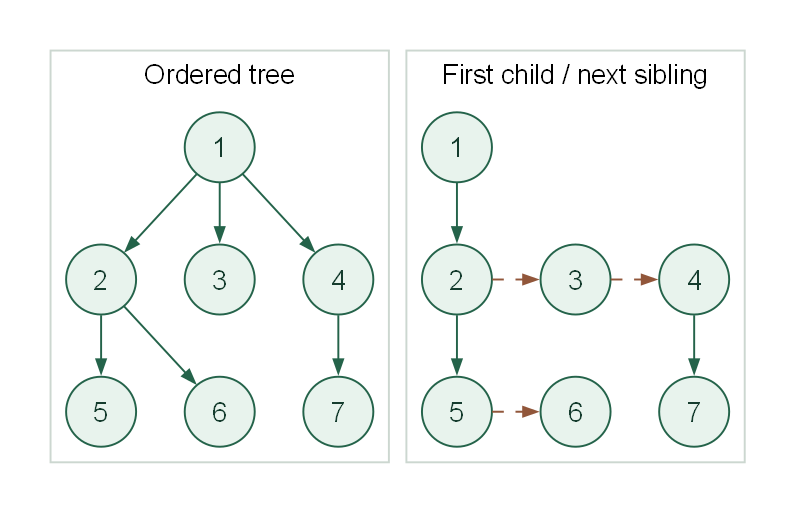

# Lab 04-E-02：多叉树孩子兄弟表示法：树的高度

## 学习目标

- [ ] 在孩子兄弟表示中按原树层次计算高度，避免把兄弟链算成向下路径。
- [ ] 独立完成给定函数，并解释时间与辅助空间复杂度。
- [ ] 通过 20 个测试点，能说明典型错误在哪个边界失效。

## 前置知识与环境

先学习 [4.1 对应内容](/learn/chapter-04-tree/01-tree-basics/)。需要 C++17、Node.js 22.13+ 与 pnpm；Make 可选。输入读取、节点分配和结果输出已在本题 support 目录中提供。

## 任务

给定一棵有序多叉树的孩子兄弟链表，返回树的高度。高度定义为从根到最深叶子的路径边数：根深度为 0，单节点树高度为 0，空树约定为 -1。`nextSibling` 连接同层节点，不增加深度。

### 待实现接口

在 `student/main.cpp` 中实现：

```cpp
int treeHeight(const Node* root);
```

节点类型 `Node` 含 `int id`、`Node* firstChild` 和 `Node* nextSibling`，函数只读取原树。 类型完整定义见 `support/tree.hpp`，固定驱动见 `support/runner.cpp`。无需自行编写 main 或修改驱动。

### 输入格式

第一行 `n root`。随后按节点编号 1..n 输入 n 行，每行 `firstChild nextSibling`。它们分别表示首孩子和下一兄弟的编号。输入表示**一棵**一般树，非空根的 nextSibling 必须为 0。空树只输入 `0 0`。

### 输出格式

输出树的高度；空树输出 -1。

### 数据范围与约定

0 ≤ n ≤ 10000。节点编号唯一且为 1..n，0 只表示空指针；所有非零引用都在合法范围内。输入保证有序、无环、无共享节点，且给定结构覆盖全部 n 个节点。n=0 时 root=0；非空时根可以不是 1，编号不代表遍历顺序。不要求处理非法输入。



图中数字为节点编号，左侧是原有序树，右侧实线表示首孩子、虚线表示下一兄弟。

## 样例

### 样例 1

输入：

```text
7 1
2 0
5 3
0 4
7 0
0 6
0 0
0 0
```

输出：

```text
2
```

最长路径为 1→2→5、1→2→6 或 1→4→7，都有 2 条边。

### 样例 2：空结构

输入：

```text
0 0
```

输出：

```text
-1
```

空结构按本题约定处理。

### 样例 3：单节点

输入：

```text
1 1
0 0
```

输出：

```text
0
```

根到自身没有边，高度为 0。

## 运行与评分

在仓库根目录执行：

```powershell
pnpm lab:doctor -- labs/chapter-04/exercise/E-04-02-lcrs-tree-height
pnpm lab:run -- labs/chapter-04/exercise/E-04-02-lcrs-tree-height --case 001-sample
pnpm lab:score -- labs/chapter-04/exercise/E-04-02-lcrs-tree-height
pnpm lab:run -- labs/chapter-04/exercise/E-04-02-lcrs-tree-height --target solution --case 001-sample
pnpm lab:verify -- labs/chapter-04/exercise/E-04-02-lcrs-tree-height
```

也可以进入本 Lab 目录运行 `make doctor`、`make run`、`make score`、`make verify`。每题 20 点，每点 5 分，总分 100。学生骨架可编译，但初始并未完成算法。

## 测试覆盖

20 点包含样例、空结构、单节点、固定种子随机及规模边界。最深分支分别放在首、中、末孩子处；星形树检查兄弟不增加高度，深链检查边数口径。 用例清单位于 `tests/cases.json`，输入和标准输出成对存放。所有输入均合法，不以未定义的错误输入作为测试。

黑盒测试检查输出正确性；复杂度和接口约束还需结合源码检查。

::: details 参考思路、正确性与复杂度

按一般树的层次做 BFS。每轮先固定当前队列大小，只处理这一层；将每个节点的全部孩子加入下一层。循环不变式是队列在每轮开始时只包含当前层节点。初始根层高度为 0，每完成一轮增加一层，最后记录的层号就是最大根叶距离。

**复杂度：** 时间 O(n)，辅助空间 O(w)，w 为一般树最大层宽；处理一层时队列可能同时容纳相邻两层，仍是 O(w)。 以上只分析待实现函数，输入存储和固定驱动的打印缓冲另计。

**常见错误：** 直接套用普通二叉树高度公式会把右兄弟链当作更深的孩子，星形树就会算错。

参考实现：

<<< ./solution/main.cpp{cpp}

:::

## 完成清单

- [ ] 函数签名和输入输出协议与题面一致。
- [ ] 20 个测试点全部通过，深链与规模边界无崩溃。
- [ ] 能解释至少一种错误写法及其反例。
- [ ] 时间、辅助空间与结果存储分别说明。

## 思考与复盘

写出分别表示“本节点子树高度”和“从本节点开始的兄弟森林高度”的递推式，说明两者为何不能混用。

## 题源

本章教材自编训练题，考查 4.1 的多叉树孩子兄弟表示法：树的高度。接口、样例与测试由本仓库编写。
