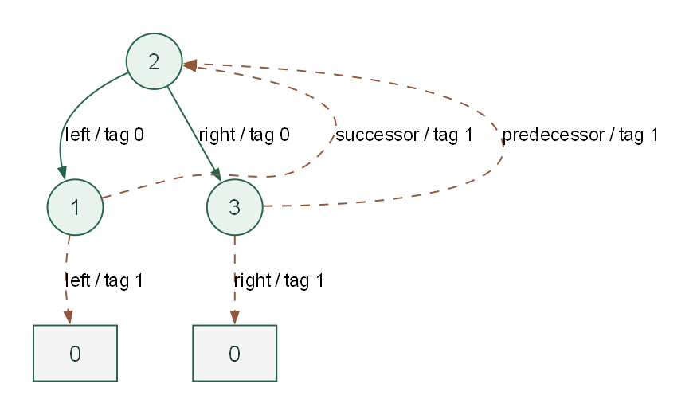

# Lab 04-E-15：中序线索化

## 学习目标

- [ ] 在保留真实孩子的前提下补齐中序前驱、后继线索及标志。
- [ ] 独立完成给定函数，并解释时间与辅助空间复杂度。
- [ ] 通过 20 个测试点，能说明典型错误在哪个边界失效。

## 前置知识与环境

先学习 [4.4 对应内容](/learn/chapter-04-tree/04-threaded-binary-tree/)。需要 C++17、Node.js 22.13+ 与 pnpm；Make 可选。输入读取、节点分配和结果输出已在本题 support 目录中提供。

## 任务

对一棵普通二叉树执行一次中序线索化，不设置头结点。原左指针为空时改为中序前驱并设 ltag=1，否则保留真实左孩子并设 ltag=0；原右指针为空时改为中序后继并设 rtag=1，否则保留真实右孩子并设 rtag=0。首节点的前驱和末节点的后继为 0，但相应标志仍为 1。所有节点初始 ltag=rtag=0，只调用一次函数，不要求重复线索化。

### 待实现接口

在 `student/main.cpp` 中实现：

```cpp
void createInorderThread(ThreadNode* root);
```

`ThreadNode` 含 `int id`、左右指针和整型 `ltag`、`rtag`；标签只取 0 或 1，不设置额外头结点。 类型完整定义见 `support/tree.hpp`，固定驱动见 `support/runner.cpp`。无需自行编写 main 或修改驱动。

### 输入格式

第一行 `n root`；随后按编号 1..n 输入 n 行 `left right`，表示普通二叉树的真实孩子编号。空树只输入 `0 0`。

### 输出格式

第一行输出 `n root`。随后按编号 1..n 各输出一行 `left ltag right rtag`，指针以编号表示。空树只输出 `0 0`。

### 数据范围与约定

0 ≤ n ≤ 10000。节点编号唯一且为 1..n，0 只表示空指针；所有非零引用都在合法范围内。输入保证有序、无环、无共享节点，且给定结构覆盖全部 n 个节点。n=0 时 root=0；非空时根可以不是 1，编号不代表遍历顺序。不要求处理非法输入。



实线是原有孩子，虚线是中序前驱或后继线索；最左前驱和最右后继仍为空。

## 样例

### 样例 1

输入：

```text
3 2
0 0
1 3
0 0
```

输出：

```text
3 2
0 1 2 1
1 0 3 0
2 1 0 1
```

原树根为 2，孩子为 1、3。中序序列 [1,2,3]：1 的后继为 2，3 的前驱为 2，2 的真实孩子不变。

### 样例 2：空结构

输入：

```text
0 0
```

输出：

```text
0 0
```

空结构按本题约定处理。

### 样例 3：单节点

输入：

```text
1 1
0 0
```

输出：

```text
1 1
0 1 0 1
```

唯一节点的两指针均为 0，两个线索标签均为 1。

## 运行与评分

在仓库根目录执行：

```powershell
pnpm lab:doctor -- labs/chapter-04/exercise/E-04-15-create-inorder-thread
pnpm lab:run -- labs/chapter-04/exercise/E-04-15-create-inorder-thread --case 001-sample
pnpm lab:score -- labs/chapter-04/exercise/E-04-15-create-inorder-thread
pnpm lab:run -- labs/chapter-04/exercise/E-04-15-create-inorder-thread --target solution --case 001-sample
pnpm lab:verify -- labs/chapter-04/exercise/E-04-15-create-inorder-thread
```

也可以进入本 Lab 目录运行 `make doctor`、`make run`、`make score`、`make verify`。每题 20 点，每点 5 分，总分 100。学生骨架可编译，但初始并未完成算法。

## 测试覆盖

20 点包含样例、空结构、单节点、固定种子随机及规模边界。左右链、分支、乱序编号和 10000 节点边界逐字段检查孩子、前驱、后继及端点标签。 用例清单位于 `tests/cases.json`，输入和标准输出成对存放。所有输入均合法，不以未定义的错误输入作为测试。

黑盒测试检查输出正确性；复杂度和接口约束还需结合源码检查。

::: details 参考思路、正确性与复杂度

迭代中序遍历，同时保存上一访问节点 previous。当前节点左链接为空时指向 previous；previous 的右链接为空时指向当前节点。真实孩子链接始终保留。按中序相邻访问的两节点恰好互为前驱、后继；遍历结束再把最后节点的空右链接标为线索，从而补全边界。

**复杂度：** 时间 O(n)，辅助栈 O(h+1)，原地修改指针与标签，不新建节点。 以上只分析待实现函数，输入存储和固定驱动的打印缓冲另计。

**常见错误：** 末节点后继虽为 0，也必须令 rtag=1；无条件覆盖左右链接会丢失真实子树。

参考实现：

<<< ./solution/main.cpp{cpp}

:::

## 完成清单

- [ ] 函数签名和输入输出协议与题面一致。
- [ ] 20 个测试点全部通过，深链与规模边界无崩溃。
- [ ] 能解释至少一种错误写法及其反例。
- [ ] 时间、辅助空间与结果存储分别说明。

## 思考与复盘

为什么不能在已经线索化的结果上直接再次调用这个普通中序遍历版本？

## 题源

本章教材自编训练题，考查 4.4 的中序线索化。接口、样例与测试由本仓库编写。
