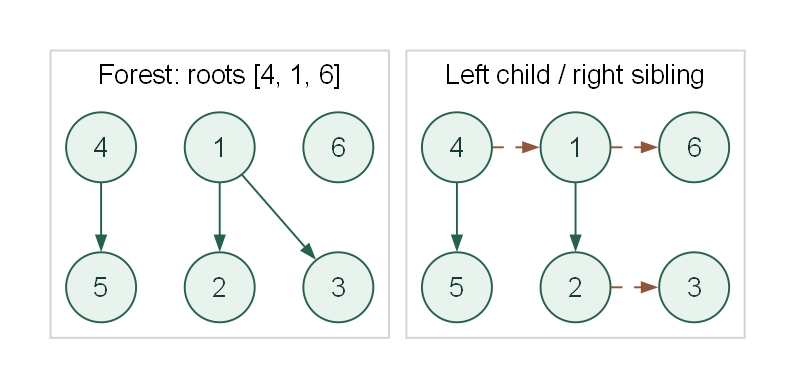

# Lab 04-E-17：森林转二叉树

## 学习目标

- [ ] 将有序森林的孩子数组转换成完整孩子兄弟二叉链表。
- [ ] 独立完成给定函数，并解释时间与辅助空间复杂度。
- [ ] 通过 20 个测试点，能说明典型错误在哪个边界失效。

## 前置知识与环境

先学习 [4.5 对应内容](/learn/chapter-04-tree/05-trees-and-forests/)。需要 C++17、Node.js 22.13+ 与 pnpm；Make 可选。输入读取、节点分配和结果输出已在本题 support 目录中提供。

## 任务

给定若干棵有序树构成的森林。每个节点的左指针指向第一个孩子，孩子之间按原有顺序用右指针相连；森林各根也按输入顺序用右指针相连。结果二叉树的根是森林的第一个根。保留全部编号、根顺序和孩子顺序，不修改输入森林。

### 待实现接口

在 `student/main.cpp` 中实现：

```cpp
BinaryNode* forestToBinary(const std::vector<GeneralNode*>& roots, std::vector<BinaryNode>& output);
```

`GeneralNode` 含 `id` 和有序 `children` 指针数组，`BinaryNode` 含 `id` 与左右指针。驱动已将 output 分配为 n+1 个节点并设置编号，槽位 0 不使用，所有输出链接或孩子数组初始为空。函数只调用一次，不得 resize output，以免已有输出指针失效。 类型完整定义见 `support/tree.hpp`，固定驱动见 `support/runner.cpp`。无需自行编写 main 或修改驱动。

### 输入格式

第一行 `n k`；接下来读取 k 个有序根编号。随后按节点编号 1..n 输入 n 行 `degree child1 ... childDegree`，列出该节点的有序孩子。无孩子时该行是 0。空森林 n=k=0，不读取根编号或节点行。

### 输出格式

第一行输出结果二叉树根编号，空森林为 0；随后按编号 1..n 输出 `left right`。

### 数据范围与约定

0 ≤ k ≤ n ≤ 10000；n=0 当且仅当 k=0。节点编号为 1..n，每个节点属于唯一一棵树；根不重复，每个非根恰有一个父节点。输入保证无环，所有节点都由给定根可达，孩子和根的输入顺序有意义。不要求处理非法输入。



两边节点编号保持不变；二叉表示的实线为左孩子、虚线为右兄弟，根链顺序为 4、1、6。

## 样例

### 样例 1

输入：

```text
6 3
4 1 6
2 2 3
0
0
1 5
0
0
```

输出：

```text
4
2 6
0 3
0 0
5 1
0 0
0 0
```

根顺序 [4,1,6] 变成 4→1→6 的右链；4 的左孩子是 5，1 的左孩子是 2，2 的右兄弟是 3。

### 样例 2：空结构

输入：

```text
0 0
```

输出：

```text
0
```

空结构按本题约定处理。

### 样例 3：单节点

输入：

```text
1 1
1
0
```

输出：

```text
1
0 0
```

单棵单节点树保持相同根编号，左右链接为空。

## 运行与评分

在仓库根目录执行：

```powershell
pnpm lab:doctor -- labs/chapter-04/exercise/E-04-17-forest-to-binary-tree
pnpm lab:run -- labs/chapter-04/exercise/E-04-17-forest-to-binary-tree --case 001-sample
pnpm lab:score -- labs/chapter-04/exercise/E-04-17-forest-to-binary-tree
pnpm lab:run -- labs/chapter-04/exercise/E-04-17-forest-to-binary-tree --target solution --case 001-sample
pnpm lab:verify -- labs/chapter-04/exercise/E-04-17-forest-to-binary-tree
```

也可以进入本 Lab 目录运行 `make doctor`、`make run`、`make score`、`make verify`。每题 20 点，每点 5 分，总分 100。学生骨架可编译，但初始并未完成算法。

## 测试覆盖

20 点包含样例、空结构、单节点、固定种子随机及规模边界。多根、孤立根、后续树更大及根顺序逆编号检查根链；星形、梳状、深链与随机森林检查全部孩子。 用例清单位于 `tests/cases.json`，输入和标准输出成对存放。所有输入均合法，不以未定义的错误输入作为测试。

黑盒测试检查输出正确性；复杂度和接口约束还需结合源码检查。

::: details 参考思路、正确性与复杂度

遍历每个一般树节点，将其第一个孩子填入输出节点的 left，将相邻孩子连成 right 链；没有孩子时 left 保持空，末孩子 right 为空。最后把森林的各根按序串联。每个节点的父子和兄弟关系都按定义唯一写入，因此输出保持原森林的有序结构。

**复杂度：** 时间 O(n)，辅助栈最坏 O(n)，另有 O(n) 输出节点。孩子数组总元素数为 n-k。 以上只分析待实现函数，输入存储和固定驱动的打印缓冲另计。

**常见错误：** 只转换每棵树却漏连根链，会使第一棵树以外的节点从输出根不可达；排序根或孩子会改变有序森林。

参考实现：

<<< ./solution/main.cpp{cpp}

:::

## 完成清单

- [ ] 函数签名和输入输出协议与题面一致。
- [ ] 20 个测试点全部通过，深链与规模边界无崩溃。
- [ ] 能解释至少一种错误写法及其反例。
- [ ] 时间、辅助空间与结果存储分别说明。

## 思考与复盘

对转换结果做逆转换，需要哪些信息？是否还需要额外存储每个节点的原父节点？

## 题源

本章教材自编训练题，考查 4.5 的森林转二叉树。接口、样例与测试由本仓库编写。
