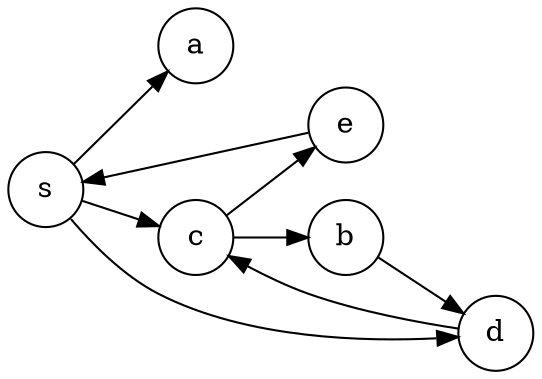
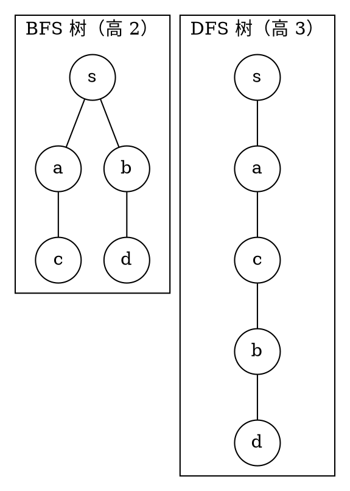
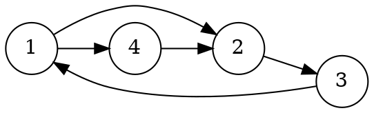
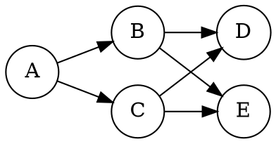
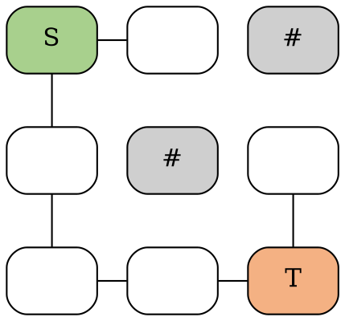

# 题库配图源（构建期生成 SVG，不面向学习者）

本文件仅用于让 `vitepress-plugin-diagrams` 在构建期生成选择题配图：构建后 SVG 会写入 `public/diagrams/`，由同目录 `quiz.json` 的题面或解析引用。学习者不需要访问本页。

## 第 4 题：BFS 分层示例图

<!-- diagram id="dfs-bfs-q04-graph" caption: "第 4 题：有向图 G 及从 s 出发的 BFS 分层" -->

## 第 5 题解析：BFS 树与 DFS 树高度对比

<!-- diagram id="dfs-bfs-q05-trees" caption: "第 5 题解析：同一张图，BFS 树与 DFS 树的高度对比" -->

## 第 8 题解析：DFS 边分类示例图

<!-- diagram id="dfs-bfs-q08-graph" caption: "第 8 题解析：从 1 出发 DFS，3→1 是后向边，4→2 是交叉边" -->

## 第 15 题解析：路径计数示例图

<!-- diagram id="dfs-bfs-q15-paths" caption: "第 15 题解析：A 到 E 有 A-B-E 与 A-C-E 两条简单路径" -->

## 第 12 题：3×3 迷宫示意图

<!-- diagram id="dfs-bfs-q12-maze" caption: "第 12 题：3×3 迷宫，S 为起点、T 为终点、# 为障碍物" -->
